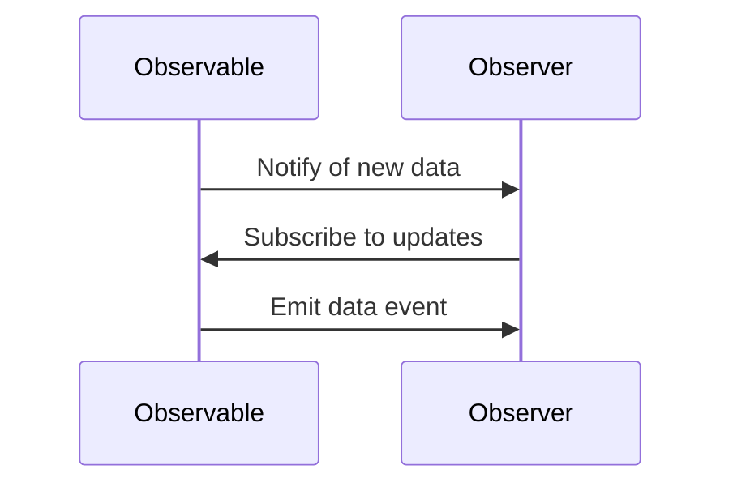
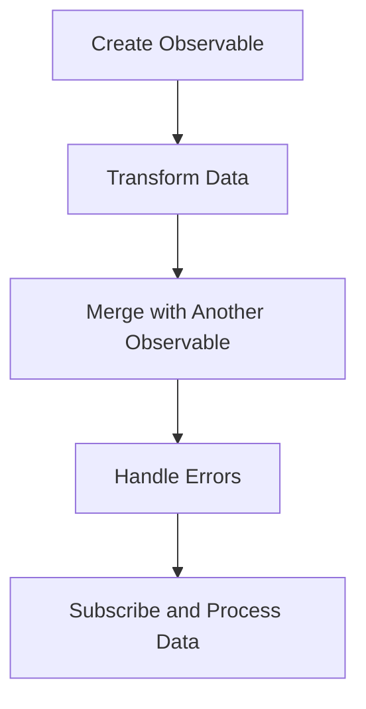

## 14.3 Working with Streams and Observables

Functional Reactive Programming (FRP) is a powerful paradigm that allows us to handle asynchronous data streams in a declarative manner. In this section, we will delve into the concepts of streams and observables, and how they can be effectively utilized in Clojure, particularly through the use of Reactive Extensions (Rx). We will also explore how to integrate RxJava with Clojure to create and manage observables.

### Streams in Functional Reactive Programming

In FRP, a **stream** is a sequence of data elements made available over time. Unlike traditional collections that are static, streams represent dynamic data that can change or be updated continuously. This makes streams particularly useful for handling real-time data, such as user inputs, sensor readings, or network requests.

Streams can be thought of as a series of events that are emitted over time, which can be observed and processed. This concept aligns closely with the observer pattern, where an object (the observer) subscribes to another object (the observable) to receive updates.

### Observables: The Core of Reactive Programming

**Observables** are a key concept in reactive programming, representing a data source that can emit multiple values over time. Observables are similar to streams but are more flexible and powerful, providing a consistent way to handle asynchronous data flows.

In the context of FRP, observables emit items to observers, which are then processed using a series of operators. This allows for complex data transformations and compositions, making it easier to manage data flow and state changes in applications.

#### The Observer Pattern in FRP

The observer pattern is a design pattern used to allow an object (the observer) to watch another object (the observable) and be notified of any changes. In FRP, this pattern is used to handle data streams, where observers can subscribe to observables to receive updates.

Here's a simple illustration of the observer pattern:



### Reactive Extensions (Rx)

**Reactive Extensions (Rx)** is a library for composing asynchronous and event-based programs using observable sequences. Rx provides a rich set of operators that allow developers to filter, transform, and combine data streams with ease.

Rx is language-agnostic and has implementations in various programming languages, including Java (RxJava), JavaScript (RxJS), and .NET (Rx.NET). In Clojure, we can leverage RxJava to work with observables and manage data streams effectively.

#### Key Features of Reactive Extensions

- **Declarative Data Flow**: Rx allows you to declare how data should be processed, rather than writing imperative code to handle data events.
- **Composability**: Rx provides a wide range of operators to compose and transform data streams, making it easy to build complex data processing pipelines.
- **Concurrency**: Rx supports concurrent data processing, allowing you to handle multiple data streams simultaneously without complex threading code.

### Example Using RxJava with Clojure

RxJava is a popular implementation of Reactive Extensions for the JVM, providing a powerful toolkit for working with observables in Java and other JVM languages, including Clojure. Let's explore how to create and subscribe to observables using RxJava in Clojure.

#### Setting Up RxJava with Clojure

First, ensure that you have RxJava included in your Clojure project. You can add it to your `project.clj` file if you're using Leiningen:

```clojure
(defproject my-clojure-app "0.1.0-SNAPSHOT"
  :dependencies [[org.clojure/clojure "1.10.3"]
                 [io.reactivex.rxjava3/rxjava "3.0.0"]])
```

#### Creating Observables

In RxJava, an observable can be created using the `Observable.create` method. Let's create a simple observable that emits a sequence of numbers:

```clojure
(ns my-clojure-app.core
  (:import [io.reactivex.rxjava3.core Observable]))

(defn create-number-observable []
  (Observable/create
    (fn [emitter]
      (doseq [i (range 1 6)]
        (.onNext emitter i))
      (.onComplete emitter))))
```

In this example, we define a function `create-number-observable` that creates an observable emitting numbers from 1 to 5. The `emitter` is used to send data to observers.

#### Subscribing to Observables

To receive data from an observable, we need to subscribe to it. Here's how you can subscribe to the observable we created:

```clojure
(defn subscribe-to-observable [observable]
  (.subscribe observable
    (fn [item] (println "Received item:" item))
    (fn [error] (println "Error occurred:" error))
    (fn [] (println "Observable completed"))))

;; Usage
(subscribe-to-observable (create-number-observable))
```

In this code, we define a function `subscribe-to-observable` that takes an observable and subscribes to it. We provide three handlers: one for each emitted item, one for errors, and one for completion.

#### Transforming Data with Operators

RxJava provides a variety of operators to transform and manipulate data streams. Let's use the `map` operator to transform the emitted numbers:

```clojure
(defn transform-observable [observable]
  (.map observable
    (fn [item] (* item 2))))

;; Usage
(def transformed-observable (transform-observable (create-number-observable)))
(subscribe-to-observable transformed-observable)
```

Here, we use the `map` operator to double each emitted number. The transformed observable is then subscribed to, printing the doubled values.

### Integrating Observables with Clojure's Functional Paradigm

Clojure's functional programming paradigm aligns well with the reactive programming model. By using pure functions and immutability, we can create more predictable and maintainable reactive systems.

#### Combining Observables

One of the strengths of RxJava is the ability to combine multiple observables. Let's see how to merge two observables:

```clojure
(defn create-another-observable []
  (Observable/create
    (fn [emitter]
      (doseq [i (range 6 11)]
        (.onNext emitter i))
      (.onComplete emitter))))

(defn merge-observables [obs1 obs2]
  (.merge Observable obs1 obs2))

;; Usage
(def merged-observable (merge-observables (create-number-observable) (create-another-observable)))
(subscribe-to-observable merged-observable)
```

In this example, we create another observable and merge it with the first one using the `merge` operator. This allows us to handle data from multiple sources in a unified manner.

#### Error Handling in Observables

Handling errors is crucial in reactive programming. RxJava provides operators like `onErrorReturn` and `onErrorResumeNext` to manage errors gracefully:

```clojure
(defn create-error-observable []
  (Observable/create
    (fn [emitter]
      (.onNext emitter 1)
      (.onError emitter (Exception. "An error occurred"))
      (.onNext emitter 2)
      (.onComplete emitter))))

(defn handle-errors [observable]
  (.onErrorReturn observable
    (fn [error]
      (println "Error handled:" (.getMessage error))
      -1)))

;; Usage
(def error-handled-observable (handle-errors (create-error-observable)))
(subscribe-to-observable error-handled-observable)
```

In this code, we create an observable that emits an error and use `onErrorReturn` to provide a fallback value when an error occurs.

### Visualizing Data Flow with Observables

To better understand how data flows through observables, let's visualize a simple data pipeline using a Mermaid.js flowchart:



This flowchart represents a typical data processing pipeline using observables, where data is created, transformed, merged, error-handled, and finally subscribed to.

### Try It Yourself: Experimenting with Observables

To deepen your understanding of observables and reactive programming, try modifying the examples provided:

- **Create a new observable** that emits a sequence of strings instead of numbers.
- **Use additional operators** such as `filter` to selectively process data.
- **Experiment with error handling** by introducing errors at different stages and observing how they are managed.

### Conclusion

Working with streams and observables in Clojure using RxJava allows you to build robust and scalable applications that handle asynchronous data flows efficiently. By leveraging the power of reactive programming, you can create systems that are more responsive, maintainable, and easier to reason about.

For further reading and exploration, consider checking out the following resources:

- [Clojure Official Documentation](https://clojure.org/reference)
- [RxJava Documentation](https://github.com/ReactiveX/RxJava)
- [Transitioning from OOP to Functional Programming](https://www.lispcast.com/oo-to-fp/)

## **Test Your Knowledge: Working with Streams and Observables Quiz**



### What is a stream in Functional Reactive Programming (FRP)?

- [x] A sequence of data elements available over time
- [ ] A static collection of data
- [ ] A single data element
- [ ] A function that processes data

> **Explanation:** In FRP, a stream represents a sequence of data elements that are available over time, allowing for real-time data processing.

### What is the role of an observable in reactive programming?

- [x] To emit items to observers
- [ ] To store data permanently
- [ ] To process data synchronously
- [ ] To manage database transactions

> **Explanation:** Observables in reactive programming emit items to observers, allowing for asynchronous data handling.

### Which library provides a model for working with observables in Clojure?

- [x] RxJava
- [ ] Redux
- [ ] Spring
- [ ] Hibernate

> **Explanation:** RxJava is a library that provides a model for working with observables in Clojure, enabling reactive programming.

### How do you create an observable in RxJava?

- [x] Using the `Observable.create` method
- [ ] Using the `new Observable()` constructor
- [ ] Using the `Observable.init` method
- [ ] Using the `Observable.start` method

> **Explanation:** In RxJava, you create an observable using the `Observable.create` method, which allows you to define the data emission logic.

### What operator would you use to transform data in an observable?

- [x] `map`
- [ ] `filter`
- [ ] `reduce`
- [ ] `collect`

> **Explanation:** The `map` operator is used to transform data in an observable, applying a function to each emitted item.

### How can you handle errors in an observable?

- [x] Using the `onErrorReturn` operator
- [ ] Using the `try-catch` block
- [ ] Using the `finally` block
- [ ] Using the `throw` statement

> **Explanation:** The `onErrorReturn` operator in RxJava allows you to handle errors in an observable by providing a fallback value.

### What is the purpose of subscribing to an observable?

- [x] To receive and process emitted data
- [ ] To store data in a database
- [ ] To initialize the observable
- [ ] To terminate the observable

> **Explanation:** Subscribing to an observable allows you to receive and process the data it emits, enabling reactive data handling.

### Which operator would you use to combine two observables?

- [x] `merge`
- [ ] `concat`
- [ ] `split`
- [ ] `divide`

> **Explanation:** The `merge` operator is used to combine two observables, allowing you to handle data from multiple sources.

### True or False: Observables in RxJava can only emit data synchronously.

- [ ] True
- [x] False

> **Explanation:** Observables in RxJava can emit data asynchronously, making them suitable for handling real-time data flows.

### What is an advantage of using Reactive Extensions (Rx)?

- [x] Declarative data flow management
- [ ] Complex threading code
- [ ] Synchronous data processing
- [ ] Static data handling

> **Explanation:** Reactive Extensions (Rx) provide a declarative approach to data flow management, simplifying the handling of asynchronous data streams.


