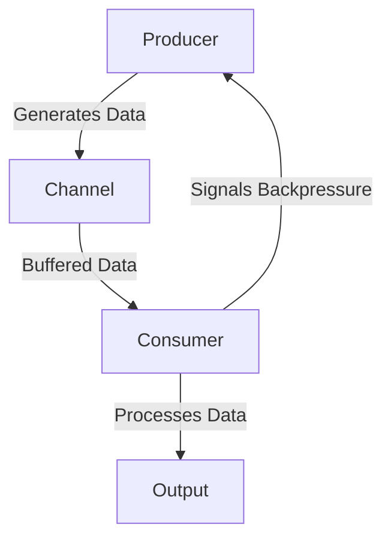

## 14.5 Handling Backpressure and Flow Control

In the realm of functional reactive programming, handling backpressure and flow control is crucial for building robust, scalable applications. Asynchronous systems, by their nature, can generate data at rates that exceed the processing capabilities of consumers, leading to potential resource exhaustion. In this section, we will explore the challenges of backpressure, strategies for managing it, and practical implementations in Clojure using `core.async`.

### Challenges in Asynchronous Systems

Asynchronous systems are designed to handle multiple tasks concurrently, often leading to scenarios where producers generate data faster than consumers can process it. This mismatch can result in:

- **Resource Exhaustion**: When consumers are overwhelmed, system resources such as memory and CPU can become exhausted, leading to degraded performance or system crashes.
- **Increased Latency**: As queues fill up, the time taken to process each item increases, resulting in higher latency.
- **Data Loss**: In some systems, excess data may be dropped to prevent overload, leading to potential data loss.

Understanding these challenges is the first step in designing systems that can effectively manage backpressure.

### Backpressure Mechanisms

Backpressure mechanisms are strategies used to control the flow of data between producers and consumers, ensuring that systems remain responsive and efficient. Here are some common techniques:

1. **Buffering**: Temporarily store excess data in a buffer until the consumer is ready to process it. This approach can smooth out spikes in data flow but may lead to increased memory usage.

2. **Throttling**: Limit the rate at which data is produced or consumed. Throttling can be implemented by introducing delays or by adjusting the rate dynamically based on system load.

3. **Dropping Data**: In scenarios where data loss is acceptable, dropping excess data can prevent resource exhaustion. This method is often used in systems where only the most recent data is relevant.

4. **Signaling Backpressure**: Allow consumers to signal producers to slow down or pause data generation. This approach requires a feedback mechanism between producers and consumers.

### Implementation in Clojure

Clojure's `core.async` library provides powerful tools for managing concurrency and backpressure. Let's explore how we can implement backpressure control using `core.async`.

#### Buffering with core.async

In `core.async`, channels can be created with different types of buffers to handle backpressure:

```clojure
(require '[clojure.core.async :as async])

;; Create a buffered channel with a fixed size
(def buffered-channel (async/chan 10))

;; Producer function
(defn producer [ch]
  (async/go
    (doseq [i (range 100)]
      (async/>! ch i)
      (println "Produced" i))))

;; Consumer function
(defn consumer [ch]
  (async/go
    (while true
      (let [value (async/<! ch)]
        (println "Consumed" value)))))

;; Start producer and consumer
(producer buffered-channel)
(consumer buffered-channel)
```

In this example, the channel `buffered-channel` is created with a fixed buffer size of 10. The producer generates data and sends it to the channel, while the consumer processes data from the channel. The buffer helps to manage backpressure by storing excess data temporarily.

#### Throttling with core.async

Throttling can be implemented by introducing delays in the producer or consumer. Here's an example of throttling a producer:

```clojure
(defn throttled-producer [ch]
  (async/go
    (doseq [i (range 100)]
      (async/>! ch i)
      (println "Produced" i)
      (async/<! (async/timeout 1000))))) ; Introduce a delay of 1000ms
```

In this example, the producer introduces a delay of 1000 milliseconds between each produced item, effectively throttling the rate of data production.

#### Dropping Data with core.async

To handle scenarios where data loss is acceptable, `core.async` provides dropping buffers:

```clojure
;; Create a channel with a dropping buffer
(def dropping-channel (async/chan (async/dropping-buffer 10)))

;; Producer function
(defn producer-dropping [ch]
  (async/go
    (doseq [i (range 100)]
      (async/>! ch i)
      (println "Produced" i))))

;; Consumer function
(defn consumer-dropping [ch]
  (async/go
    (while true
      (let [value (async/<! ch)]
        (println "Consumed" value)))))

;; Start producer and consumer
(producer-dropping dropping-channel)
(consumer-dropping dropping-channel)
```

In this example, the channel `dropping-channel` uses a dropping buffer, which discards excess data when the buffer is full.

#### Signaling Backpressure

Signaling backpressure involves creating a feedback loop between producers and consumers. This can be achieved using control channels or flags to communicate the state of the consumer to the producer.

```clojure
(def control-channel (async/chan))

(defn producer-with-backpressure [ch control-ch]
  (async/go
    (doseq [i (range 100)]
      (when (async/<! control-ch) ; Wait for signal to produce
        (async/>! ch i)
        (println "Produced" i)))))

(defn consumer-with-backpressure [ch control-ch]
  (async/go
    (while true
      (let [value (async/<! ch)]
        (println "Consumed" value)
        (async/>! control-ch true))))) ; Signal producer to continue

;; Start producer and consumer
(producer-with-backpressure buffered-channel control-channel)
(consumer-with-backpressure buffered-channel control-channel)
```

In this example, the `control-channel` is used to signal the producer when the consumer is ready to process more data.

### Practical Examples of Managing Backpressure

Let's explore a practical example where we manage backpressure in a reactive stream using `core.async`.

#### Example: Real-Time Data Processing

Imagine a scenario where we process real-time sensor data. The producer generates data at a high rate, and we need to ensure that our system can handle this without overwhelming the consumer.

```clojure
(def sensor-channel (async/chan (async/sliding-buffer 5))) ; Use a sliding buffer

(defn sensor-producer [ch]
  (async/go
    (while true
      (let [data (rand-int 100)] ; Simulate sensor data
        (async/>! ch data)
        (println "Sensor produced" data)
        (async/<! (async/timeout 500)))))) ; Simulate delay between readings

(defn data-processor [ch]
  (async/go
    (while true
      (let [data (async/<! ch)]
        (println "Processing data" data)
        (async/<! (async/timeout 1000)))))) ; Simulate processing time

;; Start sensor producer and data processor
(sensor-producer sensor-channel)
(data-processor sensor-channel)
```

In this example, we use a sliding buffer to manage backpressure. The sliding buffer retains the most recent data, discarding older data when the buffer is full. This approach is suitable for scenarios where only the latest data is relevant.

### Visualizing Backpressure and Flow Control

To better understand backpressure and flow control, let's visualize the data flow between components using a Mermaid.js diagram.



**Diagram Description**: This diagram illustrates the flow of data from a producer to a consumer through a buffered channel. The consumer processes data and signals backpressure to the producer, ensuring a balanced flow.

### References and Links

- [Clojure Official Documentation](https://clojure.org/reference)
- [Clojure Community Resources](https://clojure.org/community/resources)
- [core.async Guide](https://clojure.github.io/core.async/)
- [Transitioning from OOP to Functional Programming](https://www.lispcast.com/oo-to-fp/)

### Knowledge Check

To reinforce your understanding of backpressure and flow control, consider the following questions:

1. What are the main challenges of handling backpressure in asynchronous systems?
2. How can buffering help manage backpressure, and what are its potential drawbacks?
3. Describe how throttling can be implemented in a Clojure application.
4. When might it be acceptable to drop data to manage backpressure?
5. How does signaling backpressure differ from other strategies?

### Encouraging Engagement

Embracing functional reactive programming and mastering backpressure control can significantly enhance the scalability and resilience of your applications. As you experiment with these concepts, you'll gain a deeper understanding of how to build systems that gracefully handle varying data loads.

### Try It Yourself

Experiment with the provided code examples by modifying buffer sizes, throttling rates, and signaling mechanisms. Observe how these changes affect the system's behavior and performance.

## **Test Your Knowledge: Handling Backpressure and Flow Control Quiz**



### What is a common challenge in asynchronous systems that backpressure mechanisms aim to address?

- [x] Resource exhaustion due to overwhelming data flow
- [ ] Insufficient data production
- [ ] Lack of concurrency
- [ ] Inability to handle synchronous tasks

> **Explanation:** Backpressure mechanisms are designed to prevent resource exhaustion by managing the flow of data between producers and consumers.

### Which of the following is a strategy for handling backpressure?

- [x] Buffering
- [x] Throttling
- [ ] Increasing data production
- [x] Dropping data

> **Explanation:** Buffering, throttling, and dropping data are common strategies for managing backpressure in asynchronous systems.

### How can throttling be implemented in a Clojure application using core.async?

- [x] By introducing delays in the producer or consumer
- [ ] By increasing the buffer size
- [ ] By using synchronous channels
- [ ] By reducing the number of consumers

> **Explanation:** Throttling can be achieved by introducing delays in the producer or consumer to control the rate of data flow.

### What type of buffer discards excess data when full?

- [x] Dropping buffer
- [ ] Sliding buffer
- [ ] Fixed buffer
- [ ] Overflow buffer

> **Explanation:** A dropping buffer discards excess data when it becomes full, preventing resource exhaustion.

### In what scenario might it be acceptable to drop data to manage backpressure?

- [x] When only the most recent data is relevant
- [ ] When all data must be preserved
- [ ] When data loss is unacceptable
- [ ] When processing speed is not a concern

> **Explanation:** Dropping data can be acceptable when only the most recent data is relevant, such as in real-time monitoring systems.

### What is the role of a control channel in signaling backpressure?

- [x] To communicate the readiness of the consumer to the producer
- [ ] To increase the data production rate
- [ ] To store excess data
- [ ] To synchronize multiple producers

> **Explanation:** A control channel is used to signal the producer when the consumer is ready to process more data, helping manage backpressure.

### What is the benefit of using a sliding buffer in a real-time data processing scenario?

- [x] It retains the most recent data while discarding older data
- [ ] It stores all data indefinitely
- [ ] It increases processing latency
- [ ] It reduces the need for multiple consumers

> **Explanation:** A sliding buffer is beneficial in real-time scenarios as it retains the most recent data, which is often the most relevant.

### How does signaling backpressure differ from other strategies?

- [x] It involves a feedback loop between producers and consumers
- [ ] It relies solely on increasing buffer sizes
- [ ] It does not affect data production rates
- [ ] It requires no communication between components

> **Explanation:** Signaling backpressure involves a feedback loop where consumers communicate their readiness to producers, allowing for dynamic flow control.

### Which of the following is NOT a backpressure strategy?

- [ ] Buffering
- [ ] Throttling
- [x] Increasing consumer processing speed
- [ ] Dropping data

> **Explanation:** Increasing consumer processing speed is not a direct backpressure strategy; it may help but does not inherently manage data flow.

### True or False: Backpressure mechanisms can help reduce latency in asynchronous systems.

- [x] True
- [ ] False

> **Explanation:** By managing the flow of data and preventing resource exhaustion, backpressure mechanisms can help reduce latency and improve system responsiveness.



By mastering backpressure and flow control in Clojure, you will be well-equipped to build scalable and resilient applications that handle asynchronous data flows with ease.
