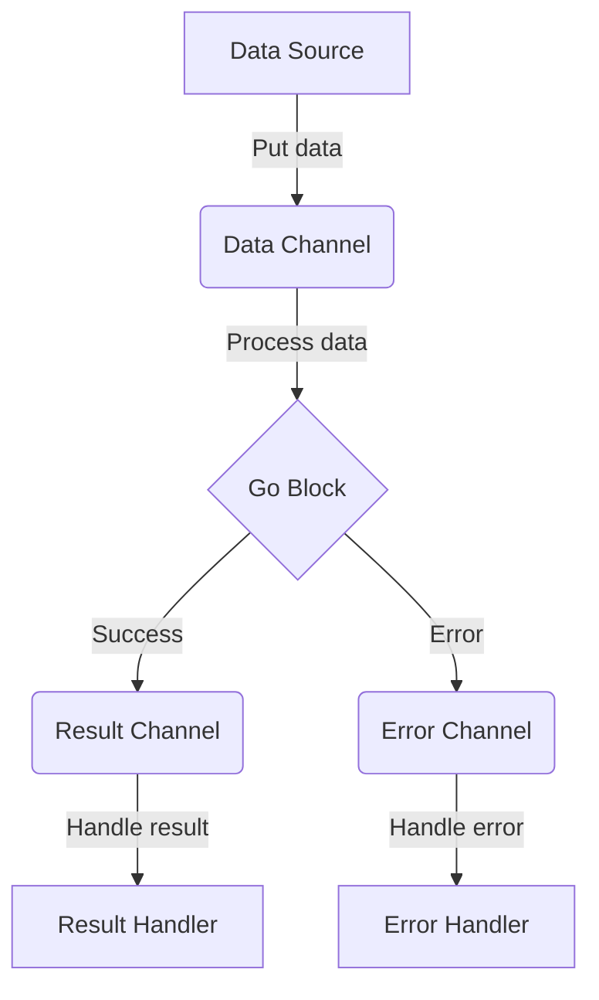

## 14.6 Asynchronous Programming with `core.async`

In this section, we delve into the world of asynchronous programming using Clojure's `core.async` library. Asynchronous programming is a powerful paradigm that allows us to build responsive and scalable applications by decoupling the execution of tasks from the main program flow. This is particularly useful in scenarios where tasks are I/O-bound or require concurrent execution. 

### Deep Dive into `core.async`

`core.async` is a library that brings asynchronous programming capabilities to Clojure by providing constructs similar to those found in languages like Go. It introduces the concept of channels, which facilitate communication between different parts of your application in a non-blocking manner. Let's explore the key components of `core.async` and how they can be used to build asynchronous pipelines.

#### Channels and Transducers

Channels are the backbone of `core.async`. They are used to pass messages between different threads or go blocks. Channels can be thought of as queues that allow data to be put onto them and taken off by different parts of your program. Here's a simple example of creating and using a channel:

```clojure
(require '[clojure.core.async :refer [chan >!! <!!]])

;; Create a channel
(def my-channel (chan))

;; Put a value onto the channel
(>!! my-channel "Hello, core.async!")

;; Take a value from the channel
(println (<!! my-channel))  ;; Output: Hello, core.async!
```

In this example, we create a channel using `chan`, put a string onto it using `>!!`, and then take the string off the channel using `<!!`. The `>!!` and `<!!` functions are blocking operations, meaning they will wait until the operation can be completed.

**Transducers** can be applied to channels to transform the data as it flows through. Transducers are composable algorithmic transformations that can be applied to a channel to process data efficiently without creating intermediate collections. Here's how you can use a transducer with a channel:

```clojure
(require '[clojure.core.async :refer [chan >!! <!! transduce]])

;; Define a simple transducer that doubles numbers
(def double-xf (map #(* 2 %)))

;; Create a channel with a transducer
(def transduced-channel (chan 10 double-xf))

;; Put values onto the channel
(>!! transduced-channel 1)
(>!! transduced-channel 2)

;; Take values from the channel
(println (<!! transduced-channel))  ;; Output: 2
(println (<!! transduced-channel))  ;; Output: 4
```

In this example, the `map` transducer doubles each number as it is put onto the channel. This demonstrates how channels and transducers can be combined for efficient data processing.

### Multithreading with `core.async`

One of the most powerful features of `core.async` is its ability to handle multithreading using go blocks and threads. Go blocks are lightweight, cooperative threads that allow you to write asynchronous code in a synchronous style. Here's a simple example of using a go block:

```clojure
(require '[clojure.core.async :refer [go chan >! <!]])

;; Create a channel
(def my-channel (chan))

;; Start a go block
(go
  ;; Put a value onto the channel
  (>! my-channel "Hello from go block!"))

;; Take the value from the channel
(println (<!! my-channel))  ;; Output: Hello from go block!
```

In this example, the go block puts a string onto the channel using `>!`, and we take it off the channel using `<!!`. The `>!` and `<!` functions are non-blocking, making them suitable for use within go blocks.

You can also use threads for more traditional multithreading, but go blocks are often preferred in `core.async` due to their lightweight nature and ease of use. Here's how you can use threads:

```clojure
(require '[clojure.core.async :refer [thread chan >! <!!]])

;; Create a channel
(def my-channel (chan))

;; Start a thread
(thread
  ;; Put a value onto the channel
  (>!! my-channel "Hello from thread!"))

;; Take the value from the channel
(println (<!! my-channel))  ;; Output: Hello from thread!
```

### Error Handling in Asynchronous Workflows

Handling errors in asynchronous workflows can be challenging, but `core.async` provides several strategies to manage errors effectively. One common approach is to use a separate error channel to communicate errors between different parts of your application. Here's an example:

```clojure
(require '[clojure.core.async :refer [go chan >! <!]])

;; Create a channel for normal data and one for errors
(def data-channel (chan))
(def error-channel (chan))

;; Start a go block that simulates a task
(go
  (try
    ;; Simulate a task that can fail
    (if (< (rand) 0.5)
      (throw (Exception. "Random failure!"))
      (>! data-channel "Task succeeded!"))
    (catch Exception e
      (>! error-channel (.getMessage e)))))

;; Handle the result or error
(go
  (let [result (<! data-channel)
        error (<! error-channel)]
    (if result
      (println "Success:" result)
      (println "Error:" error))))
```

In this example, we simulate a task that can randomly fail. If the task succeeds, we put a success message onto the `data-channel`. If it fails, we put the error message onto the `error-channel`. This separation of data and error channels helps in managing asynchronous workflows more effectively.

### Examples of Complex Asynchronous Workflows

Let's put it all together with a more complex example that demonstrates a real-world asynchronous workflow. Suppose we want to process a stream of data, transform it, and handle errors gracefully. Here's how we can achieve this using `core.async`:

```clojure
(require '[clojure.core.async :refer [go chan >! <! thread close!]])

;; Define a transducer to process data
(def process-data-xf (map #(str "Processed: " %)))

;; Create channels for data, errors, and results
(def data-channel (chan 10 process-data-xf))
(def error-channel (chan))
(def result-channel (chan))

;; Function to simulate data processing
(defn process-data [data]
  (if (< (rand) 0.8)
    (>! data-channel data)
    (throw (Exception. "Processing error!"))))

;; Start a go block to process data
(go
  (loop []
    (let [data (<! data-channel)]
      (when data
        (try
          (process-data data)
          (>! result-channel data)
          (catch Exception e
            (>! error-channel (.getMessage e))))
        (recur)))))

;; Start a go block to handle results
(go
  (loop []
    (let [result (<! result-channel)]
      (when result
        (println "Result:" result)
        (recur)))))

;; Start a go block to handle errors
(go
  (loop []
    (let [error (<! error-channel)]
      (when error
        (println "Error:" error)
        (recur)))))

;; Simulate incoming data
(thread
  (doseq [data ["data1" "data2" "data3" "data4"]]
    (>!! data-channel data))
  (close! data-channel))
```

In this example, we simulate a data processing pipeline where data is put onto the `data-channel`, processed by a go block, and results are put onto the `result-channel`. Errors are handled separately via the `error-channel`. This pattern allows us to build robust and scalable asynchronous workflows.

### Visualizing `core.async` Workflows

To better understand the flow of data and control in an asynchronous workflow using `core.async`, let's visualize the process with a diagram:



**Diagram Description:** This diagram illustrates the flow of data in a `core.async` workflow. Data is put onto the data channel from a source, processed by a go block, and then sent to either a result channel or an error channel depending on the outcome. Separate handlers manage results and errors.

### Try It Yourself

To deepen your understanding of `core.async`, try modifying the examples provided:

- **Experiment with Transducers:** Change the transducer in the `process-data-xf` definition to apply different transformations to the data.
- **Add More Channels:** Introduce additional channels for logging or metrics collection.
- **Simulate Different Workloads:** Adjust the probability of success in the `process-data` function to see how the system handles varying loads.

### References and Further Reading

- [Clojure Official Documentation](https://clojure.org/reference)
- [core.async GitHub Repository](https://github.com/clojure/core.async)
- [Transitioning from OOP to Functional Programming](https://www.lispcast.com/oo-to-fp/)

### Knowledge Check

To reinforce your learning, let's test your understanding of asynchronous programming with `core.async`.

## **Test Your Knowledge: Asynchronous Programming with `core.async` Quiz**



### What is the primary purpose of `core.async` in Clojure?

- [x] To facilitate asynchronous programming using channels and go blocks
- [ ] To provide a GUI framework for Clojure applications
- [ ] To compile Clojure code to Java bytecode
- [ ] To manage database connections

> **Explanation:** `core.async` is primarily used for asynchronous programming by providing channels and go blocks for non-blocking communication and concurrency.

### How do transducers enhance the functionality of channels in `core.async`?

- [x] By allowing data transformation without intermediate collections
- [ ] By enabling GUI rendering on channels
- [ ] By converting channels into threads
- [ ] By encrypting data on channels

> **Explanation:** Transducers allow data to be transformed efficiently as it flows through channels, without creating intermediate collections.

### Which of the following is a non-blocking operation in `core.async`?

- [ ] `>!!`
- [x] `<!`
- [ ] `<!!`
- [ ] `>!!`

> **Explanation:** The `<!` operation is non-blocking and is used within go blocks to take values from a channel.

### What is the role of a go block in `core.async`?

- [x] To execute code asynchronously in a lightweight thread
- [ ] To block the main thread until completion
- [ ] To manage database transactions
- [ ] To render HTML templates

> **Explanation:** A go block allows code to be executed asynchronously in a lightweight, cooperative thread.

### How can errors be managed in `core.async` workflows?

- [x] By using separate error channels
- [ ] By ignoring them
- [ ] By using only try-catch blocks
- [x] By logging them to a file

> **Explanation:** Errors can be managed by using separate error channels and logging them for further analysis.

### Which function is used to create a channel in `core.async`?

- [x] `chan`
- [ ] `create-channel`
- [ ] `new-channel`
- [ ] `make-channel`

> **Explanation:** The `chan` function is used to create a new channel in `core.async`.

### What is the benefit of using go blocks over threads in `core.async`?

- [x] Go blocks are more lightweight and efficient
- [ ] Go blocks can render graphics
- [x] Go blocks support non-blocking operations
- [ ] Go blocks are faster than threads

> **Explanation:** Go blocks are more lightweight and efficient than threads and support non-blocking operations.

### What does the `close!` function do in the context of `core.async`?

- [x] Closes a channel, preventing further puts
- [ ] Closes a file
- [ ] Terminates a go block
- [ ] Stops a running thread

> **Explanation:** The `close!` function closes a channel, preventing any further data from being put onto it.

### What is the advantage of using channels in `core.async`?

- [x] They allow for non-blocking communication between threads
- [ ] They provide direct access to hardware
- [ ] They simplify GUI development
- [ ] They compile Clojure to Java

> **Explanation:** Channels allow for non-blocking communication between different parts of a program, facilitating concurrency.

### True or False: `core.async` can only be used with Clojure.

- [ ] True
- [x] False

> **Explanation:** `core.async` can also be used with ClojureScript, allowing for asynchronous programming in both server-side and client-side Clojure code.



By mastering `core.async`, you can build efficient and responsive applications that leverage the power of asynchronous programming. Embrace the challenge, experiment with the examples, and let `core.async` transform the way you approach concurrency in your Clojure projects.
