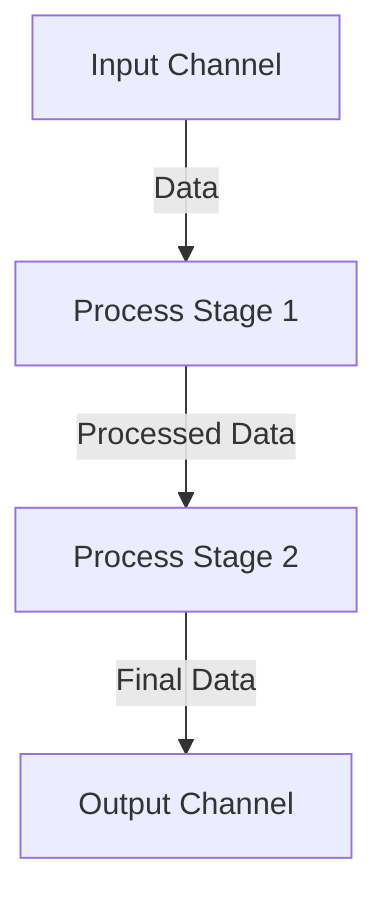
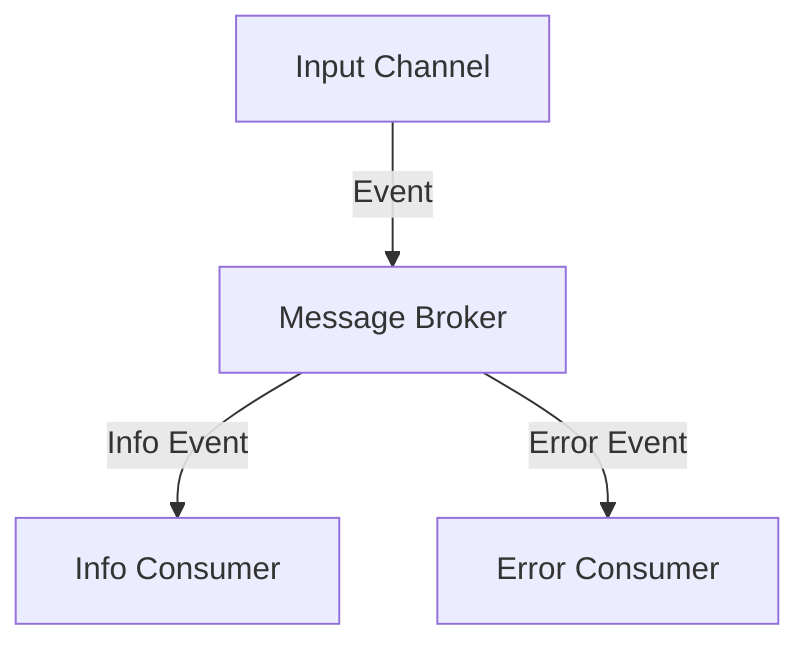

## 14.7 Use Cases for `core.async`

Clojure's `core.async` library is a powerful tool for managing concurrency in functional programming. It provides a set of abstractions that allow developers to write asynchronous code in a straightforward and intuitive manner. In this section, we will explore several practical use cases for `core.async`, including pipeline processing, event handling systems, concurrency patterns, and integration with other libraries. These examples will illustrate how `core.async` can be leveraged to build scalable and efficient applications.

### Pipeline Processing

Pipeline processing is a common pattern in software development where data is processed in stages. Each stage performs a specific operation on the data and passes it to the next stage. `core.async` provides a natural way to implement such pipelines, allowing for asynchronous processing of data.

#### Implementing Data Processing Pipelines

Let's start by implementing a simple data processing pipeline using `core.async`. We'll create a pipeline that reads data from a channel, processes it, and writes the result to another channel.

```clojure
(ns pipeline-example
  (:require [clojure.core.async :refer [chan go >! <! close!]]))

(defn process-data [data]
  ;; Simulate data processing
  (str "Processed " data))

(defn pipeline [input output]
  (go
    (loop []
      (when-let [data (<! input)]
        (let [result (process-data data)]
          (>! output result))
        (recur)))
    (close! output)))

(defn run-pipeline []
  (let [input (chan)
        output (chan)]
    (pipeline input output)
    (go
      (>! input "data1")
      (>! input "data2")
      (close! input))
    (go
      (loop []
        (when-let [result (<! output)]
          (println result)
          (recur))))))

(run-pipeline)
```

In this example, we define a `process-data` function that simulates data processing. The `pipeline` function takes two channels, `input` and `output`, and uses a `go` block to read data from the `input` channel, process it, and write the result to the `output` channel. The `run-pipeline` function sets up the channels and starts the pipeline.

#### Try It Yourself

Experiment with the pipeline by modifying the `process-data` function to perform different operations, such as transforming data to uppercase or filtering specific items. Observe how the pipeline handles these changes.

### Event Handling Systems

Event-driven systems are designed to respond to events, such as user actions or messages from other systems. `core.async` is well-suited for building such systems, providing a way to handle events asynchronously and decouple event producers from consumers.

#### Building an Event-Driven System

Let's build a simple event-driven system using `core.async`. We'll create a message broker that distributes messages to multiple consumers.

```clojure
(ns event-system
  (:require [clojure.core.async :refer [chan go >! <! close! pub sub]]))

(defn message-broker [input]
  (let [output (chan)
        p (pub input :type)]
    (sub p :info output)
    (sub p :error output)
    output))

(defn run-event-system []
  (let [input (chan)
        broker (message-broker input)]
    (go
      (>! input {:type :info :message "Info message"})
      (>! input {:type :error :message "Error message"})
      (close! input))
    (go
      (loop []
        (when-let [event (<! broker)]
          (println "Received event:" event)
          (recur))))))

(run-event-system)
```

In this example, we define a `message-broker` function that uses `pub` to create a publisher from the `input` channel. We then subscribe to `:info` and `:error` events, sending them to the `output` channel. The `run-event-system` function sets up the channels and starts the event system.

#### Try It Yourself

Modify the event system to handle additional event types, such as `:warning` or `:debug`. Add more consumers to process different types of events and observe how the system handles them.

### Concurrency Patterns

Concurrency patterns are essential for building scalable applications that can handle multiple tasks simultaneously. `core.async` provides several abstractions that make it easy to implement common concurrency patterns, such as fan-in, fan-out, and worker pools.

#### Fan-In and Fan-Out

Fan-in and fan-out are patterns used to manage multiple producers and consumers. Fan-in combines multiple input channels into a single output channel, while fan-out distributes messages from a single input channel to multiple output channels.

```clojure
(ns concurrency-patterns
  (:require [clojure.core.async :refer [chan go >! <! close! merge]]))

(defn fan-in [inputs]
  (let [output (chan)]
    (go
      (loop []
        (when-let [data (<! (merge inputs))]
          (>! output data)
          (recur)))
      (close! output))
    output))

(defn run-fan-in []
  (let [input1 (chan)
        input2 (chan)
        output (fan-in [input1 input2])]
    (go
      (>! input1 "data from input1")
      (>! input2 "data from input2")
      (close! input1)
      (close! input2))
    (go
      (loop []
        (when-let [data (<! output)]
          (println "Received data:" data)
          (recur))))))

(run-fan-in)
```

In this example, we define a `fan-in` function that merges multiple input channels into a single output channel. The `run-fan-in` function sets up the channels and demonstrates the fan-in pattern.

#### Try It Yourself

Experiment with the fan-in pattern by adding more input channels and observing how the system combines their data. Implement a fan-out pattern by distributing data from a single input channel to multiple output channels.

### Integration with Other Libraries

`core.async` can be integrated with other libraries and frameworks to build complex systems. This interoperability allows developers to leverage the strengths of different tools and create powerful applications.

#### Integrating with a Web Framework

Let's demonstrate how `core.async` can be integrated with a web framework to handle HTTP requests asynchronously. We'll use the Ring library to create a simple web server.

```clojure
(ns web-integration
  (:require [clojure.core.async :refer [chan go >! <! close!]]
            [ring.adapter.jetty :refer [run-jetty]]
            [ring.util.response :refer [response]]))

(defn async-handler [request]
  (let [result-chan (chan)]
    (go
      (let [result (str "Hello, " (:uri request))]
        (>! result-chan (response result))
        (close! result-chan)))
    result-chan))

(defn run-server []
  (run-jetty async-handler {:port 8080}))

(run-server)
```

In this example, we define an `async-handler` function that processes HTTP requests asynchronously using `core.async`. The `run-server` function starts a Jetty server with the asynchronous handler.

#### Try It Yourself

Modify the server to handle different types of requests and return different responses. Experiment with adding middleware to the server and observe how it affects the request handling.

### Visual Aids

To better understand how `core.async` can be used in these scenarios, let's visualize some of the concepts with diagrams.

#### Pipeline Processing Diagram



**Figure 1**: A simple pipeline processing diagram showing data flow through multiple stages.

#### Event Handling System Diagram



**Figure 2**: An event handling system diagram illustrating how events are distributed to different consumers.

### References and Links

For further reading and exploration of `core.async`, consider the following resources:

- [Clojure Official Documentation](https://clojure.org/reference)
- [core.async GitHub Repository](https://github.com/clojure/core.async)
- [Ring Web Framework](https://github.com/ring-clojure/ring)
- [Transitioning from OOP to Functional Programming](https://www.lispcast.com/oo-to-fp/)

### Knowledge Check

To reinforce your understanding of `core.async` use cases, try answering the following questions and challenges.

## **Test Your Knowledge: Use Cases for `core.async` Quiz**



### What is the primary purpose of `core.async` in Clojure?

- [x] To manage concurrency and asynchronous operations
- [ ] To handle exceptions in Clojure applications
- [ ] To provide a GUI framework for Clojure
- [ ] To optimize memory usage in Clojure programs

> **Explanation:** `core.async` is designed to manage concurrency and asynchronous operations in Clojure applications.

### How does the `pipeline` function in the example process data?

- [x] By reading from an input channel, processing data, and writing to an output channel
- [ ] By directly modifying the input data
- [ ] By sending data to a remote server for processing
- [ ] By storing data in a database

> **Explanation:** The `pipeline` function reads data from an input channel, processes it, and writes the result to an output channel.

### What pattern does the `fan-in` function demonstrate?

- [x] Combining multiple input channels into a single output channel
- [ ] Distributing data from a single input channel to multiple output channels
- [ ] Handling HTTP requests asynchronously
- [ ] Managing state in a concurrent application

> **Explanation:** The `fan-in` function combines multiple input channels into a single output channel, demonstrating the fan-in pattern.

### In the event handling system example, what role does the `pub` function play?

- [x] It creates a publisher that distributes messages based on their type
- [ ] It reads data from a database
- [ ] It sends HTTP requests to a server
- [ ] It logs events to a file

> **Explanation:** The `pub` function creates a publisher that distributes messages based on their type to subscribed consumers.

### How can `core.async` be integrated with a web framework?

- [x] By using asynchronous handlers to process HTTP requests
- [ ] By directly modifying the web server's source code
- [ ] By using a separate thread for each request
- [ ] By storing requests in a database

> **Explanation:** `core.async` can be integrated with a web framework by using asynchronous handlers to process HTTP requests.

### True or False: `core.async` is only useful for managing concurrency in Clojure applications.

- [x] False
- [ ] True

> **Explanation:** `core.async` is not only useful for managing concurrency but also for building event-driven systems and integrating with other libraries.

### What is a common use case for the `merge` function in `core.async`?

- [x] To combine multiple channels into one
- [ ] To split a channel into multiple channels
- [ ] To filter data from a channel
- [ ] To sort data in a channel

> **Explanation:** The `merge` function is commonly used to combine multiple channels into one, allowing for fan-in patterns.

### Which of the following is a benefit of using `core.async` for event handling?

- [x] Decoupling event producers from consumers
- [ ] Increasing memory usage
- [ ] Decreasing application performance
- [ ] Making code harder to read

> **Explanation:** `core.async` helps decouple event producers from consumers, making event handling systems more modular and flexible.

### What is the purpose of the `go` block in `core.async`?

- [x] To create lightweight threads for asynchronous operations
- [ ] To execute code synchronously
- [ ] To handle exceptions
- [ ] To optimize memory usage

> **Explanation:** The `go` block creates lightweight threads for asynchronous operations, allowing for concurrent execution.

### True or False: The `close!` function is used to close channels in `core.async`.

- [x] True
- [ ] False

> **Explanation:** The `close!` function is used to close channels in `core.async`, signaling that no more data will be sent.



By exploring these use cases and experimenting with `core.async`, you'll gain a deeper understanding of how to build scalable and efficient applications in Clojure. Embrace the power of functional programming and concurrency to create robust systems that can handle complex tasks with ease.
