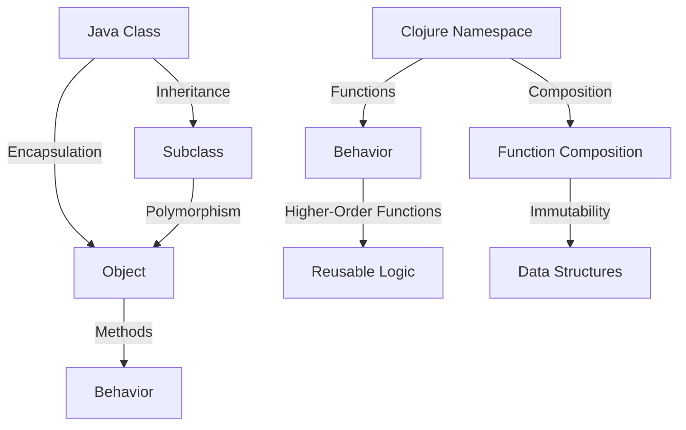

## 15.1 Introduction to Functional Design Patterns

Design patterns are a crucial component of software engineering, providing reusable solutions to common problems. In the realm of object-oriented programming (OOP), patterns like Singleton, Factory, and Observer have been extensively documented and utilized. However, as we transition into the world of functional programming (FP) with languages like Clojure, we encounter a paradigm shift that affects how we approach these patterns.

### Purpose of Design Patterns

Design patterns serve as a toolbox for developers, offering time-tested solutions to recurring design challenges. They help in achieving code reusability, maintainability, and scalability. By abstracting complex interactions into recognizable patterns, developers can communicate solutions more effectively and ensure consistency across projects.

#### Why Patterns Matter

- **Problem-Solving**: Patterns provide a structured approach to solving common design issues.
- **Communication**: They offer a shared language for developers, making it easier to discuss and implement solutions.
- **Efficiency**: By reusing established patterns, developers can save time and reduce errors.

### Shift from OOP to FP Patterns

As we move from OOP to FP, we need to rethink how traditional design patterns apply. Functional programming emphasizes immutability, first-class functions, and higher-order functions, which fundamentally change how patterns are implemented.

#### Comparing OOP and FP Patterns

| OOP Concept | FP Equivalent in Clojure | Explanation |
|-------------|--------------------------|-------------|
| **Class** | **Namespace** | In Clojure, namespaces group related functions and data, similar to how classes encapsulate methods and properties. |
| **Method** | **Function** | Functions in Clojure are first-class citizens, allowing them to be passed around and manipulated like objects in OOP. |
| **Inheritance** | **Composition** | FP favors composing functions and data structures over class hierarchies. |
| **State** | **Immutable Data** | Clojure uses immutable data structures to manage state, contrasting with mutable objects in OOP. |

#### Translating Patterns

Many OOP patterns are designed to manage mutable state or object hierarchies, which are less relevant in FP. Instead, FP introduces patterns like:

- **Higher-Order Functions**: Functions that take other functions as arguments or return them as results.
- **Function Composition**: Combining simple functions to build more complex ones.
- **Monads**: Structures that represent computations instead of values.
- **Lenses**: Functional tools for accessing and modifying data structures.

### Importance in Clojure

Understanding functional design patterns is essential for writing idiomatic Clojure code. Clojure's strengths lie in its simplicity, expressiveness, and ability to handle concurrency with ease. By leveraging functional patterns, developers can write more concise and robust code.

#### Key Benefits

- **Conciseness**: Functional patterns often lead to shorter and more readable code.
- **Parallelism**: Patterns like immutability and pure functions make it easier to write concurrent and parallel programs.
- **Modularity**: FP patterns encourage breaking down problems into smaller, reusable components.

### Overview of Patterns

In this chapter, we will explore several functional design patterns and their applications in Clojure:

1. **The Strategy Pattern**: Implementing interchangeable algorithms using higher-order functions.
2. **The Decorator Pattern**: Enhancing functions with additional behavior without altering their core logic.
3. **The Factory Pattern**: Creating objects or data structures functionally.
4. **The Observer Pattern**: Managing state changes and notifications with immutable data.
5. **Memoization**: Caching function results to optimize performance.
6. **Functional Domain Modeling**: Using algebraic data types and pattern matching to model complex domains.
7. **Currying and Partial Application**: Simplifying function calls by fixing arguments.
8. **Pattern Matching with `core.match`**: Using pattern matching to simplify complex conditionals.

Each pattern will be accompanied by code examples, diagrams, and practical applications to illustrate its use in real-world scenarios.

### Code Examples

Let's start with a simple example of function composition, a fundamental concept in FP:

```clojure
;; Define basic functions
(defn add [x y]
  (+ x y))

(defn multiply [x y]
  (* x y))

;; Compose functions to create a new function
(defn add-then-multiply [x y z]
  (-> x
      (add y)
      (multiply z)))

;; Usage
(add-then-multiply 2 3 4) ; => 20
```

In this example, we use the `->` threading macro to compose the `add` and `multiply` functions, demonstrating how function composition can lead to clean and readable code.

### Visual Aids

To further illustrate the transition from OOP to FP patterns, consider the following diagram:



**Diagram Description**: This diagram contrasts Java classes with Clojure namespaces, highlighting how behavior and logic are encapsulated and composed differently in each paradigm.

### References and Links

For further reading, consider these resources:

- [Clojure Official Documentation](https://clojure.org/reference)
- [Transitioning from OOP to Functional Programming](https://www.lispcast.com/oo-to-fp/)
- [Clojure Community Resources](https://clojure.org/community/resources)

### Knowledge Check

To reinforce your understanding, consider the following questions:

- What are the key differences between OOP and FP design patterns?
- How does immutability affect the implementation of design patterns in Clojure?
- Why is function composition important in functional programming?

### Encouraging Engagement

Embracing functional programming can be challenging, but with each step, you'll gain a deeper understanding and see tangible benefits in your codebase. As you explore these patterns, try to apply them to your projects and experiment with different approaches.

### Test Your Knowledge: Introduction to Functional Design Patterns Quiz



### What is a primary benefit of using design patterns in software engineering?

- [x] They provide reusable solutions to common problems.
- [ ] They increase the complexity of the code.
- [ ] They are only applicable to OOP languages.
- [ ] They eliminate the need for testing.

> **Explanation:** Design patterns offer reusable solutions, enhancing code maintainability and communication.

### How does functional programming handle state differently from OOP?

- [x] By using immutable data structures.
- [ ] By using global variables.
- [ ] By relying on class hierarchies.
- [ ] By avoiding state altogether.

> **Explanation:** Functional programming emphasizes immutability, contrasting with mutable state in OOP.

### Which of the following is a functional programming pattern?

- [x] Function Composition
- [ ] Singleton Pattern
- [ ] Factory Pattern
- [ ] Adapter Pattern

> **Explanation:** Function composition is a key pattern in functional programming, enabling the combination of simple functions.

### What is a higher-order function?

- [x] A function that takes other functions as arguments or returns them.
- [ ] A function that is defined within a class.
- [ ] A function that cannot be modified.
- [ ] A function that is only used in OOP.

> **Explanation:** Higher-order functions can take or return other functions, a core concept in FP.

### What is the role of the `->` macro in Clojure?

- [x] To facilitate function composition.
- [ ] To define classes.
- [ ] To create mutable variables.
- [ ] To handle exceptions.

> **Explanation:** The `->` macro is used for threading, making function composition more readable.

### How does Clojure's approach to design patterns differ from Java's?

- [x] It focuses on immutability and function composition.
- [ ] It relies on class inheritance.
- [ ] It uses global state extensively.
- [ ] It avoids using patterns altogether.

> **Explanation:** Clojure emphasizes immutability and composition, differing from Java's class-based approach.

### What is memoization used for in functional programming?

- [x] Caching function results to optimize performance.
- [ ] Storing global variables.
- [ ] Defining class hierarchies.
- [ ] Handling exceptions.

> **Explanation:** Memoization caches results of expensive function calls to improve efficiency.

### Why is understanding functional design patterns important in Clojure?

- [x] To write idiomatic and efficient code.
- [ ] To avoid using functions.
- [ ] To implement class hierarchies.
- [ ] To increase code complexity.

> **Explanation:** Functional patterns help write idiomatic Clojure code, leveraging its strengths.

### What does the term "immutable" mean in the context of Clojure?

- [x] Data cannot be changed after it is created.
- [ ] Data can be modified at any time.
- [ ] Data is stored globally.
- [ ] Data is only used in OOP.

> **Explanation:** Immutability means data remains constant, a cornerstone of functional programming.

### True or False: Functional programming patterns are only applicable to Clojure.

- [ ] True
- [x] False

> **Explanation:** Functional patterns are applicable to many languages, not just Clojure.



With this foundation, you're now equipped to delve deeper into the specific functional design patterns that will enhance your Clojure programming skills. Let's explore each pattern in detail in the following sections.
