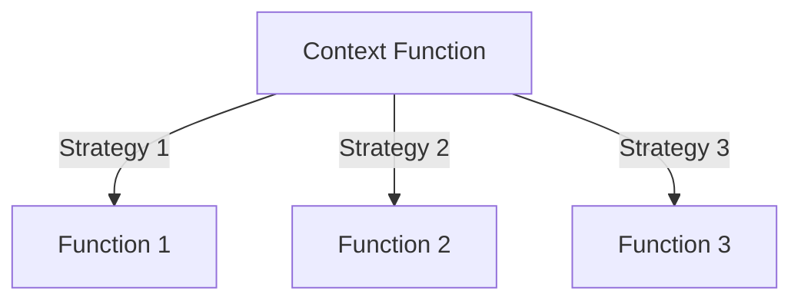

## 15.2 The Strategy Pattern in Functional Context

The Strategy Pattern is a powerful design pattern that allows you to define a family of algorithms, encapsulate each one, and make them interchangeable. This pattern is particularly useful when you need to select an algorithm's behavior at runtime. In the context of functional programming, and specifically in Clojure, the Strategy Pattern can be implemented in a more natural and concise way by leveraging the language's ability to treat functions as first-class citizens.

### Strategy Pattern Basics

In object-oriented programming (OOP), the Strategy Pattern is typically implemented using interfaces or abstract classes. Each strategy is represented as a concrete class implementing a common interface. This allows the client code to choose which strategy to use at runtime.

**Purpose of the Strategy Pattern:**

- **Define a family of algorithms**: The Strategy Pattern allows you to define a set of algorithms that can be used interchangeably.
- **Encapsulate each algorithm**: Each algorithm is encapsulated in a separate class, promoting modularity and separation of concerns.
- **Make algorithms interchangeable**: The client can switch between different algorithms without altering the code that uses them.

In Java, the Strategy Pattern might look like this:

```java
// Strategy interface
public interface PaymentStrategy {
    void pay(int amount);
}

// Concrete strategy classes
public class CreditCardPayment implements PaymentStrategy {
    public void pay(int amount) {
        System.out.println("Paid " + amount + " using Credit Card.");
    }
}

public class PayPalPayment implements PaymentStrategy {
    public void pay(int amount) {
        System.out.println("Paid " + amount + " using PayPal.");
    }
}

// Context class
public class ShoppingCart {
    private PaymentStrategy paymentStrategy;

    public void setPaymentStrategy(PaymentStrategy paymentStrategy) {
        this.paymentStrategy = paymentStrategy;
    }

    public void checkout(int amount) {
        paymentStrategy.pay(amount);
    }
}
```

### Functional Implementation in Clojure

In Clojure, we can achieve the same behavior more succinctly by passing functions as parameters. This approach not only reduces boilerplate code but also enhances flexibility and testability.

**Functional Approach:**

- **Functions as First-Class Citizens**: In Clojure, functions can be assigned to variables, passed as arguments, and returned from other functions.
- **Higher-Order Functions**: Functions that take other functions as arguments or return them as results.
- **Anonymous Functions**: Functions that are defined without a name, often used for short-lived operations.

Let's translate the Java example into Clojure:

```clojure
;; Define different payment strategies as functions
(defn credit-card-payment [amount]
  (println (str "Paid " amount " using Credit Card.")))

(defn paypal-payment [amount]
  (println (str "Paid " amount " using PayPal.")))

;; Context function that takes a payment strategy
(defn checkout [payment-strategy amount]
  (payment-strategy amount))

;; Usage
(checkout credit-card-payment 100)
(checkout paypal-payment 150)
```

### Examples in Clojure

Clojure's ability to treat functions as first-class citizens makes it easy to implement the Strategy Pattern. Here's a more complex example where we select different sorting algorithms based on user input:

```clojure
;; Define sorting strategies
(defn bubble-sort [coll]
  ;; Bubble sort implementation
  (println "Sorting using Bubble Sort")
  (sort coll))  ; Placeholder for actual bubble sort logic

(defn quick-sort [coll]
  ;; Quick sort implementation
  (println "Sorting using Quick Sort")
  (sort coll))  ; Placeholder for actual quick sort logic

;; Context function that takes a sorting strategy
(defn sort-collection [sort-strategy coll]
  (sort-strategy coll))

;; Usage
(sort-collection bubble-sort [5 3 8 1 2])
(sort-collection quick-sort [5 3 8 1 2])
```

In this example, `sort-collection` is a higher-order function that takes a sorting strategy function and a collection to sort. The specific sorting algorithm is determined at runtime, providing flexibility and modularity.

### Advantages of the Functional Strategy Pattern

Implementing the Strategy Pattern in a functional context offers several advantages:

1. **Simplicity**: The code is more concise and easier to understand. There is no need for additional classes or interfaces.
2. **Flexibility**: Functions can be easily swapped or modified without changing the surrounding code.
3. **Ease of Testing**: Individual functions can be tested in isolation, improving test coverage and maintainability.
4. **Reduced Boilerplate**: Functional implementations often require less code, reducing the potential for errors.

### Try It Yourself

Experiment with the provided code examples by modifying the strategies or adding new ones. For instance, try implementing a new payment method or sorting algorithm and integrate it into the existing structure.

### Visual Aids

To better understand the flow of the Strategy Pattern in Clojure, consider the following diagram, which illustrates how different strategies are passed to a context function:



**Diagram Description:** The diagram shows a context function that can receive different strategies (functions) as input, allowing for flexible behavior selection.

### References and Links

For more information on Clojure's functional programming capabilities, visit the [Clojure Official Documentation](https://clojure.org/reference). To explore transitioning from OOP to functional programming, check out this [guide on transitioning from OOP to FP](https://www.lispcast.com/oo-to-fp/).

### Knowledge Check

1. What is the primary purpose of the Strategy Pattern?
2. How does Clojure's treatment of functions as first-class citizens facilitate the implementation of the Strategy Pattern?
3. What are the benefits of using the Strategy Pattern in a functional context?

### Exercises

1. Implement a new sorting strategy in Clojure and integrate it with the `sort-collection` function.
2. Create a new payment method function and use it with the `checkout` function.
3. Refactor an existing Java Strategy Pattern implementation into Clojure.

### Encouraging Engagement

Embracing functional programming can be challenging, but with each step, you'll gain a deeper understanding and see tangible benefits in your codebase. Keep experimenting with different strategies and explore how functional programming can simplify your designs.

## **Test Your Knowledge: The Strategy Pattern in Functional Context Quiz**



### What is the primary purpose of the Strategy Pattern?

- [x] To define a family of algorithms and make them interchangeable
- [ ] To create a single, fixed algorithm
- [ ] To enforce a strict class hierarchy
- [ ] To eliminate the need for algorithms

> **Explanation:** The Strategy Pattern is intended to define a family of algorithms, encapsulate them, and make them interchangeable.

### How does Clojure's functional approach simplify the Strategy Pattern?

- [x] By using functions as first-class citizens
- [ ] By enforcing strict typing
- [ ] By requiring more boilerplate code
- [ ] By limiting the number of functions

> **Explanation:** Clojure treats functions as first-class citizens, allowing them to be passed as arguments, which simplifies the implementation of the Strategy Pattern.

### What is a benefit of using the Strategy Pattern in Clojure?

- [x] Increased flexibility
- [ ] Increased complexity
- [ ] Reduced modularity
- [ ] Reduced testability

> **Explanation:** The Strategy Pattern in Clojure increases flexibility by allowing different strategies to be easily swapped.

### Which of the following is a key feature of functional programming used in the Strategy Pattern?

- [x] Higher-order functions
- [ ] Inheritance
- [ ] Polymorphism
- [ ] Encapsulation

> **Explanation:** Higher-order functions, which take other functions as arguments, are a key feature of functional programming used in the Strategy Pattern.

### In Clojure, how are different strategies typically represented?

- [x] As functions
- [ ] As classes
- [ ] As interfaces
- [ ] As modules

> **Explanation:** In Clojure, different strategies are typically represented as functions, leveraging the language's functional nature.

### What is an advantage of using functions in the Strategy Pattern?

- [x] Reduced boilerplate code
- [ ] Increased code size
- [ ] More complex testing
- [ ] Less flexibility

> **Explanation:** Using functions in the Strategy Pattern reduces boilerplate code, making the implementation more concise.

### How can you test individual strategies in Clojure?

- [x] By testing functions in isolation
- [ ] By testing entire classes
- [ ] By testing the main program
- [ ] By testing interfaces

> **Explanation:** In Clojure, individual strategies can be tested in isolation by testing the functions that represent them.

### What does the `checkout` function in the Clojure example do?

- [x] It executes a payment strategy
- [ ] It sorts a collection
- [ ] It manages user input
- [ ] It validates data

> **Explanation:** The `checkout` function in the Clojure example executes a payment strategy by calling the function passed to it.

### What is a key difference between Java and Clojure implementations of the Strategy Pattern?

- [x] Java uses classes, while Clojure uses functions
- [ ] Java uses functions, while Clojure uses classes
- [ ] Java is more concise than Clojure
- [ ] Clojure requires more boilerplate code

> **Explanation:** In Java, the Strategy Pattern is implemented using classes, while in Clojure, it is implemented using functions.

### True or False: The Strategy Pattern in Clojure requires defining interfaces.

- [ ] True
- [x] False

> **Explanation:** False. The Strategy Pattern in Clojure does not require defining interfaces, as it uses functions instead.


