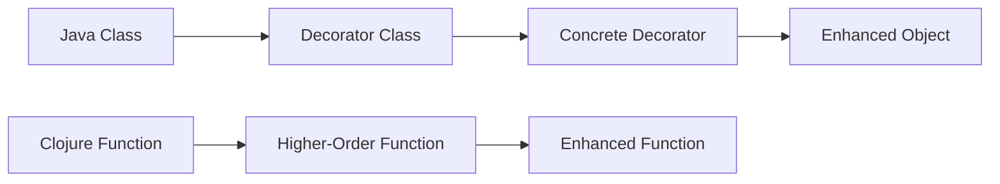

## 15.3 Applying the Decorator Pattern Functionally

In the world of software design, patterns are essential tools that help developers solve recurring problems. One such pattern is the **Decorator Pattern**, which is widely used in object-oriented programming (OOP) to add behavior to objects dynamically. In this section, we will explore how to apply the decorator pattern functionally in Clojure, leveraging the power of higher-order functions and functional composition.

### Decorator Pattern Explained

The decorator pattern is a structural design pattern that allows behavior to be added to individual objects, dynamically, without affecting the behavior of other objects from the same class. In Java, this is typically achieved by creating a set of decorator classes that wrap the original class.

#### Java Example: Decorator Pattern

Let's consider a simple Java example to illustrate the decorator pattern:

```java
// Component interface
interface Coffee {
    String getDescription();
    double cost();
}

// Concrete component
class SimpleCoffee implements Coffee {
    public String getDescription() {
        return "Simple Coffee";
    }

    public double cost() {
        return 5.0;
    }
}

// Decorator class
abstract class CoffeeDecorator implements Coffee {
    protected Coffee decoratedCoffee;

    public CoffeeDecorator(Coffee coffee) {
        this.decoratedCoffee = coffee;
    }

    public String getDescription() {
        return decoratedCoffee.getDescription();
    }

    public double cost() {
        return decoratedCoffee.cost();
    }
}

// Concrete decorators
class MilkDecorator extends CoffeeDecorator {
    public MilkDecorator(Coffee coffee) {
        super(coffee);
    }

    public String getDescription() {
        return decoratedCoffee.getDescription() + ", Milk";
    }

    public double cost() {
        return decoratedCoffee.cost() + 1.5;
    }
}

class SugarDecorator extends CoffeeDecorator {
    public SugarDecorator(Coffee coffee) {
        super(coffee);
    }

    public String getDescription() {
        return decoratedCoffee.getDescription() + ", Sugar";
    }

    public double cost() {
        return decoratedCoffee.cost() + 0.5;
    }
}

// Usage
public class CoffeeShop {
    public static void main(String[] args) {
        Coffee coffee = new SimpleCoffee();
        coffee = new MilkDecorator(coffee);
        coffee = new SugarDecorator(coffee);

        System.out.println(coffee.getDescription() + " $" + coffee.cost());
    }
}
```

In this example, the `Coffee` interface represents the component, and `SimpleCoffee` is a concrete component. The `CoffeeDecorator` is an abstract class that implements the `Coffee` interface and contains a reference to a `Coffee` object. `MilkDecorator` and `SugarDecorator` are concrete decorators that add additional behavior.

### Functional Approach

In functional programming, we can achieve similar behavior by composing functions. Instead of wrapping objects, we create higher-order functions that take a function as an argument and return a new function with enhanced behavior.

#### Clojure Example: Functional Decorator

Let's translate the Java example into a functional approach using Clojure:

```clojure
(defn simple-coffee []
  {:description "Simple Coffee"
   :cost 5.0})

(defn add-milk [coffee]
  (update coffee :description #(str % ", Milk"))
  (update coffee :cost #(+ % 1.5)))

(defn add-sugar [coffee]
  (update coffee :description #(str % ", Sugar"))
  (update coffee :cost #(+ % 0.5)))

(defn describe-coffee [coffee]
  (str (:description coffee) " $" (:cost coffee)))

;; Usage
(let [coffee (-> (simple-coffee)
                 add-milk
                 add-sugar)]
  (println (describe-coffee coffee)))
```

In this Clojure example, we define a `simple-coffee` function that returns a map representing the coffee. The `add-milk` and `add-sugar` functions are higher-order functions that take a coffee map as an argument and return a new coffee map with updated properties. We use the threading macro `->` to apply the decorators sequentially.

### Higher-Order Functions

Higher-order functions are functions that can take other functions as arguments or return them as results. They are a powerful tool in functional programming, enabling us to create flexible and reusable code.

#### Creating a Logging Decorator

Let's create a higher-order function that adds logging to any function:

```clojure
(defn with-logging [f]
  (fn [& args]
    (println "Calling function with arguments:" args)
    (let [result (apply f args)]
      (println "Function result:" result)
      result)))

;; Example function
(defn add [a b]
  (+ a b))

;; Decorated function
(def logged-add (with-logging add))

;; Usage
(logged-add 3 4)
```

In this example, `with-logging` is a higher-order function that takes a function `f` and returns a new function that logs the arguments and result of `f`. We then apply this decorator to the `add` function.

### Examples

#### Caching Decorator

Caching is a common optimization technique that can be implemented as a decorator. Let's create a caching decorator in Clojure:

```clojure
(defn with-cache [f]
  (let [cache (atom {})]
    (fn [& args]
      (if-let [cached-result (get @cache args)]
        cached-result
        (let [result (apply f args)]
          (swap! cache assoc args result)
          result)))))

;; Example function
(defn expensive-computation [x]
  (Thread/sleep 1000) ; Simulate a long computation
  (* x x))

;; Decorated function
(def cached-expensive-computation (with-cache expensive-computation))

;; Usage
(time (cached-expensive-computation 5)) ; First call, takes time
(time (cached-expensive-computation 5)) ; Second call, returns cached result
```

The `with-cache` function creates a cache using an atom. It checks if the result for the given arguments is already cached; if not, it computes the result, caches it, and returns it.

### Visual Aids

To better understand the transformation from Java's decorator pattern to Clojure's functional approach, consider the following diagram:



**Diagram Description**: This diagram illustrates the conceptual shift from Java's class-based decorator pattern to Clojure's function-based approach. In Java, decorators are implemented as classes that wrap other classes, while in Clojure, decorators are higher-order functions that enhance other functions.

### References and Links

- [Clojure Official Documentation](https://clojure.org/reference)
- [Clojure Community Resources](https://clojure.org/community/resources)
- [Transitioning from OOP to Functional Programming](https://www.lispcast.com/oo-to-fp/)

### Knowledge Check

1. **What is the primary purpose of the decorator pattern?**
   - [x] To add behavior to objects dynamically without modifying their structure.
   - [ ] To create a new class hierarchy.
   - [ ] To enforce strict typing.
   - [ ] To optimize memory usage.

2. **How does the functional approach to the decorator pattern differ from the OOP approach?**
   - [x] It uses higher-order functions instead of class inheritance.
   - [ ] It requires more boilerplate code.
   - [ ] It is less flexible.
   - [ ] It cannot be used for logging.

3. **What is a higher-order function?**
   - [x] A function that takes other functions as arguments or returns them as results.
   - [ ] A function that only performs arithmetic operations.
   - [ ] A function that cannot be nested.
   - [ ] A function with a fixed number of parameters.

4. **How can you implement logging as a decorator in Clojure?**
   - [x] By creating a higher-order function that wraps the original function and logs its input and output.
   - [ ] By modifying the original function directly.
   - [ ] By using Java's logging framework.
   - [ ] By creating a new class for each function.

5. **What is the advantage of using atoms in a caching decorator?**
   - [x] Atoms provide a thread-safe way to manage mutable state.
   - [ ] Atoms automatically serialize data.
   - [ ] Atoms are faster than functions.
   - [ ] Atoms are only used for logging.

6. **How can the threading macro `->` be used in function composition?**
   - [x] It applies a series of functions to an initial value, threading the result through each function.
   - [ ] It creates a new thread for each function call.
   - [ ] It is used only for debugging.
   - [ ] It is not related to function composition.

7. **What is the role of `swap!` in the caching decorator?**
   - [x] It updates the atom with a new value in a thread-safe manner.
   - [ ] It initializes the atom.
   - [ ] It deletes the atom.
   - [ ] It logs the atom's value.

8. **Can the decorator pattern be used for error handling in Clojure?**
   - [x] Yes, by wrapping functions with error-handling logic.
   - [ ] No, it is only for adding features.
   - [ ] No, Clojure does not support error handling.
   - [ ] Yes, but only in Java.

9. **What is a common use case for function decorators in Clojure?**
   - [x] Adding logging, caching, or authentication to functions.
   - [ ] Creating new data types.
   - [ ] Compiling code.
   - [ ] Enforcing immutability.

10. **True or False: The decorator pattern in functional programming always requires mutable state.**
    - [ ] True
    - [x] False

> **Explanation:** In functional programming, decorators can be implemented without mutable state by using higher-order functions and immutable data structures.

### Encouraging Engagement

Embracing functional programming can be challenging, but with each step, you'll gain a deeper understanding and see tangible benefits in your codebase. Try experimenting with the provided examples and see how you can apply these concepts to your projects. By mastering functional design patterns like the decorator pattern, you'll be well-equipped to build scalable and maintainable applications in Clojure.

### Try It Yourself

- **Experiment with the code examples**: Modify the `add-milk` and `add-sugar` functions to add other ingredients or features.
- **Create your own decorators**: Implement a decorator that adds authentication checks to a function.
- **Explore Clojure's threading macros**: Use `->>` to see how it changes the data flow in your functions.

### Quiz

## **Test Your Knowledge: Applying the Decorator Pattern Functionally Quiz**



### What is the primary purpose of the decorator pattern?

- [x] To add behavior to objects dynamically without modifying their structure.
- [ ] To create a new class hierarchy.
- [ ] To enforce strict typing.
- [ ] To optimize memory usage.

> **Explanation:** The decorator pattern allows for the dynamic addition of behavior to objects without changing their existing structure, making it flexible and reusable.

### How does the functional approach to the decorator pattern differ from the OOP approach?

- [x] It uses higher-order functions instead of class inheritance.
- [ ] It requires more boilerplate code.
- [ ] It is less flexible.
- [ ] It cannot be used for logging.

> **Explanation:** In functional programming, decorators are implemented using higher-order functions, which are more flexible and concise compared to class-based inheritance in OOP.

### What is a higher-order function?

- [x] A function that takes other functions as arguments or returns them as results.
- [ ] A function that only performs arithmetic operations.
- [ ] A function that cannot be nested.
- [ ] A function with a fixed number of parameters.

> **Explanation:** Higher-order functions are a core concept in functional programming, allowing functions to be passed around and composed like data.

### How can you implement logging as a decorator in Clojure?

- [x] By creating a higher-order function that wraps the original function and logs its input and output.
- [ ] By modifying the original function directly.
- [ ] By using Java's logging framework.
- [ ] By creating a new class for each function.

> **Explanation:** In Clojure, logging can be added by wrapping the original function in a higher-order function that logs input and output, maintaining purity and separation of concerns.

### What is the advantage of using atoms in a caching decorator?

- [x] Atoms provide a thread-safe way to manage mutable state.
- [ ] Atoms automatically serialize data.
- [ ] Atoms are faster than functions.
- [ ] Atoms are only used for logging.

> **Explanation:** Atoms in Clojure offer a way to manage state changes safely in a concurrent environment, making them ideal for caching.

### How can the threading macro `->` be used in function composition?

- [x] It applies a series of functions to an initial value, threading the result through each function.
- [ ] It creates a new thread for each function call.
- [ ] It is used only for debugging.
- [ ] It is not related to function composition.

> **Explanation:** The `->` macro in Clojure allows for clean and readable function composition by threading the result of each function into the next.

### What is the role of `swap!` in the caching decorator?

- [x] It updates the atom with a new value in a thread-safe manner.
- [ ] It initializes the atom.
- [ ] It deletes the atom.
- [ ] It logs the atom's value.

> **Explanation:** The `swap!` function in Clojure updates the value of an atom safely, ensuring consistency in a concurrent environment.

### Can the decorator pattern be used for error handling in Clojure?

- [x] Yes, by wrapping functions with error-handling logic.
- [ ] No, it is only for adding features.
- [ ] No, Clojure does not support error handling.
- [ ] Yes, but only in Java.

> **Explanation:** In Clojure, decorators can be used to add error-handling logic to functions, enhancing their robustness without altering their core functionality.

### What is a common use case for function decorators in Clojure?

- [x] Adding logging, caching, or authentication to functions.
- [ ] Creating new data types.
- [ ] Compiling code.
- [ ] Enforcing immutability.

> **Explanation:** Function decorators in Clojure are commonly used to add cross-cutting concerns like logging, caching, or authentication, enhancing function behavior.

### True or False: The decorator pattern in functional programming always requires mutable state.

- [ ] True
- [x] False

> **Explanation:** In functional programming, decorators can be implemented without mutable state by using higher-order functions and immutable data structures.



By applying the decorator pattern functionally in Clojure, we can create flexible, reusable, and maintainable code. This approach not only enhances our understanding of functional programming but also equips us with the tools to build scalable applications.
