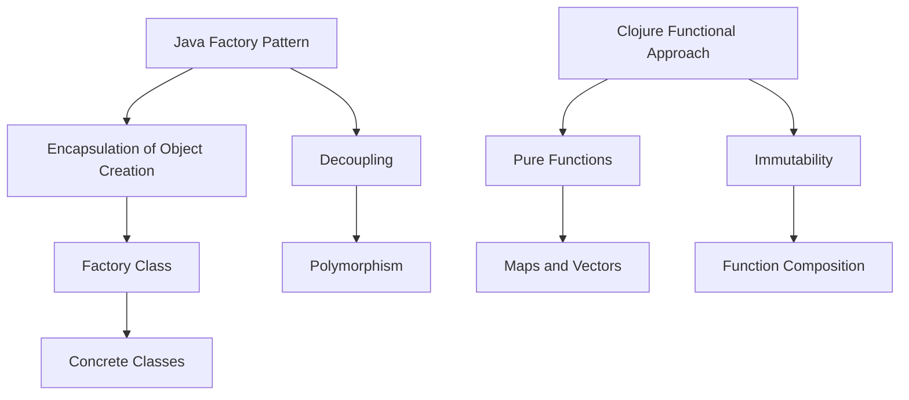

## 15.4 Reimagining the Factory Pattern

In this section, we will explore how to reimagine the Factory Pattern, a staple of object-oriented programming (OOP), within the functional programming paradigm using Clojure. We will delve into how functional alternatives, such as pure functions and immutable data structures, can be employed to achieve the same objectives without relying on traditional factories. By the end of this section, you'll be equipped with the knowledge to create complex data structures and initialize components functionally.

### Factory Pattern in OOP

The Factory Pattern in OOP is a design pattern that provides an interface for creating objects in a superclass, but allows subclasses to alter the type of objects that will be created. It is a creational pattern that abstracts the instantiation process, allowing for more flexibility and decoupling in the codebase.

#### Key Characteristics of the Factory Pattern

- **Encapsulation of Object Creation**: The factory method encapsulates the creation logic, allowing for complex creation processes to be hidden from the client code.
- **Decoupling**: It decouples the client code from the concrete classes, enabling easier maintenance and extension.
- **Polymorphism**: The pattern leverages polymorphism, allowing the factory to return objects of different types that share a common interface or superclass.

#### Example in Java

Let's consider a simple example in Java, where we have a `ShapeFactory` that creates different types of `Shape` objects.

```java
// Shape interface
interface Shape {
    void draw();
}

// Concrete implementation: Circle
class Circle implements Shape {
    public void draw() {
        System.out.println("Drawing a Circle");
    }
}

// Concrete implementation: Square
class Square implements Shape {
    public void draw() {
        System.out.println("Drawing a Square");
    }
}

// Factory class
class ShapeFactory {
    public Shape getShape(String shapeType) {
        if (shapeType == null) {
            return null;
        }
        if (shapeType.equalsIgnoreCase("CIRCLE")) {
            return new Circle();
        } else if (shapeType.equalsIgnoreCase("SQUARE")) {
            return new Square();
        }
        return null;
    }
}

// Client code
public class FactoryPatternDemo {
    public static void main(String[] args) {
        ShapeFactory shapeFactory = new ShapeFactory();

        // Get an object of Circle and call its draw method.
        Shape shape1 = shapeFactory.getShape("CIRCLE");
        shape1.draw();

        // Get an object of Square and call its draw method.
        Shape shape2 = shapeFactory.getShape("SQUARE");
        shape2.draw();
    }
}
```

In this example, the `ShapeFactory` class is responsible for creating instances of `Shape` objects. The client code interacts with the factory to obtain instances of `Circle` and `Square`.

### Functional Alternatives

In functional programming, we aim to replace the need for factories by leveraging pure functions and immutable data structures. Instead of encapsulating object creation in a class, we can use functions to generate and configure data structures.

#### Pure Functions and Data Structures

Pure functions are the cornerstone of functional programming. They are functions where the output value is determined only by its input values, without observable side effects. This makes them predictable and easy to test.

In Clojure, we can use pure functions to create and manipulate data structures, achieving the same goals as the Factory Pattern in OOP.

#### Creating Objects and Data in Clojure

In Clojure, we can create complex data structures using maps, vectors, and other immutable collections. Functions can be used to initialize and configure these structures.

Let's reimagine the Java `ShapeFactory` example in Clojure.

```clojure
;; Define a protocol for shapes
(defprotocol Shape
  (draw [this]))

;; Implement Circle as a map with a protocol implementation
(defn create-circle []
  {:type :circle
   :draw (fn [_] (println "Drawing a Circle"))})

;; Implement Square as a map with a protocol implementation
(defn create-square []
  {:type :square
   :draw (fn [_] (println "Drawing a Square"))})

;; Factory function to create shapes
(defn get-shape [shape-type]
  (case shape-type
    :circle (create-circle)
    :square (create-square)
    nil))

;; Client code
(let [circle (get-shape :circle)
      square (get-shape :square)]
  ((:draw circle))
  ((:draw square)))
```

In this Clojure example, we use maps to represent `Circle` and `Square` objects. The `get-shape` function acts as a factory, returning the appropriate shape based on the input. Each shape is a map with a `:draw` function, which is invoked to perform the drawing action.

### Advantages of Functional Alternatives

- **Simplicity**: Pure functions and data structures simplify the codebase by eliminating the need for complex class hierarchies.
- **Immutability**: Using immutable data structures ensures that the state cannot be altered, leading to more predictable and reliable code.
- **Flexibility**: Functions can easily be composed and reused, allowing for greater flexibility in configuring and creating data structures.

### Examples of Functional Factory Alternatives

Let's explore some practical examples where functions generate configurations or initialize components.

#### Example 1: Configuring a Web Server

Suppose we want to configure a web server with different settings. In a functional style, we can use a map to represent the configuration and functions to modify it.

```clojure
(defn default-config []
  {:port 8080
   :host "localhost"
   :ssl false})

(defn enable-ssl [config]
  (assoc config :ssl true))

(defn set-port [config port]
  (assoc config :port port))

;; Create a server configuration
(let [config (-> (default-config)
                 (set-port 8443)
                 enable-ssl)]
  (println config))
```

In this example, we start with a `default-config` and use functions like `enable-ssl` and `set-port` to modify the configuration. The `->` threading macro is used to apply transformations in a readable manner.

#### Example 2: Initializing Components with Dependencies

When initializing components with dependencies, we can use functions to inject dependencies and create the component.

```clojure
(defn create-database [url]
  {:type :database
   :url url})

(defn create-service [db]
  {:type :service
   :database db})

;; Initialize components
(let [db (create-database "jdbc:postgresql://localhost:5432/mydb")
      service (create-service db)]
  (println service))
```

Here, the `create-database` function creates a database component, and `create-service` initializes a service with the database as a dependency. This approach is flexible and allows for easy testing and configuration.

### Visualizing the Transition

To better understand the transition from the Factory Pattern in OOP to functional alternatives in Clojure, let's visualize the process.



**Figure 1: Transition from Java Factory Pattern to Clojure Functional Approach**

### Further Reading and Resources

For those interested in exploring more about functional programming and Clojure, here are some recommended resources:

- [Clojure Official Documentation](https://clojure.org/reference)
- [Transitioning from OOP to Functional Programming](https://www.lispcast.com/oo-to-fp/)
- [Clojure Community Resources](https://clojure.org/community/resources)

### Knowledge Check

To reinforce your understanding of reimagining the Factory Pattern in Clojure, consider the following questions:

1. How does the use of pure functions in Clojure differ from the Factory Pattern in OOP?
2. What are the advantages of using immutable data structures in functional programming?
3. How can threading macros like `->` enhance the readability of functional code?

### Exercises

1. **Exercise 1**: Create a function-based factory in Clojure that generates different types of vehicles (e.g., car, truck, bike) with specific attributes.
2. **Exercise 2**: Refactor a Java-based factory pattern to Clojure, focusing on using pure functions and immutable data structures.

### Summary

In this section, we explored how to reimagine the Factory Pattern from OOP in a functional programming context using Clojure. By leveraging pure functions and immutable data structures, we can achieve the same goals as the Factory Pattern while benefiting from the simplicity and flexibility of functional programming.

## **Test Your Knowledge: Reimagining the Factory Pattern Quiz**



### Which of the following is a key characteristic of the Factory Pattern in OOP?

- [x] Encapsulation of Object Creation
- [ ] Mutable State Management
- [ ] Direct Instantiation
- [ ] Inheritance

> **Explanation:** The Factory Pattern encapsulates the object creation process, allowing for more flexibility and decoupling.

### How do pure functions in Clojure replace the need for factories?

- [x] By providing predictable outputs without side effects
- [ ] By using inheritance
- [ ] By managing mutable state
- [ ] By relying on direct instantiation

> **Explanation:** Pure functions provide predictable outputs based on input values, eliminating the need for encapsulated object creation.

### What is the benefit of using immutable data structures in functional programming?

- [x] Predictability and reliability
- [ ] Increased complexity
- [ ] Mutable state management
- [ ] Direct instantiation

> **Explanation:** Immutable data structures ensure that the state cannot be altered, leading to more predictable and reliable code.

### In Clojure, how can we represent a Circle object functionally?

- [x] Using a map with a protocol implementation
- [ ] Using a class with methods
- [ ] Using inheritance
- [ ] Using mutable fields

> **Explanation:** In Clojure, we can use maps to represent objects and protocols to define behavior.

### What does the `->` threading macro do in Clojure?

- [x] Applies transformations in a readable manner
- [ ] Manages mutable state
- [x] Composes functions
- [ ] Directly instantiates objects

> **Explanation:** The `->` threading macro applies transformations in a readable manner and aids in function composition.

### Which of the following is NOT a characteristic of functional programming?

- [ ] Immutability
- [x] Mutable State Management
- [ ] Pure Functions
- [ ] Function Composition

> **Explanation:** Functional programming emphasizes immutability and pure functions, avoiding mutable state management.

### How can we initialize components with dependencies in Clojure?

- [x] By using functions to inject dependencies
- [ ] By using inheritance
- [x] By creating maps with dependencies
- [ ] By managing mutable state

> **Explanation:** Functions can inject dependencies, and maps can represent components with dependencies.

### What is a benefit of using pure functions in functional programming?

- [x] Predictable outputs
- [ ] Mutable state management
- [ ] Direct instantiation
- [ ] Inheritance

> **Explanation:** Pure functions provide predictable outputs based on input values, enhancing code reliability.

### How does the Factory Pattern in OOP achieve polymorphism?

- [x] By returning objects of different types that share a common interface
- [ ] By using mutable state
- [ ] By direct instantiation
- [ ] By using threading macros

> **Explanation:** The Factory Pattern achieves polymorphism by returning objects of different types that share a common interface.

### True or False: Clojure's functional approach eliminates the need for encapsulation.

- [x] True
- [ ] False

> **Explanation:** Clojure's functional approach uses pure functions and data structures, reducing the need for encapsulation.


