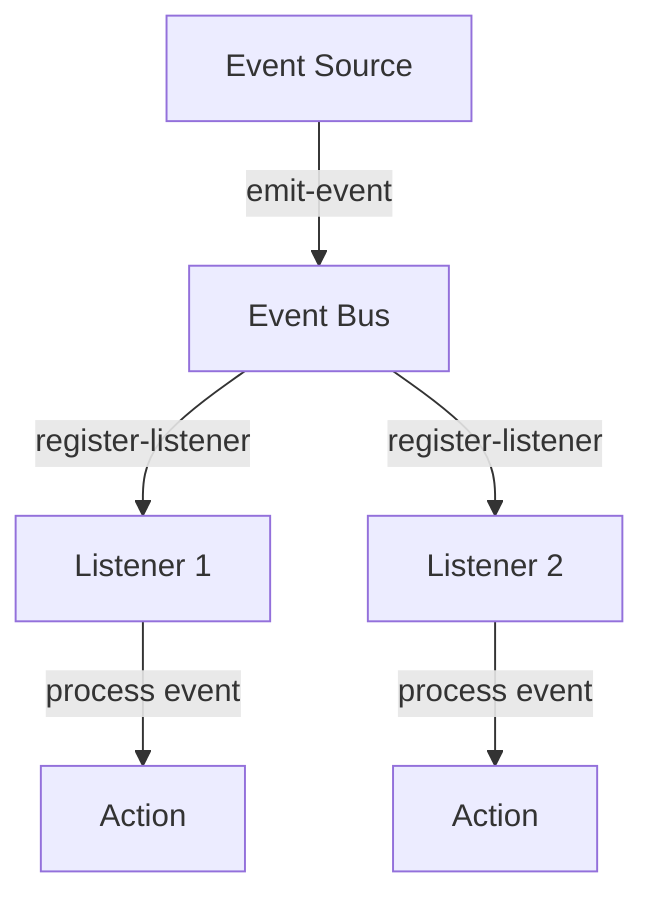

## 15.5 The Observer Pattern in Functional Programming

The Observer Pattern is a design pattern commonly used in object-oriented programming (OOP) to allow an object, known as the subject, to maintain a list of dependents, called observers, and notify them automatically of any state changes. In functional programming, and particularly in Clojure, the Observer Pattern can be implemented using functional reactive programming (FRP) concepts and libraries like `core.async`.

### Observer Pattern Overview

The Observer Pattern is a behavioral design pattern that defines a one-to-many dependency between objects so that when one object changes state, all its dependents are notified and updated automatically. This pattern is particularly useful for implementing distributed event-handling systems, where changes in one part of a system need to be communicated to other parts.

#### Key Components of the Observer Pattern

1. **Subject**: The object that holds the state and notifies observers of changes.
2. **Observer**: The objects that are interested in the state changes of the subject.
3. **Subscription Mechanism**: A way for observers to register themselves with the subject.
4. **Notification Mechanism**: A way for the subject to notify all registered observers of state changes.

### Functional Implementation

In functional programming, we aim to avoid mutable state and side effects, which can make implementing the Observer Pattern in a traditional way challenging. Instead, we use functional reactive programming (FRP) and event streams to achieve similar behavior.

#### Functional Reactive Programming (FRP)

FRP is a programming paradigm for reactive programming using the building blocks of functional programming. It allows us to work with time-varying values and propagate changes through a system in a declarative manner.

- **Event Streams**: In FRP, we use event streams to represent sequences of events over time. These streams can be composed, transformed, and filtered using functional operators.
- **Reactive Values**: FRP provides constructs for representing values that change over time and automatically update dependent computations.

#### Implementing Observables in Clojure

In Clojure, we can use libraries like `core.async` to implement observables and handle asynchronous events. `core.async` provides channels and go blocks, which allow us to model asynchronous data flows and event-driven systems.

### Using `core.async`

`core.async` is a Clojure library that provides facilities for asynchronous programming using channels. Channels are a powerful abstraction for communication between different parts of a program, and they can be used to implement observer-like behavior.

#### Key Concepts in `core.async`

1. **Channels**: Channels are queues that can be used to pass messages between different parts of a program. They can be buffered or unbuffered.
2. **Go Blocks**: Go blocks are lightweight threads that allow you to write asynchronous code in a synchronous style.
3. **Pipelines**: Pipelines allow you to process data through a series of transformations, similar to Unix pipelines.

#### Implementing Observer-Like Behavior

To implement observer-like behavior using `core.async`, we can create a channel for each event stream and use go blocks to listen for events and notify subscribers.

```clojure
(require '[clojure.core.async :as async])

(defn create-event-stream []
  (async/chan))

(defn subscribe [event-stream handler]
  (async/go-loop []
    (when-let [event (async/<! event-stream)]
      (handler event)
      (recur))))

(defn publish [event-stream event]
  (async/go
    (async/>! event-stream event)))

;; Example usage
(let [event-stream (create-event-stream)]
  (subscribe event-stream (fn [event] (println "Received event:" event)))
  (publish event-stream {:type :update :data "New data"}))
```

In this example, we create an event stream using a channel and define a `subscribe` function that takes an event stream and a handler function. The handler function is called whenever an event is published to the stream.

### Examples

Let's explore some examples of using the Observer Pattern in functional programming with Clojure.

#### Example 1: Simple Event Notification

In this example, we'll create a simple event notification system where subscribers are notified of changes to a shared state.

```clojure
(defn create-state []
  (atom {:value 0}))

(defn add-subscriber [state handler]
  (add-watch state :observer
    (fn [_ _ _ new-state]
      (handler new-state))))

(defn update-state [state new-value]
  (swap! state assoc :value new-value))

;; Example usage
(let [state (create-state)]
  (add-subscriber state (fn [new-state] (println "State updated:" new-state)))
  (update-state state 42))
```

In this example, we use an atom to represent the shared state and `add-watch` to add a subscriber that is notified whenever the state changes.

#### Example 2: Event Streams with `core.async`

In this example, we'll create an event stream using `core.async` and demonstrate how subscribers can react to events.

```clojure
(defn create-event-bus []
  (async/chan))

(defn register-listener [event-bus listener]
  (async/go-loop []
    (when-let [event (async/<! event-bus)]
      (listener event)
      (recur))))

(defn emit-event [event-bus event]
  (async/go
    (async/>! event-bus event)))

;; Example usage
(let [event-bus (create-event-bus)]
  (register-listener event-bus (fn [event] (println "Listener received:" event)))
  (emit-event event-bus {:type :click :target "button"}))
```

This example demonstrates how to use `core.async` to create an event bus and register listeners that react to events emitted on the bus.

### Visual Aids

To better understand how the Observer Pattern maps to functional programming concepts in Clojure, consider the following diagram illustrating the flow of events through a system using `core.async`.



**Diagram Description**: This diagram shows an event source emitting events to an event bus implemented using `core.async`. Listeners register with the event bus and process events, triggering actions in response.

### References and Links

- [Clojure Official Documentation](https://clojure.org/reference)
- [Clojure Community Resources](https://clojure.org/community/resources)
- [Transitioning from OOP to Functional Programming](https://www.lispcast.com/oo-to-fp/)
- [Clojure core.async Guide](https://clojure.org/guides/core_async)

### Knowledge Check

To reinforce your understanding of the Observer Pattern in functional programming, consider the following questions and exercises.

1. **What are the key components of the Observer Pattern?**
2. **How does functional reactive programming differ from traditional OOP approaches to the Observer Pattern?**
3. **Implement a simple event notification system using `core.async` channels.**

### Encouraging Engagement

Embracing functional programming can be challenging, but with each step, you'll gain a deeper understanding and see tangible benefits in your codebase. Experiment with the examples provided and try modifying them to suit your needs. Explore the power of `core.async` and FRP to build scalable, reactive systems in Clojure.

### Best Practices for Tags

- Use specific and relevant tags such as "Clojure", "Functional Programming", "Observer Pattern", "Reactive Programming", "core.async", "Event Streams", "Concurrency", "Functional Design Patterns".

### Test Your Knowledge: The Observer Pattern in Functional Programming Quiz



### What is the primary purpose of the Observer Pattern?

- [x] To define a one-to-many dependency between objects
- [ ] To encapsulate a request as an object
- [ ] To provide a way to access the elements of an aggregate object sequentially
- [ ] To define a family of algorithms and make them interchangeable

> **Explanation:** The Observer Pattern is used to define a one-to-many dependency between objects so that when one object changes state, all its dependents are notified and updated automatically.

### How does functional reactive programming (FRP) handle state changes?

- [x] By using event streams and reactive values
- [ ] By using mutable state and side effects
- [ ] By using inheritance and polymorphism
- [ ] By using design patterns like Singleton and Factory

> **Explanation:** FRP handles state changes by using event streams to represent sequences of events over time and reactive values to represent values that change over time.

### What is the role of `core.async` in implementing observer-like behavior in Clojure?

- [x] It provides channels and go blocks for asynchronous programming
- [ ] It provides classes and objects for OOP-style programming
- [ ] It provides a way to create GUIs in Clojure
- [ ] It provides a database connection pool

> **Explanation:** `core.async` provides channels and go blocks, which are used for asynchronous programming and can be used to implement observer-like behavior in Clojure.

### In the context of `core.async`, what is a channel?

- [x] A queue used to pass messages between different parts of a program
- [ ] A function used to transform data
- [ ] A data structure used to store key-value pairs
- [ ] A loop used to iterate over a collection

> **Explanation:** In `core.async`, a channel is a queue that can be used to pass messages between different parts of a program.

### Which of the following is a key advantage of using FRP for the Observer Pattern?

- [x] It allows for declarative handling of time-varying values
- [ ] It requires less memory than traditional OOP approaches
- [ ] It is easier to implement in Java than in Clojure
- [ ] It eliminates the need for any state management

> **Explanation:** FRP allows for declarative handling of time-varying values and propagates changes through a system in a declarative manner.

### What does the `subscribe` function do in the provided code example?

- [x] It registers a handler function to be called when events are published
- [ ] It creates a new event stream
- [ ] It publishes an event to the event stream
- [ ] It removes a handler from the event stream

> **Explanation:** The `subscribe` function registers a handler function that is called whenever an event is published to the event stream.

### How can you modify the provided code examples to handle multiple types of events?

- [x] By adding conditional logic in the handler function to process different event types
- [ ] By creating separate channels for each event type
- [ ] By using Java classes to represent different event types
- [ ] By using inheritance to extend the event class

> **Explanation:** You can add conditional logic in the handler function to process different event types based on the event's properties.

### What is a go block in `core.async`?

- [x] A lightweight thread for writing asynchronous code in a synchronous style
- [ ] A data structure for storing key-value pairs
- [ ] A function for transforming data
- [ ] A loop for iterating over a collection

> **Explanation:** A go block is a lightweight thread that allows you to write asynchronous code in a synchronous style.

### What is the advantage of using `core.async` channels over traditional callback mechanisms?

- [x] Channels provide a more composable and declarative way to handle asynchronous events
- [ ] Channels are faster than callbacks
- [ ] Channels require less memory than callbacks
- [ ] Channels are easier to implement in Java than in Clojure

> **Explanation:** Channels provide a more composable and declarative way to handle asynchronous events, making the code easier to reason about and maintain.

### True or False: The Observer Pattern can only be implemented in object-oriented programming languages.

- [ ] True
- [x] False

> **Explanation:** False. The Observer Pattern can be implemented in functional programming languages using concepts like FRP and event streams, as demonstrated in Clojure.



By understanding and implementing the Observer Pattern in Clojure using functional programming principles, you can build scalable, reactive systems that respond efficiently to changes and events. Explore the provided examples and experiment with `core.async` to harness the power of functional reactive programming in your applications.


