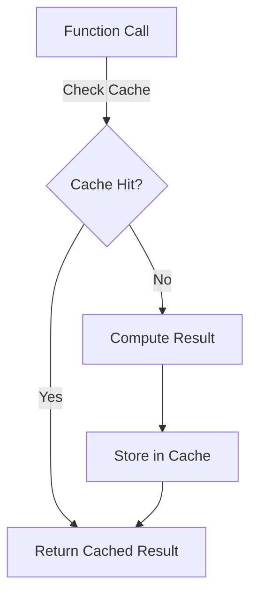

## 15.6 Memoization Techniques

Memoization is a powerful optimization technique used in functional programming to enhance performance by caching the results of expensive function calls. By storing the results of previously computed function calls, memoization allows us to avoid redundant calculations, thus speeding up applications and reducing computational overhead.

### Purpose of Memoization

Memoization is particularly useful in scenarios where functions are called repeatedly with the same arguments, such as in recursive algorithms or computationally intensive operations. By caching the results of these function calls, we can significantly reduce the time complexity from exponential to polynomial in many cases.

#### Key Benefits of Memoization:

- **Performance Optimization**: Reduces the need to recompute results, thereby saving time and computational resources.
- **Efficiency in Recursive Functions**: Particularly beneficial for recursive functions like the Fibonacci sequence, where the same calculations are performed multiple times.
- **Simplicity in Implementation**: Often requires minimal changes to existing code to implement effectively.

### Clojure's `memoize` Function

Clojure provides a built-in `memoize` function that makes it easy to apply memoization to any pure function. This function wraps around another function and caches its results based on the arguments passed.

#### Using `memoize`

The `memoize` function in Clojure is straightforward to use. Here’s a simple example:

```clojure
(defn slow-fib [n]
  (if (<= n 1)
    n
    (+ (slow-fib (- n 1)) (slow-fib (- n 2)))))

(def memoized-fib (memoize slow-fib))

;; Usage
(memoized-fib 35) ; Much faster than calling slow-fib directly
```

In this example, `memoize` is used to wrap the `slow-fib` function, which calculates Fibonacci numbers using a naive recursive approach. By memoizing it, subsequent calls with the same argument are significantly faster, as they return cached results.

#### How `memoize` Works

- **Cache Storage**: `memoize` uses an internal map to store results keyed by the function arguments.
- **Lazy Evaluation**: Results are computed and stored only when the function is called with a new set of arguments.
- **Thread Safety**: The cache is thread-safe, making it suitable for concurrent applications.

### Implementing Custom Memoization

While Clojure's `memoize` is convenient, there are situations where custom memoization strategies may be necessary, such as when dealing with complex data structures or when more control over cache behavior is required.

#### Custom Memoization Strategy

Implementing a custom memoization strategy involves creating a cache mechanism tailored to specific needs. Here's an example using an atom for cache storage:

```clojure
(defn custom-memoize [f]
  (let [cache (atom {})]
    (fn [& args]
      (if-let [cached-result (get @cache args)]
        cached-result
        (let [result (apply f args)]
          (swap! cache assoc args result)
          result)))))

(def custom-memoized-fib (custom-memoize slow-fib))

;; Usage
(custom-memoized-fib 35)
```

#### Advantages of Custom Memoization

- **Control Over Cache Size**: Implement mechanisms to limit cache size or implement eviction policies.
- **Custom Keying Strategies**: Use complex data structures as keys or implement custom hashing.
- **Cache Invalidation**: Implement strategies for cache invalidation based on specific criteria.

### Use Cases for Memoization

Memoization is particularly effective in scenarios involving:

- **Recursive Algorithms**: Functions like Fibonacci, factorial, or dynamic programming problems.
- **Expensive Calculations**: Functions that perform complex mathematical operations or data processing.
- **Data Retrieval**: Caching results of database queries or API calls to reduce latency.

#### Example: Optimizing a Recursive Function

Consider a function that calculates the nth Fibonacci number:

```clojure
(defn fib [n]
  (if (<= n 1)
    n
    (+ (fib (- n 1)) (fib (- n 2)))))

(def memoized-fib (memoize fib))

;; Without memoization
(time (fib 35)) ; Takes significantly longer

;; With memoization
(time (memoized-fib 35)) ; Much faster
```

### Limitations and Considerations

While memoization is a powerful tool, it is important to be aware of its limitations and potential pitfalls:

- **Memory Consumption**: Caching results consumes memory, which can become a problem in memory-constrained environments or when dealing with large datasets.
- **Cache Invalidation**: In some applications, cached results may become stale, requiring strategies for cache invalidation.
- **Non-Pure Functions**: Memoization is most effective with pure functions. Functions with side effects or those that depend on external state may not benefit from memoization.

#### Best Practices

- **Use with Pure Functions**: Ensure that functions are pure and deterministic to maximize the benefits of memoization.
- **Monitor Cache Size**: Implement mechanisms to monitor and manage cache size to prevent memory issues.
- **Evaluate Use Cases**: Not all functions benefit from memoization. Evaluate the performance impact before applying it broadly.

### Visual Aids

To better understand memoization, consider the following diagram illustrating the caching process:



**Diagram Description**: This flowchart illustrates the memoization process. When a function is called, the cache is checked for a stored result. If a cache hit occurs, the cached result is returned. Otherwise, the result is computed, stored in the cache, and then returned.

### References and Links

- [Clojure Official Documentation](https://clojure.org/reference)
- [Memoization in Functional Programming](https://www.lispcast.com/memoization-in-functional-programming)
- [Transitioning from OOP to Functional Programming](https://www.lispcast.com/oo-to-fp/)

### Knowledge Check

To reinforce your understanding of memoization techniques, consider the following questions and exercises:

1. Explain the concept of memoization and its benefits in functional programming.
2. How does Clojure's `memoize` function work, and what are its limitations?
3. Implement a custom memoization strategy for a function of your choice.
4. Discuss scenarios where memoization might not be suitable.
5. Modify the provided Fibonacci example to include a cache size limit.

### Encouraging Engagement

Embracing memoization can significantly enhance the performance of your Clojure applications. By understanding and applying these techniques, you'll be able to optimize your code and deliver more efficient and scalable solutions.

### Test Your Knowledge: Memoization Techniques Quiz



### What is the primary purpose of memoization in functional programming?

- [x] To cache function results for performance optimization
- [ ] To enhance code readability
- [ ] To enable parallel processing
- [ ] To simplify function signatures

> **Explanation:** Memoization caches function results to avoid redundant calculations, thus optimizing performance.

### Which Clojure function is used for memoization?

- [x] `memoize`
- [ ] `cache`
- [ ] `store`
- [ ] `remember`

> **Explanation:** Clojure provides the `memoize` function to cache results of function calls.

### What is a key benefit of using memoization in recursive functions?

- [x] Reduces time complexity by avoiding redundant calculations
- [ ] Increases memory usage
- [ ] Simplifies recursion logic
- [ ] Enhances code readability

> **Explanation:** Memoization reduces the time complexity of recursive functions by caching results and avoiding redundant calculations.

### What is a potential drawback of memoization?

- [x] Increased memory consumption
- [ ] Reduced code readability
- [ ] Decreased function purity
- [ ] Increased time complexity

> **Explanation:** Memoization can increase memory consumption due to caching of results.

### How can custom memoization strategies be beneficial?

- [x] They provide control over cache behavior and size
- [ ] They simplify function signatures
- [x] They allow for custom keying strategies
- [ ] They enhance code readability

> **Explanation:** Custom memoization strategies offer control over cache behavior, size, and keying strategies.

### What should be considered when using memoization with non-pure functions?

- [x] Memoization may not be effective due to side effects
- [ ] Memoization will always improve performance
- [ ] Non-pure functions do not require caching
- [ ] Memoization simplifies non-pure function logic

> **Explanation:** Memoization is most effective with pure functions, as non-pure functions may produce different results for the same inputs.

### What is a common use case for memoization?

- [x] Recursive algorithms
- [ ] Simple arithmetic operations
- [x] Expensive calculations
- [ ] String manipulation

> **Explanation:** Memoization is commonly used in recursive algorithms and expensive calculations to optimize performance.

### How does Clojure's `memoize` function ensure thread safety?

- [x] By using a thread-safe cache
- [ ] By locking function calls
- [ ] By avoiding concurrency
- [ ] By using atomic operations

> **Explanation:** Clojure's `memoize` function uses a thread-safe cache to ensure safe concurrent access.

### What is a strategy for managing cache size in custom memoization?

- [x] Implementing cache eviction policies
- [ ] Increasing memory allocation
- [ ] Disabling caching for large datasets
- [ ] Using larger data structures

> **Explanation:** Implementing cache eviction policies helps manage cache size in custom memoization.

### True or False: Memoization is only beneficial for pure functions.

- [x] True
- [ ] False

> **Explanation:** Memoization is most beneficial for pure functions, as they produce consistent results for the same inputs.


