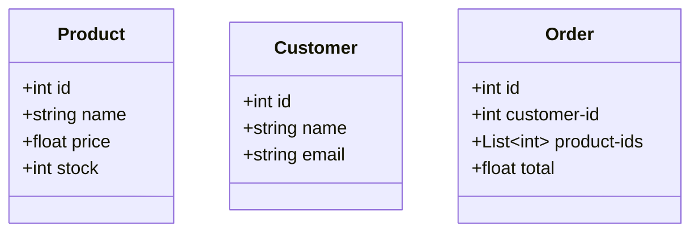
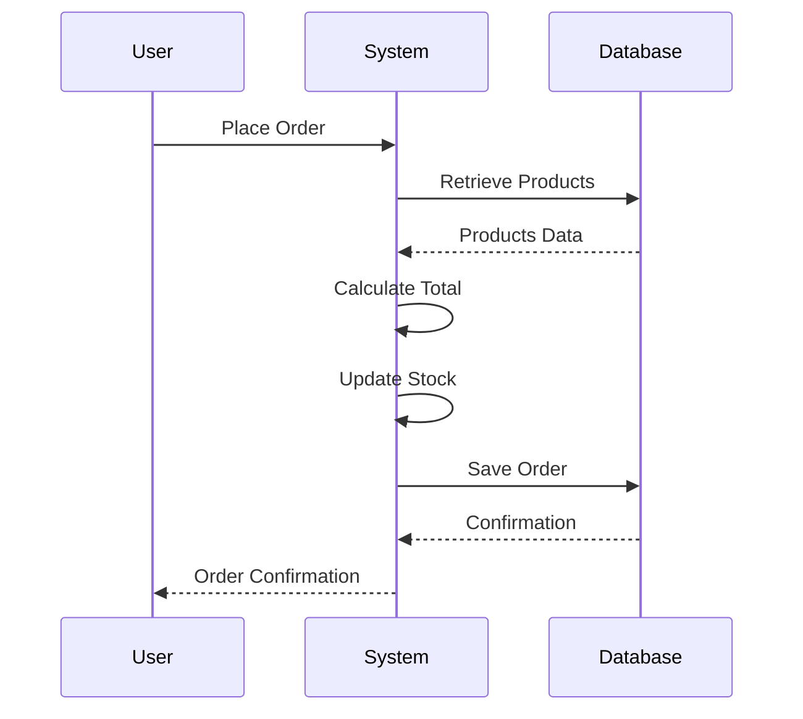

## 15.7 Functional Domain Modeling

In this section, we delve into the concept of functional domain modeling using Clojure. We'll explore how to effectively use data structures to represent business domains, leverage pure functions for business logic, and embrace immutability in our models. We will also provide practical examples, such as modeling an e-commerce system, to illustrate these concepts in action.

### Modeling with Data

In functional programming, data is often the centerpiece of domain modeling. Unlike object-oriented programming (OOP), where classes and objects encapsulate both data and behavior, functional programming separates data from behavior. This separation allows us to focus on modeling the domain using simple, immutable data structures.

#### Emphasizing Data Structures

In Clojure, data structures such as maps, vectors, lists, and sets are used to model complex domains. These structures are immutable by default, meaning that once created, they cannot be changed. This immutability provides several benefits, such as thread safety and predictability, which are crucial for building scalable applications.

Consider an e-commerce domain, where we need to model entities like `Product`, `Order`, and `Customer`. In Clojure, we can represent these entities using maps:

```clojure
(def product {:id 1 :name "Laptop" :price 999.99 :stock 50})
(def customer {:id 101 :name "Alice" :email "alice@example.com"})
(def order {:id 1001 :customer-id 101 :product-ids [1 2 3] :total 2999.97})
```

Here, each entity is represented as a map, with keys corresponding to the attributes of the entity. This approach is flexible and allows us to easily extend the model by adding new keys.

#### Pure Functions for Business Logic

Once we have modeled our domain with data structures, we can implement business logic as pure functions. Pure functions are functions that, given the same input, always produce the same output and have no side effects. This makes them predictable and easy to test.

For instance, let's implement a function to calculate the total price of an order:

```clojure
(defn calculate-total
  [products]
  (reduce + (map :price products)))

;; Example usage
(calculate-total [{:id 1 :name "Laptop" :price 999.99}
                  {:id 2 :name "Phone" :price 499.99}])
```

In this example, `calculate-total` is a pure function that takes a list of products and returns the total price. It operates solely on the input data, without modifying any external state.

#### Immutability in Models

Immutability is a cornerstone of functional programming. By using immutable data structures, we ensure that our domain models remain consistent and free from unintended side effects. This is particularly important in concurrent applications, where shared mutable state can lead to race conditions and bugs.

In our e-commerce example, suppose we want to update the stock of a product after a purchase. Instead of modifying the existing product map, we create a new map with the updated stock:

```clojure
(defn update-stock
  [product quantity]
  (assoc product :stock (- (:stock product) quantity)))

;; Example usage
(update-stock product 5)
```

The `update-stock` function returns a new product map with the updated stock, leaving the original product map unchanged. This approach ensures that our data remains consistent and safe to use across different parts of the application.

### Practical Example: Modeling an E-commerce System

To illustrate the concepts of functional domain modeling, let's build a simple e-commerce system. We'll model the domain using Clojure's data structures, implement business logic with pure functions, and embrace immutability throughout the process.

#### Defining the Domain

First, we define the core entities of our e-commerce system: `Product`, `Customer`, and `Order`. We'll represent these entities using maps:

```clojure
(def products
  [{:id 1 :name "Laptop" :price 999.99 :stock 50}
   {:id 2 :name "Phone" :price 499.99 :stock 30}
   {:id 3 :name "Tablet" :price 299.99 :stock 20}])

(def customers
  [{:id 101 :name "Alice" :email "alice@example.com"}
   {:id 102 :name "Bob" :email "bob@example.com"}])

(def orders
  [{:id 1001 :customer-id 101 :product-ids [1 2] :total 1499.98}
   {:id 1002 :customer-id 102 :product-ids [3] :total 299.99}])
```

Each entity is represented as a map, and collections of entities are stored in vectors.

#### Implementing Business Logic

Next, we implement the business logic using pure functions. We'll start by implementing a function to find a product by its ID:

```clojure
(defn find-product
  [products product-id]
  (first (filter #(= (:id %) product-id) products)))

;; Example usage
(find-product products 1)
```

This function takes a collection of products and a product ID, and returns the product with the matching ID.

Let's implement a function to place an order, which involves updating the stock of the ordered products and calculating the total price:

```clojure
(defn place-order
  [customer-id product-ids]
  (let [ordered-products (map #(find-product products %) product-ids)
        total (calculate-total ordered-products)
        updated-products (map #(update-stock % 1) ordered-products)]
    {:customer-id customer-id
     :product-ids product-ids
     :total total
     :updated-products updated-products}))

;; Example usage
(place-order 101 [1 2])
```

The `place-order` function demonstrates how we can compose pure functions to implement complex business logic. It uses `find-product`, `calculate-total`, and `update-stock` to perform the necessary operations, all while maintaining immutability.

#### Handling State and Side Effects

In a real-world application, we would need to handle state and side effects, such as persisting data to a database or sending notifications. In functional programming, we isolate side effects from the core business logic, often using constructs like monads or effect systems.

In Clojure, we can use atoms, refs, and agents to manage state changes functionally. For example, we can use an atom to store the state of our products:

```clojure
(def products-state (atom products))

(defn update-products-state
  [updated-products]
  (swap! products-state
         (fn [current-products]
           (map (fn [product]
                  (or (some #(when (= (:id product) (:id %)) %) updated-products)
                      product))
                current-products))))

;; Example usage
(update-products-state (:updated-products (place-order 101 [1 2])))
```

The `update-products-state` function uses `swap!` to update the state of the products atomically. This ensures that our state changes are consistent and thread-safe.

### Visualizing Domain Modeling

To further enhance our understanding, let's visualize the domain model and data flow using diagrams.

#### Domain Model Diagram



*Diagram 1: E-commerce Domain Model*

This class diagram represents the core entities in our e-commerce system: `Product`, `Customer`, and `Order`. Each entity has attributes that correspond to its properties.

#### Data Flow Diagram



*Diagram 2: Order Processing Data Flow*

This sequence diagram illustrates the data flow during the order processing. The user places an order, the system retrieves product data, calculates the total, updates the stock, and saves the order to the database.

### References and Further Reading

For those interested in exploring functional domain modeling further, consider the following resources:

- [Clojure Official Documentation](https://clojure.org/reference)
- [Transitioning from OOP to Functional Programming](https://www.lispcast.com/oo-to-fp/)
- [Functional Programming in Clojure](https://www.clojure.org/guides/learn/functions)

### Knowledge Check and Exercises

To reinforce your understanding of functional domain modeling, try the following exercises:

1. **Exercise 1:** Extend the e-commerce model to include a `Category` entity and associate products with categories.
2. **Exercise 2:** Implement a function to calculate discounts on orders and update the total price accordingly.
3. **Exercise 3:** Refactor the `place-order` function to handle cases where a product is out of stock.

### Summary

In this section, we explored functional domain modeling in Clojure, focusing on using data structures to represent business domains, implementing business logic with pure functions, and embracing immutability. By applying these principles, we can build scalable, maintainable applications that are easy to reason about.

## **Test Your Knowledge: Functional Domain Modeling Quiz**



### What is a key benefit of using immutable data structures in domain modeling?

- [x] Thread safety and predictability
- [ ] Increased performance
- [ ] Easier debugging
- [ ] Reduced memory usage

> **Explanation:** Immutable data structures provide thread safety and predictability, which are crucial for building scalable applications.


### How are entities typically represented in Clojure for domain modeling?

- [x] As maps
- [ ] As classes
- [ ] As arrays
- [ ] As functions

> **Explanation:** In Clojure, entities are typically represented as maps, allowing for flexible and extensible domain models.


### What is the primary advantage of using pure functions for business logic?

- [x] Predictability and ease of testing
- [ ] Faster execution
- [ ] Simpler syntax
- [ ] Better error handling

> **Explanation:** Pure functions are predictable and easy to test because they always produce the same output for the same input and have no side effects.


### In the given e-commerce example, how is the total price of an order calculated?

- [x] By using the `calculate-total` function
- [ ] By directly summing the prices
- [ ] By updating the order map
- [ ] By querying the database

> **Explanation:** The `calculate-total` function is used to compute the total price of an order by summing the prices of the products.


### What Clojure construct is used to manage state changes functionally?

- [x] Atoms
- [ ] Classes
- [ ] Arrays
- [ ] Loops

> **Explanation:** Atoms are used in Clojure to manage state changes functionally, ensuring consistency and thread safety.


### Which diagram type is used to represent the core entities in an e-commerce system?

- [x] Class Diagram
- [ ] Sequence Diagram
- [ ] Flowchart
- [ ] State Diagram

> **Explanation:** A class diagram is used to represent the core entities and their attributes in an e-commerce system.


### What does the `update-stock` function return after updating a product's stock?

- [x] A new product map with updated stock
- [ ] The original product map
- [ ] A boolean value
- [ ] An error message

> **Explanation:** The `update-stock` function returns a new product map with the updated stock, leaving the original map unchanged.


### How can side effects be isolated in functional programming?

- [x] By using constructs like monads or effect systems
- [ ] By using loops
- [ ] By using mutable variables
- [ ] By using global state

> **Explanation:** Side effects can be isolated in functional programming by using constructs like monads or effect systems.


### Which Clojure function is used to update the state of an atom?

- [x] `swap!`
- [ ] `assoc`
- [ ] `reduce`
- [ ] `map`

> **Explanation:** The `swap!` function is used to update the state of an atom in Clojure, ensuring atomic updates.


### True or False: In functional domain modeling, behavior and data are encapsulated together.

- [ ] True
- [x] False

> **Explanation:** In functional domain modeling, behavior and data are separated, with data represented by immutable structures and behavior implemented as pure functions.


