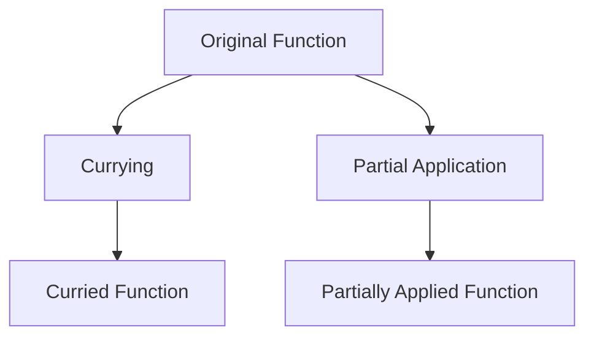

## 15.8 Currying and Partial Application Techniques

In the world of functional programming, currying and partial application are two powerful techniques that can significantly enhance the flexibility and expressiveness of your code. These concepts, while rooted in mathematical principles, have practical applications in software development, particularly when working with languages like Clojure. In this section, we will delve into these techniques, explore their applications, and provide practical examples to illustrate their benefits.

### Currying Explained

Currying is a functional programming technique that transforms a function with multiple arguments into a sequence of functions, each taking a single argument. This transformation allows for more flexible function composition and reuse. The concept is named after the mathematician Haskell Curry, who contributed to the development of combinatory logic.

#### How Currying Works

Consider a function `f(x, y)` that takes two arguments. Currying transforms this function into a series of nested functions, each taking one argument:

```clojure
(defn add [x y]
  (+ x y))

(defn curried-add [x]
  (fn [y]
    (+ x y)))

;; Usage
((curried-add 5) 3) ; => 8
```

In the example above, `curried-add` is a curried version of the `add` function. It returns a new function that takes `y` as an argument and adds it to `x`.

#### Benefits of Currying

- **Function Reusability**: Currying allows you to create specialized functions by fixing some arguments and leaving others open for later specification.
- **Function Composition**: Curried functions can be easily composed with other functions, facilitating more complex operations.
- **Code Readability**: By breaking down functions into smaller, single-argument functions, currying can improve the readability and maintainability of your code.

### Partial Application

Partial application is a related concept that involves fixing a few arguments of a function, producing another function of smaller arity. Unlike currying, which always transforms a function into a sequence of single-argument functions, partial application allows for more flexibility in specifying which arguments to fix.

#### Practical Uses of Partial Application

Partial application is particularly useful when you want to create a function with some preset parameters, which can be reused in different contexts.

```clojure
(defn multiply [x y]
  (* x y))

(def multiply-by-2 (partial multiply 2))

(multiply-by-2 5) ; => 10
```

In this example, `multiply-by-2` is a partially applied version of the `multiply` function, with the first argument fixed to `2`. This can be useful in scenarios where you need to repeatedly multiply numbers by `2`.

### Currying in Clojure

Clojure does not provide built-in support for currying in the same way some other functional languages do, but you can achieve currying using higher-order functions.

#### Implementing Currying in Clojure

To implement currying in Clojure, you can define a function that returns another function, as shown in the earlier example. Here's a more complex example:

```clojure
(defn curry [f]
  (fn [x]
    (fn [y]
      (f x y))))

(def curried-add (curry +))

((curried-add 5) 3) ; => 8
```

In this example, the `curry` function takes a function `f` and returns a curried version of it. This approach can be generalized to functions with more than two arguments by nesting further.

### Examples of Currying and Partial Application

Let's explore some scenarios where currying and partial application can enhance code reusability and readability.

#### Example 1: Configurable Logging

Suppose you have a logging function that takes a log level and a message. You can use partial application to create specialized logging functions.

```clojure
(defn log [level message]
  (println (str "[" level "] " message)))

(def info-log (partial log "INFO"))
(def error-log (partial log "ERROR"))

(info-log "This is an info message.")
(error-log "This is an error message.")
```

In this example, `info-log` and `error-log` are partially applied functions that fix the log level, making it easier to log messages with consistent formatting.

#### Example 2: Building Complex Functions with Currying

Consider a scenario where you need to apply a series of transformations to a collection of data. Currying can help you build these transformations incrementally.

```clojure
(defn transform [f g h x]
  (h (g (f x))))

(def curried-transform
  (fn [f]
    (fn [g]
      (fn [h]
        (fn [x]
          (h (g (f x))))))))

(def transform-with-f (curried-transform inc))
(def transform-with-fg (transform-with-f #(* % 2)))
(def full-transform (transform-with-fg dec))

(full-transform 3) ; => 7
```

Here, `curried-transform` allows you to build a complex transformation step by step, improving the modularity and clarity of your code.

### Try It Yourself

To deepen your understanding of currying and partial application, try modifying the examples above. For instance, experiment with different operations in the `transform` function or create additional partially applied functions for various use cases.

### Visualizing Currying and Partial Application

To better understand how currying and partial application work, let's visualize the process using a flowchart.



**Diagram Description**: This flowchart illustrates the transformation of an original function into a curried function through currying and into a partially applied function through partial application.

### Further Reading and Resources

For more information on currying and partial application in Clojure, consider exploring the following resources:

- [Clojure Official Documentation](https://clojure.org/reference)
- [Functional Programming Concepts](https://www.lispcast.com/oo-to-fp/)
- [Clojure Community Resources](https://clojure.org/community/resources)

### Knowledge Check

Before moving on, take a moment to test your understanding of currying and partial application with the following questions.

## **Test Your Knowledge: Currying and Partial Application Techniques Quiz**



### What is currying in functional programming?

- [x] Transforming a function with multiple arguments into a sequence of functions with single arguments
- [ ] Transforming a function with single arguments into one with multiple arguments
- [ ] A technique to optimize function execution
- [ ] A method to handle exceptions in functional code

> **Explanation:** Currying transforms a function with multiple arguments into a sequence of functions, each taking a single argument.

### What is the main difference between currying and partial application?

- [x] Currying transforms a function into a sequence of single-argument functions, while partial application fixes some arguments of a function.
- [ ] Currying fixes some arguments of a function, while partial application transforms a function into single-argument functions.
- [ ] Both are the same and can be used interchangeably.
- [ ] Currying is used for asynchronous programming, while partial application is not.

> **Explanation:** Currying transforms a function into single-argument functions, whereas partial application fixes some arguments of a function.

### How can you achieve currying in Clojure?

- [x] By using higher-order functions to return nested functions
- [ ] By using a built-in Clojure function
- [ ] By using macros
- [ ] By using Java interoperability

> **Explanation:** Currying in Clojure is achieved by using higher-order functions to create nested functions.

### Which of the following is a benefit of currying?

- [x] Improved function composition
- [ ] Faster execution time
- [ ] Reduced memory usage
- [ ] Easier debugging

> **Explanation:** Currying improves function composition by allowing functions to be combined more flexibly.

### What is partial application used for?

- [x] Creating functions with some preset parameters
- [ ] Transforming functions into single-argument functions
- [x] Enhancing code reusability
- [ ] Handling exceptions

> **Explanation:** Partial application creates functions with some preset parameters, enhancing code reusability.

### In Clojure, how do you create a partially applied function?

- [x] Using the `partial` function
- [ ] Using the `apply` function
- [ ] Using the `map` function
- [ ] Using the `reduce` function

> **Explanation:** The `partial` function in Clojure is used to create partially applied functions.

### What is the result of `((curried-add 5) 3)` if `curried-add` is a curried version of the addition function?

- [x] 8
- [ ] 15
- [ ] 5
- [ ] 3

> **Explanation:** The curried function adds the two arguments, resulting in 8.

### Which of the following is a practical use of partial application?

- [x] Configurable logging functions
- [ ] Handling infinite sequences
- [ ] Managing state in concurrent applications
- [ ] Implementing software transactional memory

> **Explanation:** Partial application can be used to create configurable logging functions by fixing log levels.

### How does currying improve code readability?

- [x] By breaking down functions into smaller, single-argument functions
- [ ] By reducing the number of lines of code
- [ ] By eliminating the need for comments
- [ ] By using more complex data structures

> **Explanation:** Currying breaks down functions into smaller, single-argument functions, improving readability.

### True or False: Clojure has built-in support for currying like some other functional languages.

- [ ] True
- [x] False

> **Explanation:** Clojure does not have built-in support for currying, but it can be achieved using higher-order functions.



By mastering currying and partial application, you can write more flexible and reusable code in Clojure. These techniques not only enhance code readability but also facilitate complex function compositions, making them indispensable tools in functional programming.
