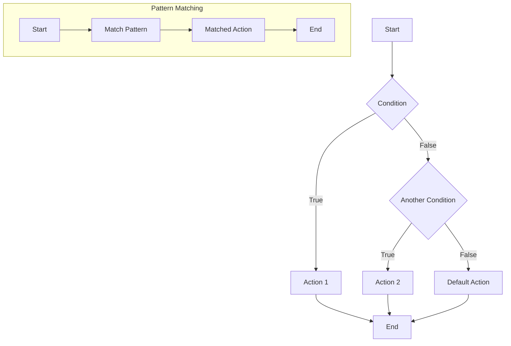

## 15.9 Pattern Matching with `core.match`

### Introduction to Pattern Matching

Pattern matching is a powerful feature in many functional programming languages that simplifies complex conditional logic by allowing you to destructure and match data structures against patterns. This approach can lead to more readable and maintainable code, as it abstracts away the boilerplate often associated with nested conditionals and type checks.

In Clojure, pattern matching is not built into the language core, but the [`core.match`](https://github.com/clojure/core.match) library provides a robust solution. This library allows developers to match against Clojure's rich data structures, such as vectors, maps, and lists, in a concise and expressive manner.

### Using `core.match`

The `core.match` library is a powerful tool for implementing pattern matching in Clojure. It allows developers to express complex conditional logic in a declarative style, making code easier to read and maintain. To use `core.match`, you need to include it in your project dependencies. Here's a simple setup using Leiningen:

```clojure
(defproject my-project "0.1.0-SNAPSHOT"
  :dependencies [[org.clojure/clojure "1.10.3"]
                 [org.clojure/core.match "0.3.0"]])
```

Once you have `core.match` included, you can start using its features by requiring it in your namespace:

```clojure
(ns my-project.core
  (:require [clojure.core.match :refer [match]]))
```

### Syntax and Features

The `core.match` library provides a `match` macro that allows you to specify patterns and corresponding expressions. Here's a basic example of its syntax:

```clojure
(match [value]
  [1] "one"
  [2] "two"
  [_] "default")
```

In this example, `match` takes a vector of values to match against a series of patterns. The underscore `_` acts as a wildcard, matching any value not explicitly handled by previous patterns.

#### Matching on Data Structures

One of the strengths of `core.match` is its ability to match complex data structures. Let's explore some common scenarios:

1. **Vectors and Lists**: You can match vectors and lists by specifying their structure.

    ```clojure
    (match [[a b]]
      [[1 2]] "Matched 1 and 2"
      [[3 4]] "Matched 3 and 4"
      :else "No match")
    ```

2. **Maps**: Matching maps involves specifying keys and values.

    ```clojure
    (match [{:keys [type value]}]
      [{:type :error :value v}] (str "Error with value: " v)
      [{:type :success :value v}] (str "Success with value: " v)
      :else "Unknown type")
    ```

3. **Nested Structures**: You can match nested structures by combining patterns.

    ```clojure
    (match [{:keys [type data]}]
      [{:type :user :data {:name "Alice"}}] "User Alice"
      [{:type :user :data {:name "Bob"}}] "User Bob"
      :else "Unknown user")
    ```

### Examples

Let's look at some practical examples of using `core.match` to handle different scenarios, such as processing messages in a messaging system.

#### Example: Message Processing

Suppose we have a system that processes different types of messages, each with its own structure. We can use pattern matching to handle each message type cleanly.

```clojure
(defn process-message [message]
  (match message
    {:type :text :content c} (str "Text message: " c)
    {:type :image :url u} (str "Image URL: " u)
    {:type :video :url u :duration d} (str "Video URL: " u ", duration: " d)
    :else "Unknown message type"))

;; Example usage
(process-message {:type :text :content "Hello, World!"})
;; => "Text message: Hello, World!"

(process-message {:type :image :url "http://example.com/image.png"})
;; => "Image URL: http://example.com/image.png"

(process-message {:type :video :url "http://example.com/video.mp4" :duration 120})
;; => "Video URL: http://example.com/video.mp4, duration: 120"
```

#### Example: Handling Different Commands

In a command-line application, you might need to handle different commands with various options. Pattern matching simplifies this task.

```clojure
(defn handle-command [command]
  (match command
    [:create {:name n}] (str "Creating " n)
    [:delete {:id i}] (str "Deleting ID " i)
    [:update {:id i :name n}] (str "Updating ID " i " to " n)
    :else "Unknown command"))

;; Example usage
(handle-command [:create {:name "ProjectX"}])
;; => "Creating ProjectX"

(handle-command [:delete {:id 42}])
;; => "Deleting ID 42"

(handle-command [:update {:id 42 :name "ProjectY"}])
;; => "Updating ID 42 to ProjectY"
```

### Benefits of Pattern Matching

Pattern matching with `core.match` offers several benefits that contribute to cleaner and more maintainable code:

1. **Readability**: The declarative style of pattern matching makes code easier to read and understand, as it abstracts away complex conditional logic.

2. **Maintainability**: By centralizing logic in a single `match` expression, you reduce the risk of errors and make future modifications simpler.

3. **Expressiveness**: Pattern matching allows you to express complex conditions succinctly, reducing boilerplate and improving code clarity.

4. **Error Handling**: With pattern matching, you can handle unexpected cases gracefully, ensuring your code is robust and resilient.

### Try It Yourself

To get hands-on experience with `core.match`, try modifying the examples above. Here are some suggestions:

- Add a new message type to the `process-message` function, such as `:audio`, and handle it appropriately.
- Extend the `handle-command` function to include a `:list` command that returns a list of all existing items.
- Experiment with nested data structures, such as a list of maps, and create patterns to match specific conditions.

### Visual Aids

To help visualize how pattern matching simplifies conditional logic, consider the following flowchart that compares traditional conditional statements with pattern matching:



**Caption:** The left side of the flowchart represents a traditional approach using nested conditionals, while the right side illustrates the streamlined process with pattern matching.

### References and Links

- [Clojure Official Documentation](https://clojure.org/reference)
- [Clojure Community Resources](https://clojure.org/community/resources)
- [core.match GitHub Repository](https://github.com/clojure/core.match)
- [Transitioning from OOP to Functional Programming](https://www.lispcast.com/oo-to-fp/)

### Knowledge Check

To reinforce your understanding of pattern matching with `core.match`, consider the following questions:

- How does pattern matching improve code readability and maintainability?
- What are the key differences between pattern matching and traditional conditional logic?
- How can pattern matching be used to handle nested data structures effectively?

### Exercises

1. **Extend the Message Processing Example**: Add support for a new message type, such as `:notification`, with fields for `title` and `body`.

2. **Create a Pattern Matching Function**: Write a function using `core.match` to categorize a list of numbers into `:even` and `:odd`.

3. **Nested Data Structure Matching**: Given a list of maps representing users, use pattern matching to extract and print the names of all users over the age of 30.

### Conclusion

Pattern matching with `core.match` is a powerful technique that enhances the expressiveness and maintainability of Clojure code. By adopting this approach, you can simplify complex conditional logic, making your codebase more robust and easier to understand. As you continue to explore functional programming with Clojure, consider integrating pattern matching into your projects to leverage its full potential.

## **Test Your Knowledge: Pattern Matching with `core.match` Quiz**



### What is the primary benefit of using pattern matching in Clojure?

- [x] Simplifies complex conditional logic
- [ ] Increases code execution speed
- [ ] Reduces memory usage
- [ ] Enables object-oriented programming

> **Explanation:** Pattern matching simplifies complex conditional logic by providing a declarative way to handle different data structures and conditions.

### Which library provides pattern matching capabilities in Clojure?

- [ ] clojure.spec
- [x] core.match
- [ ] core.async
- [ ] clojure.java.jdbc

> **Explanation:** The `core.match` library provides pattern matching capabilities in Clojure.

### What is the purpose of the `_` symbol in `core.match`?

- [x] Acts as a wildcard to match any value
- [ ] Represents a null value
- [ ] Indicates a syntax error
- [ ] Specifies a default value

> **Explanation:** The `_` symbol acts as a wildcard in `core.match`, matching any value not explicitly handled by previous patterns.

### How can pattern matching improve code maintainability?

- [x] By centralizing logic in a single expression
- [ ] By increasing execution speed
- [ ] By reducing the number of lines of code
- [ ] By enforcing strict typing

> **Explanation:** Pattern matching improves maintainability by centralizing logic in a single expression, making future modifications simpler.

### In which scenario is pattern matching particularly useful?

- [x] When handling multiple message types with different structures
- [ ] When optimizing for performance
- [ ] When implementing complex algorithms
- [ ] When designing user interfaces

> **Explanation:** Pattern matching is particularly useful when handling multiple message types with different structures, as it simplifies the logic needed to process each type.

### What is a common use case for pattern matching in functional programming?

- [x] Processing different data structures
- [ ] Implementing inheritance hierarchies
- [ ] Managing memory allocation
- [ ] Designing graphical user interfaces

> **Explanation:** A common use case for pattern matching in functional programming is processing different data structures.

### How does pattern matching handle unexpected cases?

- [x] By providing a default pattern
- [ ] By throwing an exception
- [ ] By logging an error
- [ ] By ignoring the case

> **Explanation:** Pattern matching handles unexpected cases by providing a default pattern, ensuring robustness.

### What is a key advantage of using `core.match` over traditional conditionals?

- [x] Declarative syntax for complex conditions
- [ ] Faster execution time
- [ ] Lower memory consumption
- [ ] Easier integration with Java libraries

> **Explanation:** A key advantage of using `core.match` is its declarative syntax, which simplifies expressing complex conditions.

### Which data structures can `core.match` handle?

- [x] Vectors, lists, and maps
- [ ] Only vectors
- [ ] Only lists
- [ ] Only maps

> **Explanation:** `core.match` can handle vectors, lists, and maps, making it versatile for pattern matching.

### True or False: Pattern matching can only be used with simple data types in Clojure.

- [ ] True
- [x] False

> **Explanation:** False. Pattern matching in Clojure can be used with complex data structures, such as vectors, lists, and maps.


