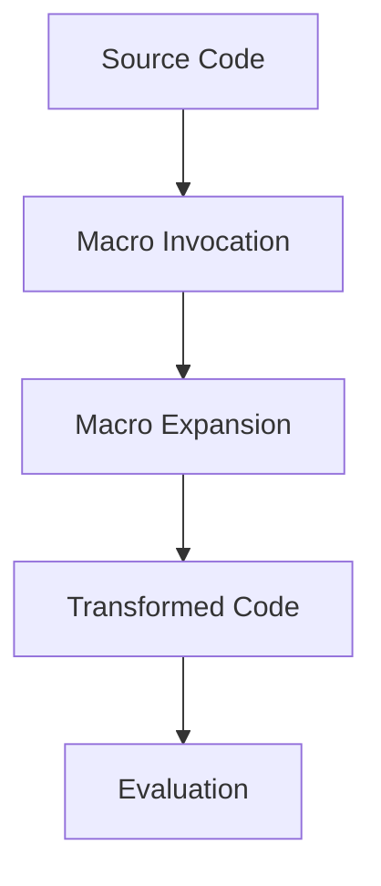

## 16.1 Introduction to Macros in Clojure

In this section, we delve into the fascinating world of macros in Clojure, a powerful feature that sets Clojure apart from many other programming languages. Macros enable developers to write code that writes code, allowing for compile-time transformations and optimizations. This capability is crucial for creating domain-specific languages (DSLs), implementing syntactic abstractions, and enhancing the expressiveness of your codebase.

### What Are Macros?

Macros in Clojure are constructs that transform code before it is evaluated. This means that macros operate at the compile-time level, allowing developers to manipulate and generate code dynamically. Unlike functions, which are executed at runtime, macros are expanded during the compilation phase, providing a unique opportunity to influence the structure and behavior of the code before it runs.

#### Macros vs. Functions

To understand the distinction between macros and functions, let's consider their roles and capabilities:

- **Functions**: Functions in Clojure are first-class citizens, meaning they can be passed around as arguments, returned from other functions, and assigned to variables. They are executed at runtime and operate on values.

- **Macros**: Macros, on the other hand, are expanded at compile-time. They work with the code itself, transforming it into a different form before it is evaluated. This allows macros to introduce new syntactic constructs and perform optimizations that would be impossible with functions alone.

Here's a simple example to illustrate the difference:

```clojure
; Function example
(defn add [a b]
  (+ a b))

; Macro example
(defmacro unless [condition body]
  `(if (not ~condition)
     ~body))
```

In the above code, `add` is a function that takes two arguments and returns their sum. The `unless` macro, however, transforms the code into an `if` statement that executes `body` only if `condition` is false.

### Why Use Macros?

Macros are particularly beneficial in scenarios where you need to extend the language's syntax or create DSLs. They allow you to introduce new constructs that can make your code more expressive and concise. Here are some common use cases for macros:

- **Domain-Specific Languages (DSLs)**: Macros can be used to create DSLs that simplify complex operations or configurations. For example, you might use macros to define a DSL for building HTML templates or configuring a web server.

- **Syntactic Abstractions**: Macros enable you to abstract repetitive patterns in your code, reducing boilerplate and enhancing readability. They allow you to encapsulate complex logic in a single construct, making your codebase more maintainable.

- **Performance Optimizations**: Since macros are expanded at compile-time, they can be used to optimize code by eliminating unnecessary computations or restructuring code for better performance.

### Code as Data: The Homoiconicity of Clojure

One of the key features that make macros so powerful in Clojure is the language's homoiconicity. This means that Clojure code is represented as data structures that can be manipulated by the program itself. In Clojure, code is data, and data is code. This property allows macros to transform code with ease, as they can operate directly on the data structures representing the code.

Consider the following example:

```clojure
; A simple macro that doubles the value of an expression
(defmacro double [expr]
  `(* 2 ~expr))

; Usage
(double (+ 1 2)) ; Expands to (* 2 (+ 1 2))
```

In this example, the `double` macro takes an expression and transforms it into a multiplication operation. The use of backticks (`) and tildes (~) allows us to construct the new code structure, demonstrating how Clojure's homoiconicity facilitates code manipulation.

### Code Examples and Diagrams

Let's explore some practical examples and visual aids to deepen our understanding of macros in Clojure.

#### Example: A Simple Logging Macro

Suppose we want to create a macro that logs the execution time of a block of code. Here's how we might implement it:

```clojure
(defmacro log-time [expr]
  `(let [start# (System/nanoTime)
         result# ~expr
         end# (System/nanoTime)]
     (println "Execution time:" (/ (- end# start#) 1e6) "ms")
     result#))

; Usage
(log-time (Thread/sleep 1000))
```

In this example, the `log-time` macro calculates the execution time of the given expression and prints it to the console. The use of `#` in variable names ensures that the variables are unique, preventing naming conflicts.

#### Diagram: Macro Expansion Process

Below is a diagram illustrating the macro expansion process in Clojure:



**Caption**: The macro expansion process involves transforming source code through macro invocations, resulting in transformed code that is then evaluated.

### Practical Applications of Macros

Macros can be applied in various real-world scenarios to enhance code expressiveness and efficiency. Let's explore some practical applications:

#### Creating a DSL for HTML Generation

Imagine you need to generate HTML content programmatically. Using macros, you can create a DSL that simplifies this task:

```clojure
(defmacro html [& body]
  `(str "<html>" ~@body "</html>"))

(defmacro body [& body]
  `(str "<body>" ~@body "</body>"))

(defmacro p [content]
  `(str "<p>" ~content "</p>"))

; Usage
(html
  (body
    (p "Hello, world!")))
```

This example demonstrates how macros can be used to create a DSL for HTML generation, making the code more intuitive and readable.

#### Implementing Control Structures

Macros can also be used to implement custom control structures. For instance, you might create a `while` loop macro:

```clojure
(defmacro while-loop [condition & body]
  `(loop []
     (when ~condition
       ~@body
       (recur))))

; Usage
(let [x (atom 0)]
  (while-loop (< @x 5)
    (println "x is" @x)
    (swap! x inc)))
```

This macro provides a `while` loop construct that repeatedly executes the body as long as the condition is true.

### Try It Yourself

To deepen your understanding of macros, try modifying the examples provided. For instance, enhance the `log-time` macro to include additional information, such as the name of the function being timed. Experiment with creating your own DSLs or control structures using macros.

### References and Further Reading

- [Clojure Official Documentation](https://clojure.org/reference)
- [Clojure Community Resources](https://clojure.org/community/resources)
- [Transitioning from OOP to Functional Programming](https://www.lispcast.com/oo-to-fp/)

### Knowledge Check

To reinforce your understanding of macros in Clojure, consider the following questions:

1. What is the primary difference between macros and functions in Clojure?
2. How does Clojure's homoiconicity facilitate macro creation?
3. In what scenarios might you choose to use a macro over a function?
4. How can macros be used to create domain-specific languages?
5. What are some potential pitfalls when using macros?

### Conclusion

Embracing macros in Clojure can significantly enhance your ability to write expressive, concise, and efficient code. By understanding the distinction between macros and functions, and leveraging Clojure's homoiconicity, you can unlock new possibilities for code transformation and metaprogramming. As you continue to explore macros, remember to experiment and iterate, building upon the foundational concepts introduced in this section.

## **Test Your Knowledge: Introduction to Macros in Clojure Quiz**



### What is the primary role of macros in Clojure?

- [x] Transform code before evaluation
- [ ] Execute code at runtime
- [ ] Store data structures
- [ ] Manage state changes

> **Explanation:** Macros transform code before it is evaluated, operating at compile-time to modify the code structure.

### How do macros differ from functions in Clojure?

- [x] Macros operate at compile-time
- [ ] Functions operate at compile-time
- [x] Macros transform code
- [ ] Functions transform code

> **Explanation:** Macros operate at compile-time, transforming code before it is evaluated, whereas functions operate at runtime.

### What is homoiconicity in Clojure?

- [x] Code is represented as data
- [ ] Code is executed as data
- [ ] Data is stored as code
- [ ] Functions are first-class citizens

> **Explanation:** Homoiconicity means that Clojure code is represented as data structures, allowing for easy manipulation by macros.

### Why might you use a macro instead of a function?

- [x] To create new syntactic constructs
- [ ] To execute code faster
- [ ] To manage state changes
- [ ] To store data structures

> **Explanation:** Macros are used to create new syntactic constructs and extend the language's capabilities.

### What is a common use case for macros in Clojure?

- [x] Creating domain-specific languages
- [ ] Managing concurrency
- [ ] Storing data in databases
- [ ] Handling exceptions

> **Explanation:** Macros are often used to create domain-specific languages, simplifying complex operations.

### How does Clojure's homoiconicity benefit macro creation?

- [x] Allows code manipulation as data
- [ ] Enables faster execution
- [ ] Simplifies state management
- [ ] Enhances error handling

> **Explanation:** Homoiconicity allows macros to manipulate code as data structures, facilitating code transformation.

### What is a potential pitfall of using macros?

- [x] Increased complexity
- [ ] Slower execution
- [ ] Reduced readability
- [ ] Limited functionality

> **Explanation:** Macros can increase code complexity, making it harder to understand and maintain.

### How can macros optimize performance?

- [x] By eliminating unnecessary computations
- [ ] By executing code faster
- [ ] By managing state changes
- [ ] By storing data structures

> **Explanation:** Macros can optimize performance by restructuring code and eliminating unnecessary computations at compile-time.

### What is a key feature of macros in Clojure?

- [x] Compile-time code transformation
- [ ] Runtime code execution
- [ ] Data storage
- [ ] State management

> **Explanation:** Macros perform compile-time code transformation, modifying code before it is evaluated.

### True or False: Macros in Clojure can be used to create custom control structures.

- [x] True
- [ ] False

> **Explanation:** True. Macros can be used to create custom control structures, extending the language's syntax.


