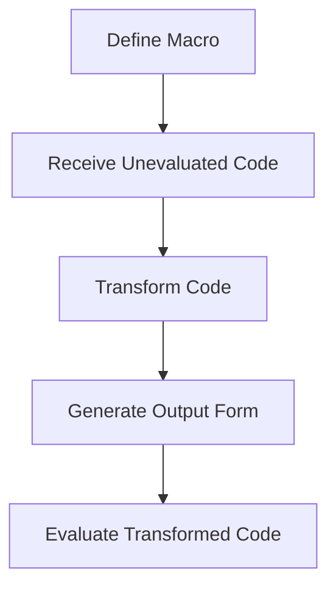

## 16.2 Writing Basic Macros

In the realm of functional programming with Clojure, macros are a powerful tool that allow developers to perform metaprogramming—writing code that writes code. This section will guide you through the process of writing basic macros in Clojure, providing a strong foundation for leveraging this advanced feature to create more expressive and efficient code.

### Defining Macros

Macros in Clojure are defined using the `defmacro` construct. Unlike functions, macros operate on the unevaluated code, allowing you to manipulate and transform code before it is executed. This capability is akin to creating new language constructs, enabling you to extend the language in ways that are not possible with functions alone.

#### Using `defmacro`

To define a macro, use the `defmacro` keyword followed by the macro's name and a parameter list. The macro body consists of code that generates the desired output form. Here's a simple example of a macro that adds two numbers:

```clojure
(defmacro add [a b]
  `(+ ~a ~b))
```

In this example, the macro `add` takes two arguments, `a` and `b`, and produces code that adds them together. The backtick (`` ` ``) is used for syntax quoting, which we'll explore in detail next.

### Quoting and Syntax

Quoting is a crucial concept in macro writing, as it determines how expressions are treated. In Clojure, there are several types of quoting:

- **Simple Quoting (`'`)**: Prevents evaluation of the expression.
- **Syntax Quoting (`` ` ``)**: Similar to simple quoting but resolves symbols to their fully-qualified names and allows unquoting.

#### Simple Quoting

Simple quoting is used to prevent the evaluation of an expression. For example:

```clojure
'(1 2 3) ; => (1 2 3)
```

In this case, the list `(1 2 3)` is not evaluated and is returned as-is.

#### Syntax Quoting

Syntax quoting is more powerful and is often used in macros. It not only prevents evaluation but also resolves symbols to their fully-qualified names, ensuring that the code generated by the macro is correctly scoped. Syntax quoting is done using the backtick (`` ` ``), and unquoting within a syntax-quoted expression is done using the tilde (`~`).

Consider the following example:

```clojure
(defmacro greet [name]
  `(println "Hello," ~name))
```

Here, the `greet` macro uses syntax quoting to construct a form that prints a greeting. The `~name` is unquoted, allowing the macro to insert the value of `name` into the generated code.

### Macro Arguments

One of the distinguishing features of macros is that they receive unevaluated code as their arguments. This allows macros to manipulate the code itself, rather than just the values produced by the code.

#### Handling Unevaluated Code

When writing macros, it's important to remember that the arguments are passed as raw code forms. You can manipulate these forms to produce the desired output. For example, consider a macro that implements a simple `when` construct:

```clojure
(defmacro my-when [condition & body]
  `(if ~condition
     (do ~@body)))
```

In this macro, `my-when` takes a condition and a body of expressions. The `& body` syntax collects all remaining arguments into a list, which is then spliced into the `do` form using `~@`.

### Examples of Macros

Let's explore some practical examples to solidify your understanding of macros.

#### Example 1: Implementing a `when` Macro

The `my-when` macro we introduced earlier is a simplified version of the built-in `when` macro. It evaluates the body only if the condition is true:

```clojure
(defmacro my-when [condition & body]
  `(if ~condition
     (do ~@body)))

;; Usage
(my-when true
  (println "This will print")
  (println "This too"))

(my-when false
  (println "This will not print"))
```

#### Example 2: Creating a Debugging Macro

Macros can be used to inject debugging information into your code. Here's a macro that logs the value of an expression along with its result:

```clojure
(defmacro debug [expr]
  `(let [result# ~expr]
     (println "Debug:" '~expr "=" result#)
     result#))

;; Usage
(debug (+ 1 2))
```

In this example, the `debug` macro evaluates the expression, prints it along with its result, and then returns the result. The `#` character is used to generate a unique symbol, ensuring that the temporary variable `result#` does not clash with other symbols.

### Try It Yourself

To deepen your understanding, try modifying the examples above:

- **Modify the `my-when` macro** to include an `else` branch.
- **Enhance the `debug` macro** to log the time taken to evaluate the expression.

### Visual Aids

To better understand how macros transform code, let's visualize the process using a simple flowchart:



*Figure 1: The process of macro transformation in Clojure.*

### References and Links

For further reading and exploration of macros in Clojure, consider the following resources:

- [Clojure Official Documentation](https://clojure.org/reference/macros)
- [Clojure Community Resources](https://clojure.org/community/resources)
- [Transitioning from OOP to Functional Programming](https://www.lispcast.com/oo-to-fp/)

### Knowledge Check

To ensure you've grasped the concepts, here's a quick exercise:

- **Exercise**: Write a macro `unless` that works like an inverted `if`, executing the body only if the condition is false.

### Encouraging Engagement

Writing macros can seem daunting at first, but with practice, you'll find them to be a powerful tool in your Clojure toolkit. Embrace the challenge, and remember that each macro you write brings you closer to mastering Clojure's metaprogramming capabilities.

### Test Your Knowledge: Writing Basic Macros Quiz



### What is the primary purpose of macros in Clojure?

- [x] To manipulate and transform code before it is evaluated
- [ ] To perform runtime type checking
- [ ] To optimize code for performance
- [ ] To handle exceptions in a functional way

> **Explanation:** Macros allow you to manipulate and transform code before it is evaluated, enabling metaprogramming.

### How do macros receive their arguments?

- [x] As unevaluated code forms
- [ ] As evaluated values
- [ ] As strings
- [ ] As numbers

> **Explanation:** Macros receive unevaluated code forms as their arguments, allowing them to manipulate the code itself.

### What is the purpose of syntax quoting in macros?

- [x] To resolve symbols to their fully-qualified names and allow unquoting
- [ ] To prevent code execution
- [ ] To perform string interpolation
- [ ] To optimize code for performance

> **Explanation:** Syntax quoting resolves symbols to their fully-qualified names and allows unquoting, ensuring correct scoping in macros.

### Which character is used for syntax quoting in Clojure?

- [x] Backtick (`` ` ``)
- [ ] Single quote (`'`)
- [ ] Double quote (`"`)
- [ ] Tilde (`~`)

> **Explanation:** The backtick (`` ` ``) is used for syntax quoting in Clojure.

### What does the `~` character do in a syntax-quoted expression?

- [x] Unquotes an expression
- [ ] Quotes an expression
- [ ] Concatenates strings
- [ ] Performs arithmetic operations

> **Explanation:** The `~` character unquotes an expression within a syntax-quoted form.

### What is the benefit of using macros over functions?

- [x] They can create new language constructs
- [ ] They execute faster than functions
- [ ] They are easier to debug
- [ ] They require less memory

> **Explanation:** Macros can create new language constructs by transforming code before evaluation.

### Which of the following is a valid use case for macros?

- [x] Creating domain-specific languages
- [ ] Performing arithmetic operations
- [ ] Managing application state
- [ ] Handling user input

> **Explanation:** Macros are often used to create domain-specific languages by transforming code.

### What is the role of the `defmacro` keyword?

- [x] To define a macro
- [ ] To define a function
- [ ] To declare a variable
- [ ] To import a library

> **Explanation:** The `defmacro` keyword is used to define a macro in Clojure.

### True or False: Macros can only be used for code generation.

- [x] True
- [ ] False

> **Explanation:** Macros are primarily used for code generation and transformation in Clojure.

### What is a potential drawback of using macros?

- [x] They can make code harder to understand and debug
- [ ] They always improve performance
- [ ] They simplify code structure
- [ ] They reduce memory usage

> **Explanation:** While powerful, macros can make code harder to understand and debug due to their complexity.



By mastering the art of writing macros, you unlock a new level of expressiveness and flexibility in your Clojure programs. Keep experimenting and exploring, and you'll soon find yourself crafting elegant solutions with ease.
