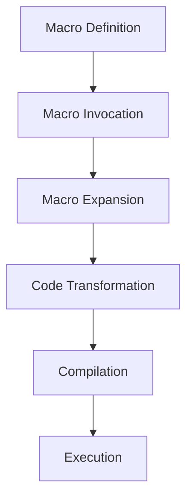

## 16.3 Macro Expansion and Debugging

In Clojure, macros are a powerful tool that allow developers to extend the language by writing code that writes code. This metaprogramming capability can be incredibly useful, but it also introduces complexity, especially when it comes to debugging. In this section, we will explore the macro expansion process, learn how to use tools like `macroexpand` and `macroexpand-1` to inspect macro expansions, and provide strategies for debugging macros effectively. We will also discuss common pitfalls in macro writing and how to avoid them.

### Understanding Macro Expansion

Macros in Clojure are expanded during the compilation phase. When you write a macro, you're essentially defining a transformation from one piece of code to another. This transformation occurs before the code is evaluated, allowing you to manipulate the structure of your code programmatically.

#### The Macro Expansion Process

1. **Macro Definition**: You define a macro using the `defmacro` keyword. This macro can take any number of arguments and returns a piece of Clojure code.

2. **Invocation**: When the macro is invoked in your code, Clojure replaces the macro call with the code returned by the macro.

3. **Expansion**: The macro is expanded during the compilation phase. This means that the macro's code is executed, and the result is inserted into the place where the macro was called.

4. **Compilation**: The expanded code is then compiled into bytecode, just like any other Clojure code.

This process allows you to create powerful abstractions and domain-specific languages within Clojure. However, it also means that debugging can be more challenging, as the code you write is not the code that gets executed.

### Using `macroexpand` and `macroexpand-1`

To understand what a macro is doing, it's often helpful to see the code that it expands into. Clojure provides two functions for inspecting macro expansions: `macroexpand` and `macroexpand-1`.

#### `macroexpand-1`

The `macroexpand-1` function performs a single step of macro expansion. It takes a form as an argument and returns the result of expanding that form once.

```clojure
(defmacro my-macro [x]
  `(println "The value is:" ~x))

(macroexpand-1 '(my-macro 42))
;; => (clojure.core/println "The value is:" 42)
```

In this example, `macroexpand-1` shows us the immediate result of expanding `my-macro`. This is useful for understanding how a macro transforms its arguments.

#### `macroexpand`

The `macroexpand` function continues to expand the form until it is no longer a macro call. This is useful for seeing the final form that will be compiled.

```clojure
(macroexpand '(my-macro 42))
;; => (clojure.core/println "The value is:" 42)
```

In this case, `macroexpand` produces the same result as `macroexpand-1` because `my-macro` expands to a form that is not a macro call.

### Debugging Techniques

Debugging macros can be challenging due to the complexity of the transformations they perform. Here are some strategies to help you debug macros effectively:

#### Expand Step by Step

Use `macroexpand-1` to expand your macro step by step. This allows you to see each transformation that occurs and identify where things might be going wrong.

```clojure
(defmacro with-debug [x]
  `(do
     (println "Debugging:" '~x)
     ~x))

(macroexpand-1 '(with-debug (+ 1 2)))
;; => (do (clojure.core/println "Debugging:" (quote (+ 1 2))) (+ 1 2))
```

By examining each step, you can verify that your macro is transforming the code as expected.

#### Use `println` for Debugging

Incorporate `println` statements within your macro to output intermediate values during expansion. This can provide insight into how your macro is processing its arguments.

```clojure
(defmacro debug-macro [x]
  (println "Expanding macro with:" x)
  `(println "Result:" ~x))

(debug-macro 10)
;; Output during expansion: Expanding macro with: 10
;; => (clojure.core/println "Result:" 10)
```

#### Check for Hygiene Issues

Macros can introduce hygiene issues, where symbols in the macro body unintentionally capture or clash with symbols in the surrounding code. Use `gensym` to generate unique symbols and avoid these issues.

```clojure
(defmacro safe-let [bindings & body]
  (let [syms (map (fn [_] (gensym)) bindings)]
    `(let [~@(interleave syms bindings)]
       ~@body)))

(macroexpand-1 '(safe-let [x 1 y 2] (+ x y)))
;; => (let [G__1234 1 G__1235 2] (+ G__1234 G__1235))
```

### Common Pitfalls

Writing macros can be error-prone. Here are some common pitfalls and how to avoid them:

#### Incorrect Quoting

Ensure that you use the correct level of quoting. Over-quoting or under-quoting can lead to unexpected behavior.

```clojure
(defmacro bad-macro [x]
  (list 'println "Value:" x))

(macroexpand '(bad-macro 42))
;; => (println "Value:" 42)
```

In this example, the macro works as expected, but if you mistakenly quote the entire list, it will not evaluate correctly.

#### Argument Evaluation

Remember that macro arguments are not evaluated before expansion. If you need to evaluate an argument, do so explicitly within the macro.

```clojure
(defmacro eval-arg [x]
  `(+ ~x 1))

(macroexpand '(eval-arg (+ 2 3)))
;; => (+ (+ 2 3) 1)
```

#### Overuse of Macros

Avoid using macros when a function would suffice. Macros should be reserved for cases where you need to manipulate the structure of the code itself.

### Try It Yourself

Experiment with the following macro to see how it expands and behaves:

```clojure
(defmacro log-and-exec [expr]
  `(do
     (println "Executing:" '~expr)
     ~expr))

(log-and-exec (+ 3 4))
```

Try modifying the macro to log the result of the expression as well. Use `macroexpand` to inspect the changes.

### Visualizing Macro Expansion

Understanding macro expansion can be aided by visualizing the process. Below is a flowchart that illustrates how a macro is expanded and transformed into executable code.



**Caption:** This flowchart represents the macro expansion process, from definition to execution.

### References and Links

- [Clojure Official Documentation](https://clojure.org/reference/macros)
- [Clojure Community Resources](https://clojure.org/community/resources)
- [Transitioning from OOP to Functional Programming](https://www.lispcast.com/oo-to-fp/)
- [Clojure Macro Guide](https://clojure.org/guides/macros)

### Knowledge Check

- What is the purpose of `macroexpand` and `macroexpand-1`?
- How can `gensym` help prevent hygiene issues in macros?
- Why is it important to understand the macro expansion process?

### Exercises

1. Write a macro that logs the time taken to execute a given expression.
2. Create a macro that swaps the values of two variables.
3. Debug a macro that fails due to incorrect quoting.

### Conclusion

Mastering macro expansion and debugging is crucial for leveraging the full power of Clojure's metaprogramming capabilities. By understanding the expansion process, using tools like `macroexpand`, and employing effective debugging techniques, you can write robust and efficient macros that enhance your Clojure applications.

## **Test Your Knowledge: Macro Expansion and Debugging Quiz**



### What does the `macroexpand` function do in Clojure?

- [x] Expands a macro form until it is no longer a macro call.
- [ ] Evaluates a macro form immediately.
- [ ] Compiles a macro form into bytecode.
- [ ] Converts a macro form into a function.

> **Explanation:** `macroexpand` continues to expand the form until it is no longer a macro call, showing the final form that will be compiled.

### How can `macroexpand-1` be used effectively?

- [x] By expanding a macro form one step at a time.
- [ ] By evaluating a macro form.
- [ ] By compiling a macro form.
- [ ] By converting a macro form into a function.

> **Explanation:** `macroexpand-1` performs a single step of macro expansion, allowing you to see each transformation individually.

### What is a common pitfall when writing macros?

- [x] Incorrect quoting of expressions.
- [ ] Using too many functions.
- [ ] Avoiding the use of `gensym`.
- [ ] Overusing loops.

> **Explanation:** Incorrect quoting can lead to unexpected behavior in macros, as it affects how expressions are evaluated.

### Why is `gensym` used in macros?

- [x] To generate unique symbols and avoid hygiene issues.
- [ ] To evaluate macro arguments.
- [ ] To compile macros into bytecode.
- [ ] To convert macros into functions.

> **Explanation:** `gensym` generates unique symbols to prevent symbol clashes and ensure macro hygiene.

### Which function is used to inspect the immediate result of a macro expansion?

- [x] `macroexpand-1`
- [ ] `macroexpand`
- [ ] `eval`
- [ ] `compile`

> **Explanation:** `macroexpand-1` shows the immediate result of expanding a macro form once.

### What should be avoided when writing macros?

- [x] Overuse of macros for simple tasks.
- [ ] Using functions within macros.
- [ ] Evaluating arguments within macros.
- [ ] Using `gensym` for unique symbols.

> **Explanation:** Overusing macros for tasks that can be accomplished with functions can lead to unnecessary complexity.

### How can `println` assist in debugging macros?

- [x] By outputting intermediate values during expansion.
- [ ] By evaluating macro arguments.
- [ ] By compiling macros into bytecode.
- [ ] By converting macros into functions.

> **Explanation:** `println` can be used to output intermediate values, providing insight into how a macro processes its arguments.

### What is the result of a macro expansion?

- [x] A transformed piece of code ready for compilation.
- [ ] An evaluated expression.
- [ ] A compiled bytecode.
- [ ] A converted function.

> **Explanation:** The result of a macro expansion is a transformed piece of code that will be compiled.

### How can hygiene issues in macros be prevented?

- [x] By using `gensym` to generate unique symbols.
- [ ] By avoiding the use of functions.
- [ ] By compiling macros into bytecode.
- [ ] By converting macros into functions.

> **Explanation:** Using `gensym` generates unique symbols, preventing symbol clashes and ensuring macro hygiene.

### True or False: Macros are evaluated before they are expanded.

- [ ] True
- [x] False

> **Explanation:** Macros are expanded before they are evaluated, transforming the code structure before execution.


