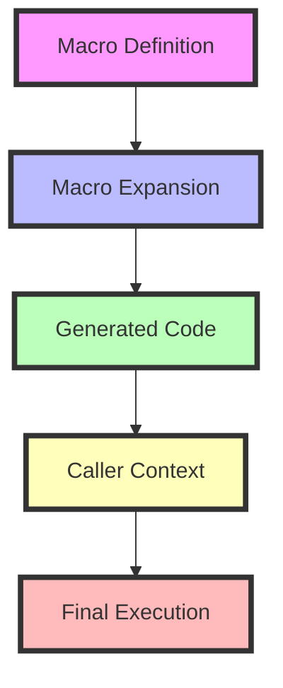

## 16.4 Advanced Macro Techniques

In this section, we delve into the advanced techniques of working with macros in Clojure. Macros are a powerful feature of Clojure that allow you to extend the language by writing code that writes code. This metaprogramming capability can be harnessed to create domain-specific languages, optimize performance, and simplify complex code patterns. However, with great power comes great responsibility. Understanding advanced macro techniques such as macro hygiene, the use of gensyms, and creating macros that generate other macros is crucial for writing robust and maintainable Clojure code.

### Macro Hygiene

**Explain the concept of macro hygiene and how Clojure prevents variable capture.**

Macro hygiene refers to the practice of preventing unintended interactions between the code inside a macro and the code where the macro is used. In other words, it ensures that variables within a macro do not accidentally interfere with variables in the surrounding code, which could lead to bugs and unexpected behavior.

Clojure macros are designed to be hygienic by default. This means they automatically prevent variable capture, which is when a variable inside a macro unintentionally binds to a variable in the macro's calling context. Clojure achieves this by using a technique called **gensym** (generate-symbol), which creates unique symbols for variables inside macros.

#### Example of Macro Hygiene

Consider a simple macro that increments a variable:

```clojure
(defmacro increment [var]
  `(let [temp# ~var]
     (inc temp#)))

(let [x 5]
  (increment x))
```

In this example, the `temp#` symbol is generated using gensym, ensuring that it is unique and does not conflict with any `temp` variable in the surrounding code. The `#` suffix is a convention in Clojure to indicate that a gensym is being used.

### Unhygienic Macros

**Discuss situations where unhygienic macros are necessary and how to handle them.**

While macro hygiene is beneficial, there are situations where unhygienic macros are necessary. Unhygienic macros deliberately capture or use variables from the surrounding context. This can be useful for creating DSLs (domain-specific languages) or when you need to manipulate the context directly.

#### Example of Unhygienic Macros

Suppose we want to create a macro that introduces a new variable into the caller's context:

```clojure
(defmacro define-and-increment [var]
  `(do
     (def ~var 0)
     (inc ~var)))

(define-and-increment my-var)
```

In this case, the macro `define-and-increment` introduces a new variable `my-var` into the caller's context. This is unhygienic because it relies on the variable `var` being available in the caller's context.

**Handling Unhygienic Macros**

To handle unhygienic macros safely, you should:

1. **Document the macro's behavior**: Clearly state that the macro will introduce or manipulate variables in the caller's context.
2. **Use unique names**: Choose variable names that are unlikely to clash with existing variables.
3. **Provide warnings or checks**: Use runtime checks to warn users if the macro might cause conflicts.

### Variable Capturing and Gensyms

**Introduce gensyms (`generate-symbols`) to create unique symbols in macros.**

Variable capturing occurs when a macro inadvertently binds to a variable in the caller's context. This can lead to subtle bugs, especially in large codebases. To prevent this, Clojure provides the `gensym` function, which generates unique symbols that are guaranteed not to clash with existing variables.

#### Using Gensyms

Here's how you can use gensyms in a macro:

```clojure
(defmacro safe-increment [var]
  (let [unique-var (gensym "temp")]
    `(let [~unique-var ~var]
       (inc ~unique-var))))

(let [x 5]
  (safe-increment x))
```

In this example, `gensym` is used to create a unique symbol `unique-var`, ensuring that it does not conflict with any `temp` variable in the caller's context.

#### Benefits of Gensyms

- **Avoid Variable Capture**: Gensyms prevent accidental variable capture, making macros safer and more predictable.
- **Improve Code Clarity**: By using gensyms, you can write macros that are easier to understand and maintain.

### Macros Generating Macros

**Explore the idea of writing macros that generate other macros.**

One of the most powerful aspects of Clojure macros is their ability to generate other macros. This allows you to create highly dynamic and flexible code that can adapt to different contexts and requirements.

#### Example of Macros Generating Macros

Let's create a macro that generates another macro to define a series of functions:

```clojure
(defmacro generate-function-macros [name]
  `(defmacro ~(symbol (str "define-" name "-function")) [func-name]
     `(defn ~(symbol (str ~name "-" func-name)) []
        (println "This is a" ~(str name) "function"))))

(generate-function-macros "custom")

(define-custom-function example)
(custom-example)
```

In this example, the `generate-function-macros` macro creates a new macro `define-custom-function`, which in turn defines a function `custom-example`. This demonstrates the power of macros to generate other macros and extend the language in a flexible way.

#### Considerations for Macros Generating Macros

- **Complexity**: Macros generating macros can become complex and difficult to debug. Ensure you have a clear understanding of the code flow.
- **Documentation**: Provide thorough documentation for each macro, including examples of how they should be used.
- **Testing**: Write comprehensive tests to ensure that the generated macros behave as expected.

### Try It Yourself

To gain a deeper understanding of advanced macro techniques, try modifying the examples provided:

1. **Modify the `increment` macro** to accept an additional argument that specifies the amount to increment.
2. **Create a new macro** that generates a series of functions with different names and behaviors.
3. **Experiment with gensyms** to see how they prevent variable capture in different contexts.

### Visual Aids

To further illustrate these concepts, let's look at a diagram that shows how macros generate code and interact with the caller's context:



**Diagram Description**: This flowchart illustrates the process of macro expansion in Clojure. The macro definition is expanded into generated code, which interacts with the caller's context and leads to final execution.

### References and Links

For further reading and exploration of advanced macro techniques in Clojure, consider the following resources:

- [Clojure Official Documentation](https://clojure.org/reference)
- [Clojure Community Resources](https://clojure.org/community/resources)
- [Transitioning from OOP to Functional Programming](https://www.lispcast.com/oo-to-fp/)
- [Clojure Macros Guide](https://clojure.org/guides/macros)

### Knowledge Check

Let's summarize the key takeaways from this section:

- **Macro Hygiene**: Clojure macros are hygienic by default, preventing variable capture.
- **Unhygienic Macros**: Sometimes necessary for DSLs, but should be used with caution.
- **Gensyms**: Use gensyms to create unique symbols and avoid variable capture.
- **Macros Generating Macros**: Powerful technique for extending the language, but requires careful design and testing.

## **Test Your Knowledge: Advanced Macro Techniques Quiz**



### What is macro hygiene in Clojure?

- [x] Preventing unintended variable capture in macros
- [ ] Ensuring macros are syntactically correct
- [ ] Optimizing macros for performance
- [ ] Making macros easier to read

> **Explanation:** Macro hygiene refers to the prevention of unintended variable capture, ensuring that variables inside a macro do not interfere with those in the caller's context.

### Why are gensyms used in Clojure macros?

- [x] To create unique symbols and prevent variable capture
- [ ] To optimize macro performance
- [ ] To make macros easier to read
- [ ] To ensure macros are syntactically correct

> **Explanation:** Gensyms are used to generate unique symbols, preventing variable capture and ensuring that macros do not interfere with the caller's context.

### When might you need to use unhygienic macros?

- [x] When creating a domain-specific language
- [ ] When optimizing macro performance
- [ ] When ensuring macros are syntactically correct
- [ ] When making macros easier to read

> **Explanation:** Unhygienic macros are sometimes necessary when creating domain-specific languages or when you need to manipulate the caller's context directly.

### What is a potential downside of macros generating other macros?

- [x] Increased complexity and difficulty in debugging
- [ ] Improved performance
- [ ] Easier to read code
- [ ] Simplified syntax

> **Explanation:** Macros generating other macros can become complex and difficult to debug, requiring careful design and testing.

### How can you handle unhygienic macros safely?

- [x] Document the macro's behavior
- [x] Use unique names for variables
- [ ] Avoid using macros altogether
- [ ] Optimize the macro for performance

> **Explanation:** To handle unhygienic macros safely, document their behavior and use unique names to avoid conflicts.

### What does the `gensym` function do?

- [x] Generates unique symbols
- [ ] Optimizes macro performance
- [ ] Ensures macros are syntactically correct
- [ ] Makes macros easier to read

> **Explanation:** The `gensym` function generates unique symbols, preventing variable capture in macros.

### What is a key benefit of macro hygiene?

- [x] Prevents unintended variable capture
- [x] Ensures macros do not interfere with the caller's context
- [ ] Optimizes macro performance
- [ ] Makes macros easier to read

> **Explanation:** Macro hygiene prevents unintended variable capture, ensuring that macros do not interfere with the caller's context.

### What is a gensym?

- [x] A function that generates unique symbols
- [ ] A type of macro
- [ ] A variable in Clojure
- [ ] A performance optimization technique

> **Explanation:** A gensym is a function that generates unique symbols, used to prevent variable capture in macros.

### What is a common use case for macros generating macros?

- [x] Creating flexible and dynamic code
- [ ] Optimizing macro performance
- [ ] Ensuring macros are syntactically correct
- [ ] Making macros easier to read

> **Explanation:** Macros generating macros are used to create flexible and dynamic code, allowing for powerful language extensions.

### True or False: Clojure macros are hygienic by default.

- [x] True
- [ ] False

> **Explanation:** Clojure macros are designed to be hygienic by default, preventing unintended variable capture.


