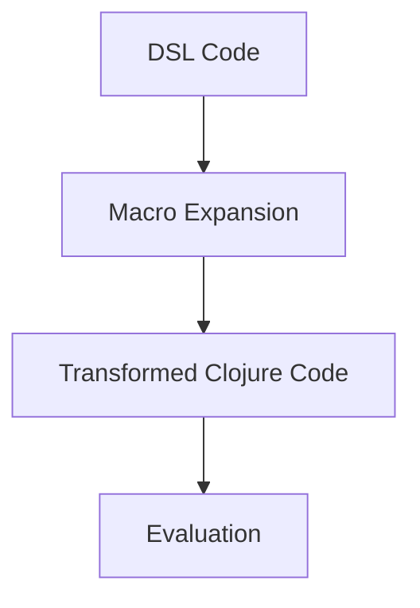

## 16.5 Creating Domain-Specific Languages

In the world of software development, **Domain-Specific Languages (DSLs)** are specialized mini-languages tailored to a particular application domain. They offer a way to express domain concepts directly in code, making the code more readable and maintainable. In this section, we will explore the purpose of DSLs, how Clojure's macros can be utilized to create them, and the considerations involved in designing an effective DSL.

### Purpose of DSLs

**Explain why and when to create domain-specific languages.**

DSLs are designed to simplify complex tasks by providing a set of abstractions that are closer to the problem domain than general-purpose programming languages. They can be either **internal**, embedded within a host language, or **external**, with their own syntax and parser. Clojure, with its powerful macro system, is particularly well-suited for creating internal DSLs.

**When to Use DSLs:**

1. **Domain Complexity**: When the domain has complex rules and logic that can be abstracted into simpler, more expressive constructs.
2. **Repetitive Patterns**: When there are repetitive coding patterns that can be encapsulated in a higher-level language.
3. **Improved Communication**: When you need to improve communication between developers and domain experts by using domain-specific terminology.
4. **Rapid Prototyping**: When you need to quickly prototype domain logic without getting bogged down in implementation details.

### Macros in DSLs

**Show how macros can be used to create expressive and concise DSLs.**

Clojure's macro system is a powerful tool for creating DSLs. Macros allow you to extend the language by creating new syntactic constructs. This capability is essential for building DSLs that feel natural and expressive.

#### Understanding Macros

Macros in Clojure operate at the syntactic level, transforming code before it is evaluated. This allows you to create new language constructs that can simplify complex patterns and enhance readability.

**Example of a Simple Macro:**

```clojure
(defmacro unless [condition & body]
  `(if (not ~condition)
     (do ~@body)))

;; Usage
(unless false
  (println "This will print because the condition is false."))
```

In this example, the `unless` macro provides a more intuitive way to express conditional logic, similar to the `unless` keyword in other languages.

#### Building a DSL with Macros

To build a DSL, you can use macros to define new constructs that encapsulate domain-specific logic. Let's consider building a simple DSL for defining workflows.

**Workflow DSL Example:**

```clojure
(defmacro workflow [& steps]
  `(do ~@steps))

(defmacro step [name & body]
  `(println "Executing step:" ~name)
  (do ~@body))

;; Usage
(workflow
  (step "Initialize" (println "Initializing..."))
  (step "Process" (println "Processing data..."))
  (step "Finalize" (println "Finalizing...")))
```

In this example, the `workflow` and `step` macros allow you to define a sequence of steps in a workflow, making the code more readable and aligned with the domain language.

### Examples of DSLs in Clojure

**Provide examples of DSLs in Clojure, such as testing frameworks or HTML templating.**

#### Testing Framework DSL

Clojure's `clojure.test` library is an excellent example of a DSL for testing. It provides macros like `deftest` and `is` to define tests in a concise and expressive manner.

**Example:**

```clojure
(ns my-test
  (:require [clojure.test :refer :all]))

(deftest addition-test
  (is (= (+ 1 2) 3)))

(run-tests 'my-test)
```

Here, `deftest` and `is` are macros that transform test definitions into executable code, providing a clear and concise way to express test logic.

#### HTML Templating DSL

Another common use of DSLs is in HTML templating. Libraries like `hiccup` provide a DSL for generating HTML in Clojure.

**Example:**

```clojure
(require '[hiccup.core :refer :all])

(html
 [:html
  [:head
   [:title "My Page"]]
  [:body
   [:h1 "Welcome to My Page"]
   [:p "This is a paragraph."]]])
```

This DSL allows you to express HTML structure using Clojure data structures, making it easy to generate dynamic content.

### Design Considerations

**Discuss considerations for designing a DSL, such as readability and learning curve.**

When designing a DSL, several factors must be considered to ensure it is effective and user-friendly:

1. **Readability**: The DSL should be easy to read and understand, even for those who are not familiar with the underlying implementation.
2. **Expressiveness**: It should allow users to express domain concepts concisely and clearly.
3. **Consistency**: The syntax and semantics of the DSL should be consistent with the host language and the domain.
4. **Learning Curve**: The DSL should be easy to learn, especially for domain experts who may not be familiar with programming.
5. **Extensibility**: It should be easy to extend the DSL with new features as the domain evolves.
6. **Performance**: The DSL should not introduce significant performance overhead compared to using the host language directly.

### Try It Yourself

To deepen your understanding of DSLs in Clojure, try modifying the examples provided. For instance, extend the workflow DSL to include error handling or logging capabilities. Experiment with creating a DSL for a different domain, such as configuration management or data processing.

### Visual Aids

To better understand how DSLs map to Clojure's syntax and macros, consider the following diagram illustrating the transformation process:



**Diagram Description:** This flowchart illustrates the process of transforming DSL code using macros in Clojure. The DSL code is first expanded by macros, resulting in transformed Clojure code, which is then evaluated.

### References and Links

- [Clojure Official Documentation](https://clojure.org/reference)
- [Clojure Macros Guide](https://clojure.org/reference/macros)
- [Hiccup Library for HTML Templating](https://github.com/weavejester/hiccup)
- [Clojure Test Documentation](https://clojure.github.io/clojure/clojure.test-api.html)
- [Transitioning from OOP to Functional Programming](https://www.lispcast.com/oo-to-fp/)

### Knowledge Check

**Pose questions or small challenges within the text to engage readers.**

1. What are the advantages of using a DSL in a complex domain?
2. How do macros facilitate the creation of DSLs in Clojure?
3. Try creating a simple DSL for a task you frequently perform in your projects.

### Encouraging Engagement

Embracing DSLs can significantly enhance the expressiveness and maintainability of your code. By leveraging Clojure's macro system, you can create powerful abstractions that align closely with your domain, making your applications more intuitive and easier to manage.

### Test Your Knowledge: Creating Domain-Specific Languages Quiz



### What is a key advantage of using DSLs in software development?

- [x] They simplify complex domain logic.
- [ ] They always improve performance.
- [ ] They replace the need for general-purpose languages.
- [ ] They are easier to implement than general-purpose languages.

> **Explanation:** DSLs simplify complex domain logic by providing abstractions closer to the problem domain.

### How do Clojure macros help in creating DSLs?

- [x] They allow the creation of new syntactic constructs.
- [ ] They improve runtime performance.
- [ ] They automatically generate documentation.
- [ ] They restrict language features.

> **Explanation:** Macros in Clojure allow developers to create new syntactic constructs, which are essential for building expressive DSLs.

### What is an example of a DSL in Clojure?

- [x] The `clojure.test` library.
- [ ] The Java Virtual Machine.
- [ ] The Clojure compiler.
- [ ] The Linux kernel.

> **Explanation:** The `clojure.test` library is a DSL for testing, providing macros like `deftest` and `is`.

### What should be considered when designing a DSL?

- [x] Readability and expressiveness.
- [ ] Only performance.
- [ ] Only syntax.
- [ ] Only domain knowledge.

> **Explanation:** Readability and expressiveness are crucial considerations when designing a DSL, along with other factors like consistency and learning curve.

### Which of the following is a benefit of using an internal DSL?

- [x] It can leverage the host language's features.
- [ ] It requires a separate parser.
- [ ] It cannot be extended.
- [ ] It must have its own syntax.

> **Explanation:** Internal DSLs can leverage the host language's features, making them easier to implement and use.

### What is the role of macros in Clojure?

- [x] They transform code before evaluation.
- [ ] They execute code at runtime.
- [ ] They compile code into machine language.
- [ ] They manage memory allocation.

> **Explanation:** Macros transform code before it is evaluated, allowing for the creation of new language constructs.

### What is a common use case for DSLs?

- [x] Rapid prototyping of domain logic.
- [ ] Replacing all general-purpose languages.
- [ ] Writing low-level system code.
- [ ] Managing hardware resources.

> **Explanation:** DSLs are often used for rapid prototyping of domain logic, providing abstractions that simplify complex tasks.

### What is a potential drawback of using DSLs?

- [x] They can introduce a learning curve.
- [ ] They always improve performance.
- [ ] They are easier to implement than general-purpose languages.
- [ ] They are universally applicable.

> **Explanation:** DSLs can introduce a learning curve, especially for users unfamiliar with the domain or the DSL itself.

### True or False: DSLs are always external languages with their own syntax.

- [ ] True
- [x] False

> **Explanation:** DSLs can be internal, embedded within a host language, and do not always require their own syntax.

### What is a key consideration when extending a DSL?

- [x] Ensuring consistency with existing constructs.
- [ ] Only focusing on performance.
- [ ] Ignoring user feedback.
- [ ] Avoiding any changes to the syntax.

> **Explanation:** When extending a DSL, it's important to ensure consistency with existing constructs to maintain usability and readability.


