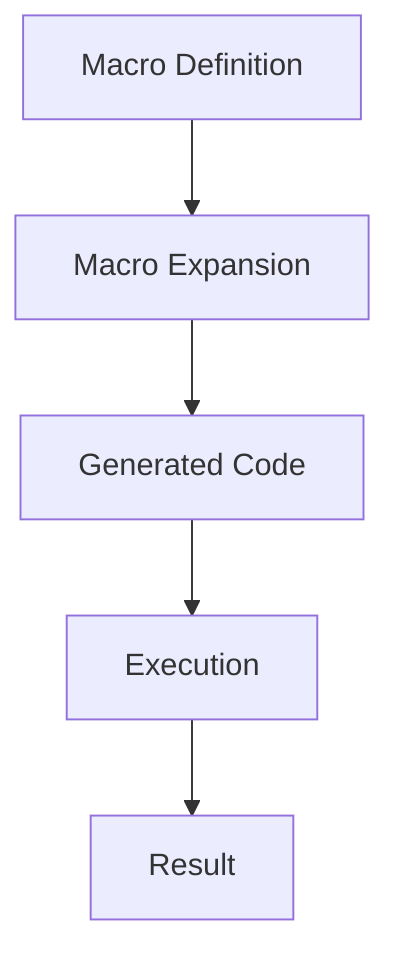

## 16.6 Best Practices for Using Macros

Macros in Clojure are a powerful tool that allows developers to manipulate code as data, enabling the creation of domain-specific languages and complex abstractions. However, with great power comes great responsibility. Misuse of macros can lead to code that is difficult to understand, maintain, and debug. This section delves into best practices for using macros in Clojure, ensuring that they enhance rather than hinder your codebase.

### Use Sparingly

#### Prefer Functions Over Macros

Macros should be used sparingly and only when necessary. In many cases, functions can achieve the desired outcome without the complexity that macros introduce. Functions are first-class citizens in Clojure and can be passed around, composed, and manipulated easily. They are also simpler to reason about and test compared to macros.

**Example:**

```clojure
;; Prefer using a function
(defn add [a b]
  (+ a b))

;; Avoid unnecessary macro
(defmacro add-macro [a b]
  `(+ ~a ~b))
```

In the example above, the function `add` is straightforward and preferable to the macro `add-macro`, which does not provide any additional benefit.

#### When to Use Macros

Macros are appropriate when you need to:

- **Delay Evaluation**: Control the evaluation of arguments, such as in control structures.
- **Code Generation**: Generate repetitive code patterns dynamically.
- **DSL Creation**: Create domain-specific languages that require syntactic sugar.

### Clarity and Readability

#### Write Clear and Understandable Macros

Macros can obscure the flow of a program if not written clearly. Aim to write macros that enhance readability and make the codebase more maintainable. Avoid using macros to perform tasks that can be achieved with functions, as this can lead to confusion.

**Example:**

```clojure
(defmacro unless [condition & body]
  `(if (not ~condition)
     (do ~@body)))
```

The `unless` macro provides a clear and concise way to express conditional logic that executes when a condition is false, improving readability.

#### Avoid Overly Complex Macros

Complex macros can be difficult to debug and understand. Keep macros simple and focused on a single task. If a macro becomes too complex, consider breaking it down into smaller, more manageable pieces or using functions instead.

### Documentation

#### Thoroughly Document Macros

Macros can be challenging to understand, especially for developers new to the codebase. Thorough documentation is crucial to ensure that others (and future you) can understand the purpose and functionality of a macro.

- **Purpose**: Clearly state what the macro does and why it is needed.
- **Usage**: Provide examples of how to use the macro.
- **Parameters**: Explain each parameter and its role.
- **Limitations**: Note any limitations or edge cases.

**Example Documentation:**

```clojure
(defmacro with-logging [message & body]
  "Executes the body with logging.
  
  Parameters:
  - message: A string to log before executing the body.
  - body: The code to execute.
  
  Usage:
  (with-logging \"Starting task\" 
    (do-task))
  
  Logs the message before executing the task."
  `(do
     (println ~message)
     ~@body))
```

### Testing Macros

#### Guidelines for Testing Macros

Testing macros can be more challenging than testing functions due to their code-generation nature. However, it is essential to ensure that macros work as intended.

1. **Test Generated Code**: Evaluate the code generated by the macro to ensure it behaves as expected.
2. **Use `macroexpand`**: Utilize `macroexpand` to inspect the expanded form of a macro and verify its correctness.
3. **Test Edge Cases**: Consider edge cases and ensure the macro handles them gracefully.
4. **Use Unit Tests**: Write unit tests for macros just as you would for functions, focusing on the behavior of the generated code.

**Example:**

```clojure
;; Macro definition
(defmacro debug [expr]
  `(let [result# ~expr]
     (println "Debug:" '~expr "=" result#)
     result#))

;; Testing the macro
(deftest test-debug-macro
  (is (= 3 (macroexpand '(debug (+ 1 2)))))
  (is (= 3 (debug (+ 1 2)))))
```

### Best Practices Summary

- **Use Macros Judiciously**: Reserve macros for situations where they provide clear benefits over functions.
- **Prioritize Readability**: Write macros that enhance code clarity and avoid unnecessary complexity.
- **Document Extensively**: Provide comprehensive documentation for each macro to aid understanding and maintenance.
- **Test Thoroughly**: Ensure macros are tested effectively to confirm their correctness and reliability.

### Try It Yourself

Experiment with creating a simple macro that logs the execution time of a code block. Consider how you might document and test this macro.

```clojure
(defmacro time-execution [& body]
  "Logs the execution time of the provided code block."
  `(let [start# (System/nanoTime)
         result# (do ~@body)
         end# (System/nanoTime)]
     (println "Execution time:" (/ (- end# start#) 1e6) "ms")
     result#))

;; Usage example
(time-execution
  (Thread/sleep 1000)
  (println "Task completed"))
```

### Visual Aids

#### Macro Expansion Flow



**Diagram Description:** This flowchart illustrates the process of macro expansion in Clojure. A macro definition is expanded into generated code, which is then executed to produce a result.

### References and Links

- [Clojure Official Documentation](https://clojure.org/reference)
- [Clojure Macros Guide](https://clojure.org/reference/macros)
- [Transitioning from OOP to Functional Programming](https://www.lispcast.com/oo-to-fp/)
- [Clojure Community Resources](https://clojure.org/community/resources)

### Knowledge Check

#### Questions

1. What are the primary reasons to use macros in Clojure?
2. How can you ensure that a macro enhances code readability?
3. Why is it important to document macros thoroughly?
4. What tools can you use to test and verify the behavior of macros?
5. How does `macroexpand` help in understanding macros?

#### Exercises

1. Create a macro that conditionally executes code based on a custom condition.
2. Document and test your macro to ensure it behaves as expected.

### Encouraging Engagement

Embracing the power of macros can significantly enhance your Clojure codebase, but it's important to approach them with care. By following best practices, you can harness the full potential of macros while maintaining clarity and maintainability in your code. Remember, the goal is to make your codebase more expressive and efficient, not more complex.

## **Test Your Knowledge: Best Practices for Using Macros Quiz**



### What is a key reason to use macros in Clojure?

- [x] To control the evaluation of arguments
- [ ] To perform simple arithmetic operations
- [ ] To handle exceptions
- [ ] To store data

> **Explanation:** Macros are used to control the evaluation of arguments, allowing for the creation of new syntactic constructs.

### Which tool can help you inspect the expanded form of a macro?

- [x] `macroexpand`
- [ ] `println`
- [ ] `eval`
- [ ] `reduce`

> **Explanation:** `macroexpand` is used to inspect the expanded form of a macro, helping developers understand what code is generated.

### Why should macros be documented thoroughly?

- [x] To ensure that others understand their purpose and usage
- [ ] To increase the size of the codebase
- [ ] To make the code run faster
- [ ] To prevent errors

> **Explanation:** Thorough documentation helps others understand the purpose, usage, and limitations of macros.

### What is a potential drawback of using complex macros?

- [x] They can make code difficult to debug
- [ ] They improve performance
- [ ] They simplify code
- [ ] They reduce the need for functions

> **Explanation:** Complex macros can make code difficult to debug and understand, which is why simplicity is preferred.

### Which of the following is a best practice for using macros?

- [x] Use macros sparingly and only when necessary
- [ ] Use macros for all repetitive tasks
- [ ] Avoid using functions
- [ ] Use macros to store data

> **Explanation:** Macros should be used sparingly and only when they provide clear benefits over functions.

### How can you test the behavior of a macro?

- [x] By evaluating the code generated by the macro
- [ ] By writing more macros
- [ ] By using `println` statements
- [ ] By avoiding tests

> **Explanation:** Testing the behavior of the code generated by the macro is essential to ensure it works as intended.

### What is one way to ensure macros enhance code clarity?

- [x] Write macros that are simple and focused on a single task
- [ ] Write macros that perform multiple complex tasks
- [ ] Avoid using comments
- [ ] Use macros for all logic

> **Explanation:** Simple and focused macros enhance code clarity and maintainability.

### Which of the following is NOT a reason to use macros?

- [x] To perform basic arithmetic operations
- [ ] To delay evaluation
- [ ] To generate repetitive code patterns
- [ ] To create domain-specific languages

> **Explanation:** Macros are not needed for basic arithmetic operations; functions are sufficient for such tasks.

### True or False: Macros should always be used instead of functions.

- [ ] True
- [x] False

> **Explanation:** Macros should only be used when they provide benefits over functions, not as a default choice.

### What is the role of `macroexpand` in macro development?

- [x] It helps in understanding the code generated by a macro
- [ ] It executes the macro
- [ ] It stores the macro
- [ ] It deletes the macro

> **Explanation:** `macroexpand` helps developers understand the code generated by a macro, aiding in debugging and verification.


