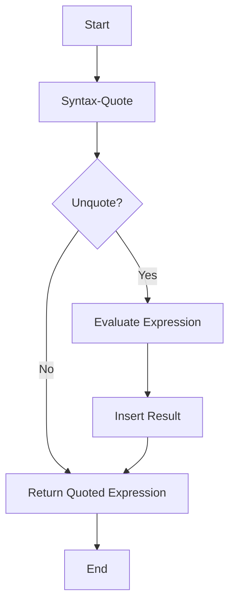

## 16.7 Quoting and Unquoting in Macro Definitions

In the realm of Clojure, macros stand as a powerful tool, allowing developers to extend the language and introduce new syntactic constructs. At the heart of macro writing are the concepts of quoting and unquoting, which enable the manipulation of code as data—a hallmark of Lisp languages. In this section, we will delve into these concepts, exploring their syntax, use cases, and common pitfalls.

### Quoting Basics

Before diving into the specifics of quoting in macros, let's revisit the basic concept of quoting in Clojure. Quoting is a mechanism to prevent the evaluation of expressions. In Clojure, the quote operator (`'`) is used to return the expression as it is, rather than evaluating it.

#### Example: Basic Quoting

```clojure
;; Without quoting, the expression is evaluated
(+ 1 2) ; => 3

;; With quoting, the expression is returned as data
'( + 1 2) ; => (+ 1 2)
```

In the example above, the quote operator tells Clojure to treat `(+ 1 2)` as a list of symbols rather than evaluating it as an arithmetic operation.

### Syntax-Quote

While the simple quote is useful, macros often require more sophisticated quoting mechanisms. This is where the syntax-quote (`` ` ``) comes into play. Syntax-quote is similar to the regular quote, but it adds several enhancements that are particularly useful in macro writing:

1. **Namespace Resolution**: Syntax-quote automatically resolves symbols to their fully qualified names, ensuring that the generated code is correctly namespaced.
2. **Unquoting Capability**: It allows parts of the quoted expression to be evaluated and inserted into the quoted structure using unquoting (`~`).
3. **Unquote-Splicing**: It supports splicing sequences into the quoted structure using unquote-splicing (`~@`).

#### Example: Syntax-Quote with Namespace Resolution

```clojure
(defn my-func []
  `(+ 1 2))

;; The syntax-quote resolves the + symbol to clojure.core/+
(my-func) ; => (clojure.core/+ 1 2)
```

In this example, the syntax-quote ensures that the `+` symbol is resolved to `clojure.core/+`, preventing any ambiguity with other `+` symbols that might exist in different namespaces.

### Unquoting

Unquoting (`~`) is used within a syntax-quoted expression to evaluate a part of that expression and include the result in the final quoted form. This is particularly useful in macros where you need to insert values or expressions into a template.

#### Example: Unquoting in Macros

```clojure
(defmacro add-one [x]
  `(+ ~x 1))

;; Usage of the macro
(add-one 5) ; => 6
```

In this macro, the unquote operator (`~`) is used to insert the value of `x` into the syntax-quoted expression. When `(add-one 5)` is called, `x` is replaced with `5`, resulting in the expression `(+ 5 1)`.

### Unquote-Splicing

Unquote-splicing (`~@`) is a powerful feature that allows you to splice a sequence into a syntax-quoted list. This is particularly useful when you want to insert multiple elements into a list within a macro.

#### Example: Unquote-Splicing in Macros

```clojure
(defmacro combine [x y]
  `(list ~@x ~@y))

;; Usage of the macro
(combine [1 2] [3 4]) ; => (1 2 3 4)
```

In this example, both `x` and `y` are expected to be sequences. The unquote-splicing operator (`~@`) is used to insert all elements of `x` and `y` into the resulting list.

### Avoiding Errors

When working with quoting and unquoting in macros, developers often encounter common pitfalls. Here are some tips to avoid these errors:

1. **Mismatched Quoting and Unquoting**: Ensure that every unquote (`~`) or unquote-splicing (`~@`) is within a syntax-quoted expression (`` ` ``). Using them outside of this context will result in errors.

2. **Namespace Conflicts**: Be aware of how syntax-quote resolves symbols to fully qualified names. This can sometimes lead to unexpected behavior if you are not mindful of namespace imports and aliases.

3. **Complex Expressions**: When dealing with complex expressions, break them down into smaller parts to simplify debugging and ensure that quoting and unquoting are used correctly.

4. **Understanding Evaluation Order**: Remember that unquoted parts are evaluated in the context of the macro call, not where the macro is defined. This can lead to subtle bugs if not carefully managed.

### Examples: Putting It All Together

Let's look at a more complex example that demonstrates the use of quoting, unquoting, and unquote-splicing in a macro definition.

#### Example: A Macro to Create a Function

```clojure
(defmacro create-adder [n]
  `(fn [x] (+ x ~n)))

;; Create a function that adds 10
(def add-ten (create-adder 10))

(add-ten 5) ; => 15
```

In this example, the `create-adder` macro generates a function that adds a specified number `n` to its argument `x`. The syntax-quote is used to construct the function, while the unquote operator (`~`) is used to insert the value of `n`.

#### Example: A Macro with Unquote-Splicing

```clojure
(defmacro create-map [& pairs]
  `(hash-map ~@pairs))

;; Create a map with key-value pairs
(create-map :a 1 :b 2 :c 3) ; => {:a 1, :b 2, :c 3}
```

In this macro, `create-map` takes a variable number of key-value pairs and constructs a map using `hash-map`. The unquote-splicing operator (`~@`) is used to insert all the pairs into the `hash-map` function call.

### Visualizing Quoting and Unquoting

To better understand how quoting and unquoting work together in macro definitions, let's visualize the process using a flowchart.



**Caption**: This flowchart illustrates the process of evaluating a syntax-quoted expression with unquoting. If an unquote is encountered, the expression is evaluated and the result is inserted into the quoted structure.

### References and Further Reading

- [Clojure Official Documentation](https://clojure.org/reference)
- [Clojure Macros Guide](https://clojure.org/reference/macros)
- [Transitioning from OOP to Functional Programming](https://www.lispcast.com/oo-to-fp/)
- [Clojure Community Resources](https://clojure.org/community/resources)

### Knowledge Check

Let's reinforce our understanding of quoting and unquoting in macro definitions with some questions and exercises.

## **Test Your Knowledge: Quoting and Unquoting in Macro Definitions Quiz**



### What is the primary purpose of quoting in Clojure?

- [x] To prevent the evaluation of an expression
- [ ] To evaluate an expression immediately
- [ ] To convert an expression into a string
- [ ] To execute an expression in a different namespace

> **Explanation:** Quoting is used to return an expression as data, preventing its evaluation.

### How does syntax-quote differ from a regular quote?

- [x] It resolves symbols to fully qualified names
- [ ] It does not prevent evaluation
- [ ] It converts symbols to strings
- [ ] It only works with numbers

> **Explanation:** Syntax-quote resolves symbols to their fully qualified names, which is particularly useful in macros.

### What does the unquote operator (`~`) do in a syntax-quoted expression?

- [x] Evaluates a part of the expression and includes the result
- [ ] Prevents evaluation of the entire expression
- [ ] Converts the expression to a string
- [ ] Removes the expression from the quoted form

> **Explanation:** Unquote evaluates a part of the syntax-quoted expression and includes the result in the final quoted form.

### What is the purpose of unquote-splicing (`~@`)?

- [x] To insert multiple elements into a list within a macro
- [ ] To prevent evaluation of a list
- [ ] To convert a list into a string
- [ ] To remove elements from a list

> **Explanation:** Unquote-splicing is used to splice a sequence into a list within a syntax-quoted expression.

### Which of the following is a common mistake when using quoting and unquoting?

- [x] Mismatched quoting and unquoting
- [ ] Using quotes with numbers
- [x] Namespace conflicts
- [ ] Using quotes with strings

> **Explanation:** Mismatched quoting and unquoting, as well as namespace conflicts, are common mistakes.

### How does syntax-quote handle namespaces?

- [x] It resolves symbols to their fully qualified names
- [ ] It ignores namespaces
- [ ] It converts namespaces to strings
- [ ] It removes namespaces from symbols

> **Explanation:** Syntax-quote resolves symbols to their fully qualified names, ensuring correct namespace usage.

### What is the result of `(create-adder 5)` when used in a macro that adds a number to its argument?

- [x] A function that adds 5 to its argument
- [ ] A string representation of the number 5
- [x] A function that subtracts 5 from its argument
- [ ] A list containing the number 5

> **Explanation:** The macro generates a function that adds the specified number to its argument.

### What does the following macro do: `(create-map :a 1 :b 2)`?

- [x] Creates a map with the given key-value pairs
- [ ] Converts the pairs into a list
- [ ] Evaluates the pairs as arithmetic expressions
- [ ] Converts the pairs into a string

> **Explanation:** The macro creates a map using the provided key-value pairs.

### How can you avoid errors when using quoting and unquoting in macros?

- [x] Ensure all unquotes are within syntax-quoted expressions
- [ ] Use unquote with strings only
- [ ] Avoid using namespaces
- [ ] Use only regular quotes

> **Explanation:** Ensuring that all unquotes are within syntax-quoted expressions helps avoid errors.

### True or False: Unquote-splicing can be used outside of syntax-quoted expressions.

- [ ] True
- [x] False

> **Explanation:** Unquote-splicing must be used within syntax-quoted expressions to function correctly.



By mastering quoting and unquoting in macro definitions, you unlock the full potential of Clojure macros, enabling you to write more expressive and powerful code. Embrace these concepts, and you'll find yourself crafting macros that can transform your Clojure applications.
