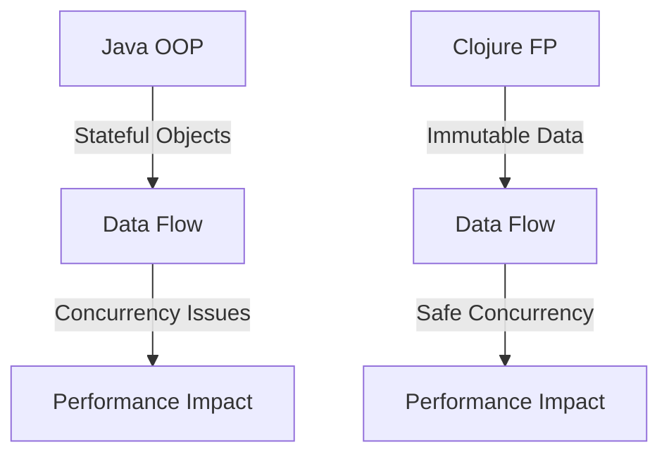

## 17.1 Understanding Performance in Functional Programs

As we delve into the realm of functional programming with Clojure, understanding performance characteristics becomes crucial. Functional programming paradigms offer unique benefits and challenges that impact performance. In this section, we will explore the implications of immutability, the importance of benchmarking, the effects of garbage collection, and real-world scenarios that demonstrate how functional programming can both enhance and hinder performance.

### Functional Performance Characteristics

Functional programming (FP) is often celebrated for its ability to produce clean, maintainable, and scalable code. However, these advantages come with their own set of performance considerations. Let's discuss how FP paradigms impact performance.

#### Benefits of Functional Programming

1. **Concurrency and Parallelism**: FP naturally supports concurrency due to its emphasis on immutability and statelessness. This can lead to significant performance improvements in multi-core environments.
   
2. **Predictability and Testability**: Pure functions, a staple of FP, are deterministic and easier to test, reducing the likelihood of performance-related bugs.

3. **Modular Code**: FP promotes small, reusable functions, which can be optimized independently, leading to more efficient code.

#### Potential Drawbacks

1. **Immutability Overhead**: The use of immutable data structures can introduce overhead, as each modification creates a new version of the data structure. We will explore how Clojure mitigates this.

2. **Garbage Collection**: Functional programs often generate more temporary objects, increasing the load on the garbage collector.

3. **Learning Curve**: Understanding and effectively utilizing FP paradigms can require a shift in mindset, which may initially slow down development.

### Immutability Overhead

Immutability is a cornerstone of functional programming, providing safety and predictability. However, it can also lead to performance overhead. 

#### How Immutability Affects Performance

In traditional object-oriented programming (OOP), modifying an object is straightforward. In FP, each modification results in a new object, which can be costly in terms of memory and CPU usage.

#### Clojure's Optimizations

Clojure addresses these challenges with persistent data structures that use structural sharing to minimize the cost of immutability. Let's explore how this works with an example.

```clojure
;; Example of a persistent vector in Clojure
(def original-vector [1 2 3 4 5])

;; Adding an element to the vector
(def new-vector (conj original-vector 6))

;; original-vector remains unchanged
(println original-vector) ; Output: [1 2 3 4 5]
(println new-vector)      ; Output: [1 2 3 4 5 6]
```

In this example, `new-vector` shares most of its structure with `original-vector`, reducing the need to duplicate data entirely.

#### Try It Yourself

Experiment with different Clojure data structures, such as maps and sets, to observe how immutability is handled. Consider the following modifications:

- Add multiple elements to a map and observe memory usage.
- Compare the performance of operations on large vs. small data structures.

### Benchmarking Importance

Benchmarking is critical for understanding where performance bottlenecks lie in your functional programs. 

#### Why Benchmarking Matters

Without accurate benchmarks, it's challenging to identify which parts of your code require optimization. Functional programs, with their emphasis on higher-order functions and immutability, can have non-intuitive performance characteristics.

#### Tools and Techniques

Clojure provides several tools for benchmarking, including the `criterium` library, which offers robust benchmarking capabilities.

```clojure
(require '[criterium.core :refer [bench]])

(defn example-function [n]
  (reduce + (range n)))

(bench (example-function 1000))
```

This code benchmarks `example-function`, providing insights into its performance characteristics.

#### Best Practices

- **Isolate Functions**: Benchmark individual functions to pinpoint slow operations.
- **Use Realistic Data**: Ensure your benchmarks reflect real-world usage scenarios.
- **Repeat Tests**: Run benchmarks multiple times to account for variability.

### Garbage Collection Effects

Functional programs often generate more temporary objects, impacting garbage collection (GC) performance.

#### Understanding Garbage Collection

GC is responsible for reclaiming memory used by objects that are no longer needed. In functional programs, frequent creation of new objects can lead to more frequent GC pauses.

#### Mitigating GC Impact

1. **Optimize Data Structures**: Use Clojure's persistent data structures to minimize object creation.
2. **Profile Memory Usage**: Tools like `jvisualvm` can help identify memory hotspots.
3. **Adjust JVM Settings**: Tuning JVM settings can reduce the impact of GC pauses.

#### Example Scenario

Consider a scenario where a large number of temporary sequences are generated:

```clojure
;; Generating a large sequence
(def large-seq (map inc (range 1000000)))

;; Processing the sequence
(def processed-seq (filter even? large-seq))
```

In this example, both `large-seq` and `processed-seq` generate intermediate objects that can increase GC pressure.

### Real-World Scenarios

Functional programming can both improve and hinder performance, depending on the context.

#### When FP Shines

1. **Concurrent Applications**: FP's immutability and statelessness make it ideal for concurrent applications, reducing the risk of race conditions.

2. **Data Transformation Pipelines**: FP excels at building complex data transformation pipelines, which can be optimized for performance.

#### When FP May Hinder

1. **Memory-Intensive Applications**: Applications with heavy memory usage may suffer from the overhead of immutable data structures.

2. **Performance-Critical Code**: In scenarios where every millisecond counts, the overhead of FP constructs may be prohibitive.

#### Making Informed Decisions

Understanding the trade-offs of FP allows developers to make informed decisions about when and how to use functional programming techniques.

### Visual Aids

To further enhance understanding, let's include a diagram that compares the data flow in Java OOP and Clojure FP paradigms.



**Diagram Description**: This diagram illustrates how Java OOP relies on stateful objects, which can lead to concurrency issues, while Clojure FP uses immutable data, enabling safe concurrency and potentially improving performance.

### References and Links

For further reading and exploration, consider the following resources:

- [Clojure Official Documentation](https://clojure.org/reference)
- [Clojure Community Resources](https://clojure.org/community/resources)
- [Transitioning from OOP to Functional Programming](https://www.lispcast.com/oo-to-fp/)

### Knowledge Check

To reinforce your understanding, consider the following questions:

1. How does immutability impact performance in functional programming?
2. What are the benefits of using persistent data structures in Clojure?
3. Why is benchmarking important in functional programs?
4. How can garbage collection affect the performance of functional programs?
5. In what scenarios does functional programming excel in terms of performance?

### Encouraging Engagement

Embracing functional programming can be challenging, but with each step, you'll gain a deeper understanding and see tangible benefits in your codebase. Experiment with the concepts discussed here, and don't hesitate to explore further with the resources provided.

### Formatting and Structure

Organize your learning with clear headings and subheadings, and use bullet points to break down complex information. Highlight important terms or concepts using bold or italic text sparingly to enhance readability.

### Writing Style

We aim to create a collaborative learning experience, using first-person plural (we, let's) and avoiding gender-specific pronouns. Keep sentences and paragraphs concise to aid readability.

### Best Practices for Tags

Use specific and relevant tags such as "Clojure", "Functional Programming", "Performance Optimization", and "Immutability" to reflect the article's content accurately.

### Links to Online Guides and References

Integrate references to other relevant sections within this online guide to provide a cohesive learning experience. Ensure that all external links are reputable, authoritative, and up-to-date.

## **Test Your Knowledge: Understanding Performance in Functional Programs Quiz**



### How does immutability impact performance in functional programming?

- [x] It can introduce overhead due to the creation of new objects for each modification.
- [ ] It eliminates the need for garbage collection.
- [ ] It always improves performance by reducing memory usage.
- [ ] It has no impact on performance.

> **Explanation:** Immutability can introduce overhead because each modification results in a new object, which can increase memory usage and CPU load.

### What is a benefit of using persistent data structures in Clojure?

- [x] They minimize the cost of immutability through structural sharing.
- [ ] They eliminate the need for garbage collection.
- [ ] They always reduce the size of data structures.
- [ ] They are only useful for small data sets.

> **Explanation:** Persistent data structures use structural sharing to minimize the overhead of immutability, making them efficient for various operations.

### Why is benchmarking important in functional programs?

- [x] To identify performance bottlenecks and optimize code.
- [ ] To eliminate the need for testing.
- [ ] To ensure code is always faster than OOP.
- [ ] To replace the need for code reviews.

> **Explanation:** Benchmarking helps identify performance bottlenecks, allowing developers to focus on optimizing the most critical parts of the code.

### How can garbage collection affect the performance of functional programs?

- [x] It can cause pauses due to the frequent creation of temporary objects.
- [ ] It eliminates the need for memory management.
- [ ] It always improves performance by freeing up memory.
- [ ] It has no impact on performance.

> **Explanation:** Garbage collection can introduce pauses in program execution, especially when many temporary objects are created, as is common in functional programming.

### In what scenarios does functional programming excel in terms of performance?

- [x] Concurrent applications and data transformation pipelines.
- [ ] Memory-intensive applications.
- [x] Stateless and concurrent applications.
- [ ] Performance-critical code with tight loops.

> **Explanation:** Functional programming excels in concurrent applications and data transformation pipelines due to its emphasis on immutability and statelessness.

### What is a drawback of functional programming in terms of performance?

- [x] Immutability can lead to increased memory usage.
- [ ] It eliminates the need for concurrency.
- [ ] It always requires more CPU power.
- [ ] It reduces the need for garbage collection.

> **Explanation:** Immutability can increase memory usage as each modification results in a new object, which can be a drawback in memory-intensive applications.

### How does Clojure optimize for immutability?

- [x] By using persistent data structures with structural sharing.
- [ ] By eliminating the need for data structures.
- [x] By minimizing object creation through structural sharing.
- [ ] By using mutable data structures.

> **Explanation:** Clojure uses persistent data structures with structural sharing to minimize the overhead of immutability, making operations more efficient.

### What is a common challenge when transitioning from OOP to FP?

- [x] Shifting the mindset to embrace immutability and statelessness.
- [ ] Learning how to use classes and objects.
- [ ] Understanding how to manage mutable state.
- [ ] Adapting to a new programming language syntax.

> **Explanation:** Transitioning from OOP to FP often requires a shift in mindset to embrace immutability and statelessness, which can be challenging for developers accustomed to mutable state.

### Why is it important to use realistic data in benchmarks?

- [x] To ensure benchmarks reflect real-world usage scenarios.
- [ ] To make benchmarks run faster.
- [ ] To eliminate the need for testing.
- [ ] To ensure code is always optimized for small data sets.

> **Explanation:** Using realistic data ensures that benchmarks accurately reflect real-world usage scenarios, providing meaningful insights into performance.

### True or False: Functional programming always improves performance.

- [ ] True
- [x] False

> **Explanation:** While functional programming offers many performance benefits, such as safe concurrency and modular code, it can also introduce overhead through immutability and increased garbage collection, which may hinder performance in certain scenarios.


