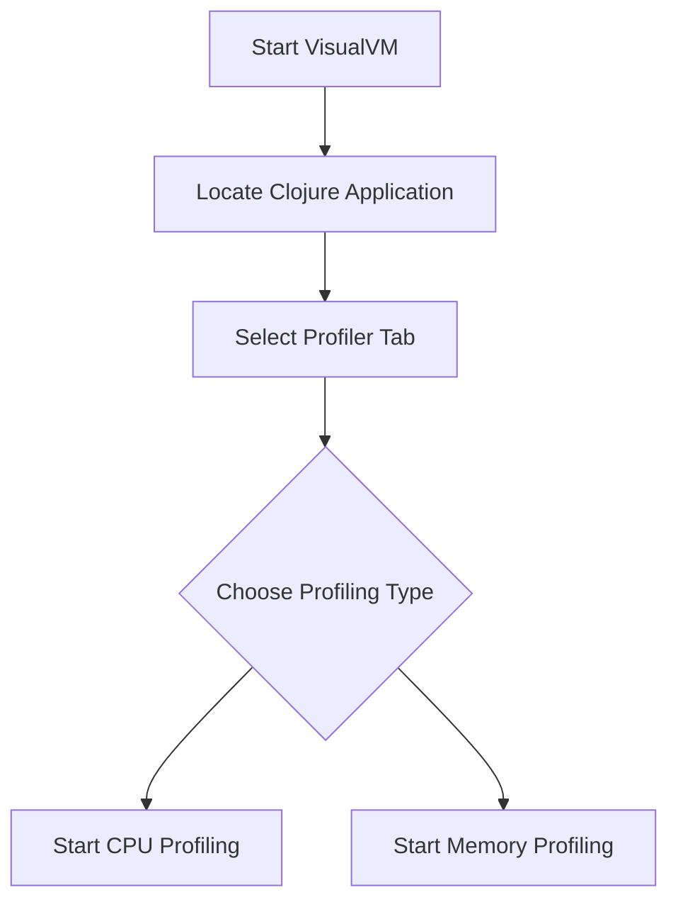

## 17.2 Profiling Clojure Applications

Profiling is an essential step in optimizing Clojure applications to ensure they run efficiently and effectively. By understanding how your application consumes resources, you can identify bottlenecks and make informed decisions to improve performance. In this section, we'll explore various profiling tools, how to set them up, and techniques to analyze CPU and memory usage. We'll also discuss continuous profiling for ongoing performance insights.

### Profiling Tools

To begin profiling Clojure applications, it's crucial to select the right tools. Here are three widely-used profilers that can help you gain insights into your application's performance:

1. **VisualVM**: A free, open-source tool that provides a visual interface for monitoring and analyzing the performance of Java applications, including those written in Clojure.
   
   - **Features**: CPU and memory profiling, thread analysis, garbage collection monitoring.
   - **Usage**: Ideal for developers seeking a straightforward tool without incurring costs.

2. **YourKit Java Profiler**: A commercial profiler known for its comprehensive features and ease of use. It supports both Java and Clojure applications.

   - **Features**: Advanced CPU and memory profiling, thread analysis, and integration with CI/CD pipelines.
   - **Usage**: Suitable for teams that require in-depth analysis and are willing to invest in a paid tool.

3. **clj-async-profiler**: A Clojure-specific profiler that leverages the capabilities of the async-profiler, providing low-overhead profiling for production environments.

   - **Features**: Flame graphs, CPU and memory profiling, low overhead.
   - **Usage**: Best for Clojure developers who need a lightweight and efficient profiling solution.

### Setting Up Profilers

Let's dive into the setup process for each of these tools, ensuring you can start profiling your Clojure applications effectively.

#### VisualVM Setup

1. **Download and Install VisualVM**: Visit the [VisualVM website](https://visualvm.github.io/) and download the latest version. Follow the installation instructions for your operating system.

2. **Configure Clojure Application**: Ensure your Clojure application is running on a Java Virtual Machine (JVM) that VisualVM can connect to. You may need to enable JMX (Java Management Extensions) for remote monitoring.

3. **Launch VisualVM**: Open VisualVM and locate your running Clojure application in the Applications tab.

4. **Start Profiling**: Select your application, navigate to the Profiler tab, and choose CPU or Memory profiling. Click the "CPU" or "Memory" button to start collecting data.



**Diagram 1**: VisualVM Profiling Setup Flowchart

#### YourKit Java Profiler Setup

1. **Download and Install YourKit**: Obtain the profiler from the [YourKit website](https://www.yourkit.com/). Follow the installation guide specific to your platform.

2. **Integrate with Clojure Application**: Add the YourKit agent to your JVM startup options. This typically involves appending `-agentpath:/path/to/yourkit/libyjpagent.so` to your JVM options.

3. **Start YourKit**: Launch the YourKit profiler and connect it to your running Clojure application.

4. **Profile the Application**: Use the YourKit interface to start CPU or memory profiling and analyze the results.

#### clj-async-profiler Setup

1. **Install clj-async-profiler**: Add the [clj-async-profiler](https://github.com/clojure-goes-fast/clj-async-profiler) dependency to your project.

2. **Start Profiling**: Use the provided API to start profiling your application. For example, you can start CPU profiling with:

   ```clojure
   (require '[clj-async-profiler.core :as profiler])

   ;; Start CPU profiling
   (profiler/start {:event :cpu})

   ;; Run your code here

   ;; Stop profiling and save the results
   (profiler/stop)
   ```

3. **Analyze Results**: Use the generated flame graphs to identify performance bottlenecks.

### Identifying Hotspots

Once you've set up your profiler and collected data, the next step is to identify performance hotspots in your code. Hotspots are areas where your application spends a significant amount of time or resources, indicating potential bottlenecks.

- **CPU Hotspots**: Look for methods or functions that consume a large percentage of CPU time. These are often candidates for optimization.
  
- **Memory Hotspots**: Identify areas with high memory allocation or frequent garbage collection events. Reducing memory usage can lead to performance improvements.

**Example**: Suppose you have a Clojure function that processes a large dataset. Profiling reveals that a specific map operation is consuming 80% of CPU time. This indicates a hotspot that may benefit from optimization, such as using a more efficient algorithm or leveraging parallel processing.

### CPU and Memory Analysis

Analyzing CPU and memory usage provides a comprehensive view of your application's performance. Here's how to approach each type of analysis:

#### CPU Analysis

- **Identify CPU-Intensive Operations**: Use profiling tools to pinpoint functions or methods with high CPU usage. Consider optimizing these areas by refactoring code, using more efficient data structures, or parallelizing tasks.

- **Visualize with Flame Graphs**: Tools like clj-async-profiler generate flame graphs that visually represent CPU usage. Use these graphs to identify which functions are consuming the most CPU time.

#### Memory Analysis

- **Track Memory Allocation**: Profiling tools can show you where memory is being allocated in your application. Focus on reducing allocations in frequently called functions.

- **Monitor Garbage Collection**: High garbage collection activity can indicate excessive memory allocation. Use profiling data to identify and optimize these areas.

### Continuous Profiling

Continuous profiling involves monitoring your application in production environments to gain ongoing performance insights. This approach helps you detect and address performance issues as they arise, ensuring your application remains efficient over time.

- **Implement Continuous Profiling**: Use tools like clj-async-profiler or commercial solutions that support continuous profiling. Integrate these tools into your production environment to collect performance data continuously.

- **Analyze Trends**: Regularly review profiling data to identify trends or patterns in resource usage. This can help you proactively address potential performance issues.

- **Automate Alerts**: Set up alerts to notify you of significant changes in performance metrics, such as increased CPU usage or memory allocation.

### Try It Yourself

To gain hands-on experience with profiling, try modifying the following Clojure code to see how it affects performance. Use a profiler to measure the impact of your changes.

```clojure
(defn process-data [data]
  (map #(do-something %) data))

(defn do-something [item]
  ;; Simulate a CPU-intensive operation
  (Thread/sleep 100)
  (inc item))

;; Profile this function to identify hotspots
(process-data (range 1000))
```

**Suggestions for Experimentation**:

- Replace `map` with `pmap` to parallelize processing.
- Reduce the sleep time in `do-something` to simulate a less CPU-intensive operation.
- Profile memory usage by increasing the size of the dataset.

### Conclusion

Profiling is a vital step in optimizing Clojure applications, allowing you to identify and address performance bottlenecks. By using tools like VisualVM, YourKit Java Profiler, and clj-async-profiler, you can gain insights into CPU and memory usage, enabling you to make informed decisions to enhance your application's efficiency. Continuous profiling further ensures that your application remains performant over time, providing ongoing insights into resource usage.

For more information on Clojure profiling tools and techniques, visit the [Clojure Official Documentation](https://clojure.org/reference) and explore community resources for additional insights.

## **Test Your Knowledge: Profiling Clojure Applications Quiz**



### Which of the following tools is a free, open-source profiler for Java and Clojure applications?

- [x] VisualVM
- [ ] YourKit Java Profiler
- [ ] clj-async-profiler
- [ ] JProfiler

> **Explanation:** VisualVM is a free, open-source tool for profiling Java applications, including those written in Clojure.

### What is the primary benefit of using flame graphs in profiling?

- [x] Visualizing CPU usage
- [ ] Monitoring memory allocation
- [ ] Analyzing thread contention
- [ ] Tracking garbage collection

> **Explanation:** Flame graphs provide a visual representation of CPU usage, helping identify functions that consume the most CPU time.

### Which profiler is known for its low overhead and suitability for production environments?

- [ ] VisualVM
- [ ] YourKit Java Profiler
- [x] clj-async-profiler
- [ ] JProfiler

> **Explanation:** clj-async-profiler is known for its low overhead, making it suitable for profiling in production environments.

### What is continuous profiling?

- [x] Monitoring application performance in production environments
- [ ] Profiling applications during development only
- [ ] Analyzing memory usage exclusively
- [ ] Running CPU analysis once

> **Explanation:** Continuous profiling involves monitoring application performance in production environments for ongoing insights.

### How can high garbage collection activity affect application performance?

- [x] It indicates excessive memory allocation
- [ ] It improves CPU usage
- [ ] It reduces memory usage
- [ ] It enhances thread performance

> **Explanation:** High garbage collection activity often indicates excessive memory allocation, which can negatively impact performance.

### What is the purpose of setting up alerts in continuous profiling?

- [x] To notify of significant changes in performance metrics
- [ ] To stop profiling automatically
- [ ] To reduce CPU usage
- [ ] To increase memory allocation

> **Explanation:** Alerts notify you of significant changes in performance metrics, allowing you to address issues proactively.

### Which tool provides a visual interface for monitoring and analyzing Java applications?

- [x] VisualVM
- [ ] YourKit Java Profiler
- [ ] clj-async-profiler
- [ ] JProfiler

> **Explanation:** VisualVM offers a visual interface for monitoring and analyzing Java applications, including Clojure.

### What does CPU analysis help identify?

- [x] CPU-intensive operations
- [ ] Memory allocation patterns
- [ ] Garbage collection frequency
- [ ] Thread contention

> **Explanation:** CPU analysis helps identify operations that consume significant CPU time, indicating potential areas for optimization.

### Why is it important to track memory allocation in profiling?

- [x] To reduce allocations in frequently called functions
- [ ] To increase garbage collection frequency
- [ ] To enhance CPU usage
- [ ] To improve thread performance

> **Explanation:** Tracking memory allocation helps reduce allocations in frequently called functions, improving performance.

### True or False: Continuous profiling is only useful during the development phase.

- [ ] True
- [x] False

> **Explanation:** Continuous profiling is useful in production environments, providing ongoing insights into application performance.


