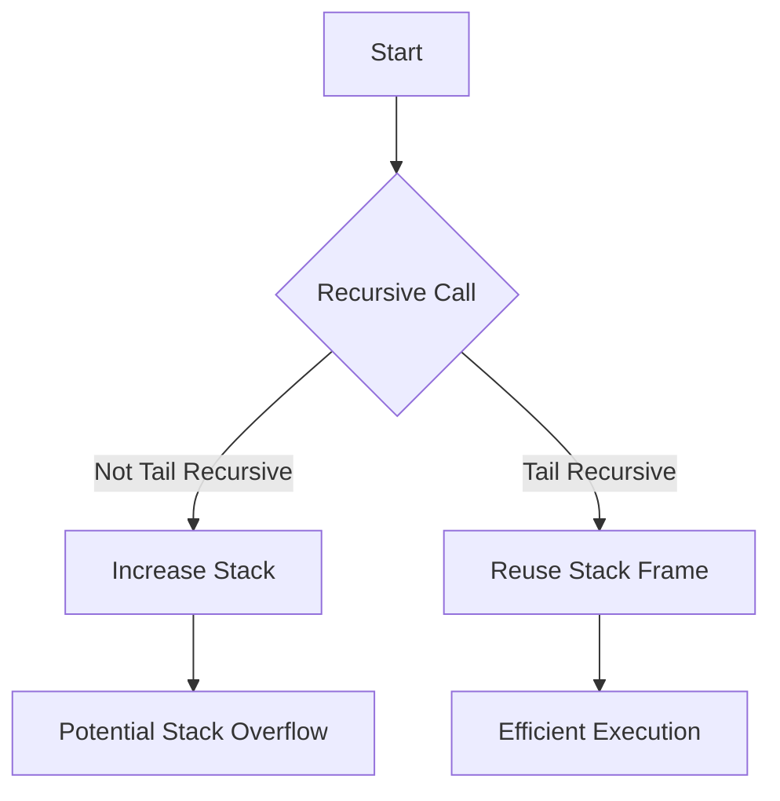

## 17.3 Optimizing Recursive Functions

In functional programming, recursion is a fundamental concept that replaces traditional loops found in imperative programming. However, recursion can sometimes lead to performance issues, especially when dealing with deep recursive calls. In this section, we will explore various techniques to optimize recursive functions in Clojure, focusing on tail recursion, memoization, and iterative alternatives.

### Tail Recursion for Efficiency

Tail recursion is a powerful optimization technique that allows recursive functions to execute in constant stack space, preventing stack overflow errors. In Clojure, the `recur` special form is used to achieve tail recursion. Let's delve into how this works and why it's beneficial.

#### Understanding Tail Recursion

A function is tail recursive if the recursive call is the last operation in the function. This means that the current function frame can be replaced with the next one, allowing the function to execute in constant stack space. This optimization is crucial for functions that need to handle large input sizes or deep recursion levels.

#### Using `recur` in Clojure

Clojure provides the `recur` special form to facilitate tail recursion. When using `recur`, the recursive call is made without growing the call stack. Here's a simple example to illustrate this concept:

```clojure
(defn factorial [n]
  (loop [acc 1, n n]
    (if (zero? n)
      acc
      (recur (* acc n) (dec n)))))
```

In this example, the `factorial` function calculates the factorial of a number using tail recursion. The `loop` form initializes the accumulator `acc` and the counter `n`. The `recur` form then performs the recursive call, updating the accumulator and decrementing the counter.

#### Avoiding Stack Overflows

Proper use of tail recursion helps prevent stack overflow errors, which occur when the call stack exceeds its limit. This is particularly important in functional programming, where recursion is a common pattern. By using `recur`, we ensure that our recursive functions are efficient and robust.

### Memoization Techniques

Memoization is a technique used to cache the results of expensive function calls and return the cached result when the same inputs occur again. This can significantly improve the performance of recursive functions, especially those with overlapping subproblems, such as the Fibonacci sequence.

#### Implementing Memoization in Clojure

Clojure provides the `memoize` function, which can be used to create a memoized version of a function. Here's an example:

```clojure
(defn fib [n]
  (if (<= n 1)
    n
    (+ (fib (dec n)) (fib (- n 2)))))

(def memo-fib (memoize fib))
```

In this example, `memo-fib` is a memoized version of the `fib` function. By using `memoize`, the results of previous calls to `fib` are cached, reducing redundant calculations and improving performance.

#### Benefits of Memoization

- **Performance Improvement**: By caching results, memoization reduces the number of recursive calls, leading to faster execution times.
- **Resource Efficiency**: Memoization minimizes computational overhead by avoiding repeated calculations.

### Iterative Alternatives

While recursion is a natural fit for many problems in functional programming, there are cases where converting a recursive solution to an iterative one can be beneficial. This is especially true when dealing with problems that do not naturally fit the recursive model or when performance is a critical concern.

#### When to Use Iterative Solutions

Consider using iterative solutions when:

- The recursive solution is not tail recursive and leads to stack overflow.
- The problem can be solved more naturally with loops or higher-order functions.
- Performance is a critical concern, and iterative solutions offer a more efficient approach.

#### Converting Recursive to Iterative

Here's an example of converting a recursive function to an iterative one using a loop:

```clojure
(defn sum-of-list [lst]
  (reduce + lst))
```

In this example, the `sum-of-list` function uses `reduce`, a higher-order function, to iterate over the list and calculate the sum. This approach is both concise and efficient.

### Practical Examples

Let's explore some practical examples to demonstrate the optimization of recursive functions.

#### Example 1: Optimizing a Recursive Fibonacci Function

Before Optimization:

```clojure
(defn fib [n]
  (if (<= n 1)
    n
    (+ (fib (dec n)) (fib (- n 2)))))
```

This naive implementation of the Fibonacci sequence is inefficient due to repeated calculations.

After Optimization with Memoization:

```clojure
(def memo-fib (memoize fib))
```

By memoizing the `fib` function, we significantly reduce the number of recursive calls, improving performance.

#### Example 2: Tail Recursive Factorial

Before Optimization:

```clojure
(defn factorial [n]
  (if (zero? n)
    1
    (* n (factorial (dec n)))))
```

This implementation can lead to stack overflow for large `n`.

After Optimization with Tail Recursion:

```clojure
(defn factorial [n]
  (loop [acc 1, n n]
    (if (zero? n)
      acc
      (recur (* acc n) (dec n)))))
```

By using `loop` and `recur`, we make the function tail recursive, preventing stack overflow.

### Try It Yourself

Experiment with the provided examples by modifying the input values or implementing additional optimizations. Consider converting other recursive functions to use `recur` or memoization, and observe the performance improvements.

### Visual Aids

To further illustrate the concepts, let's include a diagram showing the difference between a stack-based recursive call and a tail-recursive call using `recur`.



**Diagram Description**: This flowchart illustrates how tail recursion reuses the stack frame, leading to efficient execution, while non-tail-recursive calls increase the stack size, potentially causing stack overflow.

### References and Links

For further reading and deeper insights into Clojure and functional programming, explore the following resources:

- [Clojure Official Documentation](https://clojure.org/reference)
- [Clojure Community Resources](https://clojure.org/community/resources)
- [Transitioning from OOP to Functional Programming](https://www.lispcast.com/oo-to-fp/)
- [Clojure Memoization Guide](https://clojure.org/reference/memoize)

### Knowledge Check

To reinforce your understanding, consider the following questions:

1. What is tail recursion, and how does it prevent stack overflow?
2. How does memoization improve the performance of recursive functions?
3. When should you consider converting a recursive solution to an iterative one?
4. How does the `recur` special form work in Clojure?

### Encouraging Engagement

Embracing functional programming can be challenging, but with each step, you'll gain a deeper understanding and see tangible benefits in your codebase. Experiment with the examples, explore different optimization techniques, and observe the improvements in performance and efficiency.

## **Test Your Knowledge: Optimizing Recursive Functions Quiz**



### What is the primary benefit of using tail recursion in Clojure?

- [x] It prevents stack overflow errors by reusing the stack frame.
- [ ] It increases the speed of recursive functions.
- [ ] It allows for parallel execution of recursive calls.
- [ ] It simplifies the syntax of recursive functions.

> **Explanation:** Tail recursion reuses the stack frame, preventing stack overflow errors during deep recursive calls.


### Which Clojure special form is used to achieve tail recursion?

- [x] `recur`
- [ ] `loop`
- [ ] `reduce`
- [ ] `memoize`

> **Explanation:** The `recur` special form is used in Clojure to achieve tail recursion by reusing the stack frame.


### How does memoization improve the performance of recursive functions?

- [x] By caching results of previous calls to avoid redundant calculations.
- [ ] By parallelizing recursive calls.
- [ ] By simplifying the function logic.
- [ ] By reducing the number of function parameters.

> **Explanation:** Memoization caches the results of previous function calls, reducing redundant calculations and improving performance.


### When should you consider converting a recursive function to an iterative one?

- [x] When the recursive solution is not tail recursive and leads to stack overflow.
- [ ] When the function has more than three parameters.
- [ ] When the function is only called once.
- [ ] When the function is used in a web application.

> **Explanation:** Converting to an iterative solution is beneficial when the recursive solution is not tail recursive and may cause stack overflow.


### What is the purpose of the `memoize` function in Clojure?

- [x] To cache the results of function calls for performance optimization.
- [ ] To convert recursive functions to iterative ones.
- [ ] To execute functions in parallel.
- [ ] To simplify function syntax.

> **Explanation:** The `memoize` function caches the results of function calls, optimizing performance by avoiding redundant calculations.


### How does the `recur` special form differ from a regular recursive call?

- [x] It reuses the current stack frame for the next call.
- [ ] It creates a new stack frame for each call.
- [ ] It allows for parallel execution of recursive calls.
- [ ] It simplifies the function syntax.

> **Explanation:** The `recur` special form reuses the current stack frame, preventing stack overflow and optimizing recursion.


### What is a common use case for memoization in recursive functions?

- [x] Calculating Fibonacci numbers.
- [ ] Sorting a list.
- [ ] Parsing JSON data.
- [ ] Handling HTTP requests.

> **Explanation:** Memoization is commonly used in recursive functions like calculating Fibonacci numbers, where overlapping subproblems occur.


### Which of the following is NOT a benefit of using tail recursion?

- [ ] It prevents stack overflow errors.
- [ ] It allows for constant stack space usage.
- [x] It increases the number of recursive calls.
- [ ] It optimizes recursive function performance.

> **Explanation:** Tail recursion does not increase the number of recursive calls; it optimizes the execution by reusing stack frames.


### What is the role of the `loop` form in tail recursion?

- [x] To initialize variables for the recursive process.
- [ ] To cache results of recursive calls.
- [ ] To execute recursive calls in parallel.
- [ ] To simplify the function syntax.

> **Explanation:** The `loop` form initializes variables for the recursive process, working in conjunction with `recur` for tail recursion.


### True or False: Memoization can be used to optimize any recursive function.

- [x] True
- [ ] False

> **Explanation:** Memoization can be used to optimize any recursive function, especially those with overlapping subproblems, by caching results.



By mastering these optimization techniques, you'll be well-equipped to write efficient and scalable recursive functions in Clojure, enhancing the performance of your functional applications.
