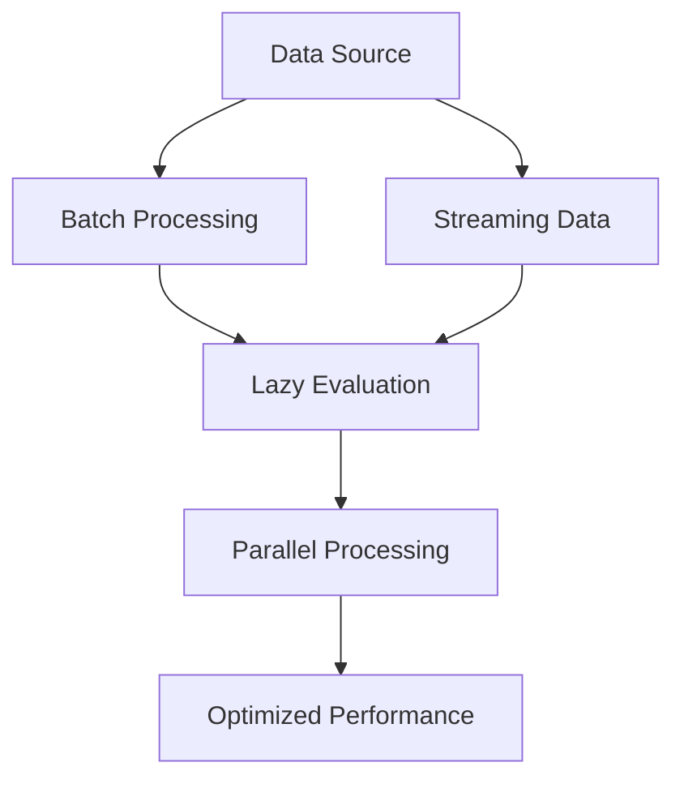

## 17.4 Efficient Data Processing Strategies

In the realm of functional programming, efficient data processing is crucial for building scalable applications. Clojure, with its immutable data structures and functional paradigms, provides powerful tools and techniques to optimize data processing tasks. In this section, we will explore various strategies, including batch processing, streaming data, lazy evaluation, and parallel processing. We'll also examine real-world case studies that demonstrate the effectiveness of these strategies.

### Batch Processing

Batch processing involves grouping data into batches and processing them collectively. This approach can significantly reduce overhead and improve cache utilization, leading to better performance. In Clojure, batch processing can be achieved using functions like `partition`, `partition-all`, and `chunked-seq`.

#### Partitioning Data

The `partition` function divides a sequence into fixed-size chunks, which can be processed independently. This is particularly useful when dealing with large datasets.

```clojure
(defn process-batch [batch]
  ;; Process each batch
  (map inc batch))

(defn batch-process [data batch-size]
  (map process-batch (partition batch-size data)))

;; Example usage
(batch-process (range 100) 10)
```

In this example, `partition` splits the data into batches of 10 elements each, and `process-batch` applies a transformation to each batch. This approach minimizes the overhead of processing each element individually.

#### Chunked Sequences

Clojure's chunked sequences are another powerful tool for batch processing. They allow for efficient traversal and manipulation of large datasets.

```clojure
(defn chunked-process [data]
  (map inc (chunked-seq data)))

;; Example usage
(chunked-process (range 100))
```

Chunked sequences improve performance by processing data in chunks, reducing the number of function calls and memory allocations.

### Streaming Data

Streaming data processing is essential for handling large or infinite data sources efficiently. Clojure's lazy sequences and transducers provide a robust framework for streaming data.

#### Lazy Sequences

Lazy sequences in Clojure allow you to process data incrementally, loading only the necessary elements into memory. This is especially useful for large datasets or when working with potentially infinite sequences.

```clojure
(defn lazy-process [data]
  (->> data
       (filter even?)
       (map inc)
       (take 10)))

;; Example usage
(lazy-process (range))
```

In this example, the sequence is processed lazily, filtering even numbers, incrementing them, and taking the first 10 results. Lazy evaluation ensures that only the required data is processed, optimizing memory usage.

#### Transducers

Transducers provide a way to compose data transformations without creating intermediate collections. They are particularly useful for streaming data processing.

```clojure
(defn transduce-process [data]
  (transduce
    (comp (filter even?) (map inc))
    conj
    []
    data))

;; Example usage
(transduce-process (range 100))
```

Transducers allow you to apply a series of transformations efficiently, without the overhead of intermediate collections. This is ideal for processing large datasets or streaming data.

### Lazy Evaluation

Lazy evaluation is a powerful concept in functional programming, allowing you to defer computation until the results are needed. However, it is important to understand when to use lazy sequences and when to avoid them for optimal performance.

#### When to Use Lazy Sequences

Lazy sequences are beneficial when working with large datasets or potentially infinite sequences, as they allow you to process data incrementally and efficiently.

```clojure
(defn lazy-filter [data]
  (filter even? data))

;; Example usage
(lazy-filter (range))
```

In this example, the `filter` function creates a lazy sequence, processing elements only when needed. This reduces memory usage and improves performance.

#### When to Avoid Lazy Sequences

In some cases, lazy sequences can lead to performance issues, particularly when the entire dataset needs to be processed or when strict evaluation is required.

```clojure
(defn eager-sum [data]
  (reduce + data))

;; Example usage
(eager-sum (range 100))
```

In this example, using `reduce` with eager evaluation is more efficient than processing the entire sequence lazily. It's important to choose the right evaluation strategy based on the specific requirements of your application.

### Parallel Processing

Parallel processing leverages multiple cores to process data concurrently, significantly improving performance for data-intensive tasks. Clojure provides several tools for parallel processing, including `pmap` and reducers.

#### Using `pmap`

The `pmap` function is a parallel version of `map`, distributing the computation across multiple cores.

```clojure
(defn parallel-process [data]
  (pmap inc data))

;; Example usage
(parallel-process (range 100))
```

In this example, `pmap` applies the `inc` function to each element in parallel, leveraging multiple cores for improved performance.

#### Reducers

Reducers provide a more flexible approach to parallel processing, allowing you to compose parallel transformations.

```clojure
(require '[clojure.core.reducers :as r])

(defn reducer-process [data]
  (r/fold + (r/map inc data)))

;; Example usage
(reducer-process (range 100))
```

Reducers allow you to perform parallel transformations efficiently, with automatic partitioning and combining of results. This is particularly useful for large datasets or computationally intensive tasks.

### Case Studies

Let's explore some real-world case studies where these strategies have led to significant performance gains.

#### Case Study 1: Batch Processing in Data Analytics

A data analytics company used batch processing to optimize their report generation process. By partitioning data into batches and processing them in parallel, they reduced the time required to generate reports from hours to minutes.

#### Case Study 2: Streaming Data in IoT Applications

An IoT company implemented streaming data processing to handle real-time sensor data. By leveraging lazy sequences and transducers, they were able to process millions of data points per second with minimal latency.

#### Case Study 3: Parallel Processing in Image Processing

A digital imaging company used parallel processing to enhance image processing tasks. By applying `pmap` and reducers, they achieved significant performance improvements, reducing processing time by over 50%.

### Try It Yourself

Experiment with the code examples provided in this section. Try modifying the batch size in the batch processing example, or apply different transformations using transducers. Observe how these changes impact performance and efficiency.

### Visual Aids

Below is a flowchart illustrating the data processing strategies discussed in this section:



**Figure 1:** Data processing strategies flowchart.

### References and Links

- [Clojure Official Documentation](https://clojure.org/reference)
- [Clojure Community Resources](https://clojure.org/community/resources)
- [Transitioning from OOP to Functional Programming](https://www.lispcast.com/oo-to-fp/)
- [Clojure STM Guide](https://clojure.org/reference/refs)

### Knowledge Check

1. What are the benefits of batch processing in data analytics?
2. How can lazy sequences improve memory usage in large datasets?
3. What are the advantages of using transducers for data transformation?
4. How does `pmap` enhance parallel processing in Clojure?
5. What are some real-world applications of streaming data processing?

### Encouraging Engagement

Embracing functional programming can be challenging, but with each step, you'll gain a deeper understanding and see tangible benefits in your codebase. Experiment with the strategies discussed in this section, and observe how they improve the performance and scalability of your applications.

## **Test Your Knowledge: Efficient Data Processing Strategies Quiz**



### What is the primary benefit of batch processing?

- [x] Reducing overhead and improving cache utilization
- [ ] Increasing the complexity of data processing
- [ ] Decreasing the number of data transformations
- [ ] Simplifying data storage

> **Explanation:** Batch processing groups data into batches, reducing overhead and improving cache utilization, which enhances performance.

### How do lazy sequences optimize memory usage?

- [x] By loading only necessary elements into memory
- [ ] By storing all data in memory at once
- [ ] By increasing the size of data structures
- [ ] By duplicating data elements

> **Explanation:** Lazy sequences load only the necessary elements into memory, optimizing memory usage, especially for large datasets.

### What is a key advantage of using transducers?

- [x] Composing data transformations without intermediate collections
- [ ] Increasing the number of intermediate collections
- [ ] Simplifying data storage
- [ ] Reducing the number of data transformations

> **Explanation:** Transducers allow you to compose data transformations efficiently without creating intermediate collections, reducing overhead.

### How does `pmap` improve parallel processing?

- [x] By distributing computation across multiple cores
- [ ] By increasing the number of data transformations
- [ ] By reducing the size of data structures
- [ ] By simplifying data storage

> **Explanation:** `pmap` distributes computation across multiple cores, leveraging parallelism for improved performance.

### Which of the following is a real-world application of streaming data processing?

- [x] Real-time sensor data in IoT applications
- [ ] Batch processing in data analytics
- [ ] Image processing with parallel processing
- [ ] Report generation in data analytics

> **Explanation:** Streaming data processing is commonly used for real-time sensor data in IoT applications, handling large data volumes efficiently.

### What is the role of reducers in parallel processing?

- [x] Composing parallel transformations efficiently
- [ ] Increasing the number of data transformations
- [ ] Simplifying data storage
- [ ] Reducing the size of data structures

> **Explanation:** Reducers compose parallel transformations efficiently, with automatic partitioning and combining of results.

### When should lazy sequences be avoided?

- [x] When strict evaluation is required
- [ ] When working with large datasets
- [ ] When processing potentially infinite sequences
- [ ] When optimizing memory usage

> **Explanation:** Lazy sequences should be avoided when strict evaluation is required, as they defer computation until results are needed.

### What is a potential drawback of lazy sequences?

- [x] Performance issues when the entire dataset needs processing
- [ ] Increased memory usage
- [ ] Simplified data transformations
- [ ] Reduced overhead

> **Explanation:** Lazy sequences can lead to performance issues when the entire dataset needs processing, as they defer computation.

### How can batch processing reduce report generation time?

- [x] By partitioning data into batches and processing them in parallel
- [ ] By increasing the complexity of data processing
- [ ] By decreasing the number of data transformations
- [ ] By simplifying data storage

> **Explanation:** Batch processing reduces report generation time by partitioning data into batches and processing them in parallel.

### True or False: Transducers create intermediate collections during data transformation.

- [ ] True
- [x] False

> **Explanation:** False. Transducers do not create intermediate collections, allowing for efficient data transformation without overhead.



By mastering these efficient data processing strategies, you'll be well-equipped to build scalable and high-performance applications in Clojure. Continue exploring and experimenting with these techniques to fully leverage the power of functional programming.
