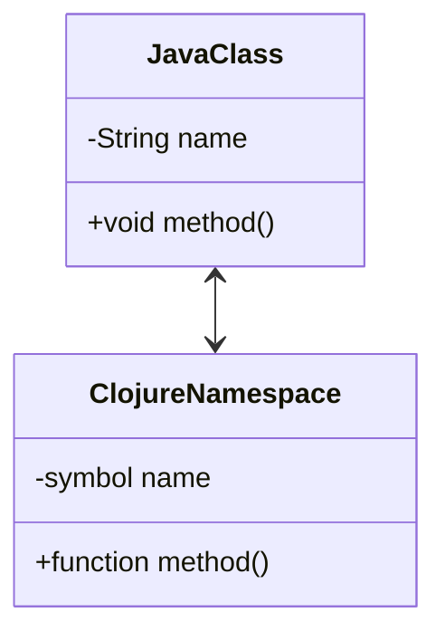

## 17.5 Leveraging Compiler Optimizations and Hints

As we delve deeper into optimizing functional code, understanding how to leverage compiler optimizations and hints in Clojure becomes crucial. This section will guide you through various strategies to enhance performance by using type hints, avoiding reflection, inlining functions, and utilizing specific compiler options.

### **Type Hints: Enhancing Performance by Reducing Reflection**

Type hints in Clojure are annotations that provide the compiler with information about the types of expressions. By default, Clojure uses reflection to determine the types of objects at runtime, which can introduce significant overhead. Type hints can help eliminate this overhead by allowing the compiler to resolve method calls at compile time.

#### **Understanding Type Hints**

Type hints are added using the `^` symbol followed by the type. They can be applied to function arguments, return values, and local variables. Here's a basic example:

```clojure
(defn add [^long a ^long b]
  (+ a b))
```

In this example, the `^long` type hint informs the compiler that both `a` and `b` are of type `long`. This allows the compiler to generate more efficient bytecode by avoiding reflection.

#### **Benefits of Using Type Hints**

- **Improved Performance**: By reducing reflection, type hints can significantly improve the performance of your Clojure code.
- **Better Interoperability with Java**: Type hints can help when calling Java methods, ensuring that the correct method overload is chosen.
- **Enhanced Readability**: Explicit type annotations can make code more understandable by clearly indicating the expected types.

#### **Applying Type Hints in Practice**

Consider the following example where we interact with a Java library:

```clojure
(defn get-length [^String s]
  (.length s))
```

Without the type hint, Clojure would use reflection to determine the type of `s` and find the appropriate `length` method. By adding `^String`, we eliminate this reflection.

### **Avoiding Reflection: Identifying and Eliminating Reflective Calls**

Reflection in Clojure occurs when the compiler cannot determine the type of an object at compile time, leading to runtime type inspection. This can slow down your application, especially in performance-critical sections.

#### **Identifying Reflective Calls**

Clojure provides tools to help you identify reflective calls. The `*warn-on-reflection*` dynamic variable can be set to `true` to enable warnings for reflective operations.

```clojure
(set! *warn-on-reflection* true)
```

When this is enabled, the compiler will output warnings whenever it encounters a reflective call, allowing you to address these issues.

#### **Using `reflect` to Analyze Code**

The `clojure.reflect` namespace provides utilities to inspect Java classes and methods, helping you understand where reflection might occur.

```clojure
(require '[clojure.reflect :as reflect])

(println (reflect/reflect String))
```

This will output a detailed description of the `String` class, allowing you to see its methods and fields.

#### **Eliminating Reflection**

Once reflective calls are identified, you can eliminate them by adding appropriate type hints or restructuring your code to provide the compiler with more information.

### **Inlining Functions: Boosting Performance with Compiler Inlining**

Inlining is a compiler optimization technique where small functions are expanded in place, reducing the overhead of function calls.

#### **When to Inline Functions**

Inlining is most beneficial for small, frequently called functions. Clojure's compiler can automatically inline certain functions, but you can also guide this process by using the `^:inline` metadata.

```clojure
(defn ^:inline add [a b]
  (+ a b))
```

#### **Benefits of Inlining**

- **Reduced Function Call Overhead**: By eliminating the need for a function call, inlining can improve performance.
- **Improved Cache Utilization**: Inlined code can lead to better instruction cache utilization, further enhancing performance.

### **Compiler Options: Fine-Tuning Performance with Compiler Flags**

Clojure provides several compiler options that can be used to optimize your code. Two notable flags are `:elide-meta` and `:direct-linking`.

#### **Using `:elide-meta`**

The `:elide-meta` option allows you to strip metadata from your code, reducing memory usage and potentially improving performance.

```clojure
;; Example of using :elide-meta
{:elide-meta [:doc :file :line]}
```

This configuration will remove the specified metadata keys from your code.

#### **Enabling `:direct-linking`**

The `:direct-linking` option can be used to reduce the indirection in function calls, leading to performance improvements.

```clojure
;; Enable direct linking in your build configuration
{:direct-linking true}
```

This option is particularly useful in environments where function call overhead is a concern.

### **Example Implementations: Demonstrating Compiler Optimizations**

Let's consider a practical example where we apply these optimizations to a Clojure function that processes a large dataset.

```clojure
(defn process-data [^List data]
  (map (fn [^String s] (.toUpperCase s)) data))
```

In this example, we use type hints to specify that `data` is a `List` and each element is a `String`. This eliminates reflection when calling `.toUpperCase`.

#### **Performance Comparison**

To demonstrate the impact of these optimizations, we can compare the performance of this function with and without type hints using a benchmarking tool like Criterium.

```clojure
(require '[criterium.core :refer [quick-bench]])

(defn process-data-no-hints [data]
  (map (fn [s] (.toUpperCase s)) data))

(quick-bench (process-data-no-hints ["hello" "world"]))
(quick-bench (process-data ["hello" "world"]))
```

### **Try It Yourself**

Experiment with the code examples provided. Try adding and removing type hints to see how it affects performance. Use the `*warn-on-reflection*` flag to identify reflective calls in your own code.

### **Visual Aids**

To better understand the relationship between Java classes and Clojure namespaces, consider the following diagram:



**Diagram Description**: This diagram illustrates how Java classes map to Clojure namespaces and functions, highlighting the interoperability between the two languages.

### **References and Links**

- [Clojure Official Documentation](https://clojure.org/reference)
- [Clojure Community Resources](https://clojure.org/community/resources)
- [Transitioning from OOP to Functional Programming](https://www.lispcast.com/oo-to-fp/)
- [Clojure Reflect Documentation](https://clojure.github.io/clojure/clojure.reflect-api.html)

### **Knowledge Check**

To ensure you've grasped the concepts covered in this section, let's test your understanding with a quiz.

## **Test Your Knowledge: Leveraging Compiler Optimizations and Hints Quiz**



### What is the primary benefit of using type hints in Clojure?

- [x] Reducing reflection overhead
- [ ] Improving code readability
- [ ] Simplifying syntax
- [ ] Enabling dynamic typing

> **Explanation:** Type hints reduce reflection overhead by allowing the compiler to resolve method calls at compile time.

### How can you identify reflective calls in your Clojure code?

- [x] By setting `*warn-on-reflection*` to `true`
- [ ] By using the `:elide-meta` option
- [ ] By enabling `:direct-linking`
- [ ] By using the `^:inline` metadata

> **Explanation:** Setting `*warn-on-reflection*` to `true` enables warnings for reflective calls, helping you identify them.

### What does the `:direct-linking` compiler option do?

- [x] Reduces indirection in function calls
- [ ] Strips metadata from code
- [ ] Enables type inference
- [ ] Inlines small functions

> **Explanation:** The `:direct-linking` option reduces indirection in function calls, improving performance.

### Which metadata can be stripped using the `:elide-meta` option?

- [x] `:doc`, `:file`, `:line`
- [ ] `:inline`, `:type`, `:arglists`
- [ ] `:name`, `:ns`, `:macro`
- [ ] `:var`, `:fn`, `:method`

> **Explanation:** The `:elide-meta` option can be used to strip metadata such as `:doc`, `:file`, and `:line`.

### What is the effect of inlining functions?

- [x] Reduces function call overhead
- [x] Improves cache utilization
- [ ] Increases code size
- [ ] Enables dynamic typing

> **Explanation:** Inlining reduces function call overhead and can improve cache utilization, leading to better performance.

### Which of the following is a benefit of using type hints?

- [x] Improved performance
- [ ] Enhanced dynamic typing
- [ ] Simplified syntax
- [ ] Increased code size

> **Explanation:** Type hints improve performance by reducing the need for reflection.

### How does the `reflect` namespace help in performance optimization?

- [x] By providing tools to inspect Java classes and methods
- [ ] By enabling function inlining
- [ ] By stripping metadata
- [ ] By reducing indirection in function calls

> **Explanation:** The `reflect` namespace provides tools to inspect Java classes and methods, helping identify reflection points.

### What is the purpose of the `^:inline` metadata?

- [x] To guide the compiler to inline small functions
- [ ] To strip metadata from code
- [ ] To enable type inference
- [ ] To reduce reflection overhead

> **Explanation:** The `^:inline` metadata guides the compiler to inline small functions, improving performance.

### True or False: Type hints are mandatory in Clojure for all functions.

- [ ] True
- [x] False

> **Explanation:** Type hints are optional in Clojure but can be used to improve performance by reducing reflection.

### What is a common use case for enabling `:direct-linking`?

- [x] Performance-critical environments
- [ ] Simplifying syntax
- [ ] Enhancing dynamic typing
- [ ] Reducing code size

> **Explanation:** `:direct-linking` is useful in performance-critical environments to reduce function call overhead.



By understanding and applying these compiler optimizations and hints, you can significantly enhance the performance of your Clojure applications. Embrace these techniques to write efficient, scalable functional code.
