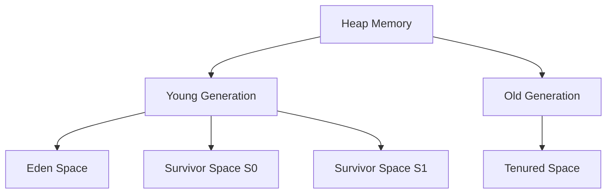

## 17.6 Managing Memory and Garbage Collection

In the realm of functional programming with Clojure, understanding memory management and garbage collection is crucial for building scalable and efficient applications. As Clojure runs on the Java Virtual Machine (JVM), it inherits the JVM's memory management capabilities, including its heap structure and garbage collection mechanisms. This section will delve into the intricacies of the JVM memory model, explore tools for monitoring memory usage, provide strategies for tuning garbage collectors, and discuss techniques for reducing object creation and detecting memory leaks.

### JVM Memory Model

To effectively manage memory in Clojure applications, it's essential to understand the JVM memory model. The JVM divides memory into several regions, each serving a distinct purpose:

- **Heap Memory**: The largest memory area used for dynamic memory allocation. It is divided into:
  - **Young Generation**: Where new objects are allocated. It is further divided into:
    - **Eden Space**: The primary area for new objects.
    - **Survivor Spaces (S0 and S1)**: Two spaces that hold objects that have survived garbage collection.
  - **Old Generation (Tenured Generation)**: Stores long-lived objects that have survived multiple garbage collection cycles.

- **Non-Heap Memory**: Includes method area, code cache, and other JVM-specific structures.

Understanding these regions helps in optimizing memory usage and garbage collection.

#### Heap Structure Diagram



**Diagram Description**: This diagram illustrates the structure of the JVM heap memory, highlighting the young and old generations and their respective subdivisions.

### Monitoring Memory Usage

Monitoring memory consumption is vital for identifying performance bottlenecks and optimizing application performance. Tools such as VisualVM and JConsole provide insights into memory usage patterns.

#### Using VisualVM

VisualVM is a powerful tool for monitoring and profiling Java applications. It offers a graphical interface to view memory usage, thread activity, and CPU utilization.

- **Installation**: VisualVM is bundled with the JDK, but you can also download it separately from the [VisualVM website](https://visualvm.github.io/).
- **Usage**: Launch VisualVM and connect to your running Clojure application. Navigate to the "Monitor" tab to view heap memory usage and garbage collection activity.

#### Using JConsole

JConsole is another tool that comes with the JDK, providing a simpler interface for monitoring JVM performance.

- **Launching JConsole**: Run `jconsole` from the command line and connect to your application.
- **Monitoring**: Use the "Memory" tab to observe heap and non-heap memory usage.

### Tuning the Garbage Collector

The garbage collector (GC) is responsible for reclaiming memory by removing unused objects. Tuning the GC can significantly impact application performance.

#### Choosing the Right Garbage Collector

The JVM offers several garbage collectors, each with its strengths and trade-offs:

- **G1 Garbage Collector**: Suitable for applications requiring predictable pause times. It divides the heap into regions and performs concurrent garbage collection.
- **Z Garbage Collector (ZGC)**: Designed for low-latency applications, ZGC handles very large heaps with minimal pause times.
- **Shenandoah**: Another low-pause-time collector, ideal for responsive applications.

#### Tuning GC Parameters

Tuning GC parameters involves setting heap size limits and adjusting GC behavior to suit application needs. Common parameters include:

- `-Xms` and `-Xmx`: Set the initial and maximum heap size.
- `-XX:+UseG1GC`: Enables the G1 garbage collector.
- `-XX:MaxGCPauseMillis`: Sets the target maximum pause time for G1.

### Reducing Object Creation

Minimizing unnecessary object creation reduces GC pressure and improves performance. Here are some strategies:

- **Reuse Immutable Data Structures**: Clojure's immutable data structures can be reused without fear of unintended side effects.
- **Avoid Unnecessary Intermediate Collections**: Use transducers to eliminate intermediate collections in data processing pipelines.
- **Leverage Persistent Data Structures**: Clojure's persistent data structures use structural sharing to minimize memory usage.

#### Code Example: Using Transducers

```clojure
(defn process-data [data]
  (transduce
    (comp
      (filter even?)
      (map #(* % 2)))
    conj
    []
    data))

;; Example usage
(process-data (range 1000))
```

**Explanation**: This example demonstrates using transducers to process a collection without creating intermediate collections, thereby reducing memory usage.

### Memory Leaks Detection

Memory leaks occur when objects are no longer needed but are not reclaimed by the GC. Detecting and fixing memory leaks is crucial for long-running applications.

#### Detecting Memory Leaks

- **Heap Dumps**: Capture heap dumps using tools like VisualVM or JConsole to analyze object retention.
- **Profiling Tools**: Use profilers to identify objects that are not being garbage collected.

#### Fixing Memory Leaks

- **Identify Retained Objects**: Use heap dumps to find objects that should be garbage collected but are not.
- **Remove Unnecessary References**: Ensure that objects are not held longer than necessary, especially in global or static contexts.

### Conclusion

Effective memory management and garbage collection tuning are essential for optimizing Clojure applications. By understanding the JVM memory model, monitoring memory usage, tuning garbage collectors, reducing object creation, and detecting memory leaks, we can build scalable and efficient functional applications.

### Knowledge Check

Let's reinforce what we've learned with some questions and exercises.

## **Test Your Knowledge: Managing Memory and Garbage Collection Quiz**



### What is the primary purpose of the young generation in the JVM heap?

- [x] To allocate new objects
- [ ] To store long-lived objects
- [ ] To manage non-heap memory
- [ ] To execute bytecode

> **Explanation:** The young generation is where new objects are allocated, and it is designed to handle short-lived objects efficiently.

### Which tool is used to monitor memory usage in Clojure applications?

- [x] VisualVM
- [ ] Eclipse
- [ ] IntelliJ IDEA
- [ ] Maven

> **Explanation:** VisualVM is a tool for monitoring and profiling Java applications, providing insights into memory usage and garbage collection.

### What is the benefit of using transducers in Clojure?

- [x] They eliminate intermediate collections
- [ ] They increase object creation
- [ ] They decrease code readability
- [ ] They are only used for I/O operations

> **Explanation:** Transducers allow for data processing without creating intermediate collections, reducing memory usage.

### How can memory leaks be detected in Clojure applications?

- [x] By capturing heap dumps
- [ ] By increasing heap size
- [ ] By using more threads
- [ ] By disabling garbage collection

> **Explanation:** Capturing heap dumps allows developers to analyze object retention and identify potential memory leaks.

### Which garbage collector is designed for low-latency applications?

- [x] ZGC
- [ ] Serial GC
- [ ] Parallel GC
- [ ] CMS

> **Explanation:** ZGC is designed for low-latency applications, handling large heaps with minimal pause times.

### What parameter sets the maximum heap size in the JVM?

- [x] -Xmx
- [ ] -Xms
- [ ] -XX:+UseG1GC
- [ ] -XX:MaxGCPauseMillis

> **Explanation:** The `-Xmx` parameter sets the maximum heap size for the JVM.

### Why is it important to minimize unnecessary object creation?

- [x] To reduce GC pressure
- [ ] To increase CPU usage
- [ ] To decrease code readability
- [ ] To enhance security

> **Explanation:** Minimizing unnecessary object creation reduces garbage collection pressure and improves application performance.

### What is the role of survivor spaces in the young generation?

- [x] To hold objects that have survived garbage collection
- [ ] To allocate new objects
- [ ] To store long-lived objects
- [ ] To manage non-heap memory

> **Explanation:** Survivor spaces hold objects that have survived garbage collection in the young generation.

### Which JVM parameter enables the G1 garbage collector?

- [x] -XX:+UseG1GC
- [ ] -Xmx
- [ ] -Xms
- [ ] -XX:MaxGCPauseMillis

> **Explanation:** The `-XX:+UseG1GC` parameter enables the G1 garbage collector in the JVM.

### True or False: Clojure's persistent data structures use structural sharing to minimize memory usage.

- [x] True
- [ ] False

> **Explanation:** Clojure's persistent data structures use structural sharing to efficiently manage memory and reduce duplication.



By mastering these concepts, you can effectively manage memory and optimize performance in your Clojure applications. Embrace the challenge, and you'll see tangible benefits in your codebase!
