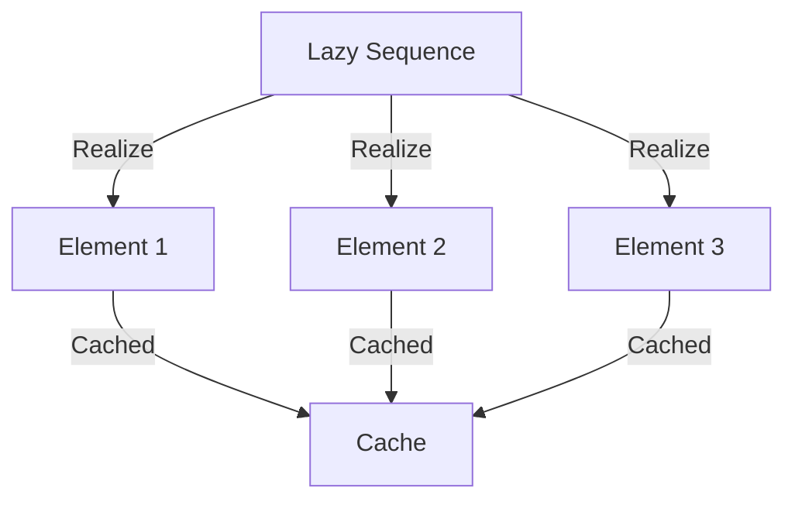
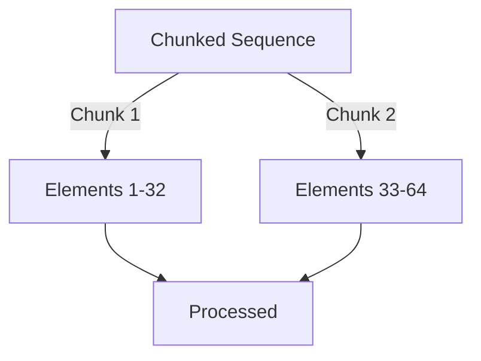

## 17.7 Performance Considerations with Lazy Sequences

In the realm of functional programming, lazy sequences are a powerful tool that allows developers to handle potentially infinite data structures efficiently. However, understanding the performance implications of using lazy sequences in Clojure is crucial for building scalable applications. In this section, we will delve into the nuances of lazy sequences, including realization overhead, chunked sequences, and strategies for efficient data processing.

### Realization Overhead

Lazy sequences in Clojure are not computed until their elements are needed. This deferred computation can be beneficial for performance, but it also introduces the concept of realization overhead. Realization occurs when a lazy sequence is accessed, causing its elements to be computed. If a sequence is realized multiple times, this can lead to redundant computations, impacting performance.

#### Example: Realization Overhead

Consider the following example where a lazy sequence is realized multiple times:

```clojure
(defn expensive-computation [x]
  (println "Computing..." x)
  (* x x))

(def lazy-seq (map expensive-computation (range 5)))

;; Realizing the sequence multiple times
(doseq [x lazy-seq] (println x))
(doseq [x lazy-seq] (println x))
```

In this code, the `expensive-computation` function is called twice for each element because the lazy sequence is realized twice. To mitigate this, we can use functions like `doall` to realize the sequence once and cache the results:

```clojure
(def realized-seq (doall lazy-seq))

;; Now, the sequence is realized only once
(doseq [x realized-seq] (println x))
(doseq [x realized-seq] (println x))
```

### Chunked Sequences

Clojure optimizes lazy sequences using chunking, which processes elements in groups rather than individually. This approach can improve performance by reducing the overhead of repeatedly invoking the sequence's generator function. However, chunking can introduce unexpected behavior, especially when side effects are involved.

#### Understanding Chunking

When a sequence is chunked, Clojure processes a fixed number of elements at once. For example, when mapping a function over a sequence, Clojure might process elements in chunks of 32. This means that even if you only request one element, the next 31 elements might also be realized.

#### Example: Chunked Sequences

```clojure
(defn side-effect [x]
  (println "Processing" x)
  x)

(def chunked-seq (map side-effect (range 100)))

;; Requesting the first element
(first chunked-seq)
```

In this example, although we only request the first element, the side effect prints messages for the first 32 elements due to chunking. Be mindful of this behavior when working with functions that have side effects.

### Avoiding Holding Onto Head of Sequence

One common pitfall with lazy sequences is holding onto the head of the sequence, which can prevent elements from being garbage collected. This can lead to memory leaks, especially with large sequences.

#### Best Practices for Managing Sequence Heads

To avoid holding onto the head of a sequence, ensure that you do not retain references to the sequence itself after processing. Use functions like `rest` or `next` to advance through the sequence without retaining the head.

#### Example: Avoiding Memory Leaks

```clojure
(defn process-sequence [seq]
  (loop [s seq]
    (when (seq s)
      (println (first s))
      (recur (rest s)))))

(process-sequence (range 1000000))
```

In this example, we use `rest` to process the sequence without holding onto the head, allowing elements to be garbage collected as they are processed.

### Eager Evaluation When Necessary

While lazy evaluation is beneficial, there are scenarios where eager evaluation is more appropriate. Functions like `doall` and `into` can be used to realize a lazy sequence eagerly, ensuring that all elements are computed at once.

#### Example: Eager Evaluation

```clojure
(defn eager-process [seq]
  (let [realized-seq (doall seq)]
    (doseq [x realized-seq]
      (println x))))

(eager-process (range 5))
```

In this example, `doall` is used to realize the sequence eagerly, ensuring that all elements are computed before processing.

### Transducers as an Alternative

Transducers provide a powerful alternative to lazy sequences, allowing for efficient data processing without creating intermediate collections. They enable function composition and transformation in a way that is both memory and performance efficient.

#### Introduction to Transducers

A transducer is a composable and reusable transformation that can be applied to a collection. Unlike lazy sequences, transducers do not produce intermediate collections, making them ideal for large data sets.

#### Example: Using Transducers

```clojure
(defn transduce-example []
  (let [xf (comp (map inc) (filter even?))]
    (transduce xf conj [] (range 10))))

(transduce-example)
```

In this example, we define a transducer `xf` that increments each number and filters even numbers. The `transduce` function applies this transformation efficiently without creating intermediate collections.

### Visual Aids

#### Diagram: Lazy Sequence Realization



*Diagram: This flowchart illustrates the realization and caching process of a lazy sequence in Clojure.*

#### Diagram: Chunked Sequence Processing



*Diagram: This flowchart demonstrates how Clojure processes chunked sequences in groups of elements.*

### References and Links

- [Clojure Official Documentation](https://clojure.org/reference)
- [Clojure Community Resources](https://clojure.org/community/resources)
- [Transitioning from OOP to Functional Programming](https://www.lispcast.com/oo-to-fp/)
- [Understanding Clojure's Chunked Sequences](https://clojure.org/reference/sequences#chunked-sequences)
- [Transducers in Clojure](https://clojure.org/reference/transducers)

### Knowledge Check

To reinforce your understanding of performance considerations with lazy sequences, try answering the following questions:

1. What is realization overhead, and how can it impact performance?
2. How does chunking optimize lazy sequences in Clojure?
3. Why is it important to avoid holding onto the head of a sequence?
4. When should you use eager evaluation functions like `doall`?
5. How do transducers improve performance compared to lazy sequences?

### Encouraging Engagement

Embracing lazy sequences and understanding their performance implications can be challenging, but with each step, you'll gain a deeper understanding and see tangible benefits in your codebase. Experiment with the examples provided, and consider how you can apply these concepts to your own projects.

### Test Your Knowledge: Performance Considerations with Lazy Sequences Quiz



### What is realization overhead in lazy sequences?

- [x] The cost of computing elements when they are accessed
- [ ] The memory usage of storing all elements in memory
- [ ] The time taken to define a lazy sequence
- [ ] The space required for intermediate collections

> **Explanation:** Realization overhead refers to the cost of computing elements in a lazy sequence when they are accessed, which can lead to redundant computations if not managed properly.

### How does chunking affect lazy sequences?

- [x] It processes elements in groups, improving performance
- [ ] It decreases the memory usage of sequences
- [ ] It ensures that all elements are computed eagerly
- [ ] It prevents side effects from occurring

> **Explanation:** Chunking processes elements in groups, reducing the overhead of repeatedly invoking the sequence's generator function, thus improving performance.

### Why should you avoid holding onto the head of a sequence?

- [x] To prevent memory leaks by allowing elements to be garbage collected
- [ ] To ensure all elements are computed eagerly
- [ ] To increase the speed of sequence processing
- [ ] To maintain the order of elements

> **Explanation:** Holding onto the head of a sequence can prevent elements from being garbage collected, leading to memory leaks, especially with large sequences.

### When is eager evaluation necessary?

- [x] When you need all elements computed at once
- [ ] When you want to delay computation as much as possible
- [ ] When working with infinite sequences
- [ ] When processing data in small chunks

> **Explanation:** Eager evaluation is necessary when you need all elements computed at once, which can be achieved using functions like `doall`.

### What advantage do transducers offer over lazy sequences?

- [x] They process data without creating intermediate collections
- [ ] They ensure all elements are computed eagerly
- [ ] They simplify the syntax of sequence operations
- [ ] They automatically parallelize data processing

> **Explanation:** Transducers process data efficiently without creating intermediate collections, making them ideal for large data sets.

### How can you mitigate realization overhead?

- [x] By caching realized sequences with `doall`
- [ ] By using chunked sequences exclusively
- [ ] By processing sequences in reverse order
- [ ] By avoiding the use of lazy sequences

> **Explanation:** Using `doall` to realize a sequence once and cache the results can mitigate realization overhead.

### What is a potential downside of chunked sequences?

- [x] They may realize more elements than needed, leading to unexpected side effects
- [ ] They decrease the overall performance of sequence processing
- [ ] They require more memory to store elements
- [ ] They are incompatible with eager evaluation

> **Explanation:** Chunked sequences may realize more elements than needed, which can lead to unexpected side effects, especially when side effects are involved.

### How do you avoid holding onto the head of a sequence?

- [x] By using `rest` or `next` to advance through the sequence
- [ ] By eagerly evaluating the entire sequence
- [ ] By processing elements in reverse order
- [ ] By using chunked sequences

> **Explanation:** Using `rest` or `next` allows you to advance through the sequence without retaining the head, enabling garbage collection of processed elements.

### What is the primary benefit of using transducers?

- [x] They allow for efficient data processing without intermediate collections
- [ ] They ensure all data is processed in parallel
- [ ] They automatically handle side effects
- [ ] They simplify sequence syntax

> **Explanation:** Transducers allow for efficient data processing without creating intermediate collections, which is beneficial for performance.

### True or False: Lazy sequences are always the best choice for data processing in Clojure.

- [ ] True
- [x] False

> **Explanation:** While lazy sequences are powerful, they are not always the best choice. In some cases, eager evaluation or transducers may be more appropriate for performance reasons.


