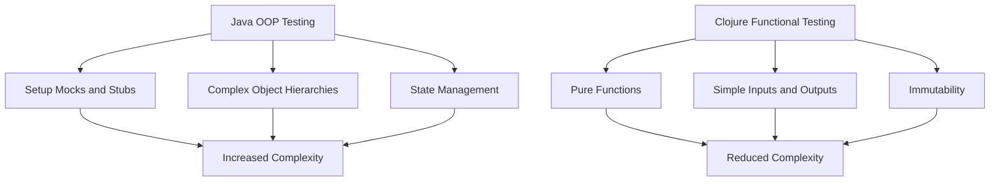

## 18.1 Benefits of Testing in Functional Programming

Functional programming, with its emphasis on pure functions and immutability, offers unique advantages when it comes to testing. In this section, we'll explore the benefits of testing in functional programming, particularly in the context of Clojure, a language that embodies these principles. We'll cover the predictability of pure functions, the simplification of test cases, the facilitation of refactoring, the role of tests as documentation, and the assurance of software quality.

### Predictability of Pure Functions

In functional programming, pure functions are the cornerstone of predictability. A pure function is one that, given the same input, will always produce the same output without causing any side effects. This deterministic behavior makes testing pure functions straightforward and reliable.

#### Characteristics of Pure Functions

1. **Deterministic Output**: Pure functions always produce the same output for the same input, eliminating the need for complex test setups.
2. **No Side Effects**: They do not alter any state or interact with external systems, which simplifies the testing process.

Consider the following Clojure example of a pure function:

```clojure
(defn add [a b]
  (+ a b))

;; Testing the pure function
(assert (= 5 (add 2 3))) ; This will always pass
```

In this example, the `add` function is pure because it simply returns the sum of its inputs without altering any external state. Testing such a function is straightforward, as it involves checking that the output matches the expected result for given inputs.

### Simplified Test Cases

Functional programming often requires fewer mocks and stubs compared to object-oriented programming (OOP). This is because functional code typically does not rely on mutable state or complex object hierarchies.

#### Benefits of Simplified Test Cases

- **Reduced Complexity**: Tests for functional code focus on inputs and outputs, avoiding the need for intricate setups.
- **Faster Test Execution**: Without the overhead of mocks and stubs, tests run faster and are easier to maintain.

Here's an example of a Clojure function that processes a list of numbers:

```clojure
(defn square-all [numbers]
  (map #(* % %) numbers))

;; Testing the function
(assert (= [1 4 9] (square-all [1 2 3])))
```

In this case, the `square-all` function processes a list of numbers by squaring each element. The test checks that the output matches the expected list of squared numbers. There is no need for mocks or stubs, as the function operates purely on its input.

### Facilitating Refactoring

A robust test suite is invaluable when refactoring code. In functional programming, where functions are often small and focused, refactoring can be done with confidence, knowing that the tests will catch any unintended changes in behavior.

#### The Role of Tests in Refactoring

- **Safety Net**: Tests provide a safety net that allows developers to make changes without fear of breaking existing functionality.
- **Encouragement of Iterative Improvement**: With a comprehensive test suite, developers are more likely to refactor and improve code quality over time.

Consider a scenario where we want to refactor a function to improve its performance:

```clojure
(defn sum [numbers]
  (reduce + numbers))

;; Refactored version using transducers
(defn sum-transducer [numbers]
  (transduce (map identity) + numbers))

;; Tests ensure both versions produce the same result
(assert (= (sum [1 2 3 4]) (sum-transducer [1 2 3 4])))
```

In this example, we've refactored the `sum` function to use a transducer for potentially better performance. The tests ensure that the refactored function behaves identically to the original, providing confidence in the change.

### Documentation Through Tests

Tests can serve as executable documentation, illustrating how functions are expected to behave. This is particularly valuable in functional programming, where functions are often composed to build more complex behavior.

#### Benefits of Tests as Documentation

- **Clarity**: Tests provide clear examples of how functions should be used and what their expected outputs are.
- **Living Documentation**: Unlike traditional documentation, tests are always up-to-date, as they must pass for the code to be considered correct.

Here's an example of using tests as documentation:

```clojure
(defn factorial [n]
  (reduce * (range 1 (inc n))))

;; Tests as documentation
(assert (= 1 (factorial 0)))  ; Factorial of 0 is 1
(assert (= 120 (factorial 5))) ; Factorial of 5 is 120
```

In this example, the tests for the `factorial` function serve as documentation, demonstrating the expected behavior for specific inputs.

### Quality Assurance

Testing is a critical component of quality assurance, ensuring that software is reliable and robust. In functional programming, where functions are often small and focused, testing can be more comprehensive and effective.

#### Ensuring Software Reliability

- **Comprehensive Coverage**: The modular nature of functional code allows for comprehensive test coverage, increasing confidence in software reliability.
- **Early Detection of Bugs**: By testing functions in isolation, bugs can be detected and fixed early in the development process.

Consider a complex data processing pipeline:

```clojure
(defn process-data [data]
  (->> data
       (filter even?)
       (map inc)
       (reduce +)))

;; Comprehensive tests ensure reliability
(assert (= 12 (process-data [1 2 3 4 5 6]))) ; Only even numbers are processed
```

In this example, the `process-data` function processes a list of numbers, filtering, mapping, and reducing them. Comprehensive tests ensure that each step of the pipeline behaves as expected, contributing to the overall reliability of the software.

### Try It Yourself

To deepen your understanding of the benefits of testing in functional programming, try modifying the examples provided. For instance, change the `square-all` function to cube the numbers instead of squaring them, and update the tests accordingly. Observe how the simplicity of functional code makes such changes straightforward and easy to verify.

### Visual Aids

To further illustrate the concepts discussed, let's include a diagram comparing the testing process in Java OOP and Clojure functional programming.



**Diagram Description**: This diagram illustrates the differences between testing in Java OOP and Clojure functional programming. In Java OOP, testing often involves setting up mocks and stubs, managing complex object hierarchies, and dealing with mutable state, leading to increased complexity. In contrast, Clojure's functional approach focuses on pure functions, simple inputs and outputs, and immutability, resulting in reduced complexity.

### References and Links

For further reading on testing in functional programming and Clojure, consider the following resources:

- [Clojure Official Documentation](https://clojure.org/reference)
- [Clojure Community Resources](https://clojure.org/community/resources)
- [Transitioning from OOP to Functional Programming](https://www.lispcast.com/oo-to-fp/)
- [Clojure Testing Libraries](https://clojure.org/guides/testing)

### Knowledge Check

To reinforce your understanding of the benefits of testing in functional programming, consider the following questions:

- What are the characteristics of pure functions that make them easy to test?
- How do tests serve as documentation in functional programming?
- Why is a robust test suite important for refactoring code?
- How does functional programming simplify test cases compared to OOP?

### Encouraging Engagement

Embracing functional programming and its testing methodologies can be challenging, but with each step, you'll gain a deeper understanding and see tangible benefits in your codebase. Remember, the key to mastering these concepts is practice and experimentation. Don't hesitate to modify the examples and explore how changes affect the tests and overall code behavior.

## **Test Your Knowledge: Benefits of Testing in Functional Programming Quiz**



### What characteristic of pure functions makes them easy to test?

- [x] Deterministic output
- [ ] Complex dependencies
- [ ] Mutable state
- [ ] Random behavior

> **Explanation:** Pure functions always produce the same output for the same input, making them easy to test due to their deterministic nature.

### How do tests serve as documentation in functional programming?

- [x] They illustrate expected behavior
- [ ] They replace all comments
- [ ] They are not useful as documentation
- [ ] They only show incorrect usage

> **Explanation:** Tests provide clear examples of how functions should behave, serving as executable documentation of code behavior.

### Why is a robust test suite important for refactoring code?

- [x] It provides a safety net for changes
- [ ] It makes code harder to understand
- [ ] It slows down development
- [ ] It increases complexity

> **Explanation:** A robust test suite acts as a safety net, allowing developers to refactor code with confidence, knowing that tests will catch any unintended changes.

### What is a benefit of simplified test cases in functional programming?

- [x] Reduced complexity
- [ ] Increased use of mocks
- [ ] More complex setups
- [ ] Slower test execution

> **Explanation:** Functional programming often requires fewer mocks and stubs, reducing test complexity and making them easier to maintain.

### How does functional programming ensure software reliability?

- [x] Comprehensive test coverage
- [ ] Ignoring edge cases
- [x] Early detection of bugs
- [ ] Avoiding tests

> **Explanation:** The modular nature of functional code allows for comprehensive test coverage and early detection of bugs, ensuring software reliability.

### What is the role of immutability in functional testing?

- [x] Simplifies test cases
- [ ] Complicates state management
- [ ] Requires more mocks
- [ ] Increases test execution time

> **Explanation:** Immutability ensures that functions do not alter state, simplifying test cases by focusing only on inputs and outputs.

### How does functional programming facilitate refactoring?

- [x] Encourages iterative improvement
- [ ] Discourages code changes
- [x] Provides a safety net
- [ ] Increases risk of errors

> **Explanation:** With a comprehensive test suite, developers are encouraged to iteratively improve and refactor code, knowing that tests will catch any errors.

### What is a key advantage of testing pure functions?

- [x] Predictability
- [ ] Complexity
- [ ] Random outputs
- [ ] Side effects

> **Explanation:** Pure functions are predictable, always producing the same output for the same input, which makes them easy to test.

### How do tests contribute to quality assurance?

- [x] Ensuring reliability
- [ ] Ignoring failures
- [ ] Reducing test coverage
- [ ] Increasing bugs

> **Explanation:** Testing is critical for quality assurance, ensuring that software is reliable and robust by detecting and fixing bugs early.

### True or False: In functional programming, tests can serve as living documentation.

- [x] True
- [ ] False

> **Explanation:** Tests in functional programming act as living documentation, providing up-to-date examples of expected function behavior.


