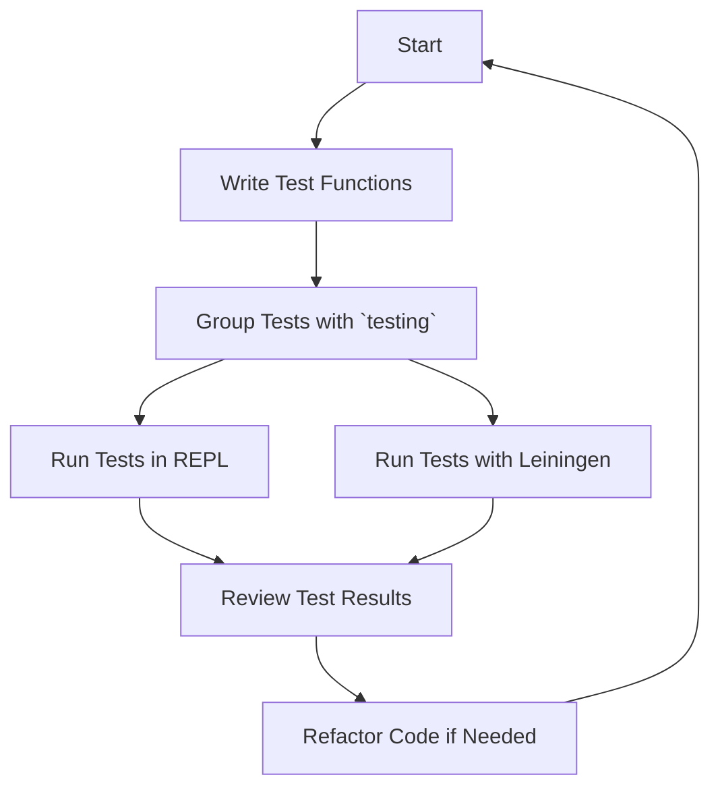

## 18.2 Writing Unit Tests with `clojure.test`

Testing is a crucial part of software development, ensuring that your code behaves as expected and remains robust as it evolves. In this section, we'll explore how to write unit tests in Clojure using its built-in testing framework, `clojure.test`. We'll cover the core features, demonstrate writing test functions, organizing and running tests, and share best practices for maintaining a clean and effective test suite.

### Getting Started with `clojure.test`

Clojure's `clojure.test` is a lightweight and powerful testing framework that provides essential tools for writing and running tests. It is integrated into the Clojure standard library, making it readily available without the need for additional dependencies. The framework supports a range of features, including defining test functions, performing assertions, and organizing tests into logical groups.

#### Core Features of `clojure.test`

- **Test Functions**: Define test cases using the `deftest` macro.
- **Assertions**: Verify expected outcomes with the `is` macro.
- **Grouping**: Organize related tests using `testing` blocks.
- **Fixtures**: Set up and tear down test environments with fixtures.
- **Reporting**: Generate detailed reports of test results.
- **Integration**: Seamlessly integrate with build tools like Leiningen for automated testing.

### Writing Test Functions

In `clojure.test`, test functions are defined using the `deftest` macro. Each test function encapsulates a specific unit of functionality you wish to verify. Within these functions, you can use the `is` macro to assert expected outcomes.

#### Example of Writing a Test Function

```clojure
(ns myapp.core-test
  (:require [clojure.test :refer :all]
            [myapp.core :refer :all]))

(deftest addition-test
  (is (= 4 (add 2 2)))
  (is (= 0 (add -1 1))))
```

In this example, we define a test namespace `myapp.core-test` and require the `clojure.test` library. We then define a test function `addition-test` using `deftest`. Inside this function, we use the `is` macro to assert that the `add` function behaves as expected.

#### Key Points

- **`deftest`**: Use this macro to define a new test function.
- **`is`**: Utilize this macro to perform assertions. It evaluates an expression and checks if it returns true.

### Grouping Tests

Organizing tests into logical groups can enhance readability and maintainability. `clojure.test` provides the `testing` macro to group related assertions within a test function.

#### Example of Grouping Tests

```clojure
(deftest arithmetic-tests
  (testing "Addition"
    (is (= 4 (add 2 2)))
    (is (= 0 (add -1 1))))
  
  (testing "Subtraction"
    (is (= 0 (subtract 2 2)))
    (is (= -2 (subtract 0 2)))))
```

Here, we group tests related to addition and subtraction using `testing` blocks. This approach clarifies the purpose of each set of assertions and makes the test output more informative.

### Running Tests

Running tests is an integral part of the development workflow. Clojure offers multiple ways to execute tests, including directly from the REPL or using build tools like Leiningen.

#### Running Tests in the REPL

To run tests in the REPL, load the test namespace and use the `run-tests` function:

```clojure
(require '[clojure.test :refer :all])
(run-tests 'myapp.core-test)
```

This command executes all tests defined in the `myapp.core-test` namespace and outputs the results in the REPL.

#### Integrating with Leiningen

Leiningen is a popular build tool for Clojure projects. It provides built-in support for running tests with the `lein test` command:

```shell
lein test
```

This command runs all tests in the project, providing a summary of the results.

### Best Practices for Writing Unit Tests

Writing clear and maintainable unit tests is essential for long-term project success. Here are some best practices to consider:

- **Keep Tests Focused**: Each test should verify a single piece of functionality.
- **Use Descriptive Names**: Name test functions and `testing` blocks clearly to convey their purpose.
- **Avoid Side Effects**: Ensure tests are independent and do not rely on external state.
- **Leverage Fixtures**: Use fixtures to set up and tear down test environments when necessary.
- **Run Tests Frequently**: Integrate tests into your development workflow to catch issues early.
- **Document Tests**: Include comments to explain complex test logic or assumptions.

### Try It Yourself

To solidify your understanding, try modifying the examples above. Add new test cases, introduce intentional errors, and observe how `clojure.test` reports them. Experiment with grouping tests and running them in different environments.

### Visual Aids

Below is a simple flowchart illustrating the process of writing and running tests with `clojure.test`:



**Diagram Description**: This flowchart outlines the iterative process of writing, grouping, running, and reviewing tests using `clojure.test`.

### References and Links

- [Clojure Official Documentation](https://clojure.org/reference)
- [Clojure Community Resources](https://clojure.org/community/resources)
- [Leiningen Documentation](https://leiningen.org/)
- [Transitioning from OOP to Functional Programming](https://www.lispcast.com/oo-to-fp/)

### Knowledge Check

Test your understanding of writing unit tests with `clojure.test` by answering the following questions.

## **Test Your Knowledge: Writing Unit Tests with `clojure.test` Quiz**



### What macro is used to define a test function in `clojure.test`?

- [x] deftest
- [ ] defn
- [ ] defmacro
- [ ] test

> **Explanation:** `deftest` is the macro used to define test functions in `clojure.test`.

### Which macro is used to perform assertions in `clojure.test`?

- [ ] assert
- [x] is
- [ ] check
- [ ] verify

> **Explanation:** The `is` macro is used to perform assertions in `clojure.test`.

### How can you group related tests in a `clojure.test` test function?

- [ ] Using `group`
- [x] Using `testing`
- [ ] Using `assert`
- [ ] Using `deftest`

> **Explanation:** The `testing` macro is used to group related tests within a `deftest`.

### What command can you use to run all tests in a Clojure project using Leiningen?

- [ ] lein run
- [x] lein test
- [ ] lein compile
- [ ] lein check

> **Explanation:** `lein test` runs all tests in a Clojure project managed by Leiningen.

### Which of the following is a best practice for writing unit tests?

- [x] Keep tests focused on a single functionality
- [ ] Write tests that depend on external state
- [ ] Use vague test names
- [ ] Avoid running tests frequently

> **Explanation:** Keeping tests focused on a single functionality is a best practice for writing unit tests.

### What is the purpose of using fixtures in `clojure.test`?

- [x] To set up and tear down test environments
- [ ] To define test functions
- [ ] To perform assertions
- [ ] To group related tests

> **Explanation:** Fixtures are used to set up and tear down test environments in `clojure.test`.

### How can you execute tests directly in the REPL?

- [x] Use `run-tests` function
- [ ] Use `lein test`
- [ ] Use `execute-tests`
- [ ] Use `test-all`

> **Explanation:** The `run-tests` function is used to execute tests directly in the REPL.

### What is a key benefit of running tests frequently?

- [x] To catch issues early in development
- [ ] To increase code complexity
- [ ] To reduce code readability
- [ ] To avoid refactoring

> **Explanation:** Running tests frequently helps catch issues early in development.

### What does the `testing` macro do in a test function?

- [x] Groups related assertions
- [ ] Defines a test function
- [ ] Performs assertions
- [ ] Sets up fixtures

> **Explanation:** The `testing` macro groups related assertions within a test function.

### True or False: `clojure.test` is a third-party library that needs to be added to a Clojure project.

- [ ] True
- [x] False

> **Explanation:** False. `clojure.test` is a built-in testing framework in Clojure.



By mastering `clojure.test`, you'll be well-equipped to ensure your Clojure applications are reliable and maintainable. Embrace the power of testing and see how it transforms your development process.
