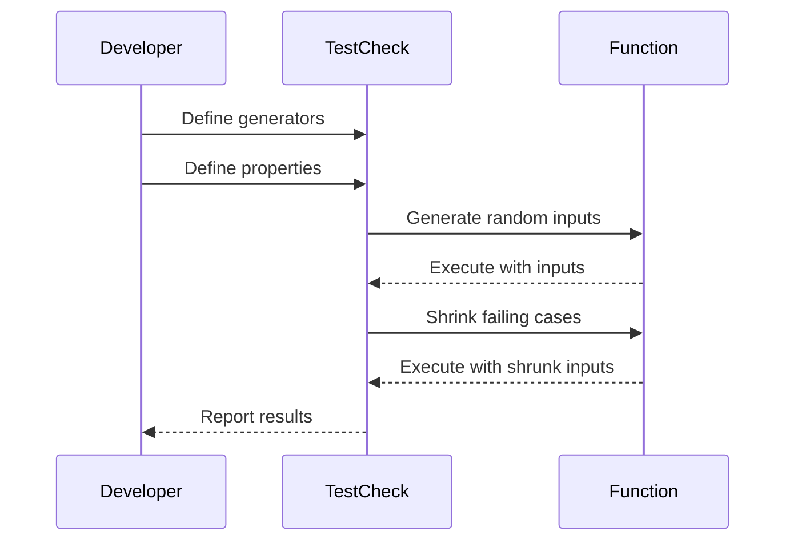

## 18.3 Property-Based Testing with `test.check`

In the realm of functional programming, testing is not just a necessity but an opportunity to embrace the declarative nature of the paradigm. Property-based testing, facilitated by Clojure's `test.check` library, allows us to specify the properties that should hold true for all inputs, rather than testing with a fixed set of examples. This approach uncovers edge cases and unexpected behaviors that traditional example-based tests might miss.

### Exploring Generative Testing

Generative testing is a powerful concept where tests are generated based on properties rather than specific examples. This technique is particularly useful in functional programming, where functions are expected to exhibit consistent behavior across a wide range of inputs.

#### What is Property-Based Testing?

Property-based testing involves specifying properties that your functions should satisfy, and then automatically generating random test cases to verify these properties. This contrasts with traditional unit testing, where you manually specify each test case. The key advantage is that property-based testing can uncover edge cases and unexpected behavior that you might not think to test explicitly.

#### Why Use `test.check`?

`test.check` is a Clojure library for property-based testing that integrates seamlessly with Clojure's functional paradigm. It provides tools to define properties, generate random inputs, and shrink failing cases to their simplest form, making debugging more manageable.

### Defining Generators

Generators are at the heart of property-based testing. They define the space of possible inputs for your tests. `test.check` provides a variety of built-in generators and allows you to compose custom ones.

#### Built-in Generators

`test.check` includes a rich set of built-in generators for common data types:

- **Integers**: `gen/int` generates random integers.
- **Strings**: `gen/string` generates random strings.
- **Collections**: `gen/vector` and `gen/list` generate random vectors and lists.

Here's a simple example using `gen/int`:

```clojure
(require '[clojure.test.check.generators :as gen])

(def int-gen (gen/int))
```

#### Composing Custom Generators

Sometimes, you'll need to create custom generators to suit your specific testing needs. You can compose generators using functions like `gen/fmap`, `gen/bind`, and `gen/tuple`.

For example, to generate a pair of integers where the second is always greater than the first:

```clojure
(def pair-gen
  (gen/bind (gen/tuple (gen/int) (gen/int))
            (fn [[a b]]
              (gen/return [(min a b) (max a b)]))))
```

This generator uses `gen/tuple` to create a pair of integers and `gen/bind` to ensure the second integer is greater than the first.

### Writing Properties

Once you have defined your generators, the next step is to specify the properties that your function should satisfy. A property is a predicate that should return true for all generated inputs.

#### Defining Properties

Properties are defined using the `for-all` macro, which takes a generator and a predicate function. Here's a simple property that tests the commutativity of addition:

```clojure
(require '[clojure.test.check :as tc])
(require '[clojure.test.check.properties :as prop])

(def addition-commutative
  (prop/for-all [a gen/int
                 b gen/int]
    (= (+ a b) (+ b a))))
```

This property states that for all integers `a` and `b`, the sum `(+ a b)` should equal `(+ b a)`.

#### Running Property Tests

To run a property test, use the `quick-check` function, which takes a property and the number of tests to run:

```clojure
(tc/quick-check 1000 addition-commutative)
```

This command runs the `addition-commutative` property 1000 times with randomly generated inputs.

### Shrinking Failing Cases

One of the standout features of `test.check` is its ability to shrink failing test cases. When a property fails, `test.check` attempts to find the smallest input that still causes the failure, making it easier to diagnose the problem.

#### How Shrinking Works

Shrinking is the process of simplifying a failing test case to its minimal form. This is crucial for debugging, as it reduces the complexity of the failing input and helps you focus on the root cause.

Consider a property that fails for large integers. `test.check` will automatically try smaller integers to see if the property still fails, eventually presenting you with the smallest failing case.

#### Example of Shrinking

Let's modify our previous example to demonstrate shrinking. Suppose we have a property that incorrectly assumes all integers are non-negative:

```clojure
(def non-negative
  (prop/for-all [a gen/int]
    (>= a 0)))

(tc/quick-check 1000 non-negative)
```

When this property fails, `test.check` will shrink the failing input to the smallest negative integer, typically `-1`, helping you quickly identify the flaw in your assumption.

### Practical Examples

Let's explore some practical examples to illustrate the power of property-based testing with `test.check`.

#### Example 1: Testing a Sorting Function

Suppose we have a function `sort` that sorts a list of integers. We want to verify that the function satisfies two properties:

1. The output list is sorted.
2. The output list is a permutation of the input list.

Here's how we can define these properties:

```clojure
(def sorted-property
  (prop/for-all [v (gen/vector gen/int)]
    (let [sorted-v (sort v)]
      (and (apply <= sorted-v)
           (= (frequencies v) (frequencies sorted-v))))))
```

This property uses `gen/vector` to generate random vectors of integers and checks that the sorted vector is non-decreasing and has the same element frequencies as the input vector.

#### Example 2: Testing a String Reversal Function

Consider a function `reverse-string` that reverses a string. We can define a property to test that reversing a string twice returns the original string:

```clojure
(def reverse-property
  (prop/for-all [s gen/string]
    (= s (reverse-string (reverse-string s)))))
```

This property uses `gen/string` to generate random strings and verifies that double reversal yields the original string.

### Try It Yourself

Experiment with the examples provided, and try modifying the generators and properties to test different functions. For instance, create a property to test that the length of a list remains unchanged after sorting.

### Visual Aids

To better understand the flow of property-based testing, let's visualize the process using a sequence diagram.



**Diagram Description:** This sequence diagram illustrates the interaction between the developer, `test.check`, and the function under test. The developer defines generators and properties, `test.check` generates random inputs and executes the function, and if a failure occurs, it shrinks the inputs and reports the results.

### References and Links

- [Clojure Official Documentation](https://clojure.org/reference)
- [Clojure Community Resources](https://clojure.org/community/resources)
- [test.check GitHub Repository](https://github.com/clojure/test.check)
- [Transitioning from OOP to Functional Programming](https://www.lispcast.com/oo-to-fp/)

### Knowledge Check

Let's solidify your understanding of property-based testing with a few questions:

1. What is the primary advantage of property-based testing over traditional example-based testing?
2. How does `test.check` help in debugging failing test cases?
3. Define a property to test that reversing a list twice yields the original list.
4. What role do generators play in property-based testing?

### Encouraging Engagement

Embracing property-based testing can significantly enhance the robustness of your code. As you experiment with `test.check`, you'll gain a deeper understanding of your code's behavior and uncover edge cases that might otherwise go unnoticed.

### Best Practices for Tags

- Use specific and relevant tags such as "Clojure", "Functional Programming", "Testing", "Property-Based Testing", "test.check", "Generative Testing", "Debugging", and "Software Quality".

### Test Your Knowledge: Property-Based Testing with `test.check` Quiz



### What is the primary advantage of property-based testing?

- [x] It can uncover edge cases and unexpected behaviors.
- [ ] It is easier to write than example-based tests.
- [ ] It requires less setup than unit tests.
- [ ] It guarantees bug-free code.

> **Explanation:** Property-based testing generates a wide range of inputs, uncovering edge cases and unexpected behaviors that might not be covered by example-based tests.

### How does `test.check` simplify debugging?

- [x] By shrinking failing inputs to minimal examples.
- [ ] By providing detailed error messages.
- [ ] By logging all test inputs.
- [ ] By automatically fixing the code.

> **Explanation:** `test.check` simplifies debugging by shrinking failing inputs to their minimal form, helping you identify the root cause of the failure.

### Which function is used to define properties in `test.check`?

- [x] `prop/for-all`
- [ ] `gen/tuple`
- [ ] `tc/quick-check`
- [ ] `gen/fmap`

> **Explanation:** `prop/for-all` is used to define properties in `test.check`, specifying the generators and the predicate that should hold true.

### What is the purpose of generators in property-based testing?

- [x] To define the space of possible inputs for tests.
- [ ] To log test results.
- [ ] To provide default values for functions.
- [ ] To optimize code performance.

> **Explanation:** Generators define the space of possible inputs for tests, allowing `test.check` to generate random test cases.

### How can you test that reversing a list twice yields the original list?

- [x] Define a property using `prop/for-all` and `gen/list`.
- [ ] Use a unit test with a fixed list.
- [ ] Log the list before and after reversal.
- [ ] Use a debugger to step through the code.

> **Explanation:** You can define a property using `prop/for-all` and `gen/list` to test that reversing a list twice yields the original list.

### What is the role of shrinking in property-based testing?

- [x] To simplify failing test cases for easier debugging.
- [ ] To generate larger test cases.
- [ ] To improve test performance.
- [ ] To automatically fix failing tests.

> **Explanation:** Shrinking simplifies failing test cases to their minimal form, making it easier to identify the root cause of the failure.

### How does `test.check` integrate with Clojure's functional paradigm?

- [x] By providing tools to define properties and generate random inputs.
- [ ] By replacing all unit tests.
- [ ] By logging all function calls.
- [ ] By optimizing code execution.

> **Explanation:** `test.check` integrates with Clojure's functional paradigm by providing tools to define properties and generate random inputs for testing.

### Which of the following is a built-in generator in `test.check`?

- [x] `gen/int`
- [ ] `gen/char`
- [ ] `gen/float`
- [ ] `gen/double`

> **Explanation:** `gen/int` is a built-in generator in `test.check` for generating random integers.

### What is the benefit of using `gen/bind` in custom generators?

- [x] It allows for dependent generation of values.
- [ ] It logs generated values.
- [ ] It improves test performance.
- [ ] It simplifies generator definitions.

> **Explanation:** `gen/bind` allows for dependent generation of values, enabling more complex and custom generators.

### True or False: Property-based testing guarantees bug-free code.

- [ ] True
- [x] False

> **Explanation:** While property-based testing can uncover many edge cases and unexpected behaviors, it does not guarantee bug-free code.



By mastering property-based testing with `test.check`, you'll enhance your ability to write robust, reliable Clojure applications. Keep exploring and experimenting with different properties and generators to fully leverage the potential of this powerful testing approach.
