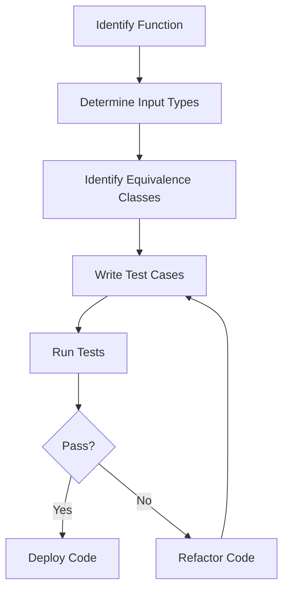

## 18.4 Testing Pure Functions Effectively

Testing pure functions is a cornerstone of functional programming, offering predictability and reliability. Pure functions, by definition, are deterministic and free of side effects, making them ideal candidates for thorough testing. In this section, we will explore various strategies and tools for effectively testing pure functions in Clojure.

### Test Coverage Strategies

#### Importance of Testing Typical and Edge Cases

Testing pure functions involves ensuring that they behave correctly across a range of inputs. This includes both typical cases, which represent common scenarios, and edge cases, which test the boundaries of input data.

- **Typical Cases:** These are the standard inputs that your function is expected to handle. For example, if you have a function that sums a list of numbers, a typical case would be a list of positive integers.
  
- **Edge Cases:** These involve unusual or extreme inputs that might challenge the function’s logic. Examples include empty lists, very large numbers, or negative numbers. Testing edge cases helps ensure that your function can handle unexpected inputs gracefully.

```clojure
;; Example of testing typical and edge cases for a sum function
(defn sum [numbers]
  (reduce + numbers))

;; Typical case: A list of positive integers
(assert (= 6 (sum [1 2 3])))

;; Edge case: An empty list
(assert (= 0 (sum [])))

;; Edge case: A list with negative numbers
(assert (= -1 (sum [1 -2])))

;; Edge case: A list with large numbers
(assert (= 10000000000 (sum [5000000000 5000000000])))
```

### Equivalence Classes

Equivalence class testing involves dividing input data into partitions where the function is expected to behave similarly. By testing one representative from each class, you can efficiently cover a wide range of inputs.

- **Identify Equivalence Classes:** Determine the different categories of input data that your function can accept. For instance, if a function processes strings, equivalence classes might include empty strings, single-character strings, and multi-character strings.

- **Test Representatives:** Select a representative input from each class to test. This reduces the number of test cases while ensuring comprehensive coverage.

```clojure
;; Example of equivalence class testing for a string reversal function
(defn reverse-string [s]
  (apply str (reverse s)))

;; Equivalence class: Empty string
(assert (= "" (reverse-string "")))

;; Equivalence class: Single-character string
(assert (= "a" (reverse-string "a")))

;; Equivalence class: Multi-character string
(assert (= "cba" (reverse-string "abc")))
```

### Testing Idempotence and Commutativity

Certain pure functions exhibit properties like idempotence and commutativity, which can be leveraged to write more robust tests.

#### Idempotence

A function is idempotent if applying it multiple times yields the same result as applying it once. Testing for idempotence involves verifying that repeated applications do not change the output.

```clojure
;; Example of testing idempotence for a function that converts text to uppercase
(defn to-uppercase [s]
  (.toUpperCase s))

;; Test for idempotence
(let [result (to-uppercase "hello")]
  (assert (= result (to-uppercase result))))
```

#### Commutativity

A function is commutative if the order of its inputs does not affect the result. This property is common in mathematical operations like addition and multiplication.

```clojure
;; Example of testing commutativity for an addition function
(defn add [a b]
  (+ a b))

;; Test for commutativity
(assert (= (add 1 2) (add 2 1)))
```

### Example-Driven Tests

Example-driven testing involves writing clear and concise test cases that demonstrate the expected behavior of a function. This approach helps in documenting the function’s intended use and can serve as a guide for future development.

```clojure
;; Example-driven test for a factorial function
(defn factorial [n]
  (reduce * (range 1 (inc n))))

;; Example tests
(assert (= 1 (factorial 0)))  ;; Factorial of 0 is 1
(assert (= 1 (factorial 1)))  ;; Factorial of 1 is 1
(assert (= 2 (factorial 2)))  ;; Factorial of 2 is 2
(assert (= 6 (factorial 3)))  ;; Factorial of 3 is 6
(assert (= 24 (factorial 4))) ;; Factorial of 4 is 24
```

### Automated Testing Tools

Automated testing tools can greatly enhance the efficiency and effectiveness of testing pure functions. In Clojure, tools like [Speclj](http://speclj.com/) provide a framework for behavior-driven development (BDD), allowing you to write tests that describe the behavior of your functions in a human-readable format.

#### Using Speclj for BDD

Speclj is a testing framework inspired by RSpec, designed for Clojure. It allows you to write specifications for your functions, making your tests more expressive and easier to understand.

```clojure
;; Example of using Speclj to test a simple function
(ns example.core-spec
  (:require [speclj.core :refer :all]
            [example.core :refer :all]))

(describe "sum"
  (it "returns the sum of a list of numbers"
    (should= 6 (sum [1 2 3])))

  (it "returns 0 for an empty list"
    (should= 0 (sum [])))

  (it "handles negative numbers"
    (should= -1 (sum [1 -2]))))
```

### Try It Yourself

Experiment with the provided code examples by modifying the inputs and observing the results. Try adding new test cases for additional edge cases or equivalence classes. This hands-on approach will deepen your understanding of testing pure functions.

### Visual Aids

To better understand the concepts of testing pure functions, consider the following diagram that illustrates the flow of data through a typical testing process:



*Diagram: The process of testing pure functions, from identifying the function to deploying the code.*

### References and Links

- [Clojure Official Documentation](https://clojure.org/reference)
- [Speclj](http://speclj.com/)
- [Transitioning from OOP to Functional Programming](https://www.lispcast.com/oo-to-fp/)
- [Clojure Community Resources](https://clojure.org/community/resources)

### Knowledge Check

#### Questions

1. What is the importance of testing both typical and edge cases in pure functions?
2. How do equivalence classes help in testing pure functions?
3. Explain the property of idempotence and how it can be tested.
4. Describe commutativity and provide an example of a commutative function.
5. How does example-driven testing benefit the development process?
6. What are some advantages of using automated testing tools like Speclj?
7. How can you test a function for idempotence using Clojure?
8. Provide an example of a function that exhibits commutativity.
9. What role do visual aids play in understanding testing processes?
10. How can you leverage the Clojure community for better testing practices?

### Encouraging Engagement

Embracing functional programming and testing pure functions can be challenging, but with each step, you'll gain a deeper understanding and see tangible benefits in your codebase. Keep experimenting, learning, and engaging with the Clojure community to enhance your skills.

### Summary

Testing pure functions effectively involves understanding and applying various strategies, such as testing typical and edge cases, identifying equivalence classes, and leveraging properties like idempotence and commutativity. Automated testing tools like Speclj can further enhance your testing process, making it more efficient and expressive. By mastering these techniques, you'll ensure that your Clojure applications are robust, reliable, and maintainable.

## **Test Your Knowledge: Testing Pure Functions Effectively Quiz**



### What is the importance of testing both typical and edge cases in pure functions?

- [x] To ensure the function behaves correctly across a range of inputs
- [ ] To make the code more complex
- [ ] To increase the number of test cases
- [ ] To focus only on common scenarios

> **Explanation:** Testing both typical and edge cases ensures that the function handles a wide range of inputs, including unexpected or extreme ones, thereby increasing reliability.

### How do equivalence classes help in testing pure functions?

- [x] By reducing the number of test cases needed
- [ ] By increasing test complexity
- [x] By covering a wide range of input scenarios
- [ ] By focusing only on edge cases

> **Explanation:** Equivalence classes allow you to test one representative from each class, efficiently covering a wide range of inputs without excessive test cases.

### Explain the property of idempotence and how it can be tested.

- [x] Idempotence means multiple applications of a function yield the same result
- [ ] Idempotence means the function can handle any input
- [ ] Idempotence means the function is commutative
- [ ] Idempotence means the function is associative

> **Explanation:** Idempotence ensures that repeated applications of a function do not change the output, which can be tested by applying the function multiple times and checking for consistency.

### Describe commutativity and provide an example of a commutative function.

- [x] Commutativity means the order of inputs does not affect the result
- [ ] Commutativity means the function is idempotent
- [ ] Commutativity means the function is associative
- [ ] Commutativity means the function is reversible

> **Explanation:** Commutative functions, like addition, produce the same result regardless of the order of inputs, e.g., `(+ 1 2)` equals `(+ 2 1)`.

### How does example-driven testing benefit the development process?

- [x] By providing clear and concise test cases
- [ ] By making tests more complex
- [x] By documenting expected behavior
- [ ] By increasing test execution time

> **Explanation:** Example-driven testing offers clear documentation of expected behavior and helps guide future development with concise test cases.

### What are some advantages of using automated testing tools like Speclj?

- [x] They facilitate behavior-driven development
- [ ] They make tests more difficult to understand
- [x] They provide a framework for expressive tests
- [ ] They increase manual testing requirements

> **Explanation:** Tools like Speclj support behavior-driven development, allowing for expressive and human-readable tests that describe function behavior.

### How can you test a function for idempotence using Clojure?

- [x] By applying the function multiple times and checking for consistency
- [ ] By testing with random inputs
- [ ] By ensuring the function is commutative
- [ ] By using complex data structures

> **Explanation:** Testing for idempotence involves applying the function multiple times and verifying that the result remains the same.

### Provide an example of a function that exhibits commutativity.

- [x] Addition
- [ ] Subtraction
- [x] Multiplication
- [ ] Division

> **Explanation:** Addition and multiplication are commutative operations, where the order of inputs does not affect the result.

### What role do visual aids play in understanding testing processes?

- [x] They provide a clear representation of the process
- [ ] They make the process more complicated
- [x] They enhance understanding
- [ ] They replace written documentation

> **Explanation:** Visual aids offer a clear and concise representation of testing processes, aiding understanding and retention.

### How can you leverage the Clojure community for better testing practices?

- [x] By engaging with community resources and discussions
- [ ] By avoiding external input
- [ ] By focusing solely on personal experience
- [ ] By ignoring community tools

> **Explanation:** Engaging with the Clojure community provides access to shared knowledge, resources, and tools that can enhance testing practices.


