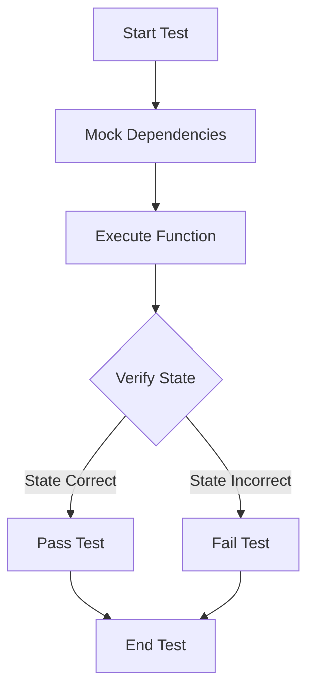

## 18.5 Approaches to Testing Side Effects and State

In functional programming, pure functions are the cornerstone of testable and maintainable code. However, real-world applications often involve side effects and state changes, which introduce complexities in testing. In this section, we explore various approaches to effectively test side effects and state in Clojure, leveraging its functional paradigms and rich ecosystem.

### Challenges of Testing Side Effects

Side effects are actions that go beyond returning a value, such as modifying a database, writing to a file, or sending a network request. Testing these actions requires strategies that isolate the side effects to ensure that tests remain reliable and deterministic.

#### Mocking External Systems

Mocking is a technique used to simulate external systems, allowing you to test your code without relying on the actual systems. This is crucial for testing interactions with databases, file systems, or network services.

**Example: Mocking a Database Call**

Suppose we have a function that retrieves user data from a database:

```clojure
(defn fetch-user [db user-id]
  ;; Simulate a database call
  (get db user-id))
```

To test this function without a real database, we can mock the database:

```clojure
(deftest test-fetch-user
  (let [mock-db {:user-1 {:name "Alice" :age 30}
                 :user-2 {:name "Bob" :age 25}}]
    (is (= {:name "Alice" :age 30} (fetch-user mock-db :user-1)))))
```

**Highlight:** The `mock-db` simulates the database, allowing us to verify the function's behavior without a real database.

#### State Verification

In Clojure, state is often managed using atoms, refs, and agents. Testing state changes involves verifying the state before and after operations.

**Example: Verifying State with Atoms**

Consider a simple counter implemented with an atom:

```clojure
(def counter (atom 0))

(defn increment-counter []
  (swap! counter inc))
```

To test this, we can verify the state of the atom before and after the operation:

```clojure
(deftest test-increment-counter
  (reset! counter 0) ; Ensure initial state
  (increment-counter)
  (is (= 1 @counter)))
```

**Highlight:** The `reset!` function ensures the atom is in a known state before the test, and `swap!` is used to change the state.

#### Time-Based Testing

Functions that depend on time can be challenging to test. Clojure provides libraries like `clj-time` and `java-time` to manipulate time for testing purposes.

**Example: Testing Time-Dependent Functions**

Suppose we have a function that checks if the current time is during office hours:

```clojure
(defn office-hours? [time]
  (let [hour (.getHour time)]
    (and (>= hour 9) (< hour 17))))
```

To test this function, we can use a fixed time:

```clojure
(deftest test-office-hours
  (let [test-time (java.time.LocalTime/of 10 0)]
    (is (office-hours? test-time))))
```

**Highlight:** Using a fixed `test-time` ensures the test is deterministic.

#### Use of Fixtures

Fixtures in `clojure.test` are used to set up and tear down test environments, ensuring that tests run in a controlled context.

**Example: Using Fixtures**

Let's say we have a series of tests that require a temporary directory:

```clojure
(use-fixtures :each
  (fn [f]
    (let [temp-dir (java.nio.file.Files/createTempDirectory "test-dir")]
      (try
        (f)
        (finally
          (java.nio.file.Files/deleteIfExists temp-dir))))))
```

**Highlight:** The fixture creates a temporary directory for each test and ensures it is cleaned up afterwards.

### Practical Strategies for Testing Side Effects and State

1. **Isolate Side Effects**: Use dependency injection to pass mocked dependencies into functions, allowing you to test logic independently of side effects.

2. **Verify State Changes**: Test the state before and after operations to ensure expected changes occur.

3. **Use Time Manipulation Libraries**: Leverage libraries to control time within your tests, making time-dependent functions testable.

4. **Leverage Fixtures**: Use fixtures to manage setup and teardown, ensuring tests run in a consistent environment.

5. **Adopt a Test-Driven Approach**: Write tests for side effects and state changes as you develop, ensuring coverage and reliability.

### Visual Aids

#### Mocking and State Verification Flow



**Diagram Description:** This flowchart illustrates the process of testing functions with side effects: mock dependencies, execute the function, verify the state, and determine test pass or fail.

### References and Further Reading

- [Clojure Official Documentation](https://clojure.org/reference)
- [Clojure Community Resources](https://clojure.org/community/resources)
- [Transitioning from OOP to Functional Programming](https://www.lispcast.com/oo-to-fp/)
- [Clojure Testing Guide](https://clojure.org/guides/testing)

### Knowledge Check

**Question:** What is the primary benefit of using fixtures in `clojure.test`?

- [x] They ensure a consistent test environment by managing setup and teardown.
- [ ] They increase the speed of test execution.
- [ ] They automatically mock external dependencies.
- [ ] They provide detailed test reports.

> **Explanation:** Fixtures are used to set up and tear down test environments, ensuring tests run consistently.

### Encouragement

Testing side effects and state in Clojure can be challenging, but by adopting these strategies, you can ensure your code is robust and reliable. Embrace the power of functional programming to write tests that are both meaningful and maintainable.

## **Test Your Knowledge: Approaches to Testing Side Effects and State Quiz**



### What is a key challenge of testing functions with side effects?

- [x] Ensuring tests are deterministic despite external interactions.
- [ ] Writing tests that execute quickly.
- [ ] Documenting test cases.
- [ ] Using only pure functions.

> **Explanation:** Functions with side effects interact with external systems, making it challenging to ensure deterministic tests.

### How can you test a function that interacts with a database?

- [x] By mocking the database interactions.
- [ ] By running tests only in a production environment.
- [ ] By avoiding database interactions in tests.
- [ ] By using real database connections in every test.

> **Explanation:** Mocking allows you to simulate database interactions, making tests independent of the actual database.

### What is the purpose of using `reset!` in state verification tests?

- [x] To set an atom to a known initial state before testing.
- [ ] To permanently change the state of an atom.
- [ ] To create a new atom.
- [ ] To delete an atom.

> **Explanation:** `reset!` sets an atom to a known state, ensuring that tests start with a consistent baseline.

### Which library can be used for time manipulation in Clojure tests?

- [x] `clj-time`
- [ ] `clojure.java.jdbc`
- [ ] `ring`
- [ ] `compojure`

> **Explanation:** `clj-time` is a library that provides functions for manipulating time, useful for testing time-dependent code.

### What is the role of fixtures in `clojure.test`?

- [x] To manage setup and teardown for tests.
- [ ] To automatically generate test data.
- [ ] To increase test execution speed.
- [ ] To provide detailed test reports.

> **Explanation:** Fixtures manage the setup and teardown process, ensuring tests run in a controlled environment.

### Why is isolating side effects important in testing?

- [x] It ensures that tests are reliable and independent of external systems.
- [ ] It makes tests run faster.
- [ ] It reduces the need for test documentation.
- [ ] It eliminates the need for test assertions.

> **Explanation:** Isolating side effects ensures that tests are not dependent on external systems, making them more reliable.

### How can you verify state changes in Clojure?

- [x] By checking the state before and after function execution.
- [ ] By running the function multiple times.
- [ ] By using only pure functions.
- [ ] By avoiding state changes in tests.

> **Explanation:** Verifying state changes involves checking the state before and after the function to ensure expected changes.

### What is the benefit of using a fixed time in time-based tests?

- [x] It ensures tests are deterministic and repeatable.
- [ ] It speeds up test execution.
- [ ] It allows tests to run in different time zones.
- [ ] It eliminates the need for mocking.

> **Explanation:** Using a fixed time ensures that tests are consistent and not affected by the current time.

### Which function is used to change the state of an atom in Clojure?

- [x] `swap!`
- [ ] `reset!`
- [ ] `alter`
- [ ] `ref-set`

> **Explanation:** `swap!` is used to change the state of an atom by applying a function to its current value.

### True or False: Fixtures can be used to mock external systems in tests.

- [ ] True
- [x] False

> **Explanation:** Fixtures manage setup and teardown, but mocking external systems typically involves using specific mocking libraries or techniques.


