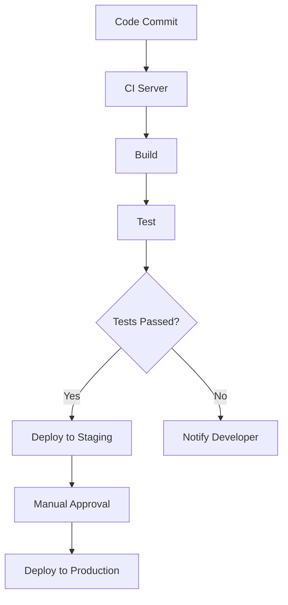

## 18.7 Automating Tests with CI/CD Tools

Automating tests is a critical component of modern software development, especially in functional programming with Clojure. Continuous Integration (CI) and Continuous Deployment (CD) tools provide the infrastructure needed to automate testing processes, ensuring rapid feedback and maintaining consistent quality across applications. In this section, we will explore the benefits of automated testing, how to set up CI for Clojure projects, strategies for test reporting and handling failures, and security considerations for CI/CD pipelines.

### **Benefits of Automation**

Automated testing offers several advantages that significantly enhance the development lifecycle:

- **Rapid Feedback**: Automated tests provide immediate feedback on code changes, allowing developers to identify and address issues quickly. This is crucial in functional programming, where changes in pure functions can have far-reaching effects.

- **Consistent Quality**: By running tests automatically, you ensure that code quality remains consistent over time. Automated tests reduce the risk of human error and ensure that all tests are executed consistently.

- **Efficiency**: Automation reduces the time and effort required to run tests manually, freeing up resources for other development tasks. This is particularly beneficial in large-scale applications where manual testing would be impractical.

- **Scalability**: Automated testing frameworks can handle a large number of tests, making it easier to scale applications without compromising on testing coverage.

### **Setting Up CI for Clojure Projects**

Setting up a CI pipeline for Clojure projects involves several steps. Let's walk through the process of configuring a CI pipeline using popular tools like Jenkins, Travis CI, or GitHub Actions.

#### **1. Choosing a CI Tool**

Select a CI tool that integrates well with your development workflow. Jenkins, Travis CI, and GitHub Actions are popular choices, each offering unique features:

- **Jenkins**: Highly customizable and supports a wide range of plugins. Ideal for complex build processes.
- **Travis CI**: Simple to set up and integrates seamlessly with GitHub repositories.
- **GitHub Actions**: Provides native integration with GitHub, allowing for easy configuration and management of workflows.

#### **2. Configuring the CI Pipeline**

Once you've chosen a CI tool, configure the pipeline to automate your testing process:

- **Define Build Steps**: Specify the steps needed to build your Clojure project. This typically involves setting up the environment, installing dependencies, and compiling the code.

- **Run Automated Tests**: Configure the pipeline to execute your test suite automatically. Use tools like `clojure.test` or `Midje` for running tests.

- **Generate Reports**: Ensure that test results are captured and reported. This can be done using plugins or built-in features of your CI tool.

Here is an example configuration for a simple Clojure project using GitHub Actions:

```yaml
name: Clojure CI

on: [push, pull_request]

jobs:
  build:
    runs-on: ubuntu-latest

    steps:
    - uses: actions/checkout@v2

    - name: Set up JDK 11
      uses: actions/setup-java@v1
      with:
        java-version: 11

    - name: Install Clojure CLI
      run: sudo apt-get install -y clojure

    - name: Run tests
      run: clojure -M:test
```

### **Test Reporting**

Effective test reporting is essential for understanding the results of automated tests and identifying areas that require attention. Here are some strategies for generating and integrating test reports into your CI dashboards:

- **Use Test Report Formats**: Generate reports in formats like JUnit XML, which are widely supported by CI tools. This allows for easy integration and visualization of test results.

- **Visualize Results**: Leverage CI tool dashboards to visualize test results. This can include charts, graphs, and detailed logs that help identify trends and patterns.

- **Integrate with Notification Systems**: Set up notifications to alert developers of test failures. This ensures that issues are addressed promptly and reduces the time to resolution.

### **Handling Failures**

Automated tests can sometimes fail due to various reasons, including flaky tests, environment issues, or code changes. Here are strategies to handle failures effectively:

- **Identify Flaky Tests**: Flaky tests are tests that sometimes pass and sometimes fail without any code changes. Use techniques like test retries or isolation to identify and address flaky tests.

- **Environment Consistency**: Ensure that the test environment is consistent across runs. Use containerization tools like Docker to create reproducible environments.

- **Root Cause Analysis**: When a test fails, perform a root cause analysis to understand the underlying issue. Use logs and test reports to gather information and pinpoint the problem.

### **Security Considerations**

Securing your CI/CD pipelines is crucial to protect your codebase and sensitive information. Here are some best practices:

- **Handle Secrets Securely**: Use secret management tools to store and manage sensitive information like API keys and passwords. Most CI tools provide built-in solutions for handling secrets.

- **Set Permissions Carefully**: Limit access to your CI/CD pipelines to only those who need it. Use role-based access control to manage permissions effectively.

- **Monitor Pipeline Activity**: Regularly monitor your CI/CD pipelines for unusual activity. Set up alerts for suspicious actions and review logs to ensure security.

### **Try It Yourself**

To get hands-on experience, try setting up a CI pipeline for a sample Clojure project using GitHub Actions. Modify the configuration to include additional steps, such as deploying to a staging environment or generating code coverage reports.

### **Visual Aids**

Here is a flowchart illustrating a typical CI/CD pipeline for a Clojure project:



**Diagram Description**: This flowchart represents a CI/CD pipeline where code commits trigger a CI server to build and test the project. If tests pass, the application is deployed to a staging environment, followed by a manual approval step for production deployment.

### **References and Links**

- [Clojure Official Documentation](https://clojure.org/reference)
- [GitHub Actions Documentation](https://docs.github.com/en/actions)
- [Jenkins CI Documentation](https://www.jenkins.io/doc/)
- [Travis CI Documentation](https://docs.travis-ci.com/)
- [Managing Secrets in GitHub Actions](https://docs.github.com/en/actions/security-guides/encrypted-secrets)

### **Knowledge Check**

To reinforce your understanding, consider these questions:

- What are the benefits of automating tests in a CI/CD pipeline?
- How can you handle flaky tests in your CI pipeline?
- What are some security best practices for managing secrets in CI/CD pipelines?

### **Conclusion**

Automating tests with CI/CD tools is a powerful way to ensure high-quality Clojure applications. By setting up effective pipelines, generating insightful reports, and addressing failures proactively, you can maintain robust and secure software development processes. Embrace these practices to enhance your functional programming projects and achieve greater efficiency and reliability.

## **Test Your Knowledge: Automating Tests with CI/CD Tools Quiz**



### What is one of the primary benefits of automating tests in a CI/CD pipeline?

- [x] Rapid feedback on code changes
- [ ] Increased manual testing
- [ ] Reduced code coverage
- [ ] Slower deployment cycles

> **Explanation:** Automated tests provide immediate feedback, allowing developers to quickly identify and fix issues.

### Which CI tool is known for its seamless integration with GitHub repositories?

- [ ] Jenkins
- [x] Travis CI
- [ ] CircleCI
- [ ] Bamboo

> **Explanation:** Travis CI is known for its simple setup and seamless integration with GitHub.

### How can you ensure test environment consistency across CI runs?

- [x] Use containerization tools like Docker
- [ ] Manually configure each environment
- [ ] Ignore environment differences
- [ ] Use different environments for each run

> **Explanation:** Docker allows for creating reproducible environments, ensuring consistency across CI runs.

### What format is commonly used for generating test reports in CI pipelines?

- [x] JUnit XML
- [ ] PDF
- [ ] CSV
- [ ] JSON

> **Explanation:** JUnit XML is a widely supported format for test reports, allowing easy integration with CI tools.

### How can you handle flaky tests in your CI pipeline?

- [x] Test retries
- [ ] Ignore the test failures
- [x] Isolate flaky tests
- [ ] Increase test complexity

> **Explanation:** Test retries and isolation can help identify and address flaky tests.

### What is a security best practice for managing secrets in CI/CD pipelines?

- [x] Use secret management tools
- [ ] Hardcode secrets in the codebase
- [ ] Share secrets publicly
- [ ] Use plain text files

> **Explanation:** Secret management tools securely store and manage sensitive information like API keys.

### Which step follows a successful test run in a typical CI/CD pipeline?

- [x] Deploy to Staging
- [ ] Code Commit
- [ ] Test
- [ ] Build

> **Explanation:** After tests pass, the application is typically deployed to a staging environment for further testing.

### What should you do when a test fails in your CI pipeline?

- [x] Perform root cause analysis
- [ ] Ignore the failure
- [ ] Delete the test
- [ ] Rollback all code changes

> **Explanation:** Root cause analysis helps understand and fix the underlying issue causing the test failure.

### Why is it important to monitor your CI/CD pipeline activity?

- [x] To detect unusual activity and ensure security
- [ ] To slow down the deployment process
- [ ] To increase manual intervention
- [ ] To reduce test coverage

> **Explanation:** Monitoring helps detect suspicious actions and maintain the security of the pipeline.

### True or False: Automated testing reduces the risk of human error in the testing process.

- [x] True
- [ ] False

> **Explanation:** Automated testing ensures consistent execution of tests, reducing the chance of human error.


