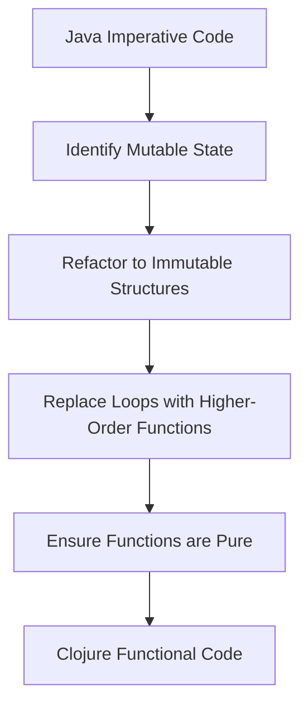

## 19.1 Identifying Imperative Code Patterns

As developers transition from an imperative programming paradigm, such as Java, to a functional one like Clojure, recognizing and refactoring imperative code patterns becomes crucial. This section will guide you through identifying these patterns and understanding their impact on functional programming. We'll also explore tools to aid in this transition and criteria for evaluating code for refactoring.

### Signs of Imperative Code

Imperative programming is characterized by a sequence of commands for the computer to perform. This approach contrasts with functional programming, which emphasizes expressions and declarations over execution. Here are key characteristics of imperative code:

1. **Mutable Variables**: Imperative code often relies on variables whose values can change over time. This mutability can lead to unpredictable behavior and bugs, especially in concurrent environments.

    ```java
    // Java example of mutable variables
    int counter = 0;
    for (int i = 0; i < 10; i++) {
        counter += i;
    }
    ```

2. **Explicit Loops**: Loops such as `for`, `while`, and `do-while` are common in imperative code. These constructs focus on the control flow rather than the transformation of data.

    ```java
    // Java example of an explicit loop
    List<String> names = Arrays.asList("Alice", "Bob", "Charlie");
    for (String name : names) {
        System.out.println(name);
    }
    ```

3. **Conditional Statements Modifying State**: Conditionals like `if`, `else`, and `switch` are used to alter the state of variables, which can complicate reasoning about code.

    ```java
    // Java example of conditional statements
    String status;
    if (age > 18) {
        status = "Adult";
    } else {
        status = "Minor";
    }
    ```

4. **Procedural Abstractions**: Functions in imperative programming often encapsulate sequences of statements that modify the state, rather than computing a value.

    ```java
    // Java example of a procedural abstraction
    void incrementCounter() {
        counter++;
    }
    ```

### Impact on Functional Programming

Imperative code can hinder the benefits of functional programming, which include:

- **Immutability**: Functional programming relies on immutable data structures, which are easier to reason about and lead to fewer bugs.
- **Referential Transparency**: This property allows functions to be predictable, as they always produce the same output for the same input.
- **Concurrency**: Functional programming's emphasis on immutability and pure functions makes it inherently more suited for concurrent and parallel execution.

Imperative patterns can obscure these benefits, making code harder to maintain and scale. For example, mutable state can lead to race conditions in concurrent applications, whereas pure functions and immutable data structures in Clojure eliminate these issues.

### Code Analysis Tools

Several tools and linters can help identify imperative constructs in code, facilitating the transition to a functional style:

- **Clojure Linter (clj-kondo)**: This tool can analyze Clojure code to detect common issues, including imperative patterns.
  - [clj-kondo GitHub Repository](https://github.com/clj-kondo/clj-kondo)

- **Eastwood**: A Clojure lint tool that can identify potential problems in your code, such as mutable state usage.
  - [Eastwood GitHub Repository](https://github.com/jonase/eastwood)

- **SonarQube**: A platform for continuous inspection of code quality that supports multiple languages, including Java and Clojure, to identify code smells and potential refactoring opportunities.
  - [SonarQube Official Site](https://www.sonarqube.org/)

### Evaluating Code for Refactoring

To determine which parts of your codebase would benefit most from refactoring, consider the following criteria:

1. **Complexity**: Identify areas with high cyclomatic complexity, which often indicates convoluted control flow that can be simplified using functional constructs.

2. **Mutability**: Focus on sections of code that heavily rely on mutable state, as these are prime candidates for transformation into immutable data structures.

3. **Side Effects**: Functions with significant side effects should be refactored to separate pure logic from side-effecting operations.

4. **Duplication**: Look for duplicated logic that can be abstracted into higher-order functions or reusable components.

5. **Concurrency Issues**: Code that manages state across threads can benefit from Clojure's concurrency primitives, such as atoms, refs, and agents.

### Code Refactoring Example

Let's refactor a simple Java imperative code snippet into a functional Clojure equivalent:

**Java Code:**

```java
// Java code to sum integers in a list
List<Integer> numbers = Arrays.asList(1, 2, 3, 4, 5);
int sum = 0;
for (int number : numbers) {
    sum += number;
}
System.out.println(sum);
```

**Clojure Code:**

```clojure
;; Clojure code to sum integers in a list
(def numbers [1 2 3 4 5])
(def sum (reduce + numbers))
(println sum)
```

**Explanation:**

- **Immutable Data Structures**: In Clojure, `numbers` is an immutable vector, and `sum` is computed using the `reduce` function, which applies the `+` operator across the collection.
- **No Explicit Loops**: The imperative loop is replaced by a functional `reduce`, which abstracts the iteration process.
- **Pure Functions**: The computation of `sum` is a pure function, with no side effects.

### Try It Yourself

Experiment with the Clojure code by modifying the `numbers` vector or the operation within `reduce`. For instance, try multiplying the numbers instead of summing them:

```clojure
(def product (reduce * numbers))
(println product)
```

### Visual Aids

To aid understanding, let's visualize the transformation from imperative to functional code using a flowchart:



**Diagram Description**: This flowchart illustrates the process of transforming Java imperative code into Clojure functional code by identifying mutable state, refactoring to immutable structures, replacing loops with higher-order functions, and ensuring functions are pure.

### References and Links

- [Clojure Official Documentation](https://clojure.org/reference)
- [Clojure Community Resources](https://clojure.org/community/resources)
- [Transitioning from OOP to Functional Programming](https://www.lispcast.com/oo-to-fp/)
- [clj-kondo GitHub Repository](https://github.com/clj-kondo/clj-kondo)
- [Eastwood GitHub Repository](https://github.com/jonase/eastwood)
- [SonarQube Official Site](https://www.sonarqube.org/)

### Knowledge Check

To reinforce your understanding, consider these questions:

1. What are the key characteristics of imperative code?
2. How does imperative code impact the benefits of functional programming?
3. Which tools can help identify imperative constructs in code?
4. What criteria should you use to evaluate code for refactoring?

### Exercises

1. **Identify Imperative Patterns**: Review a section of your Java codebase and list the imperative patterns present.
2. **Refactor to Clojure**: Choose a simple Java function and refactor it into Clojure, focusing on immutability and pure functions.
3. **Analyze with Tools**: Use clj-kondo or Eastwood to analyze a Clojure project and identify areas for improvement.

### Encouraging Engagement

Embracing functional programming can be challenging, but with each step, you'll gain a deeper understanding and see tangible benefits in your codebase. Remember, the transition from imperative to functional programming is a journey, and every refactoring effort brings you closer to writing clean, maintainable, and scalable code.

---

## **Test Your Knowledge: Identifying Imperative Code Patterns Quiz**



### Which of the following is a characteristic of imperative code?

- [x] Mutable variables
- [ ] Immutable data structures
- [ ] Pure functions
- [ ] Function composition

> **Explanation:** Mutable variables are a hallmark of imperative programming, where state changes over time.

### What impact does imperative code have on functional programming benefits?

- [x] It hinders immutability and referential transparency.
- [ ] It enhances concurrency and parallelism.
- [ ] It simplifies code readability.
- [ ] It improves function composition.

> **Explanation:** Imperative code often relies on mutable state and side effects, which can hinder the benefits of immutability and referential transparency in functional programming.

### Which tool can be used to identify imperative constructs in Clojure code?

- [x] clj-kondo
- [ ] Maven
- [ ] Docker
- [ ] Jenkins

> **Explanation:** clj-kondo is a linter for Clojure that can help identify imperative patterns and other issues in code.

### What is a key criterion for evaluating code for refactoring?

- [x] Complexity
- [ ] Code length
- [ ] Number of comments
- [ ] Use of whitespace

> **Explanation:** Complexity, such as high cyclomatic complexity, indicates areas that may benefit from refactoring to a functional style.

### How can explicit loops in imperative code be replaced in functional programming?

- [x] Using higher-order functions like `map` and `reduce`
- [ ] Using `for` and `while` loops
- [ ] Using global variables
- [ ] Using procedural abstractions

> **Explanation:** Higher-order functions like `map` and `reduce` abstract the iteration process, replacing explicit loops.

### What is the benefit of separating pure logic from side-effecting operations?

- [x] It makes code more predictable and easier to test.
- [ ] It increases code complexity.
- [ ] It reduces code readability.
- [ ] It introduces more side effects.

> **Explanation:** Separating pure logic from side effects enhances predictability and testability of code.

### What does the `reduce` function do in Clojure?

- [x] It applies a function cumulatively to the items of a sequence.
- [ ] It sorts a sequence.
- [ ] It filters elements of a sequence.
- [ ] It maps a function over a sequence.

> **Explanation:** `reduce` applies a function cumulatively to the items of a sequence, reducing it to a single value.

### Which Clojure tool can identify potential problems in code?

- [x] Eastwood
- [ ] Docker
- [ ] Kubernetes
- [ ] Gradle

> **Explanation:** Eastwood is a linter for Clojure that can identify potential problems, including imperative patterns.

### What is a common issue with mutable state in concurrent applications?

- [x] Race conditions
- [ ] Improved performance
- [ ] Enhanced security
- [ ] Increased readability

> **Explanation:** Mutable state can lead to race conditions in concurrent applications, where multiple threads access and modify shared data.

### True or False: Functional programming inherently supports concurrency better than imperative programming.

- [x] True
- [ ] False

> **Explanation:** Functional programming's emphasis on immutability and pure functions makes it inherently more suited for concurrent and parallel execution.


