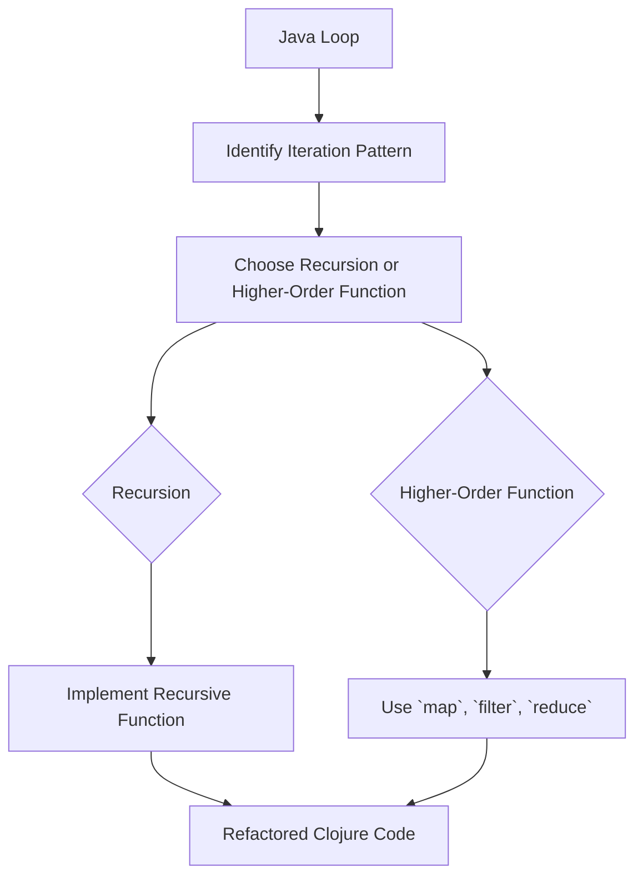

## 19.2 Refactoring Loops into Recursions

Refactoring loops into recursions is a fundamental step in embracing functional programming, especially when transitioning from an object-oriented language like Java to Clojure. In this section, we will explore how to transform traditional `for` and `while` loops into recursive functions or leverage higher-order functions such as `reduce` and `fold`. We will also discuss how to eliminate index variables by using sequence abstractions and provide practical examples to illustrate these concepts.

### **From Loops to Recursion**

#### **Understanding the Transition**

In imperative languages like Java, loops are a common construct for iterating over data. However, in functional programming, recursion and higher-order functions are preferred due to their alignment with immutability and pure functions. By refactoring loops into recursion, we can achieve cleaner, more expressive, and often more efficient code.

#### **Java Loops vs. Clojure Recursion**

Let's start by examining a simple loop in Java and then refactor it into a recursive function in Clojure.

**Java Example: Calculating the Sum of an Array**

```java
public int sumArray(int[] numbers) {
    int sum = 0;
    for (int i = 0; i < numbers.length; i++) {
        sum += numbers[i];
    }
    return sum;
}
```

**Clojure Equivalent: Using Recursion**

```clojure
(defn sum-array [numbers]
  (loop [nums numbers
         sum 0]
    (if (empty? nums)
      sum
      (recur (rest nums) (+ sum (first nums)))))
```

In the Clojure example, we use the `loop` and `recur` constructs to perform the same operation. The `loop` establishes a recursion point, and `recur` is used to call the recursion with new arguments, ensuring tail-call optimization.

### **Using `reduce` and `fold`**

#### **Simplifying Aggregations**

In many cases, recursion can be further simplified using higher-order functions like `reduce`. These functions abstract the pattern of iterating over a collection and accumulating a result.

**Clojure Example: Using `reduce`**

```clojure
(defn sum-array [numbers]
  (reduce + 0 numbers))
```

Here, `reduce` takes a function (`+`), an initial value (`0`), and a collection (`numbers`). It applies the function to the initial value and the first element, then to the result and the next element, and so on.

#### **Eliminating Index Variables**

One of the advantages of using higher-order functions is the elimination of index variables, which can lead to cleaner and less error-prone code.

**Java Example: Finding Maximum Value with Index**

```java
public int findMax(int[] numbers) {
    int max = Integer.MIN_VALUE;
    for (int i = 0; i < numbers.length; i++) {
        if (numbers[i] > max) {
            max = numbers[i];
        }
    }
    return max;
}
```

**Clojure Equivalent: Using `reduce`**

```clojure
(defn find-max [numbers]
  (reduce max Integer/MIN_VALUE numbers))
```

In this Clojure example, `reduce` is used to find the maximum value without explicitly managing an index variable.

### **Practical Examples of Loop Refactoring**

#### **Example 1: Mapping and Filtering**

Consider a Java loop that filters and transforms a list of integers.

**Java Example: Filtering and Mapping**

```java
public List<Integer> processNumbers(List<Integer> numbers) {
    List<Integer> result = new ArrayList<>();
    for (int number : numbers) {
        if (number > 10) {
            result.add(number * 2);
        }
    }
    return result;
}
```

**Clojure Equivalent: Using `filter` and `map`**

```clojure
(defn process-numbers [numbers]
  (->> numbers
       (filter #(> % 10))
       (map #(* % 2))))
```

In this example, we use `filter` to select numbers greater than 10 and `map` to double them. The threading macro `->>` is used to chain these operations, creating a pipeline that is both concise and expressive.

#### **Example 2: Recursive Fibonacci**

Let's refactor a loop-based Fibonacci sequence generator into a recursive function.

**Java Example: Fibonacci with Loop**

```java
public int fibonacci(int n) {
    if (n <= 1) return n;
    int a = 0, b = 1, c;
    for (int i = 2; i <= n; i++) {
        c = a + b;
        a = b;
        b = c;
    }
    return b;
}
```

**Clojure Equivalent: Recursive Fibonacci**

```clojure
(defn fibonacci [n]
  (if (<= n 1)
    n
    (+ (fibonacci (- n 1)) (fibonacci (- n 2)))))
```

In this recursive version, the function calls itself to compute the Fibonacci sequence. However, this naive recursion is not efficient for large `n` due to repeated calculations.

**Optimized Clojure: Tail Recursion with `recur`**

```clojure
(defn fibonacci [n]
  (loop [a 0 b 1 i n]
    (if (zero? i)
      a
      (recur b (+ a b) (dec i)))))
```

Using `loop` and `recur`, we achieve tail-call optimization, making the function efficient for larger values of `n`.

### **Visual Aids: Mapping Java to Clojure**

#### **Flowchart: Loop to Recursion Transformation**



*Caption: This flowchart illustrates the process of transforming a Java loop into a recursive function or using a higher-order function in Clojure.*

### **References and Links**

- [Clojure Official Documentation](https://clojure.org/reference)
- [Clojure Community Resources](https://clojure.org/community/resources)
- [Transitioning from OOP to Functional Programming](https://www.lispcast.com/oo-to-fp/)

### **Knowledge Check**

#### **Exercise: Refactor a Java Loop**

Refactor the following Java loop into a Clojure recursive function:

**Java Code:**

```java
public int countEvenNumbers(int[] numbers) {
    int count = 0;
    for (int number : numbers) {
        if (number % 2 == 0) {
            count++;
        }
    }
    return count;
}
```

**Clojure Hint:**

Consider using a recursive function with `loop` and `recur` or a higher-order function like `filter` and `count`.

### **Encouraging Engagement**

Embracing functional programming can be challenging, but with each step, you'll gain a deeper understanding and see tangible benefits in your codebase. Try refactoring some of your own Java loops into Clojure recursions and experience the elegance and power of functional programming.

### **Test Your Knowledge: Refactoring Loops into Recursions Quiz**



### What is the primary advantage of using recursion over loops in functional programming?

- [x] Recursion aligns with immutability and pure functions.
- [ ] Recursion is faster than loops.
- [ ] Recursion uses less memory.
- [ ] Recursion is easier to write.

> **Explanation:** Recursion is preferred in functional programming because it aligns with the principles of immutability and pure functions, which are core to the paradigm.

### Which Clojure function is commonly used to replace loops for aggregating values?

- [x] `reduce`
- [ ] `map`
- [ ] `filter`
- [ ] `recur`

> **Explanation:** `reduce` is a higher-order function used to aggregate values in a collection, replacing the need for explicit loops.

### How does `recur` help in recursive functions?

- [x] It allows for tail-call optimization.
- [ ] It makes recursion faster.
- [ ] It simplifies the function.
- [ ] It reduces memory usage.

> **Explanation:** `recur` is used in Clojure to achieve tail-call optimization, allowing recursive functions to execute efficiently without growing the call stack.

### What is a common pattern when refactoring loops to recursion?

- [x] Use `loop` and `recur` for tail recursion.
- [ ] Use `map` for all iterations.
- [ ] Use `filter` for condition checks.
- [ ] Use `reduce` for all operations.

> **Explanation:** `loop` and `recur` are commonly used for tail recursion, which is a pattern that allows functions to call themselves efficiently.

### What does the `->>` macro do in Clojure?

- [x] It threads the last expression through a series of functions.
- [ ] It threads the first expression through a series of functions.
- [ ] It optimizes recursive calls.
- [ ] It performs side-effect operations.

> **Explanation:** The `->>` macro is used to thread the last expression through a series of functions, creating a pipeline of operations.

### Which function would you use to eliminate index variables in Clojure?

- [x] `map`
- [ ] `loop`
- [ ] `recur`
- [ ] `do`

> **Explanation:** `map` applies a function to each element in a collection, eliminating the need for index variables.

### What is the benefit of using `filter` in Clojure?

- [x] It selects elements based on a predicate.
- [ ] It sorts elements.
- [ ] It aggregates values.
- [ ] It modifies elements in place.

> **Explanation:** `filter` is used to select elements from a collection that satisfy a given predicate, simplifying the code and improving readability.

### How can you achieve tail-call optimization in Clojure?

- [x] By using `recur` within a `loop`.
- [ ] By using `map` and `filter`.
- [ ] By using `reduce`.
- [ ] By using `do` blocks.

> **Explanation:** Tail-call optimization in Clojure is achieved by using `recur` within a `loop`, allowing recursive calls without growing the call stack.

### What is the primary reason for eliminating index variables in functional programming?

- [x] To reduce complexity and potential errors.
- [ ] To increase execution speed.
- [ ] To use less memory.
- [ ] To simplify syntax.

> **Explanation:** Eliminating index variables reduces complexity and potential errors, leading to cleaner and more maintainable code.

### True or False: Recursion is always more efficient than loops.

- [ ] True
- [x] False

> **Explanation:** Recursion is not always more efficient than loops; it depends on the context and whether tail-call optimization is possible.



By mastering the art of refactoring loops into recursions, you will enhance your ability to write functional code that is both elegant and efficient. Continue practicing and exploring the vast possibilities that Clojure offers in the realm of functional programming.
