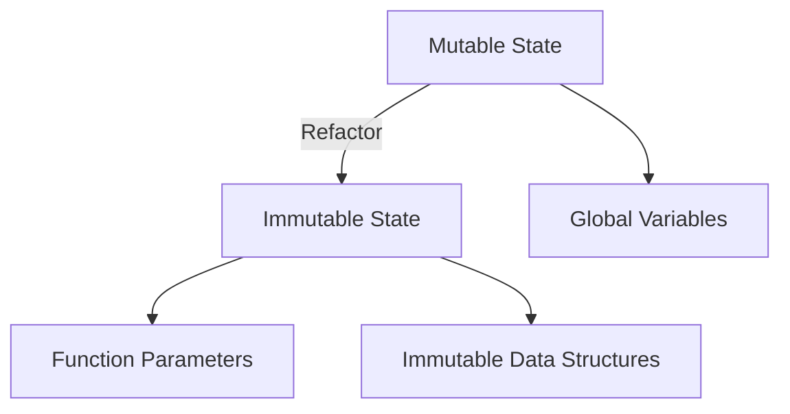

## 19.3 Eliminating Mutable State Variables

In the realm of functional programming, immutability stands as a cornerstone principle that offers numerous benefits, especially when it comes to concurrency and code reliability. As we delve into eliminating mutable state variables in Clojure, we will explore the advantages of immutability, discuss effective refactoring strategies, and examine techniques to avoid global state. Additionally, we'll present case studies with before-and-after code comparisons to illustrate the transformation process.

### Immutability Advantages

Immutability refers to the concept of data that cannot be altered after it is created. In Clojure, immutability is a fundamental aspect, and understanding its benefits is crucial for mastering functional programming.

#### Enhanced Concurrency

One of the primary advantages of immutability is its impact on concurrency. In a concurrent environment, mutable state can lead to race conditions, where multiple threads attempt to modify the same data simultaneously, resulting in unpredictable behavior. Immutable data structures eliminate these issues because they cannot be changed. Instead, any modification results in a new data structure, ensuring thread safety without the need for complex locking mechanisms.

#### Code Reliability and Predictability

Immutable data structures also enhance code reliability and predictability. Functions that operate on immutable data are inherently pure, meaning their output is solely determined by their input, without side effects. This predictability makes reasoning about code behavior easier and reduces the likelihood of bugs.

#### Simplified Debugging and Testing

With immutability, debugging and testing become more straightforward. Since data does not change unexpectedly, tracking the flow of data through a program is simpler. Unit tests can focus on function inputs and outputs without concern for hidden state changes.

### Refactoring Strategies

Transitioning from mutable to immutable state requires thoughtful refactoring. Here, we discuss strategies to help you effectively eliminate mutable state variables.

#### Passing State Through Function Parameters

One effective technique is to pass state explicitly through function parameters. This approach ensures that each function receives only the data it needs, reducing dependencies on external or global state.

```clojure
;; Before: Using mutable state
(defn update-counter [state]
  (swap! state inc))

;; After: Passing state through parameters
(defn update-counter [counter]
  (inc counter))

;; Usage
(let [initial-counter 0]
  (update-counter initial-counter))
```

In the example above, the `update-counter` function is refactored to accept a counter value as a parameter, removing the need for mutable state.

#### Utilizing Immutable Data Structures

Clojure provides a rich set of immutable data structures, such as lists, vectors, maps, and sets. Leveraging these structures is key to eliminating mutable state.

```clojure
;; Before: Using a mutable Java ArrayList
(import 'java.util.ArrayList)

(defn add-element [list element]
  (.add list element))

;; After: Using an immutable Clojure vector
(defn add-element [vector element]
  (conj vector element))

;; Usage
(let [initial-vector []]
  (add-element initial-vector 42))
```

Here, the mutable `ArrayList` is replaced with an immutable Clojure vector, ensuring that the original data remains unchanged.

### Avoiding Global State

Global state, often found in the form of global variables or singletons, can lead to tightly coupled code and unpredictable behavior. It's essential to minimize or eliminate global state in functional programming.

#### Eliminating Global Variables

Global variables can be replaced with function parameters or encapsulated within functions to limit their scope.

```clojure
;; Before: Using a global variable
(def global-counter (atom 0))

(defn increment-global-counter []
  (swap! global-counter inc))

;; After: Using a local variable
(defn increment-counter [counter]
  (inc counter))

;; Usage
(let [local-counter 0]
  (increment-counter local-counter))
```

By passing the counter as a parameter, we eliminate the reliance on a global variable.

#### Avoiding Singletons

Singletons often introduce hidden state and dependencies. In Clojure, we can replace singletons with pure functions or use closures to encapsulate state.

```clojure
;; Before: Singleton pattern
(defn singleton-instance []
  (if (nil? @instance)
    (reset! instance (create-instance)))
  @instance)

;; After: Using closures
(defn create-instance []
  (let [instance (atom nil)]
    (fn []
      (if (nil? @instance)
        (reset! instance (create-instance)))
      @instance)))
```

In the refactored version, we use a closure to manage state, avoiding the singleton pattern and making the code more functional.

### Case Studies: Before-and-After Code Comparisons

Let's examine a case study to illustrate the process of eliminating mutable state variables.

#### Case Study: Shopping Cart

Consider a shopping cart application initially implemented with mutable state.

**Before: Mutable State**

```clojure
(def cart (atom []))

(defn add-item [item]
  (swap! cart conj item))

(defn remove-item [item]
  (swap! cart #(remove #{item} %)))

(defn total-price []
  (reduce + (map :price @cart)))
```

In this implementation, the `cart` is a mutable atom, and functions modify its state directly.

**After: Immutable State**

```clojure
(defn add-item [cart item]
  (conj cart item))

(defn remove-item [cart item]
  (remove #{item} cart))

(defn total-price [cart]
  (reduce + (map :price cart)))

;; Usage
(let [initial-cart []]
  (-> initial-cart
      (add-item {:name "Apple" :price 1.0})
      (add-item {:name "Banana" :price 0.5})
      (remove-item {:name "Apple" :price 1.0})
      (total-price)))
```

In the refactored version, each function takes the cart as a parameter and returns a new cart, ensuring immutability.

### Visual Aids

Below is a diagram illustrating the transition from mutable to immutable state in a shopping cart example.



**Diagram Description:** This flowchart depicts the transition from mutable state with global variables to immutable state using function parameters and immutable data structures.

### References and Links

For further reading on immutability and functional programming in Clojure, consider the following resources:

- [Clojure Official Documentation](https://clojure.org/reference)
- [Transitioning from OOP to Functional Programming](https://www.lispcast.com/oo-to-fp/)
- [Clojure Community Resources](https://clojure.org/community/resources)

### Knowledge Check

To reinforce your understanding, consider the following questions and exercises:

1. What are the primary benefits of immutability in functional programming?
2. How can passing state through function parameters help eliminate mutable state?
3. Refactor a simple Java class with mutable fields into a Clojure namespace with immutable data structures.
4. Identify and refactor a singleton pattern in a codebase to use closures instead.
5. Experiment with the shopping cart example by adding new features or modifying existing ones.

### Encouraging Engagement

Eliminating mutable state variables can initially seem daunting, but embracing immutability will lead to more robust and maintainable code. As you continue to refactor and adopt functional programming principles, you'll find that your applications become more scalable and easier to reason about.

### Best Practices for Tags

- Use specific and relevant tags that reflect the article's content, such as "Clojure", "Functional Programming", "Immutability", "Concurrency", "Refactoring", "State Management", "Code Reliability", and "Java".

## **Test Your Knowledge: Eliminating Mutable State Variables Quiz**



### What is one of the primary benefits of immutability in functional programming?

- [x] Enhanced concurrency
- [ ] Increased memory usage
- [ ] Slower execution speed
- [ ] Complex debugging

> **Explanation:** Immutability enhances concurrency by eliminating race conditions, as immutable data cannot be modified by multiple threads simultaneously.

### How does passing state through function parameters help in eliminating mutable state?

- [x] It reduces dependencies on external state
- [ ] It increases code complexity
- [ ] It makes functions harder to test
- [ ] It introduces global variables

> **Explanation:** Passing state through function parameters ensures that functions operate only on the data they receive, reducing reliance on external or global state.

### Which Clojure data structure is inherently immutable?

- [x] Vector
- [ ] ArrayList
- [ ] HashMap
- [ ] LinkedList

> **Explanation:** Clojure's vector is an immutable data structure, unlike Java's ArrayList, which is mutable.

### What is a common issue with global variables in functional programming?

- [x] They lead to tightly coupled code
- [ ] They improve code readability
- [ ] They enhance performance
- [ ] They simplify testing

> **Explanation:** Global variables can lead to tightly coupled code and unpredictable behavior, which is contrary to functional programming principles.

### How can singletons be refactored in Clojure to avoid mutable state?

- [x] Using closures
- [ ] Using global variables
- [ ] Using mutable fields
- [ ] Using static methods

> **Explanation:** Closures can encapsulate state without relying on singletons, promoting immutability.

### What is the result of calling a function with immutable data structures?

- [x] A new data structure is returned
- [ ] The original data structure is modified
- [ ] An error is thrown
- [ ] The function does nothing

> **Explanation:** Functions operating on immutable data structures return new data structures, preserving the original.

### Why is debugging easier with immutable data?

- [x] Data does not change unexpectedly
- [ ] Errors are more frequent
- [ ] Code execution is slower
- [ ] Functions are impure

> **Explanation:** Immutable data does not change unexpectedly, making it easier to track data flow and debug issues.

### What is a benefit of using immutable data structures for testing?

- [x] Tests can focus on inputs and outputs
- [ ] Tests require more setup
- [ ] Tests are less reliable
- [ ] Tests are harder to write

> **Explanation:** With immutable data, tests can focus on function inputs and outputs without concern for hidden state changes.

### How can structural sharing improve performance in Clojure?

- [x] By reusing parts of data structures
- [ ] By duplicating data structures
- [ ] By increasing memory usage
- [ ] By slowing down data access

> **Explanation:** Structural sharing allows parts of data structures to be reused, improving performance without duplicating data.

### True or False: Immutability is a core concept in Clojure's functional programming paradigm.

- [x] True
- [ ] False

> **Explanation:** Immutability is indeed a core concept in Clojure, enabling enhanced concurrency, reliability, and ease of reasoning about code.


