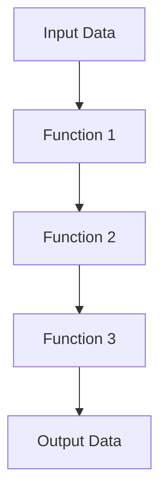

## 19.4 Simplifying Code with Higher-Order Functions

In this section, we will explore how higher-order functions (HOFs) in Clojure can significantly simplify your code, reduce boilerplate, and enhance maintainability. We'll delve into the power of function composition, the benefits of leveraging Clojure's core libraries, and the creation of custom higher-order functions to encapsulate common patterns. By the end of this section, you'll have a deeper understanding of how to refactor your code to a more functional style, drawing parallels with Java OOP concepts to aid your transition.

### Replacing Boilerplate Code

One of the key advantages of higher-order functions is their ability to reduce repetitive code structures, often referred to as boilerplate code. In Java, you might find yourself writing similar loops or conditional statements repeatedly. In Clojure, higher-order functions allow you to abstract these patterns into reusable components.

#### Example: Simplifying Iteration

Let's consider a common task: iterating over a collection to perform an operation on each element. In Java, this might look like:

```java
List<Integer> numbers = Arrays.asList(1, 2, 3, 4, 5);
List<Integer> squared = new ArrayList<>();
for (Integer number : numbers) {
    squared.add(number * number);
}
```

In Clojure, we can replace this boilerplate with a single higher-order function:

```clojure
(def numbers [1 2 3 4 5])
(def squared (map #(* % %) numbers))
```

Here, `map` is a higher-order function that takes a function and a collection, applying the function to each element of the collection. This not only reduces the amount of code but also increases readability and maintainability.

#### Code Example: Filtering and Transforming Data

Consider a scenario where we need to filter and transform data. In Java, you might write:

```java
List<String> names = Arrays.asList("Alice", "Bob", "Charlie", "David");
List<String> filteredNames = new ArrayList<>();
for (String name : names) {
    if (name.startsWith("A")) {
        filteredNames.add(name.toUpperCase());
    }
}
```

In Clojure, this can be simplified using `filter` and `map`:

```clojure
(def names ["Alice" "Bob" "Charlie" "David"])
(def filtered-names (map clojure.string/upper-case (filter #(clojure.string/starts-with? % "A") names)))
```

This example demonstrates how higher-order functions can compose operations, reducing the need for explicit iteration and conditionals.

### Function Composition

Function composition is a powerful technique in functional programming that allows you to combine simple functions to build more complex operations. This leads to clearer and more maintainable code, as each function can be understood in isolation.

#### Understanding Function Composition

In Clojure, function composition is achieved using the `comp` function, which takes multiple functions as arguments and returns a new function that is the composition of those functions.

```clojure
(defn add-one [x] (+ x 1))
(defn square [x] (* x x))

(def add-one-then-square (comp square add-one))

(add-one-then-square 3) ; => 16
```

In this example, `add-one-then-square` is a new function created by composing `add-one` and `square`. When called, it first applies `add-one` and then `square`.

#### Code Example: Composing Functions

Let's see a practical example of function composition in action:

```clojure
(defn sanitize [s] (clojure.string/trim (clojure.string/lower-case s)))
(defn validate-length [s] (<= (count s) 10))

(def validate-sanitized-input (comp validate-length sanitize))

(validate-sanitized-input "  HELLO WORLD  ") ; => false
(validate-sanitized-input "  hello  ") ; => true
```

Here, `validate-sanitized-input` is a composed function that sanitizes input by trimming and converting it to lowercase before validating its length.

### Leveraging Core Libraries

Clojure's rich standard library provides a plethora of higher-order functions that can be leveraged to avoid reinventing the wheel. By using these built-in functions, you can write concise and expressive code.

#### Utilizing Built-in Functions

Clojure's core library includes functions like `map`, `filter`, `reduce`, `some`, and many others. These functions are highly optimized and designed to work seamlessly with Clojure's immutable data structures.

```clojure
(def data [1 2 3 4 5 6 7 8 9 10])

(def even-squares (map #(* % %) (filter even? data)))
```

In this example, we use `filter` to select even numbers and `map` to square them. This approach is not only concise but also expressive, clearly conveying the intent of the code.

#### Code Example: Aggregating Data

Consider a scenario where you need to aggregate data. In Java, you might use loops and conditionals, but in Clojure, you can use `reduce`:

```clojure
(def numbers [1 2 3 4 5])
(def sum (reduce + numbers)) ; => 15
```

The `reduce` function takes a binary function and a collection, applying the function cumulatively to the elements of the collection.

### Custom Higher-Order Functions

While Clojure's core library is extensive, there are times when you may need to create custom higher-order functions to encapsulate domain-specific logic or patterns.

#### Creating Custom Functions

Creating a custom higher-order function involves writing a function that takes one or more functions as arguments or returns a function as a result. This allows you to encapsulate common patterns and reuse them across your codebase.

```clojure
(defn apply-discount [discount-fn prices]
  (map discount-fn prices))

(defn ten-percent-discount [price]
  (* price 0.9))

(apply-discount ten-percent-discount [100 200 300]) ; => (90.0 180.0 270.0)
```

In this example, `apply-discount` is a higher-order function that applies a discount function to a list of prices.

#### Code Example: Domain-Specific Logic

Let's create a custom higher-order function to handle domain-specific logic:

```clojure
(defn apply-rules [rules data]
  (reduce (fn [acc rule] (rule acc)) data rules))

(defn rule1 [data] (filter even? data))
(defn rule2 [data] (map #(* % 2) data))

(apply-rules [rule1 rule2] [1 2 3 4 5]) ; => (4 8)
```

Here, `apply-rules` takes a collection of rules and applies them sequentially to the data, demonstrating how custom higher-order functions can encapsulate complex logic.

### Visualizing Function Composition

To better understand function composition, let's visualize how functions are composed and applied in Clojure.



**Diagram Description**: This flowchart illustrates the process of function composition, where each function processes the output of the previous function, resulting in a transformed output.

### Encouraging Experimentation

To deepen your understanding of higher-order functions, try modifying the provided code examples. Experiment with different functions and data to see how the behavior changes. Consider creating your own higher-order functions to encapsulate patterns you encounter in your work.

### References and Further Reading

- [Clojure Official Documentation](https://clojure.org/reference)
- [Clojure Community Resources](https://clojure.org/community/resources)
- [Transitioning from OOP to Functional Programming](https://www.lispcast.com/oo-to-fp/)

### Knowledge Check

To reinforce your learning, consider the following questions and exercises:

1. What are the benefits of using higher-order functions in Clojure?
2. How does function composition improve code readability?
3. Try refactoring a piece of Java code using higher-order functions in Clojure.
4. Create a custom higher-order function for a specific use case in your project.

## **Test Your Knowledge: Simplifying Code with Higher-Order Functions Quiz**



### What is a higher-order function?

- [x] A function that takes other functions as arguments or returns a function as a result.
- [ ] A function that performs complex mathematical operations.
- [ ] A function that only works with numbers.
- [ ] A function that is defined at a higher scope.

> **Explanation:** Higher-order functions can take functions as arguments or return them, enabling powerful abstractions.

### Which Clojure function is used for function composition?

- [x] `comp`
- [ ] `map`
- [ ] `filter`
- [ ] `reduce`

> **Explanation:** The `comp` function is used to compose multiple functions into a single function.

### How can higher-order functions reduce boilerplate code?

- [x] By abstracting repetitive patterns into reusable functions.
- [ ] By increasing the number of lines of code.
- [ ] By making code more complex.
- [ ] By requiring more manual intervention.

> **Explanation:** Higher-order functions encapsulate common patterns, reducing repetition and boilerplate.

### What is the role of the `reduce` function in Clojure?

- [x] To apply a binary function cumulatively to the elements of a collection.
- [ ] To filter elements from a collection.
- [ ] To map elements to new values.
- [ ] To compose multiple functions.

> **Explanation:** `reduce` applies a function cumulatively, often used for aggregating data.

### What does the `map` function do?

- [x] It applies a function to each element of a collection.
- [ ] It reduces a collection to a single value.
- [ ] It filters elements based on a predicate.
- [ ] It composes multiple functions.

> **Explanation:** `map` transforms each element of a collection by applying a function to it.

### Why is function composition beneficial?

- [x] It leads to clearer and more maintainable code.
- [ ] It makes code harder to understand.
- [ ] It increases the number of functions needed.
- [ ] It complicates debugging.

> **Explanation:** Function composition allows you to build complex operations from simple, reusable functions.

### How can you create a custom higher-order function in Clojure?

- [x] By writing a function that takes functions as arguments or returns a function.
- [ ] By using only built-in functions.
- [ ] By writing a class in Java.
- [ ] By avoiding functions altogether.

> **Explanation:** Custom higher-order functions encapsulate domain-specific logic or patterns.

### What is the purpose of the `filter` function?

- [x] To select elements from a collection that satisfy a predicate.
- [ ] To map elements to new values.
- [ ] To reduce a collection to a single value.
- [ ] To compose multiple functions.

> **Explanation:** `filter` selects elements that satisfy a given condition.

### How does leveraging Clojure's core libraries help in code simplification?

- [x] By providing optimized, reusable functions that reduce the need for custom implementations.
- [ ] By requiring more code to be written.
- [ ] By complicating the codebase.
- [ ] By limiting functionality.

> **Explanation:** Clojure's core libraries offer a wealth of functions that simplify common tasks.

### True or False: Custom higher-order functions can only be used for mathematical operations.

- [ ] True
- [x] False

> **Explanation:** Custom higher-order functions can be used for a wide range of tasks, not just mathematical operations.



By embracing higher-order functions, you'll find that your Clojure code becomes more concise, expressive, and easier to maintain. As you continue to explore functional programming, remember that each step forward is a step towards more robust and scalable applications.
