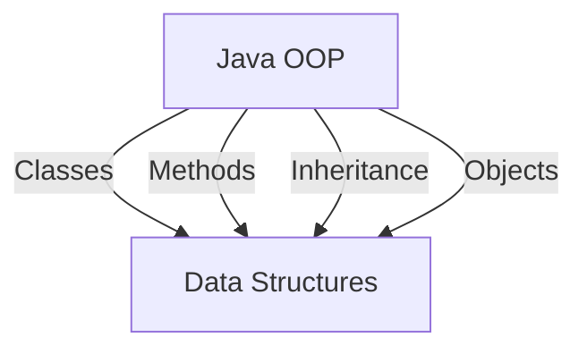

## 19.5 Enhancing Readability and Maintainability

In the world of software development, writing code that is not only functional but also clean, readable, and maintainable is crucial. As developers, we often spend more time reading code than writing it. Therefore, enhancing readability and maintainability is essential for long-term success and collaboration. In this section, we will explore several techniques and best practices to achieve these goals in Clojure, a language known for its expressive power and functional paradigm.

### Expressive Function Names

One of the most fundamental aspects of writing readable code is using expressive function names. In Clojure, as in any programming language, function names should clearly convey their purpose and behavior. This practice reduces the cognitive load on developers who read the code and makes it easier to understand the overall logic of the application.

#### Guidelines for Naming Functions

1. **Be Descriptive**: Use names that describe what the function does. Avoid generic names like `processData` or `handleInput`. Instead, opt for more specific names like `calculateTotalPrice` or `filterActiveUsers`.

2. **Use Verbs for Actions**: Functions typically perform actions, so using verbs in function names can be helpful. For example, `fetchUserData` or `sendEmailNotification`.

3. **Consistent Naming Conventions**: Establish and adhere to naming conventions within your team or project. This consistency helps in understanding the codebase more quickly.

4. **Avoid Abbreviations**: While abbreviations might save a few keystrokes, they often lead to confusion. Use full words to ensure clarity.

5. **Reflect the Function's Scope**: If a function is part of a module or namespace, its name should reflect its context. For example, `user/authenticate` is more informative than just `authenticate`.

#### Code Example: Expressive Function Names

```clojure
;; Bad example
(defn calc [a b]
  (+ a b))

;; Good example
(defn calculate-sum [number1 number2]
  "Calculates the sum of two numbers."
  (+ number1 number2))
```

In the above example, the function `calculate-sum` is much more descriptive than `calc`, making it clear what the function does.

### Code Formatting

Consistent code formatting is another critical aspect of enhancing readability. Proper formatting helps to visually organize code, making it easier to follow and understand.

#### Tools and Techniques

1. **Use `cljfmt`**: This tool automatically formats Clojure code according to community standards. It helps maintain consistency across the codebase.

2. **Indentation**: Use consistent indentation to delineate code blocks. In Clojure, two spaces per level of indentation is a common convention.

3. **Whitespace**: Use whitespace to separate logical sections of code. This separation helps in visually parsing the code.

4. **Line Length**: Keep lines of code to a reasonable length, typically around 80-100 characters. This practice improves readability, especially on smaller screens.

5. **Comments and Documentation**: Use comments to explain complex logic and provide context. However, avoid over-commenting; the code should be self-explanatory whenever possible.

#### Code Example: Code Formatting

```clojure
;; Bad example
(defn calculate-total-price[items]
  (reduce + (map #(:price %)items)))

;; Good example
(defn calculate-total-price [items]
  "Calculates the total price of a list of items."
  (reduce + (map #(:price %) items)))
```

In the good example, proper spacing, indentation, and a descriptive docstring enhance the readability of the code.

### Breaking Down Complex Functions

Complex functions can be challenging to read and understand. Breaking them down into smaller, more manageable units improves readability and maintainability. This practice aligns with the functional programming principle of composing small, pure functions.

#### Techniques for Decomposing Functions

1. **Single Responsibility Principle**: Ensure that each function has a single responsibility or task. If a function does too much, consider splitting it into smaller functions.

2. **Function Composition**: Use function composition to build complex functionality from simpler functions. This approach promotes code reuse and modularity.

3. **Helper Functions**: Create helper functions for repetitive tasks or complex logic. These functions can be reused across the codebase.

4. **Descriptive Function Signatures**: Use descriptive parameter names and return types to clarify the function's purpose and usage.

#### Code Example: Breaking Down Complex Functions

```clojure
;; Bad example
(defn process-order [order]
  (let [items (:items order)
        total (reduce + (map #(:price %) items))
        tax (* total 0.1)
        total-with-tax (+ total tax)]
    (println "Order total:" total-with-tax)))

;; Good example
(defn calculate-total [items]
  "Calculates the total price of items."
  (reduce + (map #(:price %) items)))

(defn calculate-tax [total]
  "Calculates tax for the given total."
  (* total 0.1))

(defn process-order [order]
  "Processes an order by calculating the total with tax."
  (let [items (:items order)
        total (calculate-total items)
        tax (calculate-tax total)
        total-with-tax (+ total tax)]
    (println "Order total:" total-with-tax)))
```

In the good example, the complex logic is broken down into smaller, reusable functions, making the code easier to read and maintain.

### Avoiding Deep Nesting

Deeply nested code can be difficult to follow and understand. By reducing nesting levels, we can improve the readability of our code.

#### Strategies to Reduce Nesting

1. **Use Early Returns**: Instead of nesting logic within multiple `if` statements, use early returns to handle special cases and exit the function early.

2. **Leverage `let` Bindings**: Use `let` bindings to extract and name intermediate results, reducing the need for nested expressions.

3. **Utilize Higher-Order Functions**: Use higher-order functions like `map`, `filter`, and `reduce` to replace nested loops and conditionals.

4. **Refactor with `cond`**: Use the `cond` macro to handle multiple conditional branches more cleanly than nested `if` statements.

#### Code Example: Avoiding Deep Nesting

```clojure
;; Bad example
(defn process-user [user]
  (if (:active user)
    (if (>= (:age user) 18)
      (println "Processing adult user")
      (println "User is not an adult"))
    (println "User is not active")))

;; Good example
(defn process-user [user]
  "Processes a user based on their active status and age."
  (cond
    (not (:active user)) (println "User is not active")
    (< (:age user) 18) (println "User is not an adult")
    :else (println "Processing adult user")))
```

In the good example, the `cond` macro is used to handle multiple conditions, reducing the nesting level and improving readability.

### Visual Aids: Mapping Java OOP to Clojure

To aid understanding, let's visualize how Java OOP concepts map to Clojure's functional paradigm. This comparison can help Java developers transitioning to Clojure.



**Diagram Description**: This diagram illustrates the mapping of Java OOP concepts to Clojure's functional paradigm. Classes in Java correspond to namespaces in Clojure, methods to functions, inheritance to protocols, and objects to data structures.

### References and Further Reading

- [Clojure Official Documentation](https://clojure.org/reference)
- [Clojure Community Resources](https://clojure.org/community/resources)
- [Transitioning from OOP to Functional Programming](https://www.lispcast.com/oo-to-fp/)
- [Clojure Style Guide](https://github.com/bbatsov/clojure-style-guide)

### Knowledge Check

To reinforce your understanding, consider the following questions and exercises:

1. Why is it important to use expressive function names in Clojure?
2. How can `cljfmt` help maintain consistent code formatting?
3. What are the benefits of breaking down complex functions into smaller units?
4. How can early returns reduce code nesting?
5. Rewrite a nested `if` statement using the `cond` macro.

### Exercises

1. Refactor a complex function in your codebase to improve readability and maintainability. Use the techniques discussed in this section.
2. Review your project's codebase and identify areas where function names can be improved for clarity.
3. Apply `cljfmt` to your codebase and observe the changes in formatting.

### Encouraging Engagement

Embracing functional programming can be challenging, but with each step, you'll gain a deeper understanding and see tangible benefits in your codebase. Remember, writing clean and maintainable code is a continuous process. By applying the techniques discussed in this section, you'll contribute to a more robust and collaborative development environment.

## **Test Your Knowledge: Enhancing Readability and Maintainability Quiz**



### Why is it important to use expressive function names in Clojure?

- [x] To clearly convey the function's purpose and behavior
- [ ] To make the code look more professional
- [ ] To reduce the number of lines in the code
- [ ] To make it easier to write the code

> **Explanation:** Expressive function names help convey the purpose and behavior of the function, making the code easier to read and understand.

### What is a benefit of using `cljfmt`?

- [x] It automatically formats Clojure code according to community standards
- [ ] It compiles Clojure code to Java bytecode
- [ ] It optimizes Clojure code for performance
- [ ] It converts Clojure code to JavaScript

> **Explanation:** `cljfmt` is a tool that formats Clojure code according to community standards, ensuring consistency across the codebase.

### How can breaking down complex functions improve maintainability?

- [x] By making the code easier to read and understand
- [ ] By increasing the number of lines in the code
- [ ] By making the code run faster
- [ ] By reducing the need for comments

> **Explanation:** Breaking down complex functions into smaller, more manageable units makes the code easier to read, understand, and maintain.

### Which strategy can reduce code nesting?

- [x] Using early returns
- [ ] Using more `if` statements
- [ ] Increasing the number of parameters
- [ ] Adding more comments

> **Explanation:** Early returns can help reduce code nesting by handling special cases and exiting the function early.

### What does the `cond` macro do?

- [x] It handles multiple conditional branches cleanly
- [ ] It formats code according to community standards
- [ ] It compiles Clojure code to Java bytecode
- [ ] It optimizes Clojure code for performance

> **Explanation:** The `cond` macro is used to handle multiple conditional branches more cleanly than nested `if` statements.

### What is a common convention for indentation in Clojure?

- [x] Two spaces per level of indentation
- [ ] Four spaces per level of indentation
- [ ] One tab per level of indentation
- [ ] No indentation is required

> **Explanation:** In Clojure, two spaces per level of indentation is a common convention to maintain readability.

### How can helper functions improve code quality?

- [x] By promoting code reuse and modularity
- [ ] By increasing the number of lines in the code
- [ ] By making the code run faster
- [ ] By reducing the need for comments

> **Explanation:** Helper functions promote code reuse and modularity, improving the overall quality and maintainability of the code.

### What should you avoid when naming functions?

- [x] Using abbreviations
- [ ] Using full words
- [ ] Using verbs for actions
- [ ] Using descriptive names

> **Explanation:** Avoid using abbreviations in function names, as they can lead to confusion and reduce clarity.

### How can `let` bindings help reduce nesting?

- [x] By extracting and naming intermediate results
- [ ] By increasing the number of parameters
- [ ] By adding more comments
- [ ] By using more `if` statements

> **Explanation:** `let` bindings can extract and name intermediate results, reducing the need for nested expressions and improving readability.

### True or False: Consistent code formatting is not important in functional programming.

- [ ] True
- [x] False

> **Explanation:** Consistent code formatting is crucial in functional programming, as it helps organize code visually and makes it easier to follow and understand.


