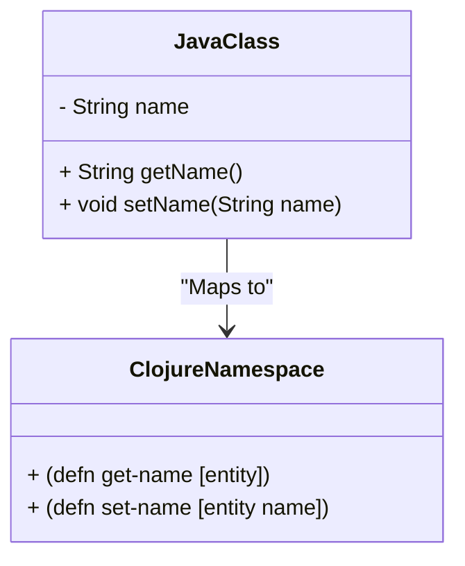

## 19.6 Techniques for Code Transformation

In the journey from imperative to functional programming, transforming code to embrace functional paradigms is a crucial step. This section delves into techniques for code transformation, focusing on refactoring patterns, the use of automated tools, and best practices to ensure code quality and maintainability. We will also draw parallels between Java OOP concepts and their equivalents in Clojure to aid Java developers transitioning to a functional style.

### Refactoring Patterns

Refactoring is the process of restructuring existing code without changing its external behavior. It improves the code's structure and readability while maintaining its functionality. Here are some common refactoring patterns that are particularly useful when transitioning to a functional style in Clojure:

#### Extract Function

**Objective:** Simplify complex functions by breaking them into smaller, reusable functions.

**Example:**

Consider a Java method that calculates the total price of items in a shopping cart, including tax:

```java
public double calculateTotalPrice(List<Item> items, double taxRate) {
    double total = 0;
    for (Item item : items) {
        double priceWithTax = item.getPrice() * (1 + taxRate);
        total += priceWithTax;
    }
    return total;
}
```

In Clojure, we can extract the calculation of the price with tax into a separate function:

```clojure
(defn price-with-tax [item tax-rate]
  (* (:price item) (+ 1 tax-rate)))

(defn calculate-total-price [items tax-rate]
  (reduce + (map #(price-with-tax % tax-rate) items)))
```

**Benefits:** This separation enhances readability and allows for easier testing and reuse of `price-with-tax`.

#### Inline Function

**Objective:** Remove unnecessary abstraction by integrating the function's logic directly into the calling code.

**Example:**

Suppose we have a simple Clojure function that doubles a number:

```clojure
(defn double [x]
  (* 2 x))

(defn process-numbers [numbers]
  (map double numbers))
```

If the `double` function is only used once, we can inline it:

```clojure
(defn process-numbers [numbers]
  (map #(* 2 %) numbers))
```

**Benefits:** Inlining can reduce the cognitive load by eliminating trivial functions.

#### Replace Conditional with Polymorphism

**Objective:** Use polymorphism to handle different cases instead of complex conditional logic.

**Example:**

In Java, you might use a switch statement to handle different shapes:

```java
public double calculateArea(Shape shape) {
    switch (shape.getType()) {
        case "circle":
            return Math.PI * Math.pow(shape.getRadius(), 2);
        case "rectangle":
            return shape.getWidth() * shape.getHeight();
        default:
            throw new IllegalArgumentException("Unknown shape");
    }
}
```

In Clojure, we can use multimethods to achieve polymorphism:

```clojure
(defmulti calculate-area :type)

(defmethod calculate-area :circle [shape]
  (* Math/PI (Math/pow (:radius shape) 2)))

(defmethod calculate-area :rectangle [shape]
  (* (:width shape) (:height shape)))

(defmethod calculate-area :default [_]
  (throw (IllegalArgumentException. "Unknown shape")))
```

**Benefits:** This approach makes it easier to extend the code with new shapes without modifying existing logic.

### Automated Refactoring Tools

Automated refactoring tools can significantly aid the transformation process by handling repetitive tasks and ensuring consistency. Many IDEs offer features that can assist in refactoring, such as:

- **Code Navigation and Inspection:** Quickly locate and analyze code segments that need transformation.
- **Automated Refactoring Suggestions:** IDEs like IntelliJ IDEA provide suggestions for extracting methods, inlining variables, and more.
- **Syntax Checking and Linting:** Tools like `clj-kondo` help maintain code quality by identifying potential issues early.

**Example Workflow:**

1. **Identify Code Smells:** Use code inspection tools to find areas that can be improved.
2. **Apply Refactoring Patterns:** Utilize IDE features to apply refactoring patterns such as Extract Function or Inline Function.
3. **Verify Changes:** Run tests to ensure that the refactoring has not altered the program's behavior.

### Regression Testing

Regression testing is crucial during refactoring to ensure that changes do not introduce new bugs or alter existing functionality. It involves running a suite of tests after each refactoring step to verify that the code still behaves as expected.

**Best Practices:**

- **Comprehensive Test Coverage:** Ensure that your tests cover all critical paths and edge cases.
- **Automated Testing:** Use tools like `clojure.test` to automate the execution of tests.
- **Continuous Integration:** Integrate testing into your CI/CD pipeline to catch issues early.

**Example:**

```clojure
(ns myapp.core-test
  (:require [clojure.test :refer :all]
            [myapp.core :refer :all]))

(deftest test-calculate-total-price
  (testing "Calculates total price with tax"
    (is (= 21.0 (calculate-total-price [{:price 10.0} {:price 10.0}] 0.05)))))
```

### Code Reviews

Code reviews are an essential part of the refactoring process. They provide an opportunity for peer feedback, knowledge sharing, and catching potential issues that automated tools might miss.

**Benefits:**

- **Improved Code Quality:** Multiple perspectives can identify improvements and potential pitfalls.
- **Knowledge Sharing:** Team members can learn from each other's approaches and solutions.
- **Consistency:** Ensures that the codebase adheres to agreed-upon standards and practices.

**Guidelines for Effective Code Reviews:**

- **Focus on the Code, Not the Coder:** Provide constructive feedback aimed at improving the code.
- **Be Specific:** Highlight specific areas of concern and suggest improvements.
- **Encourage Discussion:** Use reviews as a platform for discussing different approaches and solutions.

### Try It Yourself

Experiment with the following Clojure code by applying the refactoring patterns discussed:

```clojure
(defn calculate-discounted-price [items discount-rate]
  (reduce + (map #(* (:price %) (- 1 discount-rate)) items)))

(defn apply-discount [price discount-rate]
  (* price (- 1 discount-rate)))

(defn calculate-total-discounted-price [items discount-rate]
  (reduce + (map #(apply-discount (:price %) discount-rate) items)))
```

**Suggestions for Experimentation:**

- **Extract Function:** Break down `calculate-discounted-price` into smaller functions.
- **Inline Function:** Consider inlining `apply-discount` if it's only used once.
- **Replace Conditional with Polymorphism:** If you have different discount strategies, use multimethods to handle them.

### Visual Aids

To better understand the transformation from Java OOP to Clojure's functional style, consider the following diagram illustrating how classes and methods map to namespaces and functions:



**Diagram Description:** This diagram demonstrates how a Java class with methods maps to a Clojure namespace with functions. The encapsulated state in Java is replaced by function arguments and return values in Clojure, emphasizing immutability and statelessness.

### References and Links

For further reading and resources, consider the following:

- [Clojure Official Documentation](https://clojure.org/reference)
- [Clojure Community Resources](https://clojure.org/community/resources)
- [Transitioning from OOP to Functional Programming](https://www.lispcast.com/oo-to-fp/)
- [Clojure STM Guide](https://clojure.org/reference/refs)

### Knowledge Check

To reinforce your understanding, consider these questions:

1. What are the benefits of using Extract Function in Clojure?
2. How can automated refactoring tools assist in code transformation?
3. Why is regression testing important during refactoring?
4. What are the key elements of an effective code review?

### Conclusion

Transforming code to a functional style in Clojure involves a combination of refactoring patterns, automated tools, and best practices. By embracing these techniques, developers can improve code readability, maintainability, and scalability. As you continue to refine your skills, remember that each step towards functional programming brings you closer to harnessing the full power of Clojure.

## **Test Your Knowledge: Techniques for Code Transformation Quiz**



### What is the primary goal of the Extract Function refactoring pattern?

- [x] To simplify complex functions by breaking them into smaller, reusable functions.
- [ ] To integrate the function's logic directly into the calling code.
- [ ] To handle different cases using polymorphism.
- [ ] To automate the execution of tests.

> **Explanation:** Extract Function aims to enhance readability and reusability by decomposing complex functions into smaller, manageable ones.

### Which tool can help maintain code quality by identifying potential issues early?

- [x] `clj-kondo`
- [ ] `leiningen`
- [ ] `core.async`
- [ ] `ring`

> **Explanation:** `clj-kondo` is a linter for Clojure that helps identify potential issues in code, contributing to maintaining code quality.

### What is the benefit of using multimethods in Clojure?

- [x] They allow for polymorphism, handling different cases without complex conditionals.
- [ ] They simplify complex functions by breaking them into smaller parts.
- [ ] They integrate function logic directly into the calling code.
- [ ] They ensure that tests cover all critical paths and edge cases.

> **Explanation:** Multimethods enable polymorphism, allowing different implementations based on a dispatch value, thus reducing the need for complex conditional logic.

### Why is regression testing crucial during refactoring?

- [x] To ensure that changes do not introduce new bugs or alter existing functionality.
- [ ] To break down complex functions into smaller, reusable ones.
- [ ] To handle different cases using polymorphism.
- [ ] To automate the execution of tests.

> **Explanation:** Regression testing verifies that refactoring has not affected the program's behavior, ensuring that the code still functions as intended.

### What is a key benefit of code reviews?

- [x] Improved code quality through multiple perspectives.
- [ ] Simplifying complex functions by breaking them into smaller parts.
- [ ] Integrating function logic directly into the calling code.
- [ ] Automating the execution of tests.

> **Explanation:** Code reviews bring multiple perspectives, which can identify improvements and potential pitfalls, leading to better code quality.

### Which refactoring pattern involves removing unnecessary abstraction?

- [x] Inline Function
- [ ] Extract Function
- [ ] Replace Conditional with Polymorphism
- [ ] Automated Refactoring

> **Explanation:** Inline Function involves removing unnecessary abstraction by integrating the function's logic directly into the calling code.

### What is the purpose of using automated refactoring tools?

- [x] To handle repetitive tasks and ensure consistency during code transformation.
- [ ] To simplify complex functions by breaking them into smaller parts.
- [ ] To handle different cases using polymorphism.
- [ ] To automate the execution of tests.

> **Explanation:** Automated refactoring tools assist in code transformation by handling repetitive tasks and ensuring consistency.

### What is a common outcome of effective code reviews?

- [x] Knowledge sharing among team members.
- [ ] Simplifying complex functions by breaking them into smaller parts.
- [ ] Integrating function logic directly into the calling code.
- [ ] Automating the execution of tests.

> **Explanation:** Code reviews facilitate knowledge sharing, as team members learn from each other's approaches and solutions.

### Which of the following is a benefit of using Extract Function?

- [x] Enhanced readability and easier testing.
- [ ] Handling different cases using polymorphism.
- [ ] Removing unnecessary abstraction.
- [ ] Automating the execution of tests.

> **Explanation:** Extract Function enhances readability and allows for easier testing and reuse of code components.

### True or False: Regression testing is optional during refactoring.

- [ ] True
- [x] False

> **Explanation:** Regression testing is essential during refactoring to ensure that changes do not introduce new bugs or alter existing functionality.


