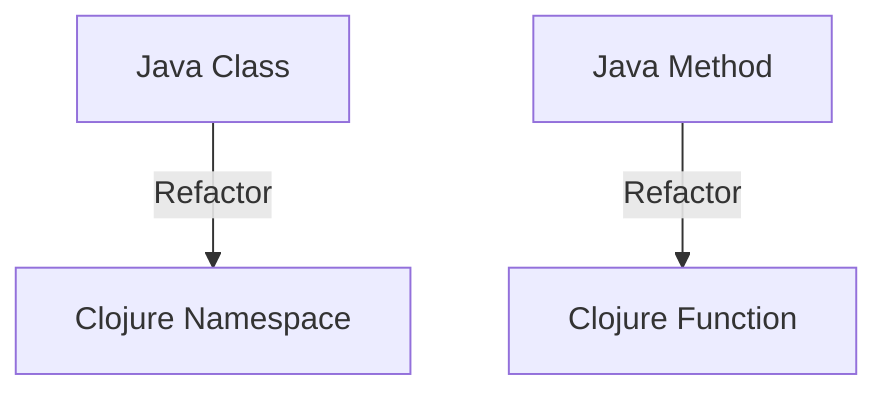
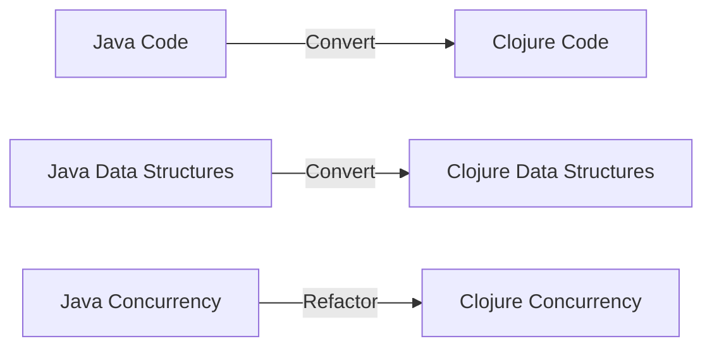

## 19.7 Refactoring Java Code to Clojure

Transitioning from Java's object-oriented programming (OOP) paradigm to Clojure's functional programming (FP) style can be transformative, offering benefits like immutability, concurrency, and concise code. This section will guide you through the process of refactoring Java code into Clojure, focusing on interfacing with Java, gradual replacement strategies, data structure conversion, and refactoring object-oriented constructs.

### Interfacing with Java

One of the strengths of Clojure is its seamless interoperability with Java. This feature allows developers to call Java methods from Clojure, making it possible to transition gradually without needing to rewrite everything at once. Let's explore how to leverage this interoperability during the transition phase.

#### Calling Java Methods from Clojure

To call Java methods from Clojure, we use the dot `.` operator. Here's a simple example of calling a static method and an instance method from a Java class:

```clojure
;; Static method call
(Math/pow 2 3) ; Equivalent to Math.pow(2, 3) in Java

;; Instance method call
(let [sb (StringBuilder.)]
  (.append sb "Hello, ")
  (.append sb "World!")
  (.toString sb))
```

In the above example, we create a `StringBuilder` instance and call its methods using the `.` operator. This approach allows us to utilize existing Java libraries and codebases while gradually refactoring our application to Clojure.

#### Gradual Replacement Strategies

When transitioning from Java to Clojure, it's often impractical to rewrite an entire application in one go. Instead, consider these gradual replacement strategies:

1. **Wrapping Java Classes with Clojure Functions**: Create Clojure functions that wrap Java methods. This encapsulation allows you to gradually replace Java logic with Clojure implementations while maintaining existing functionality.

    ```clojure
    (defn calculate-power [base exponent]
      (Math/pow base exponent))
    ```

2. **Rewriting Modules Incrementally**: Focus on refactoring one module or component at a time. This incremental approach minimizes risk and allows for continuous integration and testing.

3. **Using Protocols and Multimethods**: Define Clojure protocols or multimethods to abstract over Java interfaces and classes. This technique facilitates a smoother transition by decoupling functionality from specific implementations.

### Data Structure Conversion

Java and Clojure have different approaches to data structures. Java's mutable collections contrast with Clojure's immutable, persistent data structures. Let's discuss how to convert Java data structures to their Clojure equivalents.

#### Converting Java Collections to Clojure

Clojure provides functions to convert Java collections into Clojure's immutable counterparts. Here's how you can perform these conversions:

```clojure
;; Convert a Java List to a Clojure vector
(def java-list (java.util.ArrayList. [1 2 3]))
(def clojure-vector (vec java-list))

;; Convert a Java Map to a Clojure map
(def java-map (java.util.HashMap. {"key1" "value1", "key2" "value2"}))
(def clojure-map (into {} java-map))
```

These conversions allow you to work with Clojure's efficient and expressive data structures, which are better suited for functional programming.

#### Mapping Java Data Structures to Clojure

When refactoring, consider how Java's object-oriented data structures map to Clojure's functional paradigm:

- **Lists and Arrays**: Use Clojure's `list` or `vector` for Java's `List` and arrays.
- **Maps**: Use Clojure's `hash-map` for Java's `Map`.
- **Sets**: Use Clojure's `hash-set` for Java's `Set`.

By converting data structures, you can leverage Clojure's powerful sequence operations and immutability features.

### Refactoring Object-Oriented Constructs

Refactoring object-oriented constructs to functional paradigms involves rethinking how you design and implement your code. Let's explore how to map OOP concepts to Clojure's functional style.

#### Classes and Objects to Namespaces and Functions

In Java, classes and objects are central to the design. In Clojure, we use namespaces and functions to achieve similar outcomes. Here's a comparison:

- **Java Class**: Represents a blueprint for creating objects with encapsulated state and behavior.
- **Clojure Namespace**: Groups related functions and data, promoting modularity and reuse.

**Java Example**:

```java
public class Calculator {
    public int add(int a, int b) {
        return a + b;
    }
}
```

**Clojure Equivalent**:

```clojure
(ns myapp.calculator)

(defn add [a b]
  (+ a b))
```

In this example, the `Calculator` class is replaced by a namespace `myapp.calculator`, and the `add` method becomes a pure function.

#### Inheritance to Composition

Java's inheritance model can be refactored into Clojure's composition approach. Instead of extending classes, we compose functions and data structures.

**Java Example**:

```java
public class AdvancedCalculator extends Calculator {
    public int subtract(int a, int b) {
        return a - b;
    }
}
```

**Clojure Equivalent**:

```clojure
(ns myapp.advanced-calculator
  (:require [myapp.calculator :as calc]))

(defn subtract [a b]
  (- a b))

(defn add-and-subtract [a b c]
  (-> a
      (calc/add b)
      (subtract c)))
```

Here, we use Clojure's `require` to bring in functions from another namespace, demonstrating composition over inheritance.

#### Interfaces to Protocols

Java interfaces define contracts that classes must implement. In Clojure, protocols serve a similar purpose, allowing you to define a set of functions that different types can implement.

**Java Interface Example**:

```java
public interface Shape {
    double area();
}
```

**Clojure Protocol Equivalent**:

```clojure
(defprotocol Shape
  (area [this]))
```

Protocols provide flexibility and decoupling, enabling polymorphic behavior across different data types.

### Concurrency Models Comparison

Java and Clojure have distinct concurrency models. Java relies on synchronized blocks and the `java.util.concurrent` package, while Clojure offers powerful concurrency primitives like atoms, refs, and agents.

#### Java Concurrency

Java uses synchronized methods and locks to manage concurrency, which can lead to complex and error-prone code.

**Java Example**:

```java
public class Counter {
    private int count = 0;

    public synchronized void increment() {
        count++;
    }

    public synchronized int getCount() {
        return count;
    }
}
```

#### Clojure Concurrency

Clojure's concurrency model emphasizes immutability and state management through atoms, refs, and agents, simplifying concurrent programming.

**Clojure Equivalent**:

```clojure
(def counter (atom 0))

(defn increment []
  (swap! counter inc))

(defn get-count []
  @counter)
```

In this example, we use an `atom` to manage state changes, ensuring thread safety and simplicity.

### Visual Aids

#### Java to Clojure Namespace Mapping



*Diagram 1: Mapping Java classes and methods to Clojure namespaces and functions.*

#### Data Flow During Migration



*Diagram 2: Data flow and conversion during the migration from Java to Clojure.*

### References and Links

- [Clojure Official Documentation](https://clojure.org/reference)
- [Clojure Community Resources](https://clojure.org/community/resources)
- [Transitioning from OOP to Functional Programming](https://www.lispcast.com/oo-to-fp/)
- [Clojure Concurrency Guide](https://clojure.org/reference/atoms)
- [Java to Clojure Interoperability](https://clojure.org/reference/java_interop)

### Knowledge Check

To reinforce your understanding, consider these questions and exercises:

1. **What are the key differences between Java's and Clojure's concurrency models?**
2. **How can you call a Java method from Clojure? Provide an example.**
3. **Refactor a simple Java class into a Clojure namespace with functions.**
4. **Experiment with converting Java collections to Clojure data structures.**

### Encouraging Engagement

Embracing functional programming can be challenging, but with each step, you'll gain a deeper understanding and see tangible benefits in your codebase. Experiment with the examples provided and explore how Clojure's functional paradigm can enhance your applications.

### Test Your Knowledge: Refactoring Java Code to Clojure Quiz



### What is the primary advantage of using Clojure's immutable data structures over Java's mutable collections?

- [x] They simplify concurrency by eliminating the need for locks.
- [ ] They are faster than Java's collections.
- [ ] They consume less memory.
- [ ] They require less code to implement.

> **Explanation:** Clojure's immutable data structures simplify concurrency by removing the need for locks, as they cannot be changed once created.

### How can you call a Java static method from Clojure?

- [x] Use the dot `.` operator followed by the method name.
- [ ] Use the `invoke` function.
- [ ] Use the `call` keyword.
- [ ] Use the `java-call` function.

> **Explanation:** The dot `.` operator is used in Clojure to call static methods from Java classes.

### Which Clojure feature allows you to define a set of functions that can be implemented by different types?

- [x] Protocols
- [ ] Macros
- [ ] Atoms
- [ ] Agents

> **Explanation:** Protocols in Clojure allow you to define a set of functions that different data types can implement, similar to interfaces in Java.

### What is a key benefit of using Clojure's `atom` for state management over Java's synchronized methods?

- [x] Atoms provide a simpler and more concise way to manage state changes.
- [ ] Atoms are faster than synchronized methods.
- [ ] Atoms use less memory.
- [ ] Atoms are more secure.

> **Explanation:** Atoms provide a simpler and more concise way to manage state changes in Clojure, leveraging immutability and atomic updates.

### When refactoring Java code to Clojure, what strategy can be used to gradually replace Java logic?

- [x] Wrapping Java classes with Clojure functions
- [ ] Directly rewriting all Java code at once
- [ ] Using Java's reflection API
- [ ] Ignoring Java code and starting fresh

> **Explanation:** Wrapping Java classes with Clojure functions allows for gradual replacement of Java logic while maintaining functionality.

### Which Clojure construct is used to group related functions and data, similar to Java classes?

- [x] Namespace
- [ ] Protocol
- [ ] Macro
- [ ] Agent

> **Explanation:** Clojure namespaces group related functions and data, similar to how Java classes encapsulate state and behavior.

### What is the Clojure equivalent of Java's inheritance model?

- [x] Composition
- [ ] Protocols
- [ ] Macros
- [ ] Atoms

> **Explanation:** Clojure favors composition over inheritance, encouraging the combination of functions and data structures.

### How do you convert a Java `List` to a Clojure vector?

- [x] Use the `vec` function.
- [ ] Use the `list` function.
- [ ] Use the `array` function.
- [ ] Use the `convert` function.

> **Explanation:** The `vec` function in Clojure is used to convert a Java `List` into a Clojure vector.

### True or False: Clojure can directly call Java methods without any additional libraries.

- [x] True
- [ ] False

> **Explanation:** Clojure can directly call Java methods using its built-in interoperability features without additional libraries.

### Which of the following is not a Clojure concurrency primitive?

- [ ] Atoms
- [ ] Refs
- [ ] Agents
- [x] Locks

> **Explanation:** Locks are not a Clojure concurrency primitive; instead, Clojure uses atoms, refs, and agents for concurrency.


