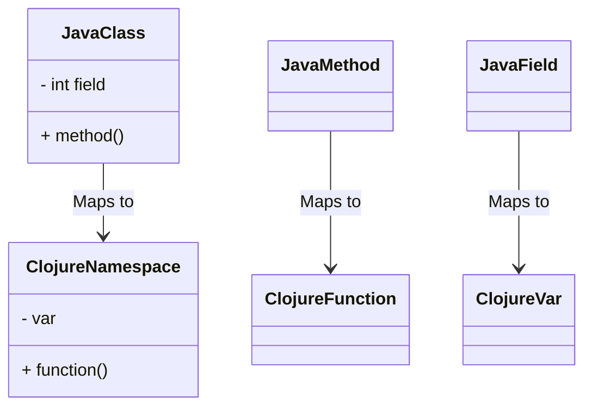

## 2.1 Values and Expressions

In the realm of functional programming, understanding the concepts of values and expressions is crucial. Clojure, a modern Lisp dialect, embraces these concepts at its core, offering a robust framework for building scalable applications. In this section, we will delve into the nature of immutable values, the distinction between expressions and statements, and how Clojure evaluates these expressions. Additionally, we will explore the concept of truthiness in Clojure, which plays a pivotal role in logical operations.

### Immutable Values

In Clojure, all values are immutable by default. This means once a value is created, it cannot be changed. This immutability is a cornerstone of functional programming, offering numerous benefits such as thread safety and predictability. 

#### Why Immutability Matters

Immutability eliminates side effects, making functions more predictable and easier to test. When a function operates on immutable data, it cannot alter the original data, ensuring that the function's behavior is consistent and reliable. This is a stark contrast to Java, where objects can be mutable, leading to potential side effects and bugs.

#### Code Example: Immutable Values

Let's consider an example to illustrate immutability in Clojure:

```clojure
(def my-list [1 2 3 4 5])

;; Attempting to change the first element
(def new-list (assoc my-list 0 10))

;; Print both lists
(println "Original List:" my-list)  ; Output: Original List: [1 2 3 4 5]
(println "New List:" new-list)      ; Output: New List: [10 2 3 4 5]
```

In this example, `my-list` remains unchanged even after attempting to modify it. Instead, `assoc` returns a new list with the modification, demonstrating immutability.

### Expressions over Statements

Clojure is an expression-oriented language, meaning that almost everything is an expression that returns a value. This is different from languages like Java, where the distinction between statements and expressions is more pronounced.

#### Expressions vs. Statements

In Java, a statement performs an action but does not return a value, while an expression evaluates to a value. For example:

```java
// Java example
int x = 5; // Statement
int y = x + 2; // Expression
```

In Clojure, everything is an expression:

```clojure
;; Clojure example
(def x 5)  ; Expression
(def y (+ x 2))  ; Expression
```

#### Evaluating Expressions

Expressions in Clojure are evaluated in a straightforward manner. Let's explore some simple and nested expressions:

```clojure
;; Simple expressions
(+ 1 2)  ; Evaluates to 3
(* 3 4)  ; Evaluates to 12

;; Nested expressions
(+ (* 2 3) (/ 10 2))  ; Evaluates to 11
```

In these examples, each expression is evaluated to produce a result. The nested expression `(+ (* 2 3) (/ 10 2))` demonstrates how Clojure handles operator precedence by evaluating the innermost expressions first.

#### Try It Yourself

Experiment with these expressions in the Clojure REPL. Modify the numbers and operators to see how the results change. This hands-on practice will deepen your understanding of expression evaluation in Clojure.

### Understanding Truthiness

In Clojure, logical operations rely on the concept of truthiness. Unlike some languages that have strict boolean types, Clojure considers any value other than `nil` or `false` to be truthy.

#### Logical Values in Clojure

Let's explore how truthiness works in Clojure:

```clojure
;; Truthy values
(if 42 "Truth" "Falsehood")  ; Evaluates to "Truth"
(if [] "Truth" "Falsehood")  ; Evaluates to "Truth"

;; Falsey values
(if nil "Truth" "Falsehood")  ; Evaluates to "Falsehood"
(if false "Truth" "Falsehood")  ; Evaluates to "Falsehood"
```

In these examples, `42` and `[]` are considered truthy, while `nil` and `false` are falsey.

#### Practical Implications

Understanding truthiness is essential for writing conditional logic in Clojure. It allows for concise and expressive code, as you can use a wide range of values in conditional expressions.

### Visual Aids

To further illustrate these concepts, let's explore a diagram that compares Java's class-based structure with Clojure's namespace and function-based structure. This will help Java developers transitioning to Clojure understand the differences in code organization.



**Diagram Explanation:** This diagram shows how Java classes and methods map to Clojure namespaces and functions. In Clojure, functions are first-class citizens, and namespaces organize code, replacing the need for classes.

### References and Links

For further reading and exploration, consider the following resources:

- [Clojure Official Documentation](https://clojure.org/reference)
- [Transitioning from OOP to Functional Programming](https://www.lispcast.com/oo-to-fp/)
- [Clojure Community Resources](https://clojure.org/community/resources)

### Knowledge Check

To reinforce your understanding, consider these questions:

- Why is immutability important in functional programming?
- How do expressions differ from statements in Clojure?
- What values are considered truthy in Clojure?

### Exercises

1. **Immutable Data Structures**: Create a vector and attempt to modify it. Observe how Clojure handles the immutability.
2. **Expression Evaluation**: Write a nested expression and evaluate it in the REPL. Change the order of operations and observe the results.
3. **Truthiness Exploration**: Experiment with different values in an `if` expression to see which are considered truthy or falsey.

### Encouraging Engagement

Embracing functional programming can be challenging, but with each step, you'll gain a deeper understanding and see tangible benefits in your codebase. Keep experimenting with Clojure's expressions and values, and you'll soon master the art of functional programming.

### Summary

In this section, we've explored the fundamental concepts of values and expressions in Clojure. We've seen how immutability provides a solid foundation for functional programming, how expressions differ from statements, and how truthiness affects logical operations. By understanding these core concepts, you're well on your way to mastering Clojure and building scalable, efficient applications.

## **Test Your Knowledge: Values and Expressions Quiz**



### Which of the following is considered truthy in Clojure?

- [x] 0
- [ ] nil
- [ ] false
- [ ] ""

> **Explanation:** In Clojure, any value other than `nil` or `false` is considered truthy, including `0` and an empty string `""`.

### What is the result of the expression `(+ 1 2 3)` in Clojure?

- [x] 6
- [ ] 5
- [ ] 7
- [ ] 3

> **Explanation:** The expression `(+ 1 2 3)` adds the numbers together, resulting in `6`.

### How does Clojure handle immutability?

- [x] By creating new values instead of modifying existing ones
- [ ] By locking data structures
- [ ] By using mutable variables
- [ ] By using synchronized methods

> **Explanation:** Clojure handles immutability by creating new values when modifications are needed, rather than altering existing ones.

### What is the primary difference between expressions and statements?

- [x] Expressions return values, while statements perform actions
- [ ] Statements return values, while expressions perform actions
- [ ] Both expressions and statements perform actions
- [ ] Both expressions and statements return values

> **Explanation:** Expressions return values, whereas statements perform actions without returning values.

### Which of the following is an example of a Clojure expression?

- [x] (+ 1 2)
- [ ] def x 5
- [ ] if (true) "yes" "no"
- [ ] println("Hello")

> **Explanation:** `(+ 1 2)` is an expression that evaluates to a value, while `def` and `println` are more akin to statements.

### What does the `assoc` function do in Clojure?

- [x] It returns a new collection with an updated value
- [ ] It modifies the original collection
- [ ] It deletes a value from the collection
- [ ] It sorts the collection

> **Explanation:** The `assoc` function returns a new collection with the specified value updated, preserving immutability.

### In Clojure, what is the result of `(if nil "Yes" "No")`?

- [x] "No"
- [ ] "Yes"
- [ ] nil
- [ ] false

> **Explanation:** Since `nil` is falsey, the `if` expression evaluates to "No".

### What is the purpose of the REPL in Clojure?

- [x] To interactively evaluate expressions and test code
- [ ] To compile Clojure programs
- [ ] To manage project dependencies
- [ ] To deploy Clojure applications

> **Explanation:** The REPL (Read-Eval-Print Loop) allows developers to interactively evaluate expressions and test code snippets.

### How does Clojure ensure thread safety?

- [x] Through immutability and persistent data structures
- [ ] By using locks and synchronized blocks
- [ ] By using thread-local variables
- [ ] By using atomic variables

> **Explanation:** Clojure ensures thread safety through immutability and the use of persistent data structures, which prevent data races.

### True or False: In Clojure, all values are mutable by default.

- [ ] True
- [x] False

> **Explanation:** False. In Clojure, all values are immutable by default, which is a key feature of functional programming.



By mastering the core concepts of values and expressions in Clojure, you lay the groundwork for building powerful, scalable applications. Continue exploring and experimenting with these ideas to deepen your understanding and proficiency in functional programming.
