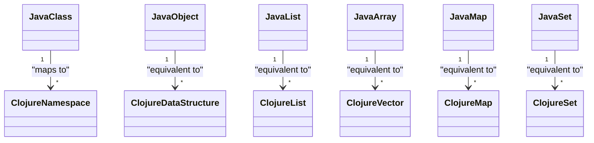

## 2.2 Data Types and Structures in Clojure

In this section, we delve into the essential data types and structures that form the backbone of Clojure's functional programming paradigm. Understanding these data types is crucial for building scalable, efficient applications. We'll explore scalar types, collection types, nested data structures, and the functions that allow us to interact with these structures.

### Scalar Types

Clojure provides several scalar types that serve as the building blocks for more complex data structures. Let's explore these fundamental types:

#### Numbers

Clojure supports a variety of numeric types, including integers, floating-point numbers, and ratios. These types are immutable, meaning their values cannot be changed once created.

```clojure
;; Integer
(def my-int 42)

;; Floating-point number
(def my-float 3.14)

;; Ratio
(def my-ratio 22/7)

;; Arithmetic operations
(+ my-int my-float)  ; Addition
(* my-int my-ratio)  ; Multiplication
```

#### Strings

Strings in Clojure are immutable sequences of characters. They are enclosed in double quotes and can be manipulated using various string functions.

```clojure
(def my-string "Hello, Clojure!")

;; String concatenation
(str my-string " How are you?")

;; String length
(count my-string)
```

#### Keywords

Keywords are symbolic identifiers that evaluate to themselves. They are often used as keys in maps due to their efficiency and readability.

```clojure
(def my-keyword :name)

;; Using keywords in maps
(def person {:name "Alice" :age 30})

;; Accessing map values
(get person :name)
```

#### Symbols

Symbols are used to refer to variables and functions. They are typically created by the reader when it encounters identifiers in code.

```clojure
(def my-symbol 'foo)

;; Using symbols to refer to functions
(defn greet [name]
  (str "Hello, " name "!"))

(greet 'Alice)
```

### Collection Types

Clojure's collection types are immutable and persistent, providing efficient means to store and manipulate data. Let's explore the primary collection types:

#### Lists

Lists are ordered collections of elements, typically used for sequential access. They are defined using parentheses.

```clojure
(def my-list '(1 2 3 4 5))

;; Accessing elements
(first my-list)  ; Returns 1
(rest my-list)   ; Returns (2 3 4 5)
```

#### Vectors

Vectors are indexed collections that provide efficient random access. They are defined using square brackets.

```clojure
(def my-vector [1 2 3 4 5])

;; Accessing elements
(nth my-vector 2)  ; Returns 3
```

#### Maps

Maps are collections of key-value pairs, providing efficient lookup and retrieval. They are defined using curly braces.

```clojure
(def my-map {:name "Alice" :age 30})

;; Accessing values
(get my-map :name)  ; Returns "Alice"
```

#### Sets

Sets are collections of unique elements, often used to test membership. They are defined using hash braces.

```clojure
(def my-set #{1 2 3 4 5})

;; Checking membership
(contains? my-set 3)  ; Returns true
```

### Nested Data Structures

Clojure allows for the creation of complex, nested data structures by combining its collection types. This enables developers to model intricate data relationships.

```clojure
(def nested-structure
  {:user {:name "Alice"
          :address {:city "Wonderland"
                    :zip 12345}}
   :orders [{:id 1 :item "Book" :quantity 2}
            {:id 2 :item "Pen" :quantity 5}]})

;; Accessing nested data
(get-in nested-structure [:user :address :city])  ; Returns "Wonderland"
```

### Accessing and Updating Collections

Clojure provides a rich set of functions to access and update collections. Let's explore some of these functions:

#### Accessing Collections

- **`get`**: Retrieve a value from a map or vector.
- **`first`**: Get the first element of a list or sequence.
- **`rest`**: Get all elements except the first from a list or sequence.

```clojure
(def my-map {:name "Alice" :age 30})
(get my-map :name)  ; Returns "Alice"

(def my-list '(1 2 3 4 5))
(first my-list)     ; Returns 1
(rest my-list)      ; Returns (2 3 4 5)
```

#### Updating Collections

- **`assoc`**: Associate a new key-value pair in a map.
- **`conj`**: Add an element to a collection.
- **`dissoc`**: Dissociate a key from a map.

```clojure
(def my-map {:name "Alice" :age 30})

;; Adding a new key-value pair
(def updated-map (assoc my-map :email "alice@example.com"))

;; Adding an element to a vector
(def my-vector [1 2 3])
(def updated-vector (conj my-vector 4))

;; Removing a key from a map
(def reduced-map (dissoc my-map :age))
```

### Try It Yourself

Experiment with the following code snippets to deepen your understanding of Clojure's data types and structures. Try modifying the examples to see how changes affect the output.

```clojure
;; Experiment with different data types
(def my-number 100)
(def my-string "Functional Programming")

;; Create a nested map and access its elements
(def my-nested-map {:user {:name "Bob" :age 25}})
(get-in my-nested-map [:user :name])

;; Update collections and observe changes
(def my-set #{1 2 3})
(def updated-set (conj my-set 4))
```

### Visual Aids

To better understand the relationship between Clojure's data structures and their Java counterparts, consider the following diagram:



**Diagram Description:** This diagram illustrates how Java classes and objects map to Clojure namespaces and data structures. It highlights the equivalence between Java lists, arrays, maps, and sets with their Clojure counterparts.

### References and Links

- [Clojure Official Documentation](https://clojure.org/reference)
- [Clojure Community Resources](https://clojure.org/community/resources)
- [Transitioning from OOP to Functional Programming](https://www.lispcast.com/oo-to-fp/)

### Knowledge Check

To reinforce your understanding of Clojure's data types and structures, consider the following questions:

1. What are the primary scalar types in Clojure?
2. How do you define a vector in Clojure?
3. What function would you use to add an element to a set?
4. How can you access a nested value in a map?
5. What are the benefits of using immutable data structures?

### Exercises

1. Create a nested data structure representing a book library, including books and authors.
2. Write a function to update the quantity of a specific item in an order list.
3. Experiment with adding and removing elements from a set and observe the results.

### Summary

In this section, we've explored Clojure's scalar and collection types, including numbers, strings, keywords, symbols, lists, vectors, maps, and sets. We've also examined how to create and manipulate nested data structures and use functions to access and update collections. Understanding these data types and structures is crucial for mastering functional programming with Clojure.

## **Test Your Knowledge: Data Types and Structures in Clojure Quiz**



### What are the primary scalar types in Clojure?

- [x] Numbers, Strings, Keywords, Symbols
- [ ] Integers, Floats, Booleans
- [ ] Arrays, Lists, Sets
- [ ] Classes, Objects, Methods

> **Explanation:** Clojure's primary scalar types include numbers, strings, keywords, and symbols, which are foundational for building more complex data structures.

### How do you define a vector in Clojure?

- [x] Using square brackets, e.g., `[1 2 3]`
- [ ] Using parentheses, e.g., `(1 2 3)`
- [ ] Using curly braces, e.g., `{1 2 3}`
- [ ] Using angle brackets, e.g., `<1 2 3>`

> **Explanation:** Vectors in Clojure are defined using square brackets, providing efficient indexed access to elements.

### What function would you use to add an element to a set?

- [x] `conj`
- [ ] `assoc`
- [ ] `dissoc`
- [ ] `insert`

> **Explanation:** The `conj` function is used to add an element to a collection, including sets, in Clojure.

### How can you access a nested value in a map?

- [x] Using the `get-in` function
- [ ] Using the `assoc` function
- [ ] Using the `conj` function
- [ ] Using the `dissoc` function

> **Explanation:** The `get-in` function is used to access nested values in a map by providing a sequence of keys.

### What are the benefits of using immutable data structures?

- [x] Thread safety and predictability
- [ ] Faster execution speed
- [x] Easier reasoning about code
- [ ] Reduced memory usage

> **Explanation:** Immutable data structures provide thread safety and predictability, making it easier to reason about code, especially in concurrent environments.

### Which collection type is best for efficient random access?

- [x] Vector
- [ ] List
- [ ] Map
- [ ] Set

> **Explanation:** Vectors provide efficient random access to elements, making them ideal for scenarios where indexed access is required.

### How do you remove a key-value pair from a map?

- [x] Using the `dissoc` function
- [ ] Using the `assoc` function
- [ ] Using the `remove` function
- [ ] Using the `delete` function

> **Explanation:** The `dissoc` function is used to remove a key-value pair from a map in Clojure.

### What is a common use case for keywords in Clojure?

- [x] As keys in maps
- [ ] As variable names
- [ ] As function names
- [ ] As data types

> **Explanation:** Keywords are commonly used as keys in maps due to their efficiency and readability.

### How do you create a ratio in Clojure?

- [x] Using the `/` operator, e.g., `22/7`
- [ ] Using the `ratio` function
- [ ] Using the `:` symbol
- [ ] Using the `#` symbol

> **Explanation:** Ratios in Clojure are created using the `/` operator, allowing precise representation of fractional numbers.

### True or False: All Clojure collections are mutable.

- [ ] True
- [x] False

> **Explanation:** Clojure collections are immutable, meaning their values cannot be changed once created, which is a core aspect of Clojure's functional programming paradigm.



By mastering Clojure's data types and structures, you're well on your way to building scalable, efficient applications. Keep experimenting and exploring to deepen your understanding and proficiency.
