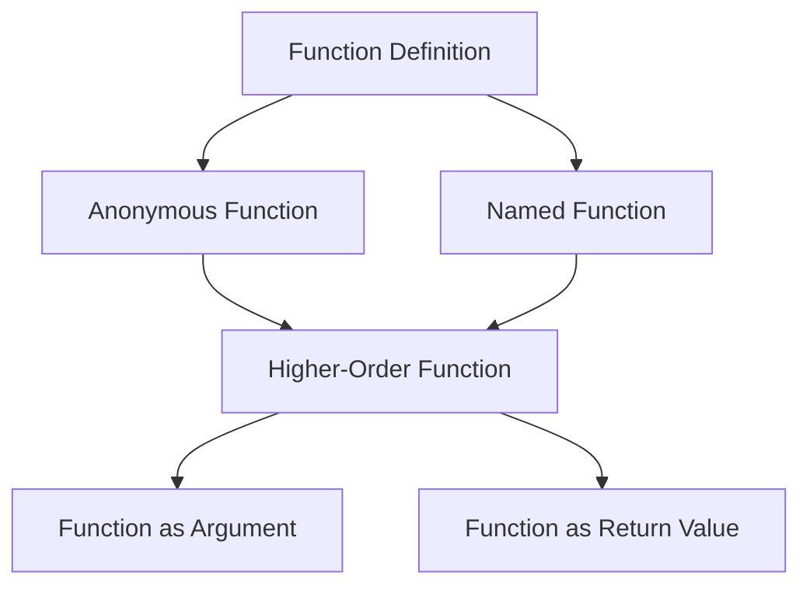

## 2.3 Functions as First-Class Citizens

In the realm of functional programming, the concept of functions as first-class citizens is foundational. This principle allows functions to be treated like any other data type, such as integers or strings. In Clojure, this capability empowers developers to write more abstract, flexible, and reusable code. In this section, we will explore how to define functions, utilize anonymous functions, pass functions as arguments, and return functions from other functions, thereby enabling higher-order programming.

### Defining Functions

In Clojure, functions are defined using the `defn` keyword. This keyword allows us to create named functions that can be reused throughout our codebase. Let's look at a simple example:

```clojure
(defn greet
  "A simple function that greets a person by name."
  [name]
  (str "Hello, " name "!"))

;; Usage
(greet "Alice") ; => "Hello, Alice!"
```

**Explanation:**

- **`defn`**: This keyword is used to define a new function. It is followed by the function name, an optional docstring, a vector of parameters, and the function body.
- **Docstring**: The string following the function name serves as documentation. It describes the purpose of the function.
- **Parameters**: Enclosed in square brackets, these are the inputs to the function.
- **Function Body**: This is the code that executes when the function is called. It can consist of one or more expressions.

### Anonymous Functions

Anonymous functions, also known as lambda expressions, are functions without a name. They are useful for short-lived operations or when passing a function as an argument. In Clojure, anonymous functions can be created using the `fn` keyword or the shorthand `#()` syntax.

**Using `fn`:**

```clojure
;; Anonymous function using fn
(fn [x] (* x x))

;; Usage with map
(map (fn [x] (* x x)) [1 2 3 4]) ; => (1 4 9 16)
```

**Using `#()`:**

```clojure
;; Anonymous function using #()
(map #(* % %) [1 2 3 4]) ; => (1 4 9 16)
```

**Explanation:**

- **`fn`**: This keyword is used to create an anonymous function. It is followed by a vector of parameters and the function body.
- **`#()`**: This is a shorthand syntax for creating anonymous functions. `%` is used to refer to the parameters.

### Passing Functions as Arguments

One of the powerful features of treating functions as first-class citizens is the ability to pass them as arguments to other functions. This enables a high level of abstraction and code reuse.

```clojure
(defn apply-twice
  "Applies a function f to x twice."
  [f x]
  (f (f x)))

;; Usage
(apply-twice inc 5) ; => 7
```

**Explanation:**

- **`apply-twice`**: This function takes another function `f` and a value `x` as arguments. It applies `f` to `x` twice.
- **Higher-Order Function**: `apply-twice` is an example of a higher-order function, as it takes a function as an argument.

### Returning Functions

Clojure allows functions to return other functions, which is a cornerstone of higher-order programming. This capability enables the creation of function factories or closures.

```clojure
(defn make-adder
  "Returns a function that adds n to its argument."
  [n]
  (fn [x] (+ n x)))

;; Usage
(def add-five (make-adder 5))
(add-five 10) ; => 15
```

**Explanation:**

- **`make-adder`**: This function returns a new function that adds `n` to its argument `x`.
- **Closure**: The returned function captures the environment in which it was created, allowing it to remember the value of `n`.

### Parallels with Java OOP

For Java developers transitioning to Clojure, understanding functions as first-class citizens can be facilitated by drawing parallels with Java concepts:

- **Methods vs. Functions**: In Java, methods are tied to classes and objects, whereas in Clojure, functions are standalone entities.
- **Lambda Expressions**: Java 8 introduced lambda expressions, which are similar to Clojure's anonymous functions.
- **Functional Interfaces**: Java's functional interfaces, like `Function<T, R>`, can be seen as a way to pass functions as arguments, akin to higher-order functions in Clojure.

### Try It Yourself

To deepen your understanding, try modifying the examples above:

1. **Create a function** that multiplies a number by a given factor, then use it with `apply-twice`.
2. **Experiment with anonymous functions** by writing a custom filter function that removes even numbers from a list.
3. **Write a function** that returns a function to check if a number is greater than a given threshold.

### Visual Aids

Below is a diagram illustrating how functions as first-class citizens enable flexible code structures:



**Diagram Explanation:**

- **Function Definition**: The starting point for creating functions.
- **Anonymous Function**: Functions without names, used for short-lived operations.
- **Named Function**: Functions defined with `defn` for reuse.
- **Higher-Order Function**: Functions that take or return other functions.
- **Function as Argument**: Passing functions to other functions.
- **Function as Return Value**: Returning functions from other functions.

### References and Links

For further reading and exploration, consider the following resources:

- [Clojure Official Documentation](https://clojure.org/reference)
- [Clojure Community Resources](https://clojure.org/community/resources)
- [Transitioning from OOP to Functional Programming](https://www.lispcast.com/oo-to-fp/)

### Knowledge Check

To reinforce your understanding, consider these questions:

1. What are the benefits of treating functions as first-class citizens?
2. How do anonymous functions differ from named functions in Clojure?
3. What is a higher-order function, and how does it enhance code flexibility?

### Exercises

1. **Define a function** that takes a list of numbers and a function, applying the function to each number.
2. **Create a function factory** that returns functions for basic arithmetic operations (add, subtract, multiply, divide).
3. **Implement a closure** that maintains a running total of numbers passed to it.

### Encouraging Engagement

Embracing functional programming can be challenging, but with each step, you'll gain a deeper understanding and see tangible benefits in your codebase. As you experiment with functions as first-class citizens, you'll discover new ways to abstract and simplify your code, making it more robust and maintainable.

## **Test Your Knowledge: Functions as First-Class Citizens Quiz**



### What is a first-class function?

- [x] A function that can be treated like any other data type
- [ ] A function that is the main entry point of a program
- [ ] A function that is defined at the top of a file
- [ ] A function that cannot be passed as an argument

> **Explanation:** First-class functions can be assigned to variables, passed as arguments, and returned from other functions.

### How do you define an anonymous function in Clojure using shorthand syntax?

- [x] `#()`
- [ ] `fn()`
- [ ] `lambda()`
- [ ] `defn()`

> **Explanation:** The `#()` syntax is a shorthand for defining anonymous functions in Clojure.

### What keyword is used to define a named function in Clojure?

- [x] `defn`
- [ ] `fn`
- [ ] `def`
- [ ] `let`

> **Explanation:** `defn` is used to define named functions in Clojure.

### What is a higher-order function?

- [x] A function that takes or returns other functions
- [ ] A function that is defined in a higher scope
- [ ] A function that is more complex than others
- [ ] A function that is always recursive

> **Explanation:** Higher-order functions can take functions as arguments or return them as results.

### Which of the following is an example of a closure?

- [x] A function that captures variables from its surrounding scope
- [ ] A function that is defined inside another function
- [x] A function that returns another function
- [ ] A function that modifies global state

> **Explanation:** Closures capture variables from their creation context and can return other functions.

### What is the purpose of the `apply-twice` function in the example?

- [x] To apply a given function to a value twice
- [ ] To double the result of a function
- [ ] To apply two different functions to a value
- [ ] To combine two functions into one

> **Explanation:** `apply-twice` applies the same function to a value two times.

### How can you pass a function as an argument in Clojure?

- [x] By using it as a parameter in another function call
- [ ] By defining it inside the function
- [x] By using `fn` to create it inline
- [ ] By converting it to a string first

> **Explanation:** Functions can be passed directly as arguments or created inline using `fn`.

### What is the output of `(map #(* % %) [1 2 3 4])`?

- [x] `(1 4 9 16)`
- [ ] `(2 4 6 8)`
- [ ] `(1 2 3 4)`
- [ ] `(0 1 4 9)`

> **Explanation:** The anonymous function squares each element in the list.

### True or False: A function can return another function in Clojure.

- [x] True
- [ ] False

> **Explanation:** Functions in Clojure can return other functions, enabling powerful abstractions.

### What is a common use case for anonymous functions?

- [x] Short-lived operations or inline function definitions
- [ ] Defining complex algorithms
- [ ] Creating global variables
- [ ] Structuring large applications

> **Explanation:** Anonymous functions are often used for short-lived tasks or when passing functions as arguments.


