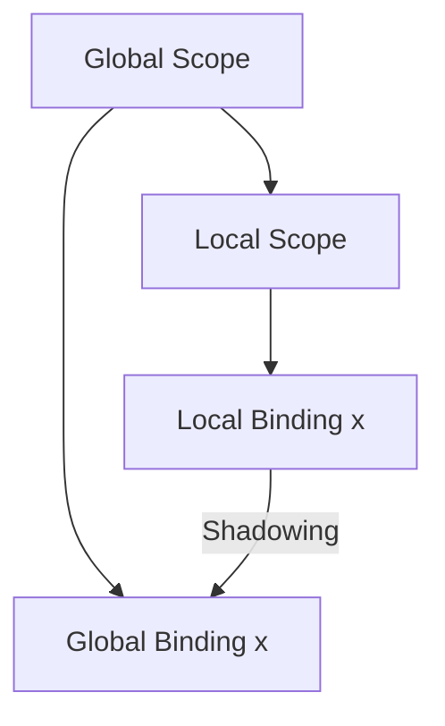

## 2.4 Immutable Variables and Bindings

In the realm of functional programming, immutability stands as a cornerstone principle that ensures the predictability and reliability of code. Clojure, as a functional language, embraces immutability by default, offering a robust framework for developers to build scalable and efficient applications. In this section, we will delve into the concepts of immutable variables and bindings in Clojure, exploring the use of `def` and `let` for creating constants and local scopes. We will also discuss the practical implications of immutability, including variable shadowing and its role in crafting safer code.

### Defining Constants with `def`

In Clojure, the `def` keyword is used to bind a name to a value, effectively creating a constant. This is akin to defining a static final variable in Java, where the value cannot be changed once assigned. The immutability of these bindings ensures that the state of the program remains consistent, reducing the risk of side effects and bugs.

```clojure
(def pi 3.14159) ; Define a constant named 'pi'
(def greeting "Hello, World!") ; Define a constant named 'greeting'
```

In the above examples, `pi` and `greeting` are constants that hold immutable values. Once defined, these values cannot be altered, providing a stable reference throughout the program.

#### Code Example: Using `def`

Let's see a practical example of using `def` in a Clojure program:

```clojure
(def base-url "https://api.example.com")

(defn fetch-data [endpoint]
  (str base-url endpoint))

(fetch-data "/users") ; Returns "https://api.example.com/users"
```

In this example, `base-url` is a constant representing the base URL of an API. The `fetch-data` function constructs a full URL by appending an endpoint to the base URL. The immutability of `base-url` ensures that the API's base URL remains consistent across different parts of the application.

### Local Bindings with `let`

While `def` is used for global bindings, Clojure provides the `let` construct for creating local bindings within a specific scope. This is similar to declaring local variables within a method in Java. Local bindings are useful for managing temporary values and computations within a function or block of code.

```clojure
(let [x 10
      y 20]
  (+ x y)) ; Returns 30
```

In the above example, `x` and `y` are local bindings that exist only within the scope of the `let` block. Once the block is exited, these bindings are no longer accessible.

#### Code Example: Using `let`

Consider a function that calculates the area of a rectangle:

```clojure
(defn rectangle-area [length width]
  (let [area (* length width)]
    (str "The area is " area)))

(rectangle-area 5 10) ; Returns "The area is 50"
```

Here, the `let` construct is used to bind the result of the multiplication to the local variable `area`. This binding is then used to construct a string that describes the area of the rectangle.

### Immutability in Practice

Immutability is a powerful concept that promotes safer and more predictable code. In Clojure, once a variable is bound to a value, it cannot be reassigned. This eliminates a whole class of bugs related to mutable state and side effects that are common in imperative programming languages.

#### Benefits of Immutability

1. **Thread Safety**: Immutable data structures are inherently thread-safe, as they cannot be modified after creation. This simplifies concurrent programming and reduces the risk of race conditions.

2. **Predictability**: With immutable variables, the behavior of a program is more predictable, as functions cannot alter the state of the system.

3. **Ease of Reasoning**: Immutability makes it easier to reason about code, as the state of variables remains constant throughout their scope.

4. **Functional Purity**: Immutability aligns with the principles of functional programming, where functions are pure and free of side effects.

### Variable Shadowing

Variable shadowing occurs when a local binding in a `let` block has the same name as a global binding created with `def`. In such cases, the local binding takes precedence within its scope, effectively "shadowing" the global binding.

```clojure
(def x 100)

(let [x 10]
  (println x)) ; Prints 10

(println x) ; Prints 100
```

In this example, the global binding `x` is shadowed by the local binding within the `let` block. As a result, the value printed inside the block is `10`, while outside the block, the global value `100` is printed.

#### Implications of Variable Shadowing

1. **Scope Clarity**: Shadowing can lead to confusion if not used carefully, as it may not be immediately clear which binding is being referenced.

2. **Code Readability**: To maintain readability, it's important to use descriptive names for local bindings and avoid shadowing unless necessary.

3. **Functional Isolation**: Shadowing can be useful for isolating computations within a function, ensuring that local changes do not affect global state.

### Try It Yourself

Experiment with the following code snippets to deepen your understanding of immutable variables and bindings in Clojure:

```clojure
; Define a global constant
(def max-value 100)

; Create a function that uses local bindings
(defn calculate-difference [a b]
  (let [difference (- a b)
        max-difference (min difference max-value)]
    (println "Difference:" difference)
    (println "Max Difference:" max-difference)))

; Test the function
(calculate-difference 150 30)
```

**Suggestions for Experimentation:**

- Try changing the value of `max-value` and observe the behavior of the `calculate-difference` function.
- Add additional local bindings within the `let` block to perform more complex calculations.
- Experiment with variable shadowing by introducing a local binding with the same name as `max-value`.

### Visual Aids

To further illustrate the concept of variable shadowing and scope, consider the following diagram:



**Diagram Description:** This diagram shows the relationship between global and local scopes in Clojure. The local binding `x` within the `let` block shadows the global binding `x`, demonstrating how local bindings take precedence within their scope.

### References and Links

For more information on Clojure's approach to immutability and bindings, consider exploring the following resources:

- [Clojure Official Documentation](https://clojure.org/reference)
- [Transitioning from OOP to Functional Programming](https://www.lispcast.com/oo-to-fp/)
- [Clojure Community Resources](https://clojure.org/community/resources)

### Knowledge Check

To reinforce your understanding of immutable variables and bindings in Clojure, answer the following questions:

1. What is the primary purpose of using `def` in Clojure?
2. How does the `let` construct differ from `def`?
3. What are the benefits of immutability in functional programming?
4. How does variable shadowing occur in Clojure?
5. Why is immutability important for thread safety?

### Exercises

1. **Exercise 1**: Write a function that calculates the factorial of a number using local bindings with `let`.

2. **Exercise 2**: Modify the `rectangle-area` function to include a local binding for perimeter calculation.

3. **Exercise 3**: Create a program that demonstrates variable shadowing with multiple nested `let` blocks.

### Solutions

**Exercise 1 Solution:**

```clojure
(defn factorial [n]
  (let [fact (fn [n acc]
               (if (zero? n)
                 acc
                 (recur (dec n) (* acc n))))]
    (fact n 1)))

(factorial 5) ; Returns 120
```

**Exercise 2 Solution:**

```clojure
(defn rectangle-area-perimeter [length width]
  (let [area (* length width)
        perimeter (+ (* 2 length) (* 2 width))]
    (str "The area is " area " and the perimeter is " perimeter)))

(rectangle-area-perimeter 5 10) ; Returns "The area is 50 and the perimeter is 30"
```

**Exercise 3 Solution:**

```clojure
(def x 50)

(let [x 20]
  (println "Outer let x:" x)
  (let [x 10]
    (println "Inner let x:" x)))

(println "Global x:" x)
```

## **Test Your Knowledge: Immutable Variables and Bindings Quiz**



### What is the primary purpose of using `def` in Clojure?

- [x] To bind a name to a value, creating a constant
- [ ] To define a mutable variable
- [ ] To create a local binding
- [ ] To declare a function

> **Explanation:** The `def` keyword in Clojure is used to bind a name to a value, making it immutable and constant throughout the program.

### How does the `let` construct differ from `def`?

- [x] `let` creates local bindings within a scope
- [ ] `let` creates global constants
- [ ] `let` is used for defining functions
- [ ] `let` is used for mutable variables

> **Explanation:** The `let` construct is used for creating local bindings within a specific scope, unlike `def`, which creates global constants.

### Which of the following is a benefit of immutability in functional programming?

- [x] Thread safety
- [ ] Increased complexity
- [ ] Mutable state
- [ ] Unpredictable behavior

> **Explanation:** Immutability ensures thread safety by preventing data from being modified after creation, reducing the risk of race conditions.

### How does variable shadowing occur in Clojure?

- [x] When a local binding in a `let` block has the same name as a global binding
- [ ] When a global binding overrides a local binding
- [ ] When a function name is reused
- [ ] When a variable is reassigned

> **Explanation:** Variable shadowing occurs when a local binding in a `let` block has the same name as a global binding, taking precedence within its scope.

### Why is immutability important for thread safety?

- [x] It prevents data from being modified concurrently
- [ ] It allows data to be changed freely
- [ ] It increases the complexity of code
- [ ] It requires additional synchronization

> **Explanation:** Immutability prevents data from being modified concurrently, eliminating the need for synchronization and reducing the risk of race conditions.

### What does the `let` construct return in Clojure?

- [x] The value of the last expression within its scope
- [ ] The first binding defined
- [ ] The sum of all bindings
- [ ] The value of the first expression

> **Explanation:** The `let` construct returns the value of the last expression evaluated within its scope.

### In Clojure, what is a key advantage of using `def` for global constants?

- [x] Consistency across the entire program
- [ ] Ability to change values dynamically
- [ ] Simplified debugging
- [ ] Enhanced performance

> **Explanation:** Using `def` for global constants ensures consistency across the entire program, as the values cannot be changed once defined.

### What happens if you try to reassign a value to a `def` binding in Clojure?

- [x] An error occurs
- [ ] The value is updated
- [ ] The program crashes
- [ ] The binding is ignored

> **Explanation:** Attempting to reassign a value to a `def` binding results in an error, as Clojure enforces immutability for such bindings.

### What is the scope of a binding created with `let`?

- [x] Local to the `let` block
- [ ] Global across the program
- [ ] Local to the entire function
- [ ] Local to the namespace

> **Explanation:** A binding created with `let` is local to the `let` block and is not accessible outside of it.

### True or False: In Clojure, once a variable is bound to a value, it can be reassigned.

- [ ] True
- [x] False

> **Explanation:** False. In Clojure, once a variable is bound to a value, it cannot be reassigned, adhering to the principle of immutability.



By mastering the concepts of immutable variables and bindings in Clojure, you are taking a significant step towards building scalable and reliable functional applications. Embrace the power of immutability and see how it transforms your approach to programming.
