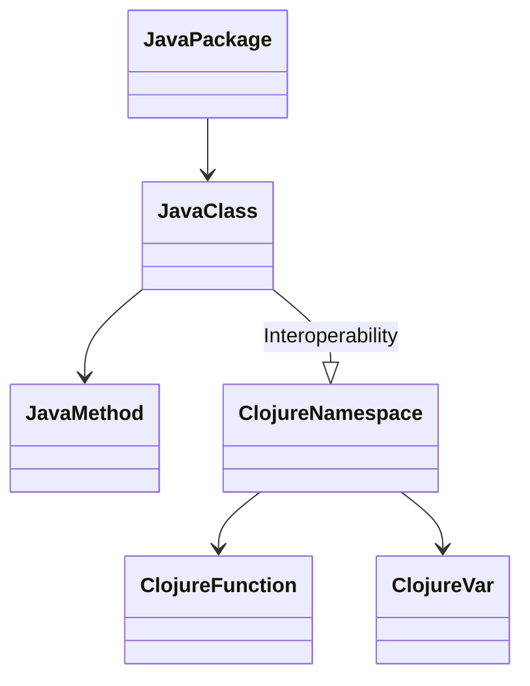

## 2.5 Organizing Code with Namespaces

In Clojure, organizing code efficiently is crucial for building scalable and maintainable applications. Namespaces play a pivotal role in structuring your codebase, similar to how packages work in Java. They allow you to group related functions and data structures, manage dependencies, and avoid naming conflicts. In this section, we will explore how to create, reference, and alias namespaces, and discuss best practices for using namespaces effectively.

### Creating Namespaces

To define a namespace in Clojure, use the `ns` macro. This is analogous to declaring a package in Java, where you specify the context in which your code will operate. The `ns` macro also allows you to manage dependencies and import other namespaces.

#### Defining a Namespace

Let's start by defining a simple namespace:

```clojure
(ns myapp.core)
```

This line establishes a new namespace called `myapp.core`. All subsequent definitions (functions, variables, etc.) will belong to this namespace. It's a good practice to mirror your project structure with your namespace hierarchy, much like you would with Java packages.

#### Including Dependencies

The `ns` macro can also be used to include other namespaces, Java classes, and libraries. Here's an example:

```clojure
(ns myapp.core
  (:require [clojure.string :as str]
            [myapp.utils :refer [helper-fn]])
  (:import (java.util Date)))
```

- **`:require`**: This is used to include other Clojure namespaces. You can alias them for brevity using `:as`.
- **`:refer`**: This allows you to bring specific functions or variables into the current namespace.
- **`:import`**: Use this to include Java classes, enabling interoperability with Java libraries.

### Referencing Other Namespaces

Clojure provides several ways to reference code from other namespaces, each with its own use case and syntax. Understanding these options will help you manage dependencies effectively.

#### Using `require`

The `require` function is the most common way to include other namespaces. It loads the specified namespace and makes its public functions available.

```clojure
(require '[clojure.set :as set])

(set/union #{1 2 3} #{3 4 5})
```

In this example, we alias `clojure.set` as `set` for convenience, allowing us to use `set/union` instead of `clojure.set/union`.

#### Using `use`

The `use` function is similar to `require`, but it automatically refers all public symbols from the specified namespace into the current one. However, this can lead to naming conflicts and is generally discouraged in favor of `require`.

```clojure
(use 'clojure.string)

(upper-case "hello")
```

While `use` can simplify code, it can also obscure where functions originate, which is why `require` with `:refer` is often preferred.

#### Using `import`

The `import` function is used to bring Java classes into a Clojure namespace. This is essential for leveraging Java's extensive libraries.

```clojure
(import '(java.util Date))

(Date.)
```

Here, we import the `Date` class from `java.util`, allowing us to create new date instances directly.

### Aliasing Namespaces

Aliasing namespaces is a powerful feature that helps keep your code concise and readable. By assigning short aliases to frequently used namespaces, you can avoid repetitive and verbose code.

#### Example of Aliasing

Consider the following example where we alias `clojure.string` as `str`:

```clojure
(ns myapp.core
  (:require [clojure.string :as str]))

(defn process-string [s]
  (str/upper-case s))
```

By using `:as str`, we can refer to functions in `clojure.string` with the `str/` prefix, making our code cleaner and easier to read.

### Namespace Best Practices

Effective use of namespaces can greatly enhance the organization and scalability of your Clojure applications. Here are some best practices to consider:

#### Organize Code Logically

- **Group Related Functions**: Place related functions and data structures in the same namespace. This mirrors the logical structure of your application and makes it easier to navigate.
- **Mirror Directory Structure**: Align your namespace hierarchy with your project's directory structure. This consistency aids in locating code and understanding its context.

#### Avoid Naming Conflicts

- **Use Aliases**: To prevent conflicts, use aliases for commonly used namespaces. This also improves code readability.
- **Limit `use`**: Avoid using `use` unless necessary, as it can lead to symbol clashes. Prefer `require` with `:refer` for explicitness.

#### Manage Dependencies

- **Declare Dependencies in `ns`**: Clearly declare all dependencies at the top of your namespace using the `ns` macro. This makes it easy to see what external code your namespace relies on.
- **Minimize Imports**: Only import what you need. This reduces the risk of conflicts and keeps your namespace clean.

### Java OOP vs. Clojure Namespaces

For developers transitioning from Java, understanding how Clojure's namespaces differ from Java's packages is crucial. While both serve to organize code, Clojure namespaces offer more flexibility and are integral to the language's functional paradigm.

#### Java Packages vs. Clojure Namespaces

- **Java Packages**: Primarily used for organizing classes and interfaces. They provide a hierarchical structure but are more rigid.
- **Clojure Namespaces**: Offer a dynamic way to group functions and data. They can be modified at runtime and support features like aliasing and dynamic loading.

#### Parallels and Differences

| Feature                  | Java Packages                     | Clojure Namespaces                |
|--------------------------|-----------------------------------|-----------------------------------|
| Organization             | Hierarchical directory structure  | Flexible grouping of functions    |
| Aliasing                 | Not supported                     | Supported via `:as`               |
| Dynamic Loading          | Limited                           | Supported                         |
| Interoperability         | Java classes only                 | Java classes and Clojure namespaces|

### Try It Yourself

Experiment with namespaces by creating a simple Clojure project. Define multiple namespaces, reference them using `require` and `import`, and practice aliasing. Modify the examples above to see how changes affect your code.

### Visual Aids

Below is a diagram illustrating how Java classes map to Clojure namespaces and functions:



**Diagram Description**: This diagram shows the relationship between Java packages and classes compared to Clojure namespaces and functions. It highlights how Clojure namespaces can interact with Java classes, offering flexibility in code organization.

### References and Links

For further reading, explore the following resources:

- [Clojure Official Documentation](https://clojure.org/reference)
- [Clojure Community Resources](https://clojure.org/community/resources)
- [Transitioning from OOP to Functional Programming](https://www.lispcast.com/oo-to-fp/)

### Knowledge Check

Before moving on, consider these questions:

- How do you define a namespace in Clojure?
- What is the difference between `require` and `use`?
- How can aliasing improve code readability?

### Exercises

1. **Create a Namespace**: Define a new namespace in a Clojure project and include dependencies using `require`.
2. **Alias a Namespace**: Practice aliasing a commonly used namespace and rewrite a function to use the alias.
3. **Avoid Conflicts**: Refactor code that uses `use` to `require` with `:refer` to prevent naming conflicts.

### Key Takeaways

- **Namespaces are essential for code organization** in Clojure, providing a flexible way to manage dependencies and avoid conflicts.
- **Aliasing and careful use of `require`** can improve code readability and maintainability.
- **Understanding the differences between Java packages and Clojure namespaces** can ease the transition for Java developers.

## **Test Your Knowledge: Organizing Code with Namespaces Quiz**



### What is the primary purpose of namespaces in Clojure?

- [x] To organize code and manage dependencies
- [ ] To compile Clojure code into Java bytecode
- [ ] To provide a graphical user interface
- [ ] To execute asynchronous tasks

> **Explanation:** Namespaces in Clojure are used to organize code and manage dependencies, similar to packages in Java.

### How do you define a namespace in Clojure?

- [x] Using the `ns` macro
- [ ] Using the `package` keyword
- [ ] Using the `namespace` function
- [ ] Using the `import` statement

> **Explanation:** The `ns` macro is used to define a namespace in Clojure.

### What is the difference between `require` and `use`?

- [x] `require` loads a namespace without referring symbols, while `use` refers all public symbols
- [ ] `require` is used for Java classes, `use` for Clojure namespaces
- [ ] `require` is deprecated, `use` is recommended
- [ ] `require` is for importing functions, `use` is for importing variables

> **Explanation:** `require` loads a namespace without referring symbols, while `use` refers all public symbols, which can lead to conflicts.

### How can aliasing improve code readability?

- [x] By shortening namespace references
- [ ] By eliminating the need for namespaces
- [ ] By converting Clojure code to Java
- [ ] By providing a graphical interface

> **Explanation:** Aliasing shortens namespace references, making code more concise and readable.

### Which of the following is a best practice for avoiding naming conflicts?

- [x] Use `require` with `:refer` instead of `use`
- [ ] Use `use` for all namespaces
- [ ] Avoid using any namespaces
- [ ] Import all Java classes

> **Explanation:** Using `require` with `:refer` is a best practice to avoid naming conflicts, as it allows selective inclusion of symbols.

### What does the `import` function do in Clojure?

- [x] It brings Java classes into a Clojure namespace
- [ ] It imports Clojure functions from other namespaces
- [ ] It compiles Clojure code to Java bytecode
- [ ] It exports Clojure functions to Java

> **Explanation:** The `import` function is used to bring Java classes into a Clojure namespace.

### How should you organize your Clojure project structure?

- [x] Mirror your namespace hierarchy with your directory structure
- [ ] Place all code in a single file
- [ ] Use a flat directory structure
- [ ] Organize by function length

> **Explanation:** Mirroring your namespace hierarchy with your directory structure helps in locating and understanding the context of your code.

### What is the benefit of using `:as` in `require`?

- [x] It allows you to alias a namespace for concise code
- [ ] It automatically refers all symbols
- [ ] It compiles the namespace
- [ ] It imports Java classes

> **Explanation:** Using `:as` in `require` allows you to alias a namespace, making the code concise and readable.

### True or False: `use` is generally preferred over `require` in Clojure.

- [ ] True
- [x] False

> **Explanation:** `require` is generally preferred over `use` because it avoids naming conflicts by not automatically referring all symbols.

### How can you include specific functions from another namespace?

- [x] Use `require` with `:refer`
- [ ] Use `import` with `:refer`
- [ ] Use `ns` with `:refer`
- [ ] Use `use` with `:refer`

> **Explanation:** Using `require` with `:refer` allows you to include specific functions from another namespace.


