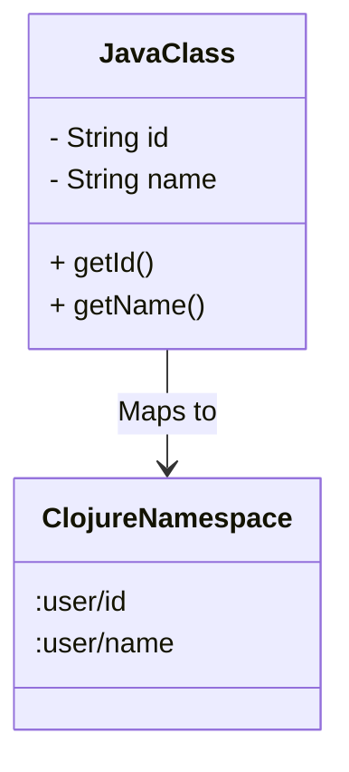

## 2.6 Understanding Namespaced Keywords

Namespaced keywords are a powerful feature in Clojure that help manage and organize data, especially in large-scale applications. They provide context, prevent naming collisions, and enhance data interoperability across different systems. In this section, we'll delve into the purpose and usage of namespaced keywords, differentiate them from code namespaces, and explore their role in data exchange.

### Purpose of Namespaced Keywords

Namespaced keywords are designed to provide a scope or context to keywords, which are often used as keys in maps or as identifiers in data structures. By prefixing a keyword with a namespace, you can avoid collisions that might occur when different parts of a program or different programs use the same keyword name for different purposes.

#### Benefits of Namespaced Keywords

- **Collision Prevention**: In large applications, different modules might define similar keywords. Namespaced keywords ensure that these do not clash by providing a unique context.
- **Clarity and Organization**: They make the data structure more readable and organized by clearly indicating the source or domain of the data.
- **Interoperability**: Namespaced keywords facilitate data exchange between systems by providing a consistent and unambiguous way to refer to data elements.

### Defining Namespaced Keywords

In Clojure, a namespaced keyword is created by prefixing a keyword with a namespace followed by a slash. For example, `:user/id` is a namespaced keyword where `user` is the namespace, and `id` is the keyword.

```clojure
;; Defining a namespaced keyword
(def user-id :user/id)

;; Using namespaced keywords in a map
(def user {:user/id 101 :user/name "Alice" :user/email "alice@example.com"})

;; Accessing values using namespaced keywords
(println (:user/name user)) ; Output: Alice
```

In this example, the `:user/id` keyword is used to uniquely identify the `id` field within the `user` namespace, preventing any potential conflicts with other `id` fields in different contexts.

### Keyword Namespaces vs. Code Namespaces

While both keyword namespaces and code namespaces serve to organize and prevent collisions, they are used in different contexts and for different purposes.

#### Keyword Namespaces

- **Purpose**: Used to provide context to data elements, especially in maps.
- **Usage**: Commonly used as keys in data structures to avoid naming conflicts.
- **Example**: `:user/id` is a keyword with the `user` namespace.

#### Code Namespaces

- **Purpose**: Used to organize code and prevent naming conflicts between functions, variables, and other code entities.
- **Usage**: Defined using the `ns` macro at the beginning of a Clojure file.
- **Example**: `(ns my-app.core)` defines a code namespace for organizing functions and variables.

```clojure
(ns my-app.core)

(defn greet [name]
  (str "Hello, " name))

;; Using the greet function within the my-app.core namespace
(println (greet "Alice")) ; Output: Hello, Alice
```

### Interoperability

Namespaced keywords play a crucial role in data exchange between systems, especially in distributed applications and microservices. They ensure that data elements are consistently identified across different systems, reducing the risk of misinterpretation.

#### Data Exchange with Namespaced Keywords

Consider a scenario where two services need to exchange user data. By using namespaced keywords, both services can agree on the structure and meaning of the data, ensuring seamless interoperability.

```clojure
;; Service A: Sending user data
(defn send-user-data []
  {:user/id 101 :user/name "Alice" :user/email "alice@example.com"})

;; Service B: Receiving user data
(defn process-user-data [data]
  (println "Processing user:" (:user/name data)))

;; Simulating data exchange
(let [user-data (send-user-data)]
  (process-user-data user-data))
```

In this example, both services use the `:user/id`, `:user/name`, and `:user/email` keywords, ensuring that the data is interpreted correctly regardless of the system.

### Code Examples

Let's explore more examples to solidify our understanding of namespaced keywords.

#### Example 1: Avoiding Collisions

Suppose we have two different data structures representing a `user` and a `product`, both having an `id` field. Using namespaced keywords, we can avoid collisions.

```clojure
(def user {:user/id 101 :user/name "Alice"})
(def product {:product/id 202 :product/name "Laptop"})

;; Accessing values
(println (:user/id user))     ; Output: 101
(println (:product/id product)) ; Output: 202
```

#### Example 2: Enhancing Clarity

Namespaced keywords can make complex data structures more readable by clearly indicating the domain of each field.

```clojure
(def order {:order/id 303
            :order/user {:user/id 101 :user/name "Alice"}
            :order/items [{:product/id 202 :product/name "Laptop"}]})

;; Accessing nested values
(println (:user/name (:order/user order))) ; Output: Alice
```

### Visual Aids

To better understand how namespaced keywords fit into the larger picture of Clojure's data handling, let's look at a diagram comparing Java classes and Clojure's use of namespaces.



**Diagram Description**: This diagram illustrates how Java classes with fields can map to Clojure namespaces with namespaced keywords, providing a similar level of organization and clarity.

### References and Links

For further reading and exploration of namespaced keywords and their applications, consider these resources:

- [Clojure Official Documentation](https://clojure.org/reference)
- [Clojure Community Resources](https://clojure.org/community/resources)
- [Transitioning from OOP to Functional Programming](https://www.lispcast.com/oo-to-fp/)

### Knowledge Check

Before moving on, let's test your understanding of namespaced keywords with a few questions.

## **Test Your Knowledge: Understanding Namespaced Keywords Quiz**



### What is the primary purpose of namespaced keywords in Clojure?

- [x] To prevent naming collisions in data structures
- [ ] To define functions within a namespace
- [ ] To organize code files
- [ ] To manage concurrency

> **Explanation:** Namespaced keywords provide context to data elements, preventing naming collisions in data structures.

### How do namespaced keywords enhance data interoperability?

- [x] By providing a consistent way to identify data elements across systems
- [ ] By allowing dynamic typing of data
- [ ] By enabling mutable state
- [ ] By supporting polymorphism

> **Explanation:** Namespaced keywords ensure that data elements are consistently identified across different systems, facilitating interoperability.

### Which of the following is a namespaced keyword?

- [x] :user/id
- [ ] user-id
- [ ] :id
- [ ] user.id

> **Explanation:** `:user/id` is a namespaced keyword with `user` as the namespace.

### How do keyword namespaces differ from code namespaces?

- [x] Keyword namespaces provide context to data elements, while code namespaces organize code.
- [ ] Keyword namespaces organize code, while code namespaces provide context to data elements.
- [ ] Both serve the same purpose.
- [ ] Neither is used in Clojure.

> **Explanation:** Keyword namespaces provide context to data elements, while code namespaces are used to organize code and prevent naming conflicts.

### Which of the following is a benefit of using namespaced keywords?

- [x] Collision prevention
- [x] Clarity and organization
- [ ] Increased execution speed
- [ ] Reduced memory usage

> **Explanation:** Namespaced keywords prevent naming collisions and enhance clarity and organization in data structures.

### What is the syntax for defining a namespaced keyword in Clojure?

- [x] :namespace/keyword
- [ ] namespace:keyword
- [ ] :namespace.keyword
- [ ] namespace/keyword

> **Explanation:** The correct syntax for defining a namespaced keyword in Clojure is `:namespace/keyword`.

### Can namespaced keywords be used in maps?

- [x] Yes, they are often used as keys in maps.
- [ ] No, they are only used in code namespaces.
- [ ] No, they are not supported in Clojure.
- [ ] Yes, but only in specific libraries.

> **Explanation:** Namespaced keywords are commonly used as keys in maps to provide context and avoid naming conflicts.

### What is a common use case for namespaced keywords?

- [x] Identifying fields in data structures
- [ ] Defining functions
- [ ] Managing concurrency
- [ ] Organizing code files

> **Explanation:** Namespaced keywords are commonly used to identify fields in data structures, providing context and avoiding naming conflicts.

### How do namespaced keywords facilitate data exchange?

- [x] By providing a consistent and unambiguous way to refer to data elements
- [ ] By enabling mutable state
- [ ] By supporting inheritance
- [ ] By allowing dynamic typing

> **Explanation:** Namespaced keywords provide a consistent and unambiguous way to refer to data elements, facilitating data exchange between systems.

### True or False: Namespaced keywords can be used to define functions in Clojure.

- [ ] True
- [x] False

> **Explanation:** Namespaced keywords are used for data elements, not for defining functions. Functions are defined within code namespaces.



By understanding and utilizing namespaced keywords, you can enhance the clarity, organization, and interoperability of your Clojure applications. As you continue to explore Clojure, consider how these concepts can be applied to your own projects, and don't hesitate to experiment with the examples provided. Embracing the power of namespaced keywords will undoubtedly lead to more robust and scalable applications.
