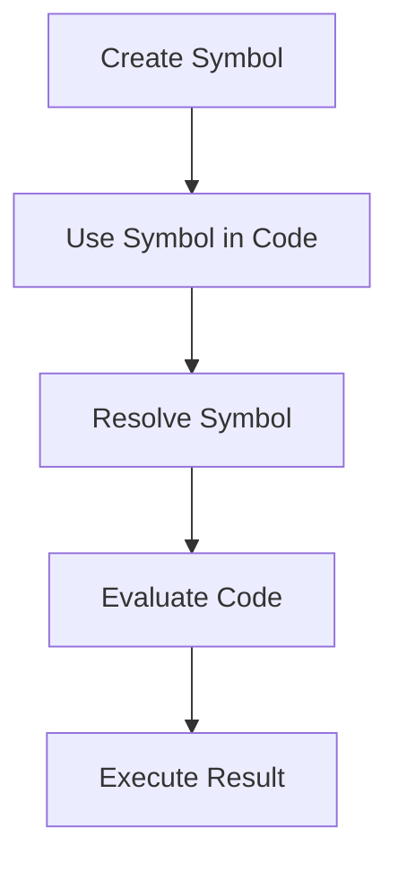

## 2.7 Symbolic Programming in Clojure

In the realm of functional programming, Clojure stands out with its unique approach to symbolic programming. By understanding symbols and their manipulation, we can unlock powerful programming paradigms that allow us to write more flexible, dynamic, and expressive code. In this section, we will delve into the concept of symbols in Clojure, explore how they enable code generation, and lay the groundwork for understanding macros.

### Symbols in Depth

**Define Symbols and Their Role**

In Clojure, a symbol is a fundamental data type that serves as a reference to variables, functions, or any other entity within a namespace. Symbols are akin to names in Java, where they are used to identify variables and methods. However, in Clojure, symbols are first-class citizens and can be manipulated programmatically.

A symbol in Clojure is typically created using the `quote` function or the shorthand single quote (`'`). This prevents the symbol from being evaluated, allowing it to be used as data.

```clojure
(def my-symbol 'x)
;; Here, 'x is a symbol, not a variable or function reference.
```

**Role of Symbols**

Symbols play a crucial role in Clojure's code-as-data philosophy, where code itself is represented as data structures. This allows for powerful metaprogramming capabilities, where programs can generate and manipulate other programs.

### Manipulating Symbols

**Creating and Using Symbols Programmatically**

Clojure provides several functions to create and manipulate symbols. The `symbol` function can be used to create a symbol from a string.

```clojure
(def sym (symbol "my-var"))
;; sym is now a symbol representing the name "my-var".
```

Symbols can be used in various contexts, such as looking up variables in a namespace or dynamically generating code.

```clojure
;; Using a symbol to refer to a variable
(def my-var 42)
(println (resolve sym)) ;; Outputs: 42
```

**Code Example: Dynamic Symbol Creation**

```clojure
(defn create-symbol [name]
  (symbol name))

(def dynamic-sym (create-symbol "dynamic-var"))
(def dynamic-var 100)

;; Using resolve to get the value of the dynamically created symbol
(println (resolve dynamic-sym)) ;; Outputs: 100
```

### Code Generation

**Symbolic Programming for Code Generation**

Symbolic programming in Clojure allows us to write code that generates other code. This is particularly useful for creating domain-specific languages (DSLs) or automating repetitive tasks.

**Illustration: Code Generation with Symbols**

Consider a scenario where we need to generate a series of functions programmatically. Symbols can be used to create function names dynamically.

```clojure
(defn generate-function [name]
  `(defn ~(symbol name) [x] (* x x)))

(eval (generate-function "square"))

(println (square 5)) ;; Outputs: 25
```

In this example, the `generate-function` creates a new function named `square` that squares its input. The `eval` function is used to evaluate the generated code, making the new function available for use.

### Macro Foundations

**Understanding Symbols as Code Representations**

Symbols are foundational to Clojure's macro system, where they are used to represent code that can be manipulated before evaluation. Macros allow us to extend the language by introducing new syntactic constructs.

**Preparing for Macros**

Before diving into macros, it's essential to understand how symbols can be used to represent code. This understanding will enable us to create powerful abstractions and transformations.

**Example: Basic Macro Using Symbols**

```clojure
(defmacro unless [condition & body]
  `(if (not ~condition)
     (do ~@body)))

;; Usage of the unless macro
(unless false
  (println "This will print because the condition is false."))
```

In the `unless` macro, symbols are used to construct the code that will be executed if the condition is false. The macro expands into an `if` statement, showcasing how symbols enable code manipulation.

### Try It Yourself

**Experiment with Symbolic Programming**

- Modify the `generate-function` example to create functions with different operations (e.g., addition, subtraction).
- Create a macro that logs the execution time of a block of code using symbols to construct the timing logic.

### Visual Aids

#### Symbol Manipulation Flow



*Diagram: This flowchart illustrates the process of creating, using, resolving, and evaluating symbols in Clojure.*

### References and Links

- [Clojure Official Documentation](https://clojure.org/reference)
- [Clojure Community Resources](https://clojure.org/community/resources)
- [Transitioning from OOP to Functional Programming](https://www.lispcast.com/oo-to-fp/)

### Knowledge Check

**Questions to Engage Understanding**

- How do symbols differ from variables in Clojure?
- What is the purpose of the `quote` function when working with symbols?
- How can symbols be used to dynamically generate code?
- Explain how macros utilize symbols for code manipulation.

### Exercises

**Practice Problems**

1. Create a macro that swaps the values of two variables using symbols.
2. Write a function that takes a list of strings and returns a list of symbols.

**Solutions**

- **Exercise 1 Solution**: Use the `let` binding to temporarily hold values and swap them.
- **Exercise 2 Solution**: Use the `map` function with `symbol` to transform strings into symbols.

### Encouraging Engagement

Embracing symbolic programming in Clojure can initially seem daunting, but as we explore these concepts, the power and flexibility they offer become apparent. By experimenting with symbols and macros, you'll gain a deeper understanding of Clojure's capabilities and how they can enhance your programming toolkit.

### Test Your Knowledge: Symbolic Programming in Clojure Quiz



### What is a symbol in Clojure?

- [x] A reference to a variable or function within a namespace
- [ ] A data structure for storing collections
- [ ] A function for manipulating strings
- [ ] A type of loop construct

> **Explanation:** In Clojure, a symbol is used as a reference to variables, functions, or other entities within a namespace.

### How can you prevent a symbol from being evaluated?

- [x] Use the `quote` function or a single quote (`'`)
- [ ] Use the `eval` function
- [ ] Use the `resolve` function
- [ ] Use the `def` function

> **Explanation:** The `quote` function or a single quote (`'`) prevents a symbol from being evaluated, allowing it to be used as data.

### What function is used to create a symbol from a string?

- [x] `symbol`
- [ ] `str`
- [ ] `keyword`
- [ ] `resolve`

> **Explanation:** The `symbol` function is used to create a symbol from a string in Clojure.

### What is the purpose of the `eval` function in symbolic programming?

- [x] To evaluate code represented as data
- [ ] To create symbols from strings
- [ ] To convert symbols to strings
- [ ] To resolve symbols to their values

> **Explanation:** The `eval` function evaluates code that is represented as data, allowing dynamic code execution.

### How do macros utilize symbols in Clojure?

- [x] By using symbols to construct and manipulate code before evaluation
- [ ] By converting symbols into strings for processing
- [ ] By storing symbols in collections
- [ ] By resolving symbols to their values

> **Explanation:** Macros use symbols to construct and manipulate code before it is evaluated, enabling powerful metaprogramming capabilities.

### Which function resolves a symbol to its value in the current namespace?

- [x] `resolve`
- [ ] `symbol`
- [ ] `quote`
- [ ] `eval`

> **Explanation:** The `resolve` function resolves a symbol to its value in the current namespace.

### What is a common use case for symbolic programming in Clojure?

- [x] Code generation and metaprogramming
- [ ] Data storage and retrieval
- [ ] String manipulation
- [ ] Loop iteration

> **Explanation:** Symbolic programming is commonly used for code generation and metaprogramming in Clojure.

### How can you create a list of symbols from a list of strings?

- [x] Use `map` with the `symbol` function
- [ ] Use `reduce` with the `str` function
- [ ] Use `filter` with the `keyword` function
- [ ] Use `for` with the `resolve` function

> **Explanation:** You can use `map` with the `symbol` function to convert a list of strings into a list of symbols.

### What is the role of the `quote` function in symbolic programming?

- [x] To prevent evaluation of code, treating it as data
- [ ] To evaluate code represented as data
- [ ] To convert symbols into strings
- [ ] To resolve symbols to their values

> **Explanation:** The `quote` function prevents evaluation of code, treating it as data, which is essential in symbolic programming.

### True or False: Symbols are evaluated immediately in Clojure.

- [ ] True
- [x] False

> **Explanation:** Symbols are not evaluated immediately in Clojure; they are used as references and can be manipulated as data.



By mastering symbolic programming in Clojure, you open the door to advanced programming techniques and the ability to write more dynamic and flexible code. As you continue your journey in functional programming, these skills will prove invaluable in building scalable and maintainable applications.
