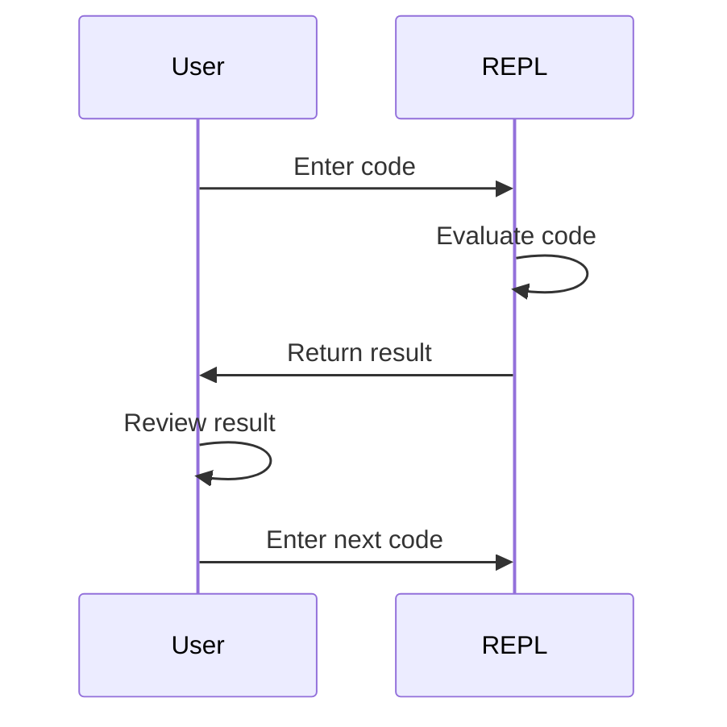

## 2.8 The REPL: Interactive Development

The Read-Eval-Print Loop (REPL) is a cornerstone of Clojure development, offering an interactive programming environment that enhances productivity and creativity. In this section, we will delve into the REPL, exploring its capabilities, how to start it, and effective workflows to maximize its potential.

### What is REPL?

The REPL stands for Read-Eval-Print Loop, a simple, interactive computer programming environment that takes single user inputs (reads), evaluates them, and returns the result to the user (prints). This cycle is repeated (loop) for each input. The REPL is a powerful tool for developing in Clojure, allowing developers to experiment with code snippets, test functions, and explore libraries in real-time.

#### Importance in Clojure Development

Clojure's REPL is particularly significant because it embodies the language's interactive and exploratory nature. It allows developers to:

- **Quickly Test Code**: Instantly see the results of code changes without the need for a full application rebuild.
- **Explore Libraries**: Load and experiment with different libraries to understand their functionalities.
- **Debug Efficiently**: Isolate and fix issues by testing small code blocks.
- **Prototype Rapidly**: Develop and iterate on ideas quickly, fostering creativity and innovation.

### Starting the REPL

Starting the REPL is straightforward, and it can be launched from the command line or integrated development environments (IDEs) like IntelliJ IDEA with Cursive or Emacs with CIDER.

#### Command Line

To start the REPL from the command line, ensure you have Leiningen or the Clojure CLI tools installed. Here's how you can do it:

1. **Using Leiningen**:
   ```bash
   lein repl
   ```

2. **Using Clojure CLI**:
   ```bash
   clj
   ```

Both commands will start the REPL session, allowing you to interact with Clojure directly.

#### Integrated Development Environments

Many IDEs support Clojure REPL integration, offering additional features like syntax highlighting and code completion. Here are examples for popular editors:

- **IntelliJ IDEA with Cursive**: 
  - Open your Clojure project.
  - Go to `Tools` > `REPL` > `Start REPL`.
  
- **Emacs with CIDER**:
  - Open your Clojure file.
  - Run `M-x cider-jack-in` to start the REPL.

### Interactive Coding

The REPL is designed for interactive coding, allowing you to write and test code snippets on the fly. This capability is invaluable for functional programming, where experimenting with functions and data transformations is common.

#### Writing and Testing Code Snippets

In the REPL, you can define functions, manipulate data structures, and evaluate expressions. Here's a simple example:

```clojure
;; Define a function
(defn greet [name]
  (str "Hello, " name "!"))

;; Test the function
(greet "Clojure Developer")
;; => "Hello, Clojure Developer!"
```

#### Immediate Feedback

The REPL provides immediate feedback, displaying the results of your code execution. This feedback loop is crucial for understanding how your code behaves and making necessary adjustments.

### REPL Workflows

To harness the full potential of the REPL, it's essential to adopt effective workflows. Here are some tips and techniques:

#### History Navigation

The REPL maintains a history of commands, allowing you to navigate through previous inputs using the up and down arrow keys. This feature is useful for:

- **Re-evaluating Commands**: Quickly re-run previous commands without retyping them.
- **Modifying Past Inputs**: Edit and re-execute commands to test variations.

#### Multitasking with REPL

The REPL can be used alongside your main development workflow to:

- **Experiment with New Ideas**: Test new concepts without affecting your main codebase.
- **Debug in Isolation**: Isolate and troubleshoot specific parts of your code.
- **Develop Incrementally**: Build and test small components before integrating them into the larger application.

### Code Examples and Exercises

Let's explore some practical exercises to solidify your understanding of the REPL.

#### Exercise 1: Data Transformation

Use the REPL to transform a collection of data. Given a list of numbers, filter out even numbers and square the remaining ones.

```clojure
;; Define a list of numbers
(def numbers [1 2 3 4 5 6 7 8 9 10])

;; Filter and transform
(->> numbers
     (filter odd?)
     (map #(* % %)))
;; => (1 9 25 49 81)
```

**Try It Yourself**: Modify the code to filter even numbers instead and cube them.

#### Exercise 2: Exploring Libraries

Load a library and explore its functions. For example, use the `clojure.set` library to perform set operations.

```clojure
(require '[clojure.set :as set])

;; Define two sets
(def set1 #{1 2 3 4})
(def set2 #{3 4 5 6})

;; Perform set operations
(set/union set1 set2)   ;; => #{1 2 3 4 5 6}
(set/intersection set1 set2) ;; => #{3 4}
(set/difference set1 set2)   ;; => #{1 2}
```

**Try It Yourself**: Experiment with other set operations like `subset?` and `superset?`.

### Visual Aids: REPL in Action

To better understand the REPL's role in Clojure development, let's visualize its workflow.



**Diagram Description**: This sequence diagram illustrates the interaction between the user and the REPL, highlighting the read-eval-print loop process.

### References and Links

For further reading and exploration, consider these resources:

- [Clojure Official Documentation](https://clojure.org/reference)
- [Clojure Community Resources](https://clojure.org/community/resources)
- [Transitioning from OOP to Functional Programming](https://www.lispcast.com/oo-to-fp/)

### Knowledge Check

To reinforce your understanding, let's test your knowledge with a quiz.

## **Test Your Knowledge: The REPL: Interactive Development Quiz**



### What does REPL stand for in Clojure?

- [x] Read-Eval-Print Loop
- [ ] Run-Evaluate-Print Loop
- [ ] Read-Execute-Print Loop
- [ ] Run-Execute-Print Loop

> **Explanation:** REPL stands for Read-Eval-Print Loop, which is a fundamental interactive programming environment in Clojure.

### Which command starts the REPL using Leiningen?

- [x] lein repl
- [ ] lein start
- [ ] clj
- [ ] lein run

> **Explanation:** The command `lein repl` is used to start the REPL in a Clojure project using Leiningen.

### How can you navigate through the command history in the REPL?

- [x] Use the up and down arrow keys
- [ ] Use the left and right arrow keys
- [ ] Use the page up and page down keys
- [ ] Use the tab key

> **Explanation:** The up and down arrow keys allow you to navigate through the command history in the REPL.

### What is the benefit of using the REPL for interactive coding?

- [x] Immediate feedback and rapid prototyping
- [ ] Slower code execution
- [ ] Limited debugging capabilities
- [ ] Reduced productivity

> **Explanation:** The REPL provides immediate feedback, allowing for rapid prototyping and efficient debugging.

### Which of the following is a valid REPL workflow?

- [x] Experimenting with new ideas
- [ ] Writing production code only
- [x] Debugging in isolation
- [ ] Ignoring errors

> **Explanation:** The REPL is ideal for experimenting with new ideas and debugging code in isolation.

### What is the purpose of the `->>` threading macro in Clojure?

- [x] To pass the result of one expression as the last argument to the next
- [ ] To create a loop in the REPL
- [ ] To start a new REPL session
- [ ] To end a REPL session

> **Explanation:** The `->>` threading macro passes the result of one expression as the last argument to the next, facilitating data transformation pipelines.

### How do you require a library in the REPL?

- [x] (require '[library.name :as alias])
- [ ] (import 'library.name)
- [ ] (include 'library.name)
- [ ] (load 'library.name)

> **Explanation:** The `(require '[library.name :as alias])` form is used to include a library in the REPL.

### What is the result of `(set/union #{1 2} #{2 3})`?

- [x] #{1 2 3}
- [ ] #{1 2}
- [ ] #{2 3}
- [ ] #{3}

> **Explanation:** The `set/union` function returns the union of two sets, which in this case is #{1 2 3}.

### Which tool can be used to start the REPL in Emacs?

- [x] CIDER
- [ ] Leiningen
- [ ] IntelliJ IDEA
- [ ] Eclipse

> **Explanation:** CIDER is an Emacs package that provides a powerful REPL integration for Clojure development.

### The REPL is an essential tool for Clojure development.

- [x] True
- [ ] False

> **Explanation:** True. The REPL is a fundamental tool in Clojure for interactive development, testing, and debugging.



By mastering the REPL, you enhance your ability to develop, test, and iterate on Clojure applications efficiently. Embrace the interactive nature of Clojure, and let the REPL be your guide in exploring the depths of functional programming.
