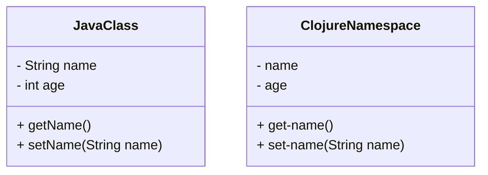

## 20.1 Writing Clean and Readable Functional Code

In the world of software development, writing clean and readable code is not just a nicety—it's a necessity. As we dive into the realm of functional programming with Clojure, we must embrace the principles that make our code both efficient and understandable. This section will guide you through the best practices for writing clean and readable functional code, focusing on simplicity, avoiding side effects, utilizing destructuring, and maintaining a consistent style.

### Simplicity Matters

When it comes to programming, simplicity is key. Albert Einstein famously said, "Everything should be made as simple as possible, but no simpler." This principle is particularly relevant in functional programming, where complex problems are often solved with elegant, straightforward solutions.

#### Embrace Simplicity

Simplicity in code means reducing complexity and focusing on clarity. In Clojure, this often involves leveraging the language's powerful abstractions and concise syntax to express ideas succinctly. Let's explore how we can achieve simplicity in our code:

- **Use Higher-Order Functions**: Clojure's higher-order functions, such as `map`, `filter`, and `reduce`, allow you to express operations on collections in a clear and concise manner. These functions abstract away common patterns, reducing boilerplate code.

- **Leverage Immutability**: By default, Clojure promotes immutability, which simplifies reasoning about code. Immutable data structures ensure that data cannot be changed unexpectedly, reducing the likelihood of bugs.

- **Favor Composition Over Inheritance**: In contrast to object-oriented programming, where inheritance is common, functional programming encourages function composition. This approach leads to simpler and more modular code.

#### Code Example: Simplicity with `map` and `filter`

```clojure
;; A simple example using map and filter to process a list of numbers
(def numbers [1 2 3 4 5 6 7 8 9 10])

;; Double each number and filter out the odd numbers
(defn process-numbers [nums]
  (->> nums
       (map #(* 2 %))
       (filter even?)))

;; Usage
(process-numbers numbers) ; => (4 8 12 16 20)
```

In this example, we use `map` to double each number in the list and `filter` to retain only the even numbers. The code is both simple and expressive, demonstrating the power of functional composition.

### Avoid Side Effects

One of the cornerstones of functional programming is the use of pure functions—functions that have no side effects and always produce the same output for the same input. Pure functions are easier to test, debug, and reason about.

#### What are Side Effects?

Side effects occur when a function interacts with the outside world or modifies some state outside its local environment. Common side effects include:

- Modifying a global variable
- Writing to a file or database
- Printing to the console

In functional programming, we strive to isolate side effects, keeping them separate from the core logic of our functions.

#### Code Example: Pure vs. Impure Functions

```clojure
;; Pure function: calculates the square of a number
(defn square [x]
  (* x x))

;; Impure function: prints the square of a number (side effect)
(defn print-square [x]
  (println (square x)))

;; Usage
(square 4) ; => 16
(print-square 4) ; Prints "16" to the console, returns nil
```

In this example, `square` is a pure function, while `print-square` is impure due to its side effect of printing to the console.

#### Isolating Side Effects

To write clean functional code, isolate side effects by:

- **Using Higher-Order Functions**: Encapsulate side effects within higher-order functions that manage them explicitly.
- **Leveraging Monads**: Although not native to Clojure, monads can be used to handle side effects in a controlled manner, similar to how they are used in Haskell.
- **Applying the Command Query Separation Principle**: Separate functions that perform actions (commands) from those that return values (queries).

### Use of Destructuring

Destructuring is a powerful feature in Clojure that enhances code readability by allowing you to extract values from complex data structures in a concise manner. It simplifies the process of working with nested data, making your code more expressive and easier to understand.

#### Destructuring Basics

Destructuring can be applied to various data structures, including vectors, maps, and lists. Let's explore how destructuring works in Clojure:

```clojure
;; Destructuring a vector
(defn greet [name age]
  (println (str "Hello, " name "! You are " age " years old.")))

;; Usage with a vector
(let [[name age] ["Alice" 30]]
  (greet name age))

;; Destructuring a map
(defn print-person-info [{:keys [name age]}]
  (println (str "Name: " name ", Age: " age)))

;; Usage with a map
(print-person-info {:name "Bob" :age 25})
```

In the examples above, we use destructuring to extract values from a vector and a map, respectively. This approach improves code readability by reducing boilerplate code.

#### Advanced Destructuring

Clojure's destructuring capabilities extend beyond simple cases. You can use nested destructuring to extract values from deeply nested structures:

```clojure
;; Nested destructuring
(defn print-address [{:keys [name address] :as person}]
  (let [{:keys [street city]} address]
    (println (str name " lives at " street ", " city))))

;; Usage with a nested map
(print-address {:name "Charlie" :address {:street "123 Elm St" :city "Springfield"}})
```

In this example, we use nested destructuring to extract the `street` and `city` from the `address` map within the `person` map.

### Consistent Style

A consistent coding style is crucial for maintaining clean and readable code, especially in collaborative projects. Consistency reduces cognitive load and makes it easier for developers to understand and modify code.

#### Establishing a Style Guide

To achieve consistency, establish a style guide for your team or project. A style guide should cover:

- **Naming Conventions**: Use descriptive names for functions and variables. Follow Clojure's conventions, such as using kebab-case for function names.
- **Indentation and Formatting**: Follow consistent indentation and formatting rules. Use tools like `cljfmt` to automate formatting.
- **Code Organization**: Organize code into namespaces logically. Group related functions and data structures together.

#### Code Example: Consistent Style

```clojure
(ns myproject.core
  (:require [clojure.string :as str]))

;; Consistent naming and formatting
(defn calculate-area [radius]
  (let [pi 3.14159]
    (* pi (square radius))))

(defn square [x]
  (* x x))

;; Usage
(calculate-area 5) ; => 78.53975
```

In this example, we adhere to a consistent naming convention and formatting style, making the code easy to read and understand.

### Try It Yourself

To reinforce your understanding of writing clean and readable functional code, try modifying the code examples provided. Experiment with different destructuring patterns, isolate side effects, and apply consistent styling to your code.

### Visual Aids

To further illustrate these concepts, let's compare Java classes and Clojure namespaces using a diagram:



**Diagram Description**: This diagram compares a Java class with a Clojure namespace. The Java class encapsulates state and behavior, while the Clojure namespace focuses on functions and data, promoting immutability and simplicity.

### References and Links

For further reading and resources on writing clean and readable functional code, explore the following links:

- [Clojure Official Documentation](https://clojure.org/reference)
- [Clojure Community Resources](https://clojure.org/community/resources)
- [Transitioning from OOP to Functional Programming](https://www.lispcast.com/oo-to-fp/)

### Knowledge Check

To test your understanding, consider the following questions:

1. What is a pure function, and why is it important in functional programming?
2. How does destructuring improve code readability in Clojure?
3. Why is it important to isolate side effects in functional programming?
4. What are some common side effects to avoid in functional code?
5. How can a consistent coding style benefit a development team?

### Summary

In this section, we've explored the principles of writing clean and readable functional code in Clojure. By embracing simplicity, avoiding side effects, utilizing destructuring, and maintaining a consistent style, we can create code that is both efficient and easy to understand. As you continue your journey in functional programming, remember that clean code is not just about aesthetics—it's about creating software that is robust, maintainable, and a joy to work with.

## **Test Your Knowledge: Writing Clean and Readable Functional Code Quiz**



### What is a pure function in functional programming?

- [x] A function that has no side effects and returns the same output for the same input
- [ ] A function that modifies global state
- [ ] A function that performs I/O operations
- [ ] A function that depends on external variables

> **Explanation:** Pure functions are central to functional programming because they are predictable and easier to test.


### How does destructuring enhance code readability in Clojure?

- [x] By allowing concise extraction of values from complex data structures
- [ ] By modifying data structures in place
- [ ] By increasing the complexity of data access
- [ ] By requiring additional boilerplate code

> **Explanation:** Destructuring simplifies the process of accessing nested data, making code more readable.


### Why is it important to isolate side effects in functional programming?

- [x] To ensure functions remain predictable and testable
- [ ] To increase the complexity of the code
- [ ] To allow functions to modify global state
- [ ] To make debugging more difficult

> **Explanation:** Isolating side effects helps maintain the purity of functions, making them easier to reason about.


### Which of the following is a common side effect to avoid in functional code?

- [x] Modifying global variables
- [ ] Using higher-order functions
- [ ] Composing functions
- [ ] Using immutable data structures

> **Explanation:** Modifying global variables introduces unpredictability, which is contrary to functional programming principles.


### How can a consistent coding style benefit a development team?

- [x] By reducing cognitive load and improving code readability
- [ ] By increasing the complexity of the codebase
- [ ] By making code harder to maintain
- [ ] By encouraging individual coding styles

> **Explanation:** Consistent style helps team members understand and work with each other's code more effectively.


### What is the primary advantage of using higher-order functions in Clojure?

- [x] They abstract common patterns and reduce boilerplate code
- [ ] They increase the complexity of the code
- [ ] They are only useful for advanced programmers
- [ ] They require more lines of code

> **Explanation:** Higher-order functions allow for more concise and expressive code by abstracting repetitive patterns.


### What is the benefit of using immutable data structures in Clojure?

- [x] They prevent unexpected changes and simplify reasoning about code
- [ ] They allow for direct manipulation of data
- [ ] They are slower than mutable structures
- [ ] They increase the risk of data corruption

> **Explanation:** Immutability ensures data remains constant, reducing the likelihood of bugs and making code easier to reason about.


### How does function composition contribute to code simplicity?

- [x] By allowing complex operations to be expressed as combinations of simpler functions
- [ ] By requiring more boilerplate code
- [ ] By increasing the number of lines in a program
- [ ] By making code harder to understand

> **Explanation:** Function composition promotes simplicity by building complex behavior from simple, reusable functions.


### Which Clojure feature allows for concise extraction of values from nested maps?

- [x] Destructuring
- [ ] Macros
- [ ] Atoms
- [ ] Agents

> **Explanation:** Destructuring is a powerful feature in Clojure that simplifies working with nested data structures.


### True or False: Pure functions in functional programming can modify global state.

- [ ] True
- [x] False

> **Explanation:** Pure functions do not modify global state; they operate only on their inputs and produce outputs without side effects.


