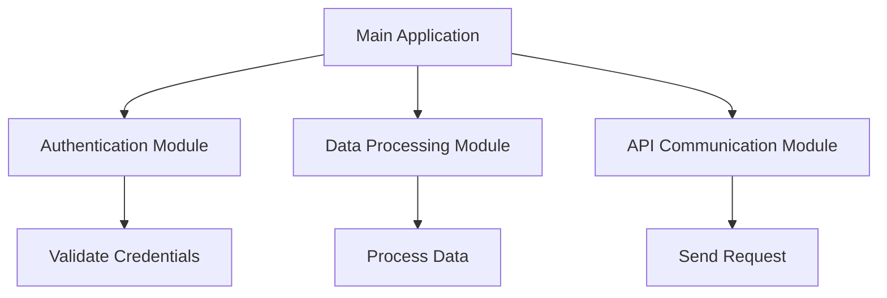
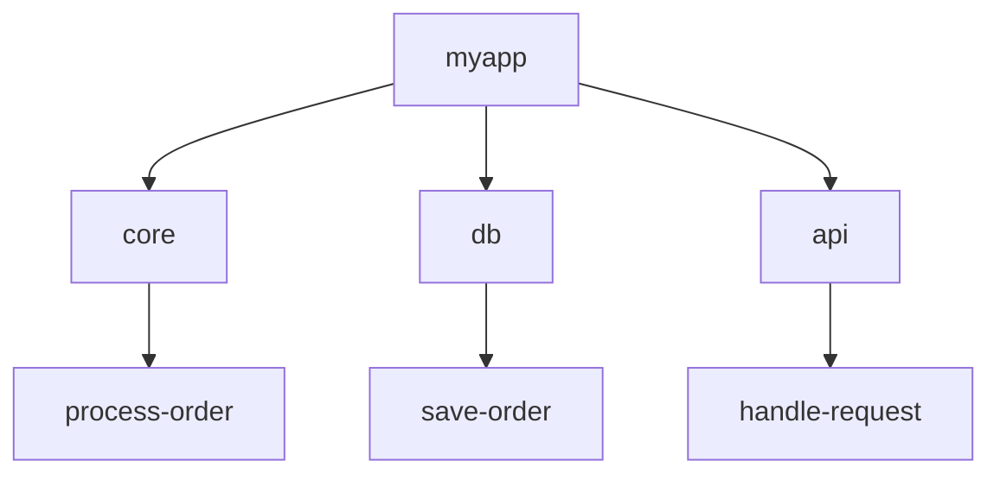

## 20.2 Organizing Functional Projects Effectively

In the realm of functional programming with Clojure, organizing your projects effectively is paramount to building scalable and maintainable applications. This section delves into best practices for structuring your Clojure projects, focusing on modular design, separation of concerns, namespace organization, and dependency management. By adopting these practices, you can ensure your codebase remains clean, efficient, and adaptable to change.

### Modular Design

**Modular design** is a fundamental principle in software development that involves breaking down a system into smaller, manageable, and reusable components. In Clojure, this translates to creating libraries or modules that encapsulate specific functionality, making it easier to maintain and scale applications.

#### Benefits of Modular Design

- **Reusability**: Modules can be reused across different projects, reducing redundancy and promoting consistency.
- **Maintainability**: Smaller, focused modules are easier to understand and modify.
- **Scalability**: Modular systems can be extended with new features without disrupting existing components.

#### Implementing Modular Design in Clojure

1. **Identify Core Components**: Determine the core functionalities of your application that can be isolated into modules. For example, authentication, data processing, and API communication can each be separate modules.

2. **Define Clear Interfaces**: Each module should expose a clear and concise API. Use Clojure protocols and interfaces to define these boundaries.

3. **Encapsulate Functionality**: Ensure that each module has a single responsibility and encapsulates all related functionality.

4. **Leverage Clojure Libraries**: Utilize existing Clojure libraries to avoid reinventing the wheel. The Clojure ecosystem offers a plethora of libraries for common tasks.

#### Code Example

```clojure
;; Define a module for user authentication
(ns myapp.auth
  (:require [clojure.string :as str]))

(defn validate-credentials [username password]
  ;; Validate user credentials
  (and (not (str/blank? username))
       (not (str/blank? password))))

(defn login [username password]
  (if (validate-credentials username password)
    {:status :success}
    {:status :failure}))
```

**Try It Yourself**: Experiment with creating a new module for handling user profiles. Define clear functions for creating, updating, and deleting profiles.

### Separation of Concerns

**Separation of concerns** is a design principle that advocates for dividing a program into distinct sections, each addressing a separate concern. This approach enhances code clarity, reduces complexity, and facilitates parallel development.

#### Applying Separation of Concerns in Clojure

1. **Distinguish Business Logic from Infrastructure**: Keep your business logic separate from infrastructure code such as database access or HTTP communication. This separation allows for easier testing and maintenance.

2. **Use Namespaces Strategically**: Organize your code into namespaces that reflect different concerns, such as `myapp.core`, `myapp.db`, and `myapp.api`.

3. **Adopt Functional Design Patterns**: Utilize functional design patterns that naturally promote separation of concerns, such as higher-order functions and pure functions.

#### Code Example

```clojure
;; Business logic for processing orders
(ns myapp.core)

(defn process-order [order]
  ;; Process the order and return a result
  {:status :processed, :order order})

;; Infrastructure code for database access
(ns myapp.db
  (:require [myapp.core :as core]))

(defn save-order [order]
  ;; Save the order to the database
  (println "Order saved:" order))
```

**Try It Yourself**: Separate the business logic of a simple e-commerce application from its database interactions. Create namespaces for each concern and ensure they interact through well-defined interfaces.

### Namespace Organization

In Clojure, **namespaces** are a powerful tool for organizing code. They allow you to group related functions and data, making your codebase more navigable and understandable.

#### Best Practices for Namespace Organization

1. **Logical Grouping**: Group related functions and data structures into namespaces. For instance, all functions related to user management can reside in a `user` namespace.

2. **Consistent Naming Conventions**: Use consistent naming conventions for namespaces. A common practice is to use lowercase, hyphen-separated names, such as `myapp.user`.

3. **Avoid Namespace Clutter**: Keep namespaces focused and avoid cluttering them with unrelated functions. If a namespace grows too large, consider splitting it into smaller, more focused namespaces.

4. **Use Aliases for Readability**: When requiring namespaces, use aliases to improve readability and avoid name clashes.

#### Code Example

```clojure
(ns myapp.user
  (:require [myapp.db :as db]))

(defn create-user [user-data]
  ;; Create a new user
  (db/save-user user-data))

(defn get-user [user-id]
  ;; Retrieve a user by ID
  (db/find-user user-id))
```

**Try It Yourself**: Organize a project with multiple concerns such as user management, order processing, and reporting. Create separate namespaces for each concern and ensure they are well-structured.

### Dependency Management

Effective **dependency management** is crucial for maintaining a healthy Clojure project. It involves managing external libraries and ensuring compatibility between different components.

#### Tools for Dependency Management

1. **Leiningen**: A popular build tool for Clojure that simplifies dependency management. It uses a `project.clj` file to specify dependencies and manage project configurations.

2. **deps.edn**: A newer tool that provides a more flexible way to manage dependencies using a `deps.edn` file. It allows for more granular control over dependency resolution.

#### Best Practices for Dependency Management

1. **Specify Exact Versions**: Always specify exact versions for dependencies to avoid unexpected changes due to updates.

2. **Use Dependency Aliases**: Use aliases to manage different sets of dependencies for different environments, such as development and production.

3. **Avoid Version Conflicts**: Regularly check for version conflicts and resolve them promptly. Tools like `lein deps :tree` can help visualize dependency trees.

4. **Regularly Update Dependencies**: Keep dependencies up-to-date to benefit from bug fixes and new features. However, ensure compatibility with your existing codebase before updating.

#### Code Example

```clojure
;; Example project.clj file for Leiningen
(defproject myapp "0.1.0-SNAPSHOT"
  :dependencies [[org.clojure/clojure "1.10.3"]
                 [ring/ring-core "1.9.0"]
                 [compojure "1.6.2"]]
  :profiles {:dev {:dependencies [[midje "1.9.9"]]}
             :prod {:dependencies [[cheshire "5.10.0"]]}})
```

**Try It Yourself**: Create a new Clojure project using Leiningen. Add dependencies for a web server and a JSON library, and experiment with different profiles for development and production.

### Visual Aids

#### Modular Design Diagram



*Diagram 1: Modular design structure for a Clojure application, illustrating the separation of concerns into distinct modules.*

#### Namespace Organization Diagram



*Diagram 2: Namespace organization for a Clojure project, showing logical grouping of related functionalities.*

### References and Links

- [Clojure Official Documentation](https://clojure.org/reference)
- [Leiningen Documentation](https://leiningen.org/)
- [deps.edn Guide](https://clojure.org/guides/deps_and_cli)
- [Transitioning from OOP to Functional Programming](https://www.lispcast.com/oo-to-fp/)
- [Clojure Community Resources](https://clojure.org/community/resources)

### Knowledge Check

#### Questions

1. What is the primary benefit of modular design in Clojure projects?
2. How does separation of concerns improve code maintainability?
3. What are the advantages of organizing code into namespaces?
4. How can you avoid dependency version conflicts in Clojure projects?

#### Exercises

1. **Modularize a Simple Application**: Take a small application and refactor it into separate modules. Define clear interfaces for each module and ensure they interact seamlessly.

2. **Namespace Refactoring**: Given a monolithic namespace, refactor it into multiple namespaces based on different concerns. Ensure that each namespace is focused and well-organized.

3. **Dependency Management Practice**: Create a new Clojure project and practice managing dependencies using both Leiningen and deps.edn. Experiment with different profiles and dependency versions.

### Encouraging Engagement

Organizing functional projects effectively requires a thoughtful approach to design and architecture. Embrace these best practices to create clean, scalable, and maintainable Clojure applications. Remember, the journey to mastering functional programming is ongoing, and each step you take will enhance your understanding and skills.

## **Test Your Knowledge: Organizing Functional Projects Effectively Quiz**



### What is a key advantage of modular design in Clojure projects?

- [x] It enhances reusability and maintainability.
- [ ] It increases code complexity.
- [ ] It requires more resources.
- [ ] It limits scalability.

> **Explanation:** Modular design allows for reusability and maintainability by breaking down a system into smaller, manageable components.


### How does separation of concerns benefit a Clojure project?

- [x] It improves code clarity and reduces complexity.
- [ ] It makes code harder to test.
- [ ] It increases the coupling between components.
- [ ] It leads to more bugs.

> **Explanation:** Separation of concerns improves code clarity and reduces complexity by dividing a program into distinct sections that address separate concerns.


### What is a best practice for organizing namespaces in Clojure?

- [x] Group related functions into logical namespaces.
- [ ] Use random naming conventions.
- [ ] Combine all functions into a single namespace.
- [ ] Avoid using aliases.

> **Explanation:** Grouping related functions into logical namespaces enhances code organization and readability.


### Which tool is commonly used for dependency management in Clojure?

- [x] Leiningen
- [ ] Maven
- [ ] Gradle
- [ ] Ant

> **Explanation:** Leiningen is a popular build tool for Clojure that simplifies dependency management.


### How can you avoid dependency version conflicts in Clojure projects?

- [x] Specify exact versions for dependencies.
- [ ] Use the latest version for all dependencies.
- [ ] Ignore version conflicts.
- [ ] Manually resolve conflicts without tools.

> **Explanation:** Specifying exact versions for dependencies helps avoid unexpected changes due to updates.


### What is the purpose of using aliases in Clojure namespaces?

- [x] To improve readability and avoid name clashes.
- [ ] To make code harder to read.
- [ ] To increase namespace clutter.
- [ ] To prevent code execution.

> **Explanation:** Using aliases improves readability and helps avoid name clashes when requiring namespaces.


### Which principle involves dividing a program into distinct sections that address separate concerns?

- [x] Separation of Concerns
- [ ] Object-Oriented Design
- [ ] Procedural Programming
- [ ] Monolithic Architecture

> **Explanation:** Separation of concerns involves dividing a program into distinct sections that address separate concerns, enhancing code clarity and maintainability.


### What is an advantage of using deps.edn over project.clj?

- [x] It provides more granular control over dependency resolution.
- [ ] It is less flexible.
- [ ] It is only for Java projects.
- [ ] It does not support profiles.

> **Explanation:** deps.edn offers more granular control over dependency resolution compared to project.clj.


### Which of the following is a benefit of keeping business logic separate from infrastructure code?

- [x] It allows for easier testing and maintenance.
- [ ] It increases code complexity.
- [ ] It makes the code harder to understand.
- [ ] It leads to more bugs.

> **Explanation:** Keeping business logic separate from infrastructure code allows for easier testing and maintenance.


### True or False: Modular design limits the scalability of a Clojure project.

- [ ] True
- [x] False

> **Explanation:** Modular design enhances scalability by allowing for the extension of systems with new features without disrupting existing components.


